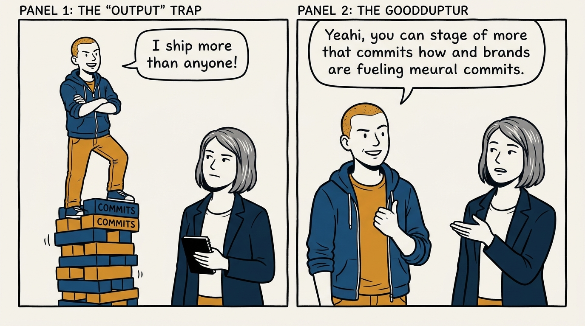
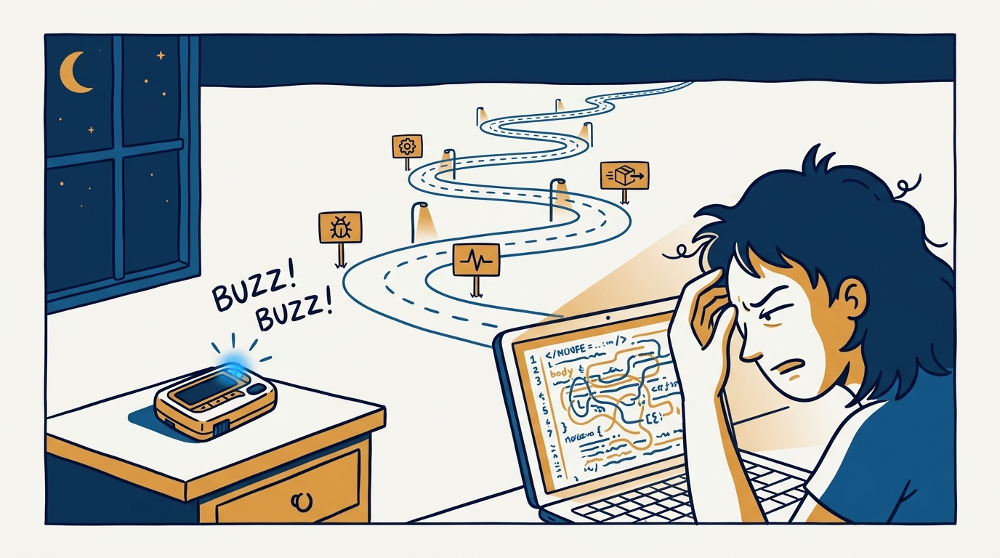
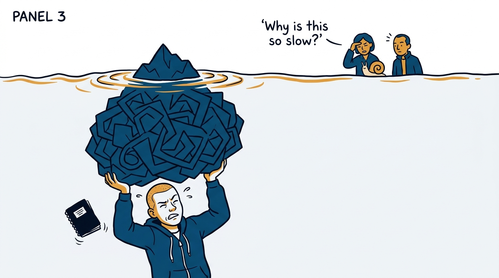
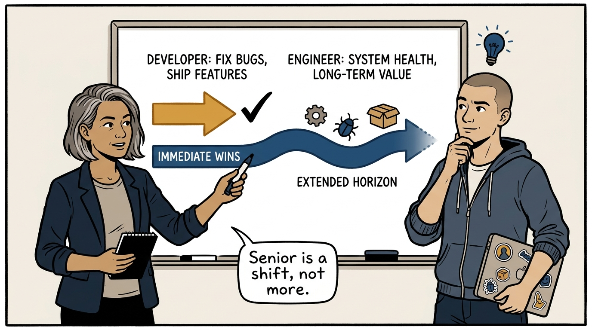
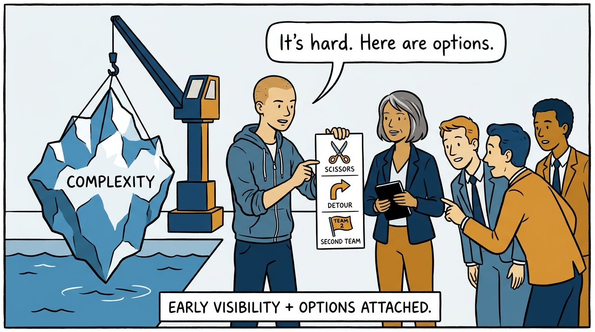
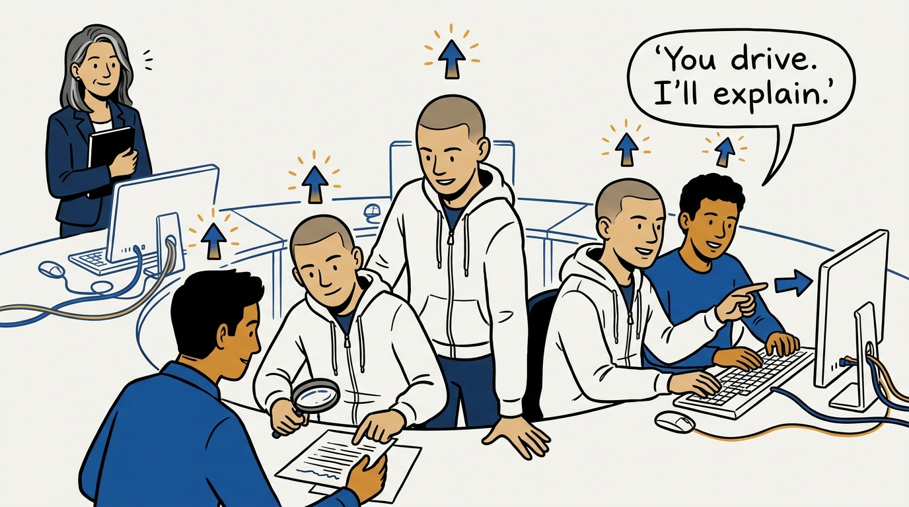
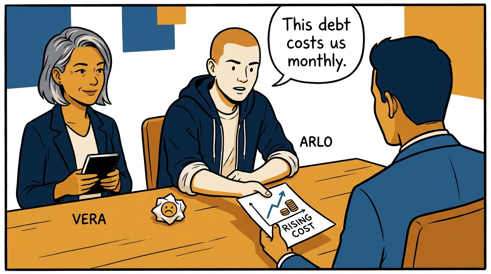
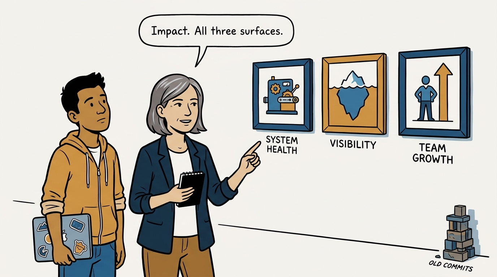

Why senior is a shift from developer to engineer — not a bigger version of the same job — in eight panels.

<!-- comic-style
{
  "cast": "VERA: a calm, seasoned engineering executive, short gray-streaked hair, dark blazer over a plain t-shirt, carries a small black notebook. ARLO: an engineer newly stepping into management, buzz-cut hair, zip-up hoodie with rolled sleeves, sticker-covered laptop under one arm.",
  "style": "Clean two-tone explainer comic, thick ink outlines, flat colors with deep blue and amber accents on a light background, generous white space, hand-lettered speech bubbles with SHORT readable text, no photorealism."
}
-->

**Panel 1:** *The hook: more output, presented as seniority — raw effort is a junior metric.*

**Panel 2:** *The problem: the developer's job ends when the code works — but the system must be operated, debugged, and migrated for years.*

**Panel 3:** *The wrong way: the quiet hero — absorbing hidden complexity silently, then being read as slow.*

**Panel 4:** *The principle: senior is the developer-to-engineer shift — thinking in system lifetimes, not bigger piles of the same job.*

**Panel 5:** *How it runs: make complexity visible early — roadblocks arrive with options attached, not as silent heroics.*

**Panel 6:** *The mechanic: the collaboration surface — reviews, pairing, mentoring, feedback — is where senior impact multiplies.*

**Panel 7:** *The cost: 'the code is bad' is not an argument — debt and testing are economics, quantified and tied to business impact.*

**Panel 8:** *The closer: the measure is impact — a sustainable system, a surfaced complexity, and a person made better. All three.*
