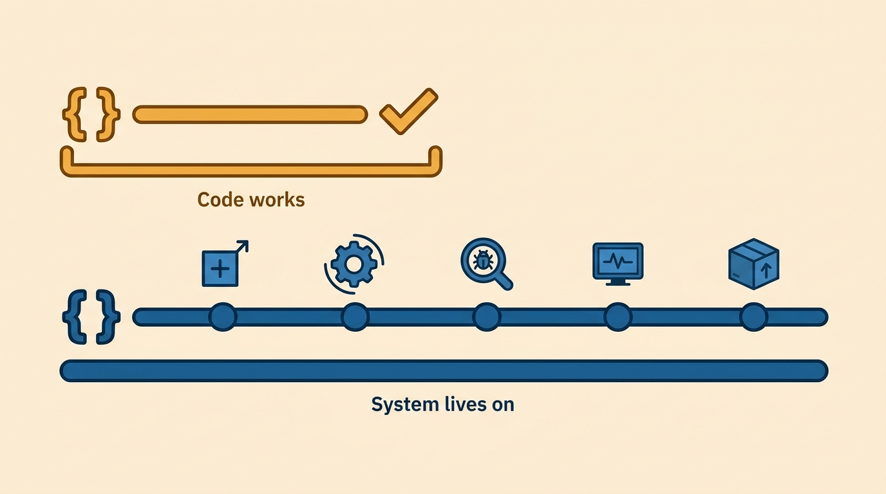
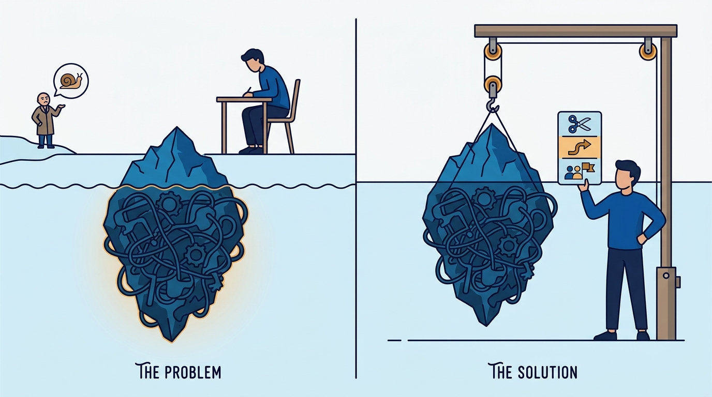
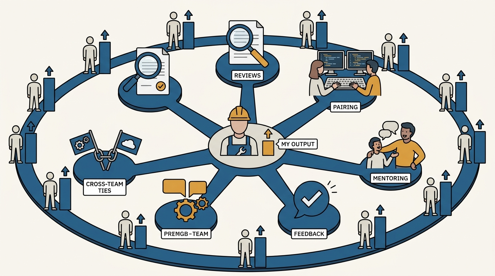

> **Status**: DRAFT
>
> **Principle**: Senior is not a bigger version of the same job — it is the shift from developer to engineer. I hold senior engineers to that shift: they think beyond the code they write to the system that must be extended, operated, debugged, and migrated for years; they make hidden complexity visible to me and to stakeholders instead of silently absorbing it; they do much of their job on the collaboration surface — code reviews, pairing, mentoring, feedback, cross-team relationships — because that is where a senior engineer's impact multiplies; and they treat tech debt, testing, and architecture as economic choices argued in business terms, not matters of taste. Impact, not raw effort, is what I measure this level by.

## Statement

The expectations I hold senior engineers to:

- **Think like an engineer, not only a developer.** Every piece of work considered for how it will be extended, operated, debugged, monitored, and migrated later; recurring bugs prevented, not just fixed once; short-term shortcuts weighed against their long-term cost; decisions documented for the engineers who come after.
- **Operate independently at scope.** Medium-sized and complex projects handled without hand-holding: self-unblocking in most situations, initiative within scope, architecture designed with feedback sought before locking it in, and mentorship both given and received.
- **Make complexity visible.** Progress communicated as what was done, why it mattered, and why it was difficult — not "done / not done." Hidden complexity surfaced to manager, peers, and stakeholders; roadblocks raised early with options attached (reduce scope, temporary workaround, another team's help); under-promise, over-deliver, over-communicate.
- **Work the collaboration surface deliberately.** Reviews that distinguish blocking issues from nitpicks and keep a professional tone; pairing that teaches rather than takes over; mentoring through reviews, pairing, and conversations; feedback — positive and corrective — given early, concretely, and empathetically; relationships with dependent teams built before urgent problems arrive.
- **Treat tech debt as economics.** Debt recognized as a compounding cost; useful temporary debt distinguished from harmful long-term debt; small debt paid down in passing; larger debt quantified, tied to business impact, and paired with high-impact projects when seeking prioritization.
- **Choose tests by system needs, not dogma.** The taxonomy known — unit, integration, UI/end-to-end, performance, load, smoke, snapshot, testing in production with flags and canaries — and applied by asking which tests catch the most valuable problems in this system, not by forcing one model everywhere.
- **Ship architecture through writing and business framing.** Design docs and RFCs before non-trivial work; prototypes to resolve uncertainty; the business goal of an architecture change explainable; a decision-maker identified, rollout and rollback plans prepared, pre-mortems run for risky changes, and lessons shared after shipping.

## How to Read This

This journal is my engineering-management operating model; this record is **the second rung** of the engineer career ladder seen from the manager's side. It is grounded in the Well-Rounded Senior Engineer chapters of Gergely Orosz's *The Software Engineer's Guidebook* (Pragmatic Engineer, 2023) — the engineering mindset, getting things done, collaboration, craft, testing, and software architecture. The article states what I hold senior engineers to and how I coach the developer-to-engineer shift; the checklist I hand the engineer — in their voice, closing with the book's senior takeaways — lives in the **Checklist** tab. The checklist is **deliberately broader than the article**: it keeps the source's full breadth — including managing one's own work, prioritizing requests, product and business awareness, documentation, and domain-driven design — where the article distills the themes I coach hardest.

## Rationale

**The developer-to-engineer shift is a shift in time horizon, and it is the first thing I probe.** A developer's job ends when the code works; an engineer's job includes **everything that happens to that code afterwards** — extension, operation, debugging, monitoring, migration. So when I assess whether someone is operating at senior, I do not start from output volume; I ask whether their shortcuts are priced, whether their recurring bugs get prevented or just re-fixed, and whether their decisions are written down for the engineers who inherit them. **Raw effort is a junior metric**; sustained impact on a long-lived system is the senior one.

**Figure 1:** *The shift is a time horizon: the developer's job ends where the code works; the engineer's job includes everything that happens to it afterwards.*

**Hidden complexity is a senior engineer's to surface, not to absorb.** The failure mode I watch for at this level is **the quiet hero**: someone who swallows gnarly integration work, invisible migrations, and unplanned yak-shaving without telling anyone — and then looks slow from the outside. I coach the opposite behavior explicitly: say what you did, why it mattered, and why it was hard; raise roadblocks early with options rather than disappearing into them; under-promise and over-communicate. **This is not self-promotion.** My planning, my staffing, and my stakeholders' expectations are only as good as the visibility of the complexity underneath them.

**Figure 2:** *Hidden complexity is surfaced, not absorbed: raised early, above the waterline, with options attached — reduce scope, workaround, or another team's help.*

**Seniority is measured on the collaboration surface, because that is where it multiplies.** A senior engineer's own commits are bounded; their effect on everyone else's commits is not. That is why reviews, pairing, mentoring, and feedback take up so much of this record: a review that teaches, a pairing session where the senior explains instead of silently taking over, feedback delivered early enough to be useful — each of these **moves the whole team's baseline**. I also expect the surface to extend beyond the team: knowing which teams we depend on and which depend on us, consulting owning teams before touching their systems, and building the cross-team relationships **before the urgent problem arrives, not during it**.

**Figure 3:** *The multiplier lives on the collaboration surface: one engineer's commits are bounded, but their effect on everyone else's is not.*

**Tech debt and testing are business decisions made with engineering judgment.** I do not accept "the code is bad" as an argument, and I do not accept test dogma either. On debt, the expectation is discrimination: pay small debt down in passing, **quantify large debt, tie it to business impact**, and pair cleanup with high-impact work — while also knowing when premature polish is the wrong trade. On testing, the expectation is fit: know the pyramid and the trophy, then **ignore both as doctrine** and ask which tests actually catch the most valuable problems in this system — including testing in production, safely, with flags, canaries, and rollbacks, when that is the honest answer.

**Architecture that ships needs sponsorship, not just correctness.** The Guidebook's architecture chapters are ultimately about **persuasion infrastructure**: design docs and RFCs that explain context, tradeoffs, and open questions; prototypes that move stuck debates forward; a named decision-maker so debates end; a business goal — revenue, cost, churn, developer productivity, reliability — that the change can be hung on. I hold senior engineers to that full arc, through rollout plans, rollback plans, and pre-mortems, to the closing reflection on how the architecture performed in reality. A technically superior design that never ships, or ships and cannot be rolled back, **is not senior work**.

## What This Means in Practice

| What this record says | What it does **not** say |
| --- | --- |
| Senior engineers think in system lifetimes: operations, migrations, the next engineer. | Gold-plate everything — the source is explicit about avoiding premature cleanup when speed matters more than polish. |
| Complexity is surfaced early, with options attached. | Complaining is communicating — the expectation is roadblocks plus reduced-scope, workaround, or cross-team options. |
| Much of the job happens in reviews, pairing, mentoring, and feedback. | Coding stops mattering — the craft bar (languages, debugging, readable code) stays, and rises. |
| Tech debt is quantified and argued in business impact. | All debt is bad — useful temporary debt is a legitimate tool when it is distinguished and tracked. |
| Tests are chosen by what catches the most valuable problems here. | One test model fits all systems — neither the pyramid nor the trophy is doctrine. |
| Architecture ships via design docs, decision-makers, rollout and rollback plans. | The best design wins by being right — without sponsorship and safety nets it is **just a document**. |
| Impact is the measure of senior work. | Hours and heroics are — **raw effort without leverage is not seniority**. |

Concretely: when I calibrate whether someone is senior, I look for **evidence on three surfaces** — a system they made more sustainable, a complexity they made visible before it became a surprise, and a person or team that got better because of how they reviewed, paired, or mentored. **All three, not one.**

## Anti-Patterns

- **The bigger junior.** More output, same horizon: shipping fast while operations, migrations, and the next engineer's comprehension are someone else's problem.
- **The quiet hero.** Absorbing hidden complexity silently, then being read as slow — visibility treated as vanity instead of as an obligation to the people planning around the work.
- **The silent takeover.** Pairing or reviewing by grabbing the keyboard and rewriting, instead of explaining and teaching — help that leaves the other person no better.
- **The nitpick reviewer.** Reviews that bury the one blocking issue under thirty style comments that a linter should own — and sour collaboration while missing the defect.
- **The debt absolutist.** Either ignoring tech debt entirely or demanding a cleanup crusade with no business case — both refusals to do the economics.
- **Test-model dogma.** Enforcing the pyramid (or the trophy) on every system regardless of what actually breaks and what the failures cost.
- **Architecture by monologue.** Pushing a major change without a design doc, a decision-maker, stakeholder buy-in, or a rollback plan — then treating its death or its outage as politics.

## Related Records

- [[competent-software-engineer]] — the baseline this record builds on; the delivery habits and craft are assumed, then extended.
- [[pragmatic-tech-lead]] — the next expectation set: leading a project and a team's execution, not just one's own scope.
- [[staff-and-principal-engineers]] — where the leverage described here becomes organization-wide.
- [[mentoring]] — the manager's-side companion to the mentoring I expect senior engineers to give and seek.
- [[feedback]] — the manager's feedback discipline; senior engineers run the peer version of the same craft.

## Scope and Revisiting

This record is `draft`. It governs the expectations I hold senior engineers to — the engineering mindset, visible communication, the collaboration surface, tech debt and testing judgment, and architecture practice — and how I calibrate and coach against them. I revisit it if promotion calibrations repeatedly disagree with it (a sign **the bar drifted from practice**), if the testing or architecture guidance stops matching how our systems are actually built and released, or if AI-assisted development materially changes **where senior leverage sits**.

## Authoritative References

- Gergely Orosz, *The Software Engineer's Guidebook* (Pragmatic Engineer, 2023) — the Well-Rounded Senior Engineer chapters (engineering mindset, getting things done, collaboration and teamwork, software engineering craft, testing, software architecture) this record distills.
