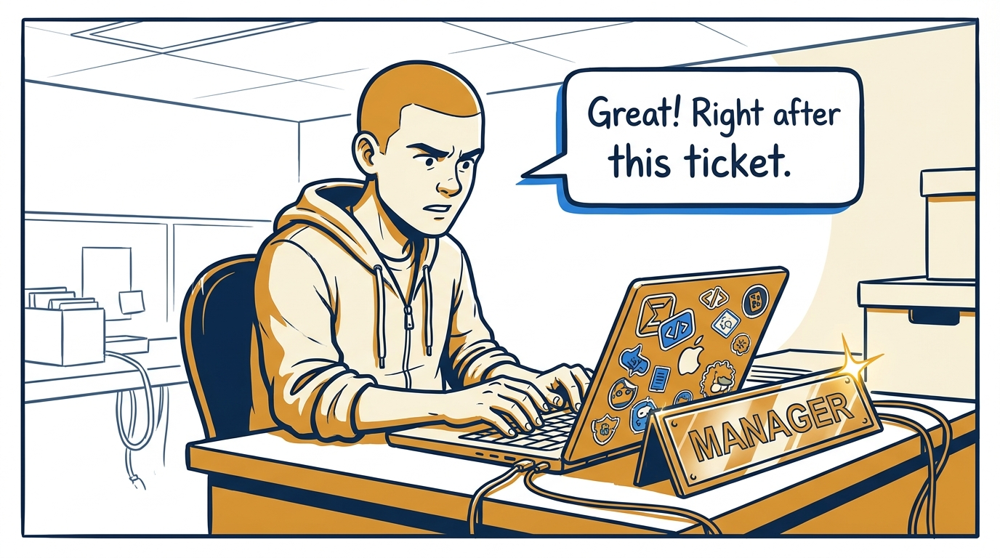
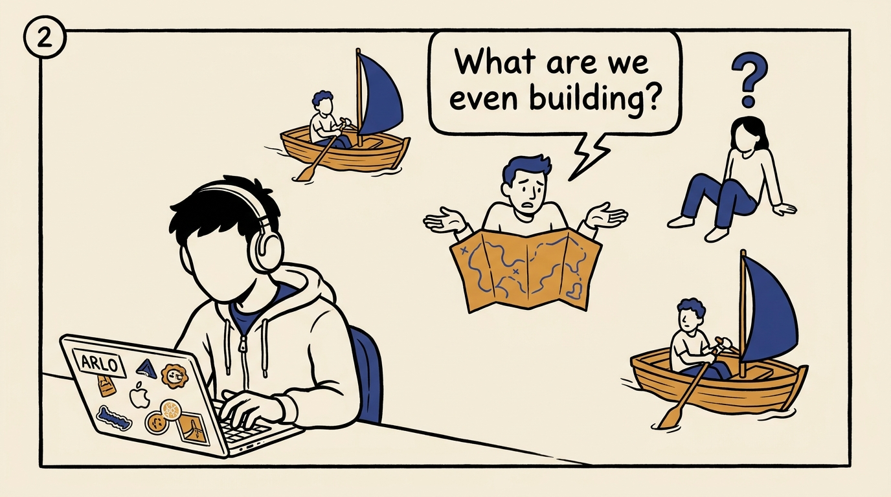
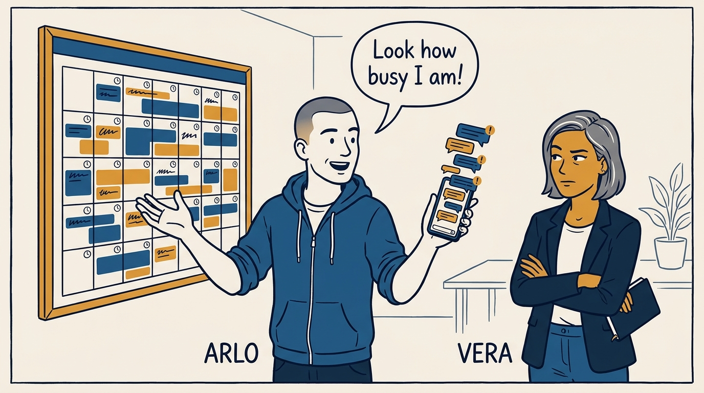
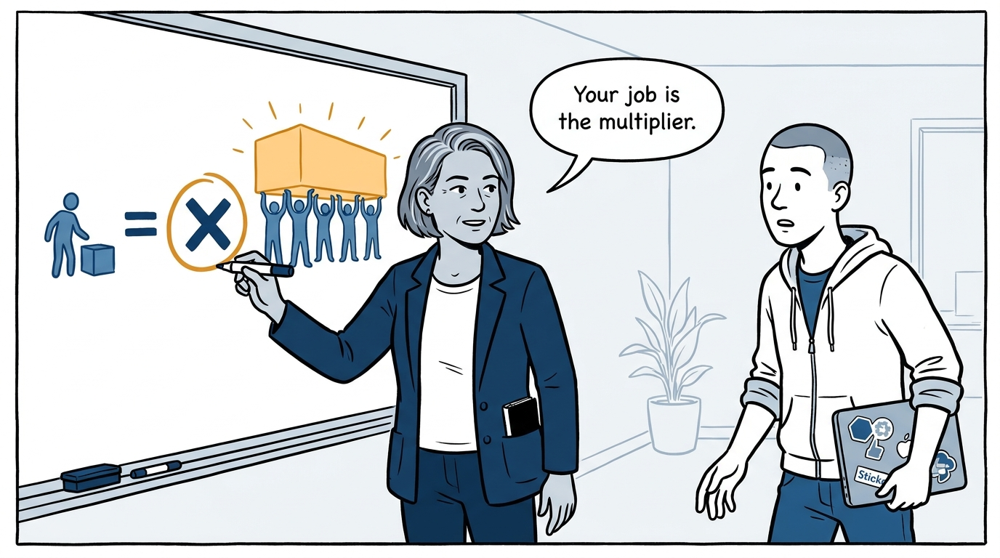
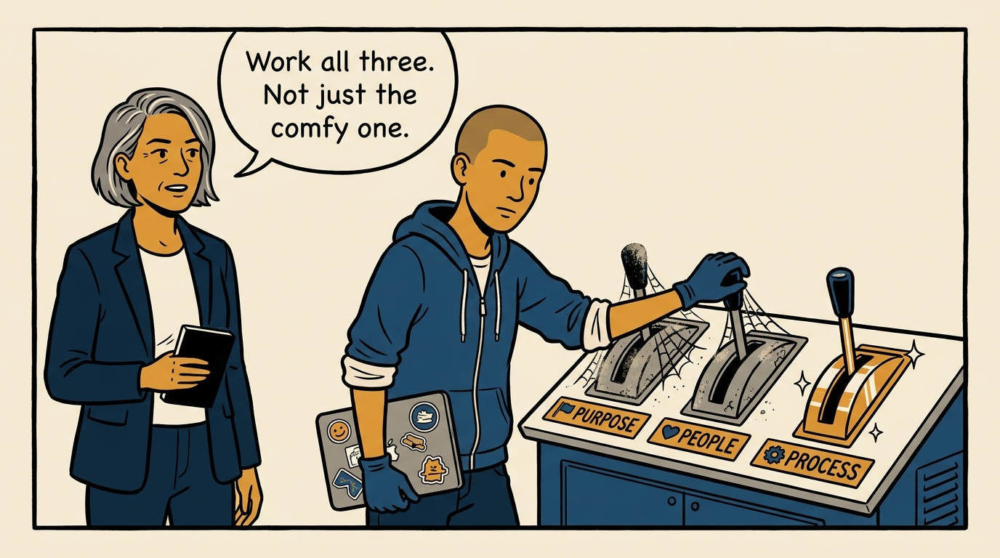
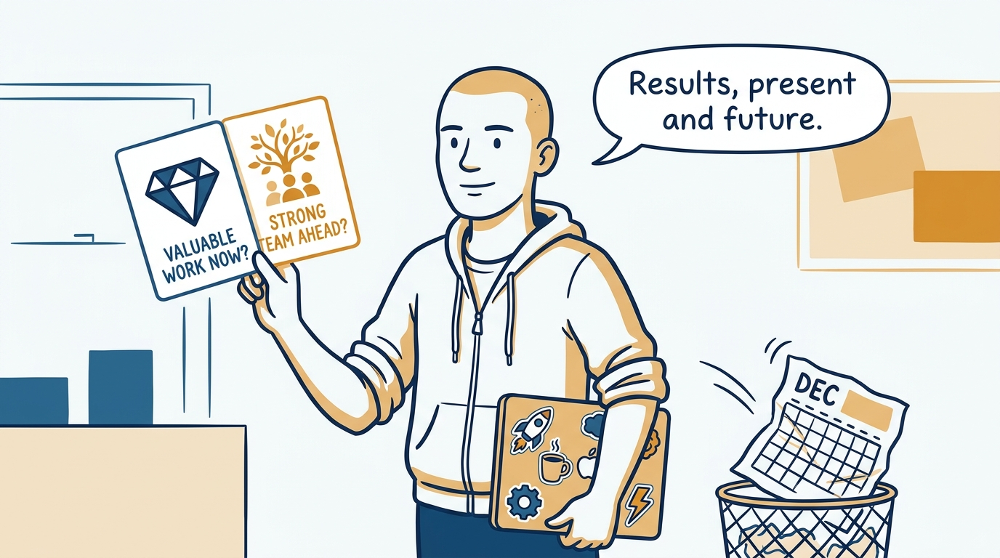
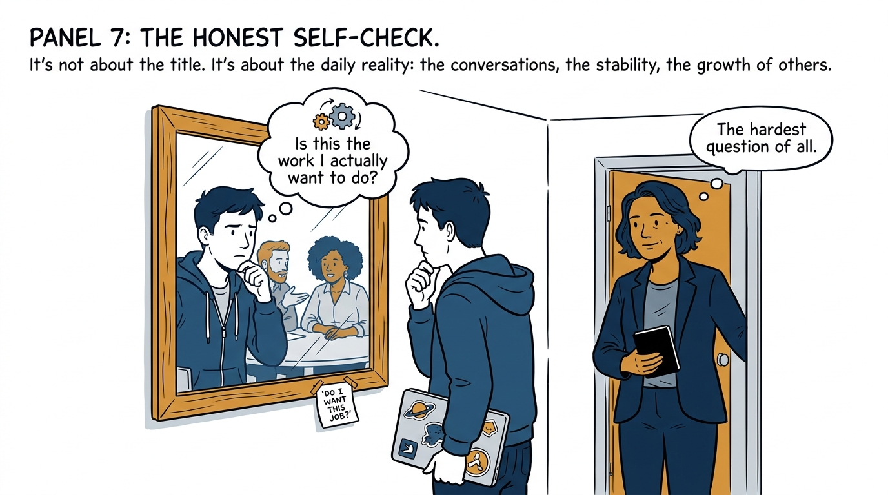
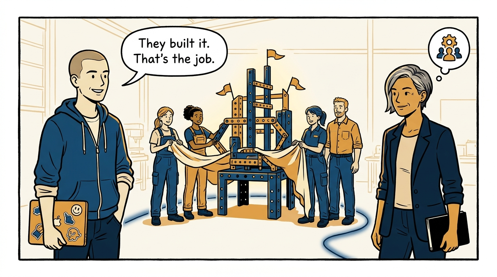

Why management is a multiplier on the team's outcomes — not your own output plus a title — in eight panels.

<!-- comic-style
{
  "cast": "VERA: a calm, seasoned engineering executive, short gray-streaked hair, dark blazer over a plain t-shirt, carries a small black notebook. ARLO: an eager early-career engineer climbing the ladder — in some strips a new lead or manager, in others the engineer being coached — buzz-cut hair, zip-up hoodie with rolled sleeves, sticker-covered laptop under one arm.",
  "style": "Clean two-tone explainer comic, thick ink outlines, flat colors with deep blue and amber accents on a light background, generous white space, hand-lettered speech bubbles with SHORT readable text, no photorealism."
}
-->

**Panel 1:** *The hook: the title arrives — and the new manager keeps doing his old job.*

**Panel 2:** *The problem: while the manager measures his own output, the group's outcome falls apart.*

**Panel 3:** *The wrong way: activity as evidence — a full calendar is easy to generate and easy to mistake for the job.*

**Panel 4:** *The principle: management is one job — better outcomes from a group of people working together, a multiplier, not your output plus a title.*

**Panel 5:** *How it runs: three levers — purpose, people, process — worked deliberately, including the ones an ex-engineer would naturally skip.*

**Panel 6:** *The mechanic: the scorecard is two questions — is the team producing valuable, easy-to-use, well-crafted work, and is it set up for great future outcomes?*

**Panel 7:** *The cost: an honest, recurring self-check — a manager who does not want the day-to-day work is a tax on the team, not a multiplier.*

**Panel 8:** *The closer: a team can achieve more than any one person alone — and making that happen is the entire job.*
