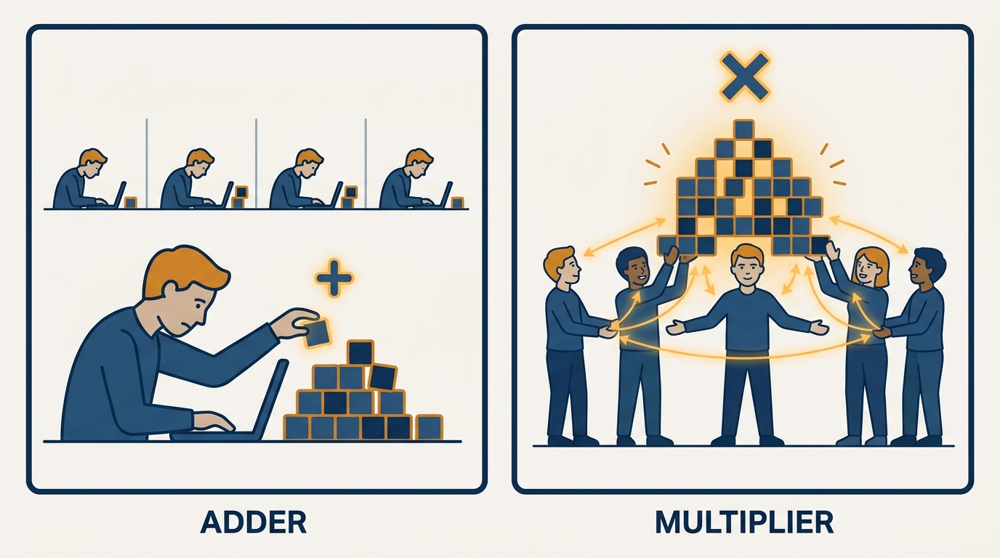
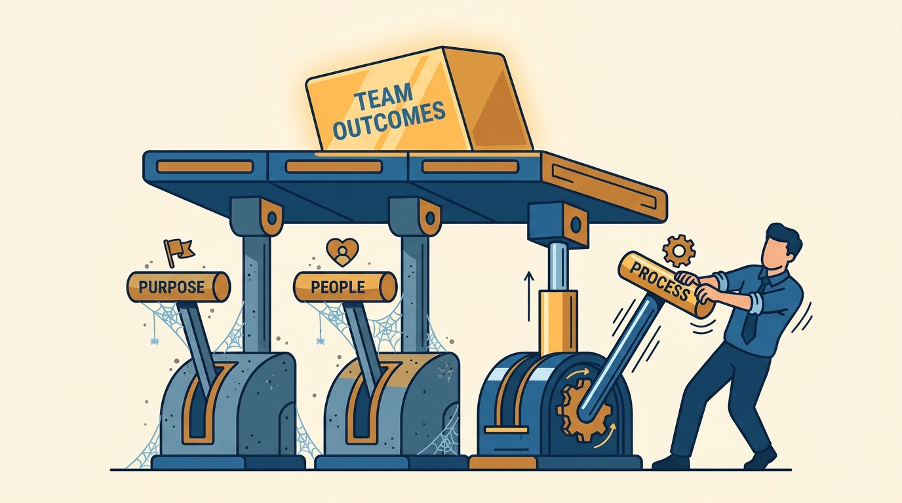
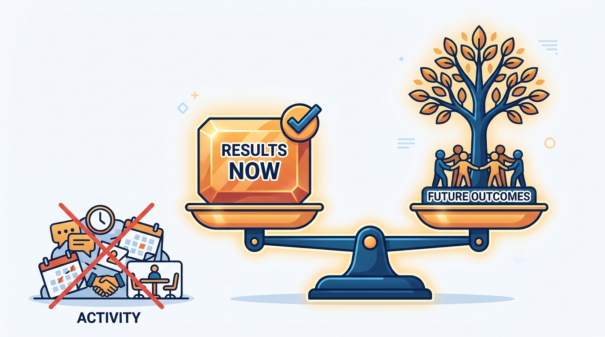

> **Status**: DRAFT
>
> **Principle**: Management is one job: getting better outcomes from a group of people working together. A team can achieve more than any one person alone, so my value as a manager is the multiplier effect — not my individual output plus a title. I work that job through three levers — purpose, people, and process — and I judge myself by the team's results, present and future, never by how busy I am. Before I take or keep the role, I check honestly that I want the day-to-day work of management, because a manager who doesn't is a tax on the team, not a multiplier.

## Statement

My operating model for the management job itself:

- **The job is outcomes through a group, not output from me.** I focus on getting better outcomes from a group of people working together, and I aim for a multiplier effect rather than adding my own individual contribution on top.
- **I work three levers: purpose, people, process.** Everything a manager can improve reduces to these three, and I deliberately invest in all of them rather than defaulting to the one I find most comfortable.
- **Purpose means the team knows what success looks like and why it matters.** I check that people actually care about the goal, and I reinforce purpose in meetings, goals, and day-to-day communication — not just in kickoff decks.
- **People means the right skills, real motivation, and trusting relationships.** I hire and develop well, understand each person's strengths and weaknesses, watch team happiness, support career goals, and give individuals what they need to do their best work.
- **Process means work moves smoothly without me in every loop.** Who does what is clear, how decisions get made is defined, meetings are effective, we learn from past mistakes, the team culture stays healthy, and I plan for tomorrow, not just today.
- **I judge my management by the team's results.** Present outcomes and whether the team is set up for great future outcomes — asking "am I creating valuable, easy-to-use, well-crafted work through this team?" and "am I building a strong, satisfied team?" — not by my activity level.
- **I run the self-check before taking or keeping the role.** Do I enjoy the day-to-day work of management, am I motivated by helping a team achieve an outcome, am I comfortable spending much of my time talking with people, can I provide stability in emotionally challenging situations, and am I willing to adapt into the leader my team needs?

## How to Read This

This journal is **my engineering-management operating model**, each record grounded in one source and written as a commitment I hold myself — and the managers who work for me — to. This record distills the opening of Julie Zhuo's *The Making of a Manager* (Portfolio/Penguin, 2019): her definition of the management job, the purpose–people–process frame, how to judge a manager, and the self-check on whether you should want the role at all. The runnable version lives in the **Checklist** tab of this post.

## Rationale

**A team can achieve more than one person alone — that is the entire reason the role exists.** If a manager's presence doesn't make the group's outcome better than the sum of individual efforts, **the role is overhead**. This is why I refuse to measure management by personal output: a manager still acting mainly as an individual contributor is doing a different job and leaving the actual one vacant. My time shifts from doing the work myself to enabling others to do it, and I accept that much of that enabling work is **unglamorous but necessary**.

**Figure 1:** *The value of the role is the multiplier effect: a manager still measuring themselves by personal output is doing a different job while the real one sits vacant.*

**Purpose, people, and process are a complete decomposition of the job — and most managers over-invest in one.** Zhuo's frame is useful precisely because it is exhaustive: any improvement I can make to a team lands in one of the three. Engineers promoted into management tend to gravitate to process, because it feels like engineering; purpose and people feel softer and get deferred. But a team with crisp processes and no shared sense of why the work matters **ships efficiently in the wrong direction**, and a team whose members lack skills or motivation can't be processed into performing. I audit myself against all three levers, and I put deliberate effort into **the ones I would naturally skip**.

**Figure 2:** *The three levers are a complete decomposition of the job — and a team lifted by only the comfortable lever ships efficiently in the wrong direction.*

**Results are the only honest scorecard — and results have a time dimension.** Activity is easy to generate and easy to mistake for management. The two questions I actually ask are about outcomes: is this team producing valuable, easy-to-use, well-crafted work now, and is it set up for great future outcomes? The second half matters as much as the first — a manager can **strip-mine a team for a great quarter** and leave it hollow. Building a strong, satisfied team is not a nice-to-have alongside delivery; it is **what makes future delivery possible**.

**Figure 3:** *The scorecard has two halves — valuable work now and a team set up for the future — and the manager's own busyness is not on the scale.*

**Trust and inspiration outperform instruction.** People do their best work **when they want to follow**, not when they are merely told what to do. So I build trust and respect deliberately, inspire people to act rather than just directing them, and adapt to what this team and this organization need — rather than importing a fixed leadership persona and expecting the team to adapt to me.

**The self-check is not a formality — the wrong person in the role damages everyone under it.** Management is a day-to-day discipline of conversations, emotional stability, and other people's growth. Someone who took the role for status, or because it was the only promotion path, and who does not enjoy that day-to-day, will neglect the levers and the team will feel it **long before the org chart does**. I ask the self-check questions of myself honestly and recurringly, and I ask them of every engineer considering the move.

## What This Means in Practice

| What this record says | What it does **not** say |
| --- | --- |
| The job is better outcomes from a group working together. | The manager's own technical output stops mattering entirely — it just stops being the measure of the job. |
| Aim for a multiplier effect on the team. | Multiply by adding headcount or meetings — the multiplier comes from purpose, people, and process. |
| Work all three levers deliberately. | Give each lever equal time every week — the mix depends on what the team currently lacks. |
| Judge management by present and future team results. | Judge only by this quarter's delivery — a hollowed-out team is **a failed result arriving late**. |
| Inspire people to act; build trust so they want to follow. | Never give direct instruction — **clarity is still part of the job**; command-and-control as the default is not. |
| Run the self-check before taking or keeping the role. | One bad week means quitting management — the check is about the day-to-day work over time, not a mood. |

Concretely: for each team I manage, I can say what success looks like and **confirm the team can say it too**; I know each person's strengths, motivation level, and career direction; the team's decision-making and ownership rules are written down; and my own review of myself starts from **team outcomes, not from my calendar**.

## Anti-Patterns

- **The player who kept playing.** Taking the manager title and continuing to act only as an individual contributor — measuring myself by personal output while the purpose, people, and process levers go untouched.
- **Activity as evidence.** Judging my management by how many meetings I ran and messages I answered instead of by what the team produced and how the team is doing.
- **Purpose by kickoff deck.** Stating the mission once and assuming it stuck, instead of reinforcing what success looks like and why it matters in meetings, goals, and daily communication.
- **The single-lever manager.** Working only the comfortable lever — usually process for ex-engineers — while skills gaps, motivation problems, or a missing sense of purpose compound.
- **Strip-mining the team.** Optimizing present outcomes while burning trust, happiness, and development — great quarters, hollow team, and the bill arrives with attrition.
- **Telling instead of inspiring.** Relying on instruction and authority instead of building the trust and respect that make people want to follow.
- **The reluctant manager who stays.** Keeping the role despite failing the self-check — not enjoying the conversations, the emotional load, or the day-to-day — because stepping back feels like demotion. The team pays for that pride.

## Related Records

- [[management-101]] — the two-sided contract with each report that operationalizes the "people" lever from the manager's first rung.
- [[leading-a-small-team]] — this definition applied at the first concrete scale: trust, 1:1s, performance clarity, and fit on a small team.
- [[managing-yourself]] — the manager's inner game; the self-check in this record is the entry gate to that ongoing work.
- [[getting-things-done]] — the "process" lever expanded: how the team actually plans and executes.
- [[first-90-days]] (executive journal) — judging by future outcomes at executive scope; the same results-not-activity scorecard, one level up.

## Scope and Revisiting

This record is `draft`. It governs how I define, do, and evaluate the management job itself, on my own teams and for the managers I hold accountable. I revisit it if I catch myself **reporting activity instead of team outcomes** for a full review cycle, if a team I manage cannot state what success looks like when asked, or if my honest answer to any self-check question stays "no" for more than a quarter.

## Authoritative References

- Julie Zhuo, *The Making of a Manager: What to Do When Everyone Looks to You* (Portfolio/Penguin, 2019) — the opening chapter on what management is, which this record distills.
