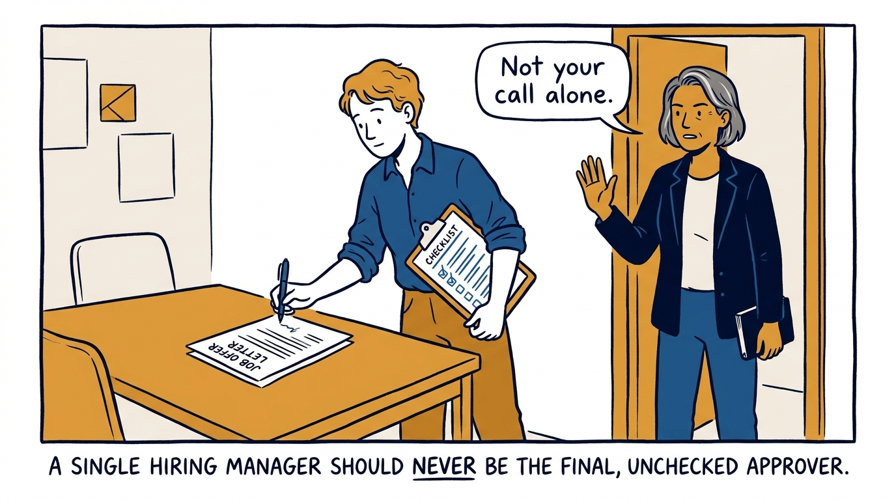
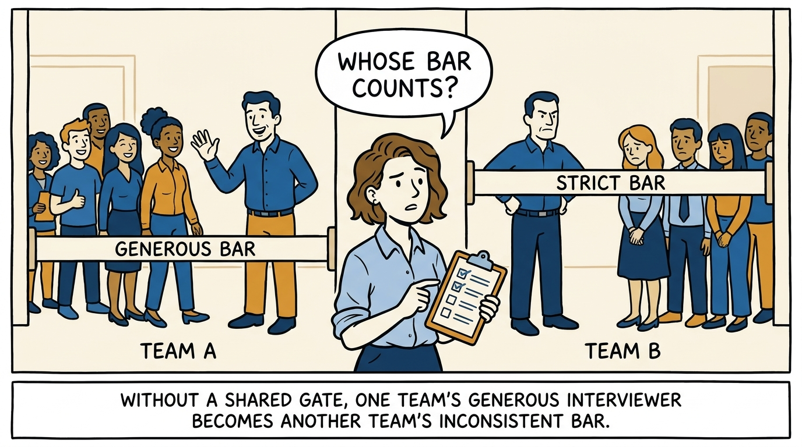
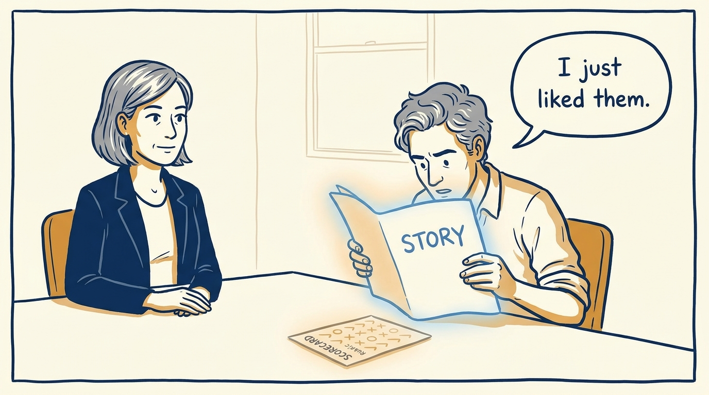
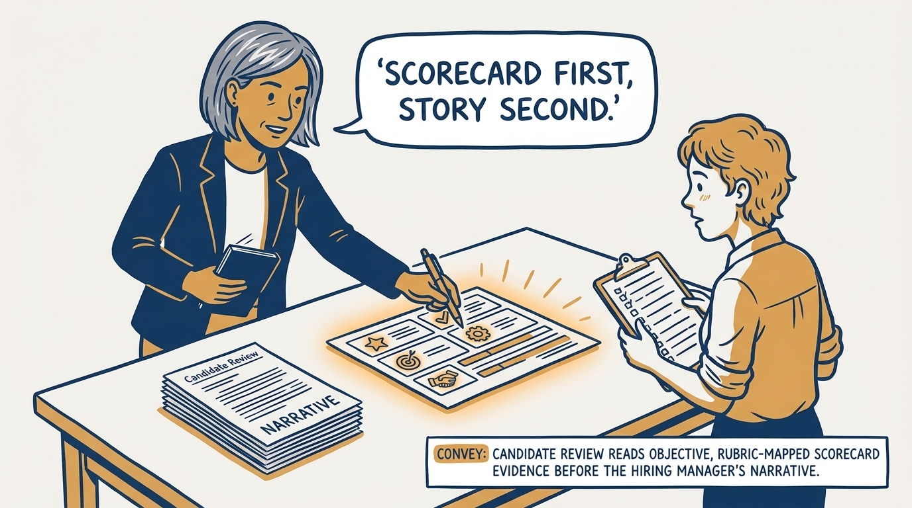
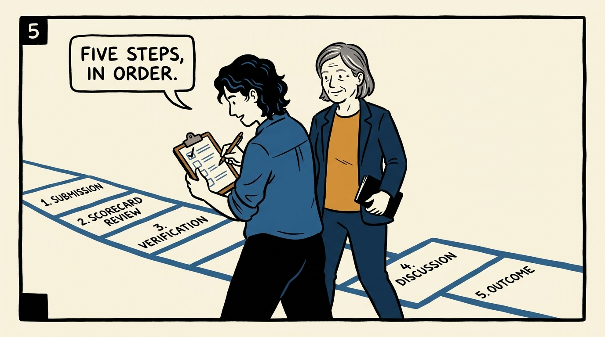
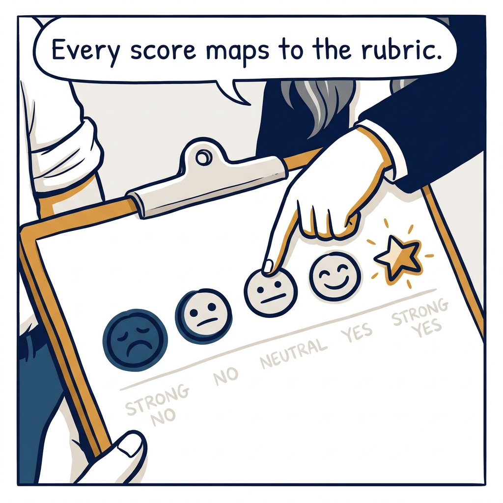
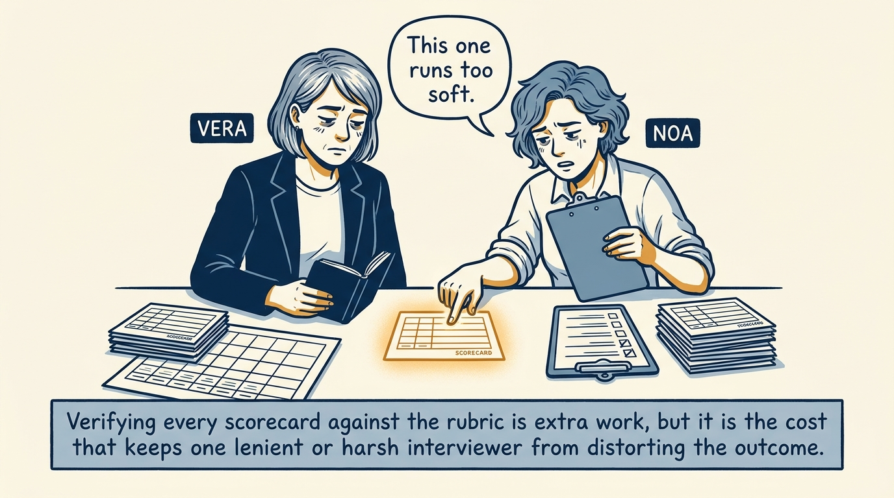
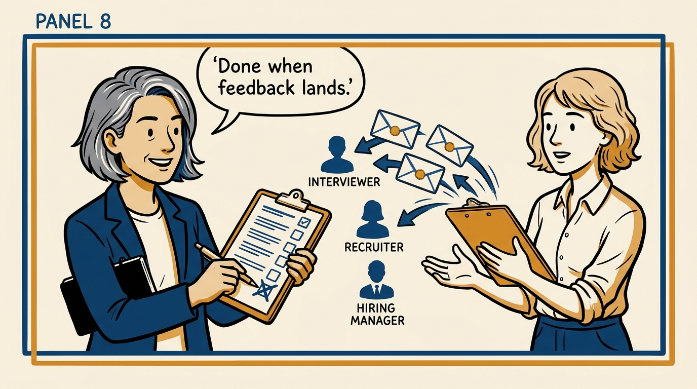

A single hiring manager should never give the final yes alone — Candidate Review is the committee gate that reads evidence before narrative and checks the level before the offer goes out, in eight panels.

<!-- comic-style
{
  "cast": "VERA: a calm, seasoned executive, short gray-streaked hair, dark blazer over a plain t-shirt, carries a small black notebook. NOA: an earnest first-time people manager, short wavy hair, rolled-up shirt sleeves, carries a clipboard with a long checklist.",
  "style": "Clean two-tone explainer comic, thick ink outlines, flat colors with deep blue and amber accents on a light background, generous white space, hand-lettered speech bubbles with SHORT readable text, no photorealism."
}
-->

**Panel 1:** *The hook: a hiring manager alone is a single point of bias, however well-intentioned.*

**Panel 2:** *The problem: without a shared gate, one team's leniency becomes another team's inconsistency.*

**Panel 3:** *The wrong way: read the story first, and the scores become confirmation instead of evidence.*

**Panel 4:** *The principle: objective scorecard evidence gets read before subjective narrative — always.*

**Panel 5:** *How it runs: submission, scorecard review, verification, discussion, and outcome — in that order.*

**Panel 6:** *The mechanic: strong no, no, neutral, yes, strong yes — each score mapped directly to the rubric.*

**Panel 7:** *The cost: verifying every scorecard against the rubric is real work — and it is what keeps the bar honest.*

**Panel 8:** *The closer: the decision is not the finish line — the loop closes when feedback lands.*
