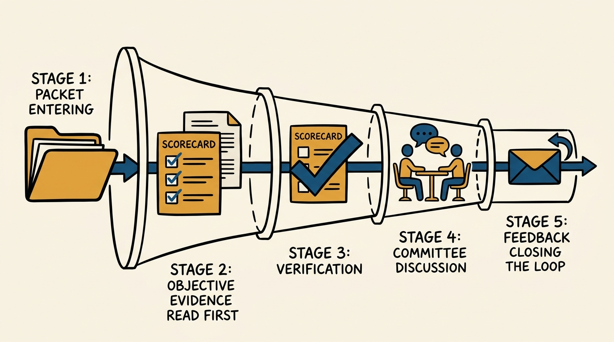
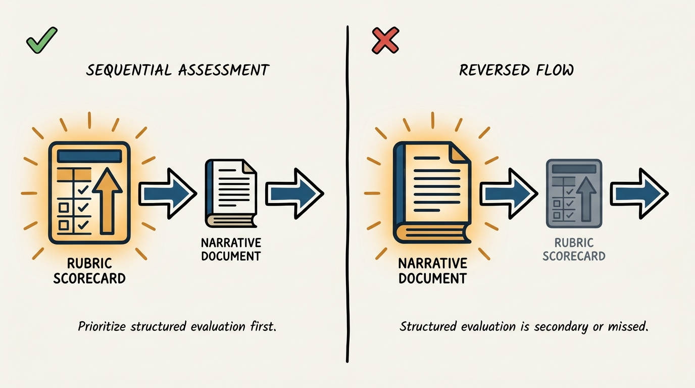
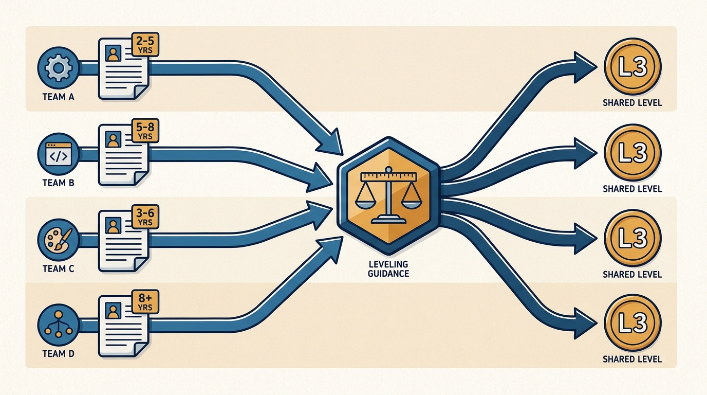

> **Status**: DRAFT
>
> **Principle**: I never let a single hiring manager give the final yes on a hire or a level. Every candidate clears Candidate Review (CR) — a committee that reads the objective scorecard evidence before the hiring manager's narrative, verifies the scorecards actually reflect the rubric, checks the suggested level against years-of-experience guidance, and closes the loop with feedback to interviewers, recruiters, and hiring managers. CR is both a hiring process and an equity process: it is how I keep one team's generous interviewer from becoming another team's inconsistent bar.

## Statement

My operating model for Candidate Review has five commitments:

- **No packet, no review.** CR only reviews candidates with a complete packet — résumé, completed individual interview scorecards, a completed hiring-committee scorecard, a suggested outcome, and a suggested level. An incomplete packet does not get a slot on the agenda.
- **Objective evidence before narrative.** I read the rubric-mapped scorecard scores first, before the hiring manager's rationale. The rationale exists to explain *divergence* from the scorecards and to show that fear, uncertainty, and doubt (FUD) were named and resolved — not to substitute for the scores.
- **Verify the scorecards, not just the outcome.** Before CR discusses a candidate, the panel confirms each scorecard actually reflects the rubric — not too lenient, not too strict, not grounded in subjective impressions dressed up as rubric items.
- **Leveling gets checked, not rubber-stamped.** The suggested level is checked against the résumé and the org's years-of-experience leveling guidance before CR agrees to it. A suggested level is an input to the decision, not the decision.
- **The loop closes.** Every CR outcome ships with feedback — to the interviewers, the recruiter, and the hiring manager — plus a feedback form so the process itself keeps improving. CR is not done when the decision is made; it is done when the feedback lands.

**Figure 1:** *Candidate Review is a five-stage gate, not a single meeting — every packet clears all five stages in order.*

## How to Read This

This journal is my people-management toolkit, grounded in the companion workbooks to Claire Hughes Johnson's *Scaling People: Tactics for Management and Company Building* (Stripe Press, 2023). This record is grounded in the "Candidate Review: Decision-Making Framework" tool from those workbooks, read through a practitioner-executive lens: the workbook frames CR as a committee that reviews interview feedback, hire/no-hire recommendations, and leveling for every candidate, then gives final approval. I read it as the gate that makes hiring an organizational decision rather than a manager's private call. The runnable five-step tool lives in the **Checklist** tab.

## Rationale

**A hiring manager alone is a single point of bias, however well-intentioned.** I match many engineering hires to a team only after they have gone through the full hiring process, which means the person who most wants to hire someone — the hiring manager — is not the right person to also be the final, unchecked approver. CR exists to put a second set of eyes, structurally independent of that motivation, between "the team wants this person" and "the offer goes out." That is why CR acts as both a hiring process and an equity process at once: the same committee that decides yes-or-no on this candidate is also the mechanism that keeps my org's hiring bar and leveling consistent across every team that uses it.

**Objective before subjective is not a formality — it is the order of operations.** CR reads the hiring-committee scorecard first: a score of strong no, no, neutral, yes, or strong yes for each interview, represented as a symbol and mapped directly to the rubric. That gives the committee a reasonably objective, high-level read on the candidate before anyone's narrative enters the room. Only after that does CR read the hiring-manager rationale — the place for the more subjective observations, and the place where the hiring manager must explain how the committee reached its conclusion, especially when that conclusion diverges from what the scorecards alone would suggest. I do not treat divergence as automatically wrong; I treat an *unexplained* divergence as a problem. When the outcome is obvious, the rationale can be as short as "clear no hire" or "clear hire." When it is not obvious, the rationale is where the hiring manager earns the committee's agreement.

**Figure 2:** *Objective before subjective: read the scorecard first, or the scores become confirmation instead of evidence.*

**FUD named early is FUD that does not send the packet back.** Fear, uncertainty, and doubt are normal residue of any hiring discussion — the mistake is letting them surface for the first time in the CR meeting. The scorecard's hiring-manager-rationale and resolved-FUD sections exist so those doubts get written down and addressed before CR convenes, which is precisely what reduces how often CR has to send a packet back for more information. A packet that surfaces fresh doubt in the room is a packet that was not ready.

**Scorecard verification is a check on the checkers, not a rubber stamp.** Before CR trusts the aggregate scorecard, reviewers read the individual interview scorecards and confirm each one actually reflects the rubric — not a subjective impression relabeled as a rubric score, not systematically too lenient, not systematically too strict. This is the step that keeps "strong yes" meaning the same thing regardless of which interviewer wrote it. Skip this step and the aggregate scorecard is only as trustworthy as its least disciplined contributor.

**Leveling is where equity becomes concrete.** After discussion resolves FUD and disagreement, CR reviews the candidate's résumé specifically to check that the suggested level roughly aligns with the org's years-of-experience leveling guidance. This is the moment CR stops being only a hire/no-hire gate and becomes a consistency mechanism: the same years of relevant experience should land at roughly the same level regardless of which team's hiring manager submitted the packet. A committee that skips this check will drift into level inflation team by team, quietly, until the leveling framework means nothing.

**Figure 3:** *Leveling is checked against one shared guidance, so the same experience lands at the same level regardless of team.*

## What This Means in Practice

| What this record says | What it does **not** say |
| --- | --- |
| CR only reviews complete packets — résumé, scorecards, suggested outcome and level. | An incomplete packet gets reviewed "this once" because the meeting is already scheduled. |
| Scorecard scores are read before the hiring-manager rationale. | The rationale is optional filler — it is required, and it must address divergence and resolved FUD. |
| CR verifies scorecards reflect the rubric, not vibes. | Verification means re-litigating the interview — it is a check on rubric fidelity, not a re-interview. |
| Leveling is checked against years-of-experience guidance every time. | The suggested level is presumed correct because the hiring manager proposed it. |
| "Yes for company, no for my team" is a legitimate, rare outcome with a clear rationale. | It is a routine escape hatch for a team that does not want to make a hard no-hire call. |
| Every outcome closes the loop with feedback to interviewers, recruiters, and hiring managers. | Feedback is optional or only given when the outcome is a hire. |

Concretely: no CR agenda item goes forward without a hiring-committee scorecard attached. Every rationale written by a hiring manager either says "clear hire" / "clear no hire" or explains the divergence and the FUD that was resolved. Every CR outcome is one of six: hire at suggested level, hire at a higher level, hire at a lower level, no hire with the committee outcome overturned, no hire with the committee outcome confirmed, or sent back for more information. And every candidate, hired or not, generates feedback that closes back to the people who ran the process.

## Anti-Patterns

- **Reviewing an incomplete packet.** Skipping the scorecard because "we're confident about this one" is exactly how CR stops being a check.
- **Reading the rationale before the scorecard.** Once the narrative anchors the committee, the objective scores become confirmation rather than evidence.
- **A rationale that explains nothing.** "We liked them" is not a rationale — it does not address divergence, and it does not name the FUD that was resolved.
- **Treating scorecard divergence as automatically suspicious.** Divergence is normal; an unexplained divergence is the actual problem.
- **Skipping scorecard verification.** Trusting the aggregate without checking that each interview scorecard actually maps to the rubric lets one lenient or one harsh interviewer distort every decision downstream.
- **Rubber-stamping the suggested level.** Approving the hiring manager's proposed level without a résumé check against years-of-experience guidance is how leveling drifts team by team.
- **Using "yes for company, no for my team" as a routine outlet.** This outcome should be very rare and carry a clear rationale — treating it as an easy compromise erodes the no-hire discipline CR exists to protect.
- **Silence after the decision.** Deciding without emailing feedback to interviewers, recruiters, and hiring managers breaks the loop that lets the process improve.

## Related Records

- [[interview-loop]] — the loop that produces the scorecards CR reviews; CR begins where the loop ends.
- [[hiring-written-exercises]] — a written exercise is one scorecard input CR verifies against its own rubric, not a separate approval step.
- [[calibrating-your-standards]] — the engineering-journal record on setting and holding a bar; CR is the per-candidate committee gate that enforces the bar, calibration is the ongoing practice of keeping it honest.
- [[hiring]] — the engineering-journal record on the hiring process end to end; CR is the decision-making committee inside that larger process.

## Scope and Revisiting

This record is `draft`. It governs how I run Candidate Review for engineering hires in my organization: what a complete packet contains, the order in which CR reads evidence, how scorecards are verified, and how leveling and feedback close the loop. I will revise it if CR outcomes drift in practice — packets reviewed incomplete, rationales that stop explaining divergence, or leveling decisions that stop tracking the years-of-experience guidance — or once I have run enough CR cycles to name concrete failure modes beyond what the workbook anticipates.

## Authoritative References

- Claire Hughes Johnson, *Scaling People: Tactics for Management and Company Building* (Stripe Press, 2023) — the companion workbooks, "Candidate Review: Decision-Making Framework" (Chapter 3).
