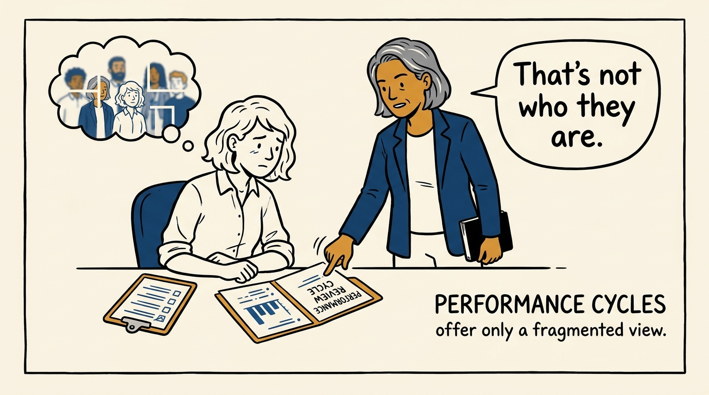
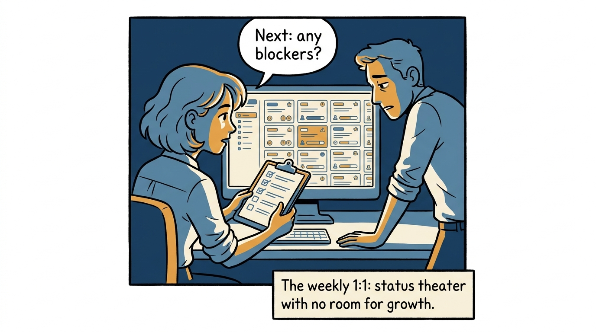
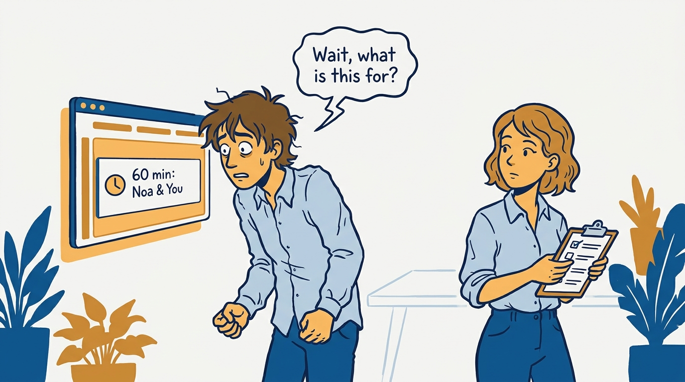
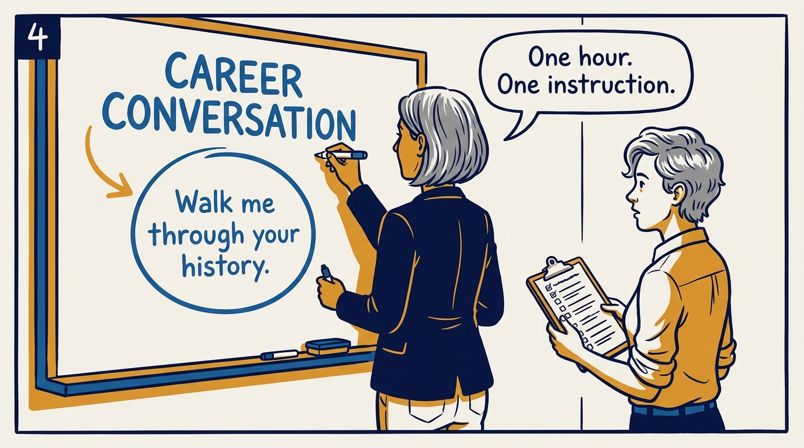
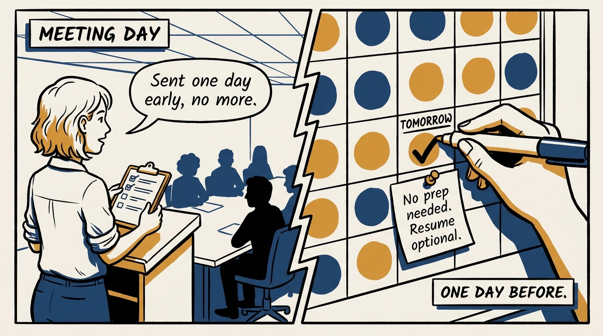
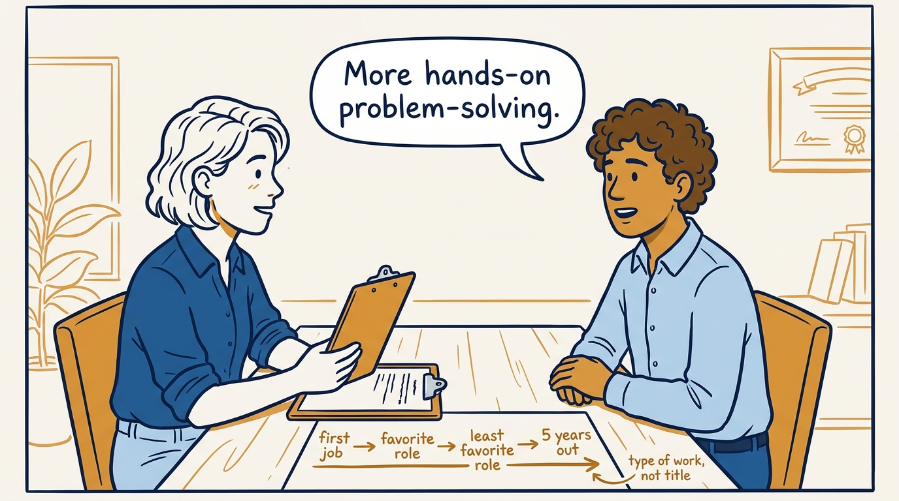
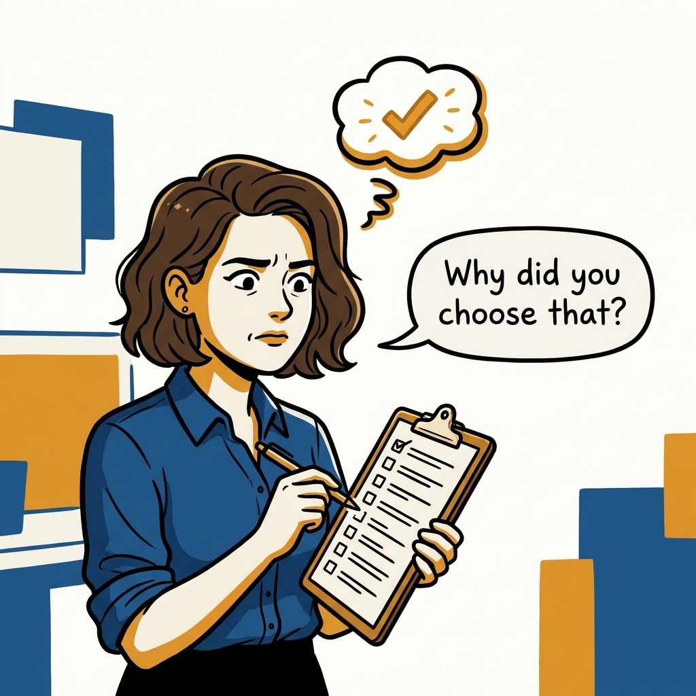
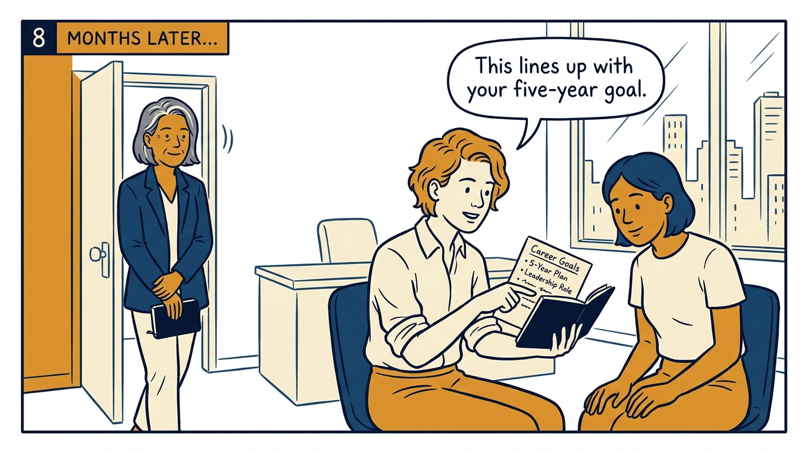

Why one deliberate hour on a person's whole career beats a dozen status-shaped 1:1s — in eight panels.

<!-- comic-style
{
  "cast": "VERA: a calm, seasoned executive, short gray-streaked hair, dark blazer over a plain t-shirt, carries a small black notebook. NOA: an earnest first-time people manager, short wavy hair, rolled-up shirt sleeves, carries a clipboard with a long checklist.",
  "style": "Clean two-tone explainer comic, thick ink outlines, flat colors with deep blue and amber accents on a light background, generous white space, hand-lettered speech bubbles with SHORT readable text, no photorealism."
}
-->

**Panel 1:** *The hook: a performance cycle tells you what someone did, not why.*

**Panel 2:** *The problem: the 1:1 turned into status theater, and development fell off the agenda.*

**Panel 3:** *The wrong way: a surprise 60-minute hold that reads like a verdict, not a conversation.*

**Panel 4:** *The tool: a one-off, 60-minute career conversation with every report, early.*

**Panel 5:** *How it runs: announce the plan up front, then send the reminder exactly one day before, not earlier.*

**Panel 6:** *The mechanic: walk the history forward, then project five years out by type of work, not title.*

**Panel 7:** *The cost: it takes a whole patient hour of asking why, not a quick diagnosis.*

**Panel 8:** *The closer: one deliberate hour, referenced months later, pays back for years.*
