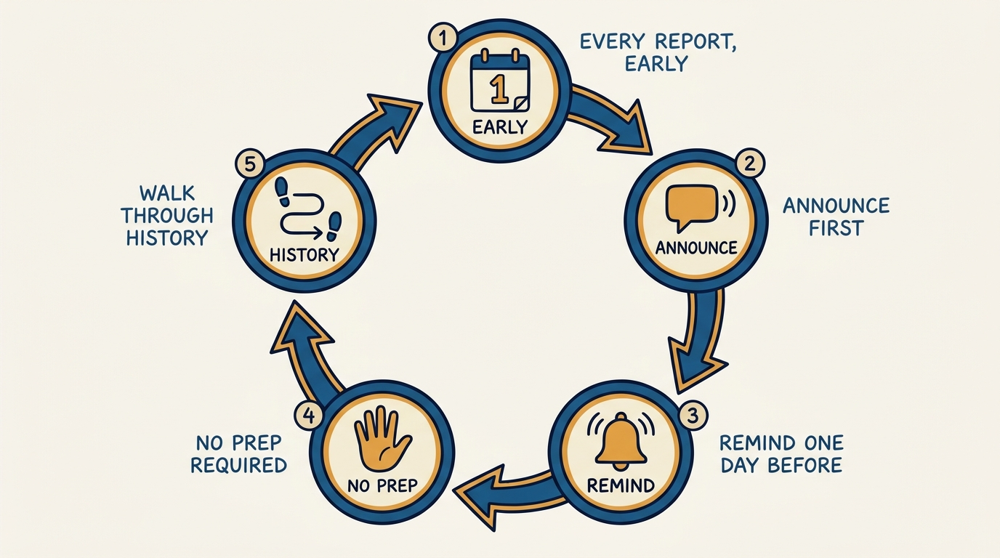
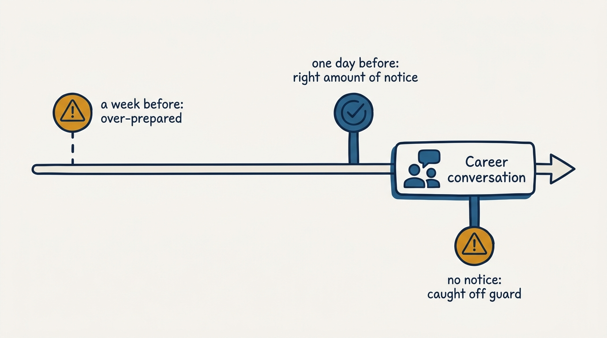
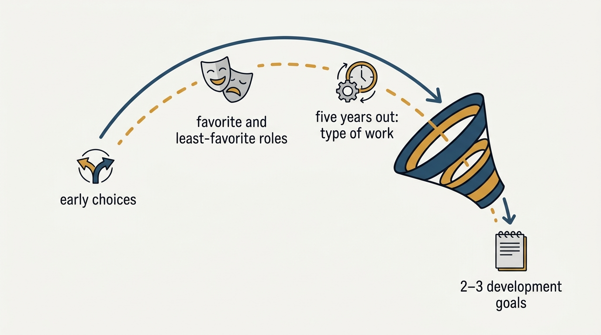

> **Status**: DRAFT
>
> **Principle**: I cannot develop someone whose motivations I know only from their last performance cycle — a snapshot of the last six months tells me what they did, not why they do anything. So I run a one-off, 60-minute career conversation with every report early in our working relationship — 30 to 45 minutes for someone fresh out of school — built around a single instruction: walk me through your history. One deliberate hour spent understanding a person's whole arc, asked about honestly and referenced deliberately afterward, pays back for years of better 1:1s, better delegation, and better development decisions.

## Statement

My operating model for career conversations has five parts:

- **Every report gets one, early.** A new team member gets a career conversation scheduled within the first few weeks — not folded into onboarding logistics, not deferred until "things settle down." It is a fixed tool, not an occasional nicety.
- **Announce it before I schedule it.** I tell the team, or the individual, that this conversation is coming and why, before the calendar invite lands. No one is surprised by an unlabeled 60-minute hold from their manager.
- **The reminder goes out exactly one day before — not earlier.** Too early and people start over-preparing a stranger's job interview instead of a get-to-know-you conversation. One day out is enough to orient, not enough to rehearse.
- **No prep required, résumé optional.** I say this explicitly in the reminder. The conversation works because it is a conversation, not a presentation the other person has to build.
- **Walk me through your history, and ask why a lot.** I do not run a checklist of questions in order — I follow one instruction and stay curious: where they grew up, why they chose their school, what they did right after college and why, their favorite and least favorite jobs and how each was chosen, and what kind of work — not what title — they picture five years out.

**Figure 1:** *The operating model is a five-part loop, not a one-time checklist: it runs the same way for every report.*

## How to Read This

This journal is my people-management toolkit, grounded in the companion workbooks to Claire Hughes Johnson's *Scaling People: Tactics for Management and Company Building* (Stripe Press, 2023), read through a practitioner-executive lens. This record is grounded in the **Career Conversations** tool from Chapter 4 of the workbooks (pp. 89–92): a scripted pre-conversation announcement and reminder, a "walk me through your history" conversation structure, and a wrap-up that produces two or three development goals. The runnable version — scripts, question prompts, and the notes template — lives in the **Checklist** tab of this post.

## Rationale

**A performance cycle is too short a window to see a person's motivations.** Performance reviews tell me what someone accomplished against a set of goals over a few months. They do not tell me why that person chose this career, what they find energizing versus draining, or where they picture themselves in five years. Without that context, my coaching defaults to generic advice and my delegation decisions default to guesswork. The career conversation exists to fill exactly that gap, once, deliberately, rather than never.

**The announcement is not a courtesy — it prevents a false read.** An unexplained 60-minute 1:1 from a manager reads as ominous to most people. Announcing the plan in a team meeting or an early 1:1, with the script framed as "get-to-know-you" rather than evaluative, changes what the person brings into the room. I say plainly that these are among my favorite conversations and that they help me understand a person's career narrative — because that framing is true, and because a report who expects curiosity behaves differently than one bracing for a verdict.

**Timing the reminder is a deliberate design choice, not an afterthought.** The workbook is specific: send the reminder the day before, not earlier. I've found the same holds in practice — a reminder sent a week out invites over-preparation, turning a conversation into a rehearsed narrative instead of an honest one. A reminder sent the day before gives someone enough notice to mentally prepare without enough time to over-script. The reminder also restates, again, that no prep is required and a résumé is optional — repetition here is not redundant, it is what actually lowers anxiety.

**Figure 2:** *The reminder is timed on purpose: early enough to orient, late enough that no one over-prepares.*

**"Walk me through your history" beats a fixed question list because the value is in the "why," not the facts.** I ask about childhood and family only far enough to respect what someone wants to share — never prying, narrowing to plain facts about location and schooling if a person is reluctant. From there the questions move forward in time: why this school, why this first job out of college, what they expected versus what happened, which jobs they loved and hated and how each one was actually chosen. The facts are easy to get; the pattern only shows up when I keep asking why. Post-college decisions in particular expose early motivations that people tend to carry for the rest of their career, which is why I linger there rather than rushing to the present.

**The five-years-out question is about type of work, not a title.** I deliberately steer away from "what role do you want" and toward "what does your day-to-day look like" — management, research, execution, leadership, communication, analytics, problem-solving, consulting. Nobody is held to this as a plan; I say so explicitly. Its value is as a reference point I can return to later, when the person is choosing between two projects or deciding what to delegate, so that choice gets weighed against a five-year direction instead of only this quarter's convenience.

## What This Means in Practice

| What this record says | What it does **not** say |
| --- | --- |
| Every report gets one 60-minute career conversation, early. | It replaces the weekly 1:1 or the performance review — it is a single, separate session that feeds both. |
| The plan is announced before it is scheduled. | The conversation is a surprise evaluation dressed up as a chat. |
| The goals reminder goes out exactly one day before. | Earlier is safer — earlier causes over-preparation, which defeats the point. |
| No prep is required; a résumé is optional. | The person must arrive with a rehearsed career narrative. |
| I ask "why" repeatedly and take notes to find patterns. | I run a fixed script of questions with no follow-up. |
| The five-year answer is a reference point for future choices. | The five-year answer is a plan the person is held to. |

Concretely: every new report on my team has a career conversation on the calendar within their first weeks, announced ahead of time, with a same-shape reminder sent exactly one day out. I leave every conversation with written notes and two or three development goals shared with the person, and I can point to a specific later moment — a project choice, a delegation decision — where I referenced those notes.

**Figure 3:** *The conversation moves forward through a career, then funnels into a short, written wrap-up: two or three goals, referenced later.*

## Anti-Patterns

- **Skipping it because the person "seems settled."** Tenure is not a substitute for ever having asked about motivation directly.
- **The surprise 60-minute hold.** Scheduling the conversation without announcing it first, so the person spends the meeting guessing what it's for instead of talking about their history.
- **The early reminder.** Sending the goals reminder a week out instead of one day out, which invites a rehearsed pitch instead of an honest conversation.
- **Treating "no prep required" as a formality.** Saying it once in passing instead of stating it plainly in the reminder, so the person prepares anyway.
- **Interrogating instead of listening.** Turning "walk me through your history" into a rapid-fire Q&A instead of following the person's own thread and asking why.
- **Letting the notes evaporate.** Taking notes in the room and never opening them again — the conversation's value is in referencing it months later, not in having had it once.
- **Treating the five-year answer as a commitment.** Holding someone to "management" or "research" as a locked-in plan instead of a reference point that can shift.

## Related Records

- [[performance-reviews]] — the recurring written evaluation of current performance; the career conversation supplies the motivational context that makes those reviews land as coaching rather than judgment.
- [[manager-transitions]] — when a report gets a new manager, the career-conversation notes are part of what should transfer, so the new manager isn't starting from zero.
- [[coaching]] (product journal) — the ongoing assessment-plan-1:1 loop; the career conversation is the single session that gives that loop its motivational grounding.
- [[staffing]] (product journal) — how people arrive on a team; the career conversation is one of the first tools I run once they're staffed.

## Scope and Revisiting

This record is `draft`. It governs how I run the one-off career conversation with every report: the pre-conversation announcement and reminder, the conversation structure, and the wrap-up that produces development goals. I revisit it whenever I notice I am referencing a report's five-year answer as a fixed plan rather than a reference point, whenever a reminder goes out earlier than one day before, or whenever I go a full onboarding cycle without holding this conversation with a new report.

## Authoritative References

- Claire Hughes Johnson, *Scaling People: Tactics for Management and Company Building* (Stripe Press, 2023) — the companion workbooks, Chapter 4: the Career Conversations tool this record distills.
