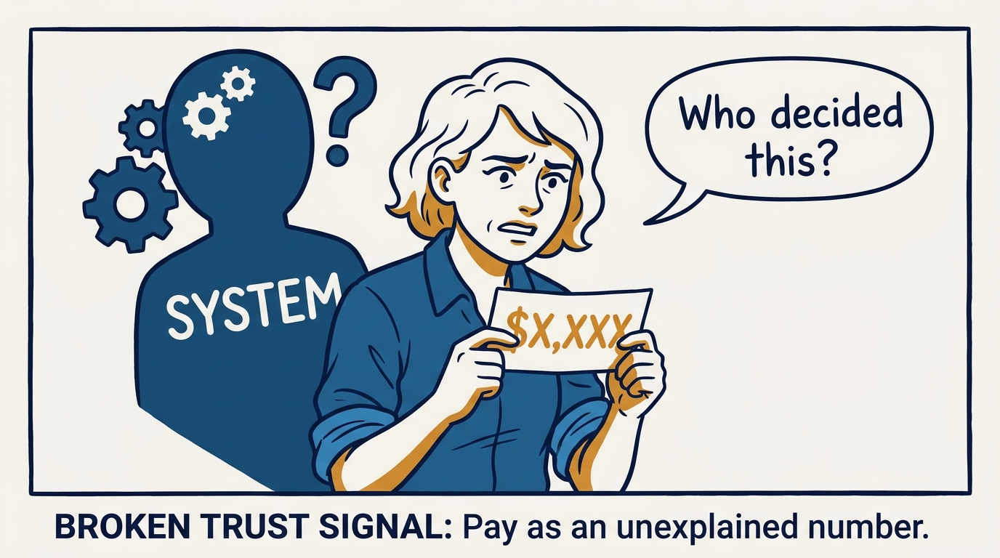
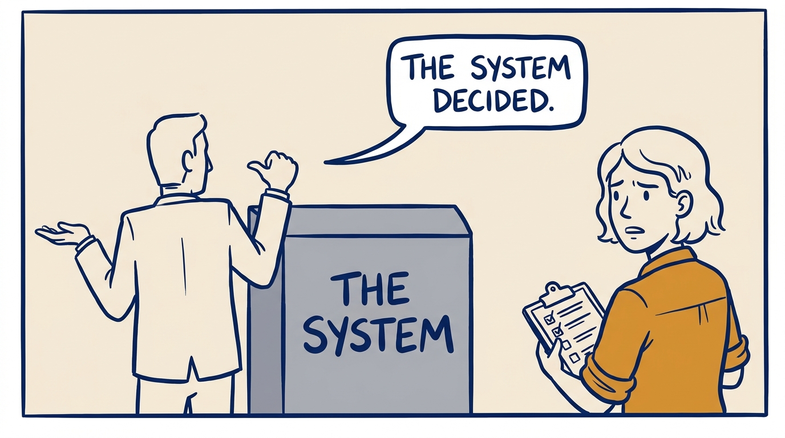
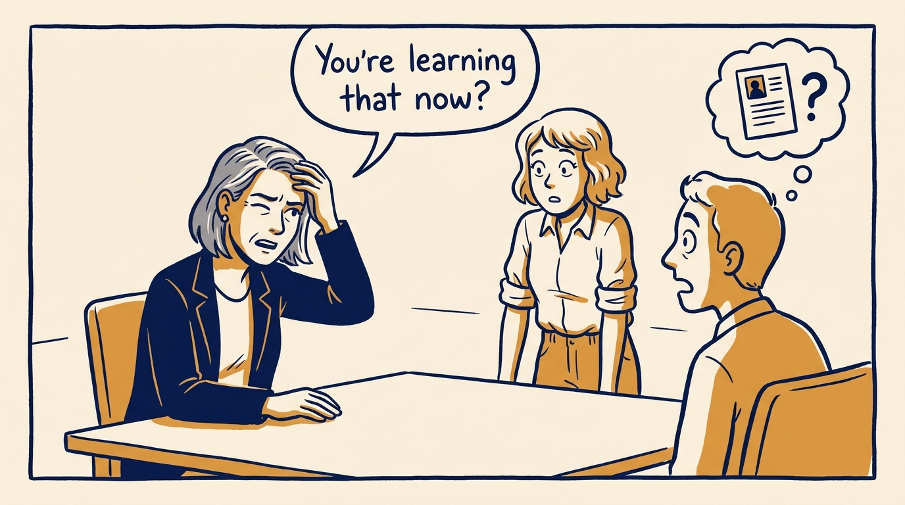
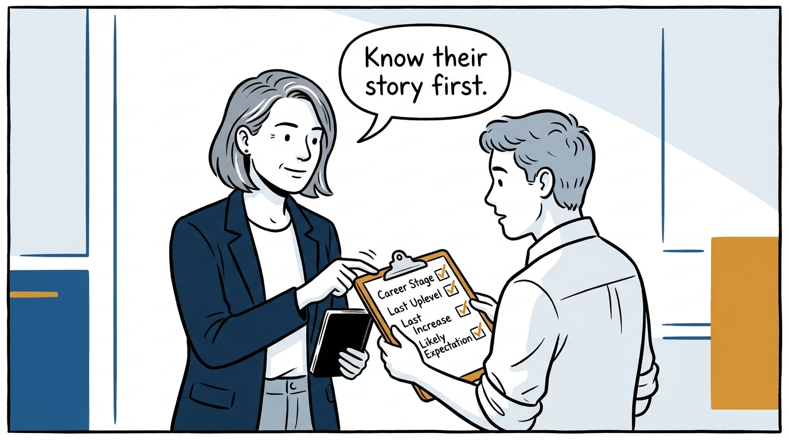
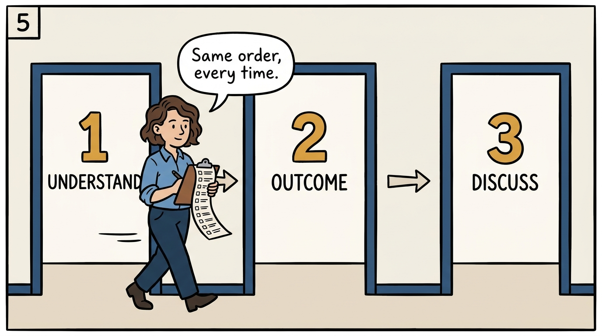
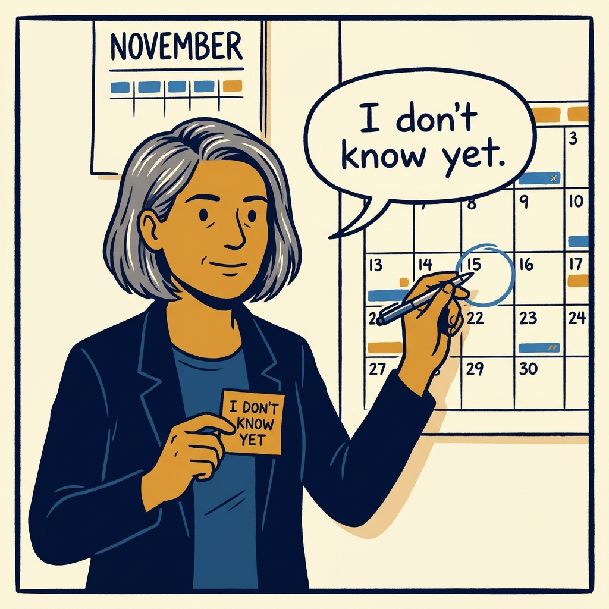
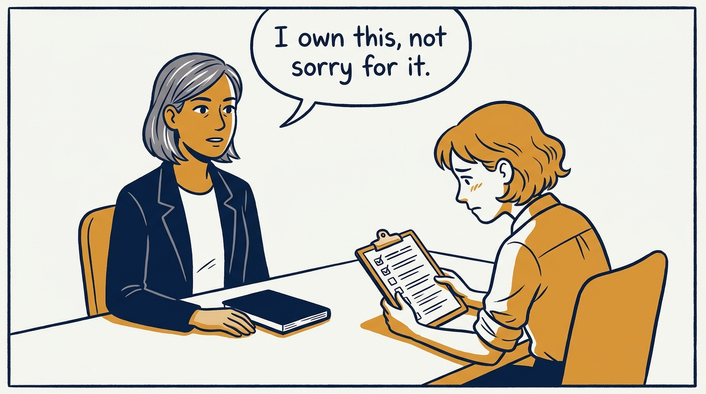
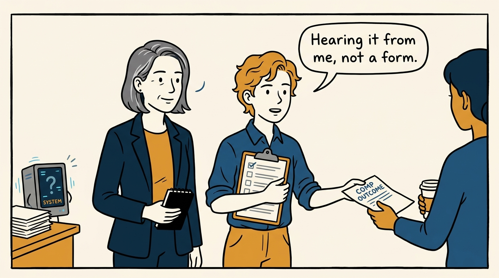

Compensation is never "the system decided" — it is mine to prepare and mine to own, in eight panels.

<!-- comic-style
{
  "cast": "VERA: a calm, seasoned executive, short gray-streaked hair, dark blazer over a plain t-shirt, carries a small black notebook. NOA: an earnest first-time people manager, short wavy hair, rolled-up shirt sleeves, carries a clipboard with a long checklist.",
  "style": "Clean two-tone explainer comic, thick ink outlines, flat colors with deep blue and amber accents on a light background, generous white space, hand-lettered speech bubbles with SHORT readable text, no photorealism."
}
-->

**Panel 1:** *The hook: a number on a pay stub with no one behind it is not a compensation conversation.*

**Panel 2:** *The problem: a manager who hides behind the process never really delivers the message.*

**Panel 3:** *The wrong way: learning a person's story from their face instead of before you sit down.*

**Panel 4:** *The tool: career stage, last uplevel, last increase, likely expectation — prepared person by person.*

**Panel 5:** *How it runs: understanding, then the outcome, then the discussion — the same order every time.*

**Panel 6:** *The mechanic: 'I don't know' plus a real date beats a confident guess about someone's pay.*

**Panel 7:** *The cost: staying in the room through disappointment, without apologizing or over-promising.*

**Panel 8:** *The closer: trust is built one conversation at a time, delivered in person, never outsourced.*
