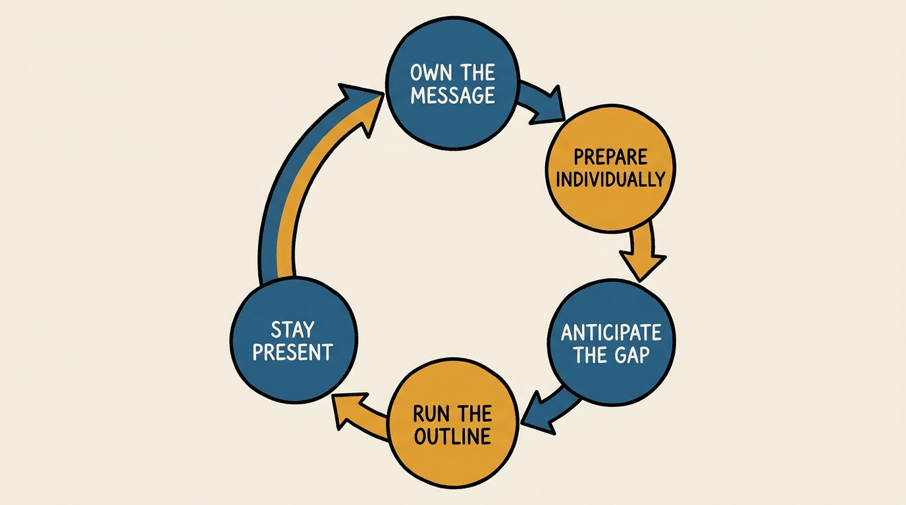
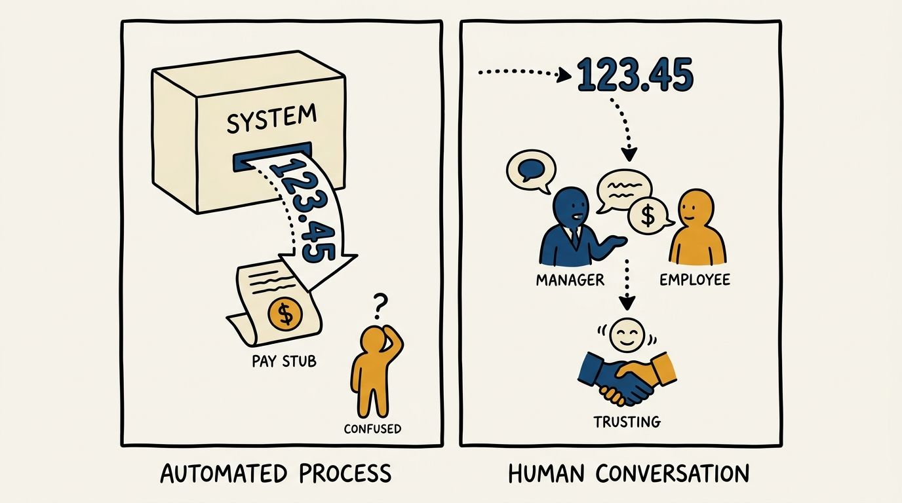
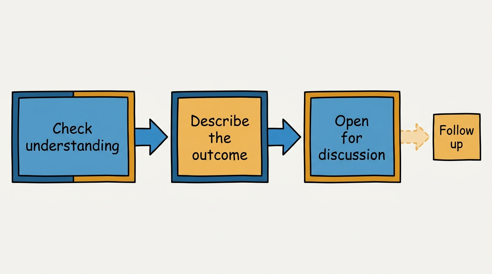

> **Status**: DRAFT
>
> **Principle**: I treat every compensation conversation as mine to own, never as something "the system decided." Pay is one of the clearest signals my organization sends about performance, trust, and fairness, and I refuse to let that signal arrive as an unexplained number on a pay stub. I prepare at the individual level — career stage, time since last uplevel, size of last increase, and what the person is likely expecting — before I say a word, and I stay present through the reaction, whatever it is.

## Statement

My operating model for compensation conversations has five parts:

- **I own the message, not the tool.** Compensation systems, bands, and calibration processes exist to make the numbers fair; they do not exist to make the conversation happen for me. I deliver the outcome myself, in person, in my own words.
- **I prepare at the individual level.** Before any conversation I know the company's comp timeline and the resources I can point someone to, and for each person I think through their career stage, the date of their last uplevel, the size of their last increase, and what they are likely expecting.
- **I anticipate the gap between expectation and outcome.** Preparation is not complete until I have gauged how the number I'm about to share will land against what the person has been quietly expecting. That gap is where the real conversation happens.
- **I follow the same three-phase outline every time.** Check for understanding of the comp philosophy, describe the outcome plainly, then open the conversation up — in that order, regardless of whether the news is good, flat, or disappointing.
- **I stay in the room when it's hard.** If expectations and outcome don't align, I expect emotion, I own the result, and I empathize without apologizing for it or promising a future I can't guarantee.

**Figure 1:** *The operating model is a loop, not a one-time script — it runs again every compensation cycle.*

## How to Read This

This journal is my people-management toolkit — the concrete tools I run people management with, not just the principles behind them. This record is grounded in the "Compensation Conversations Preparation and Guide" from the companion workbooks to Claire Hughes Johnson's *Scaling People: Tactics for Management and Company Building*, read through a practitioner-executive lens. The workbook page is a preparation aid and a conversation outline; I read it as a standing obligation on every manager who delivers a compensation outcome, starting with myself. The runnable version of this tool — the per-person prep template and the conversation outline as a working checklist — lives in the **Checklist** tab of this post.

## Rationale

**Compensation is a trust signal, not a transaction.** A number moving or not moving on a pay stub is never just administrative — it is one of the clearest statements an organization makes about what it values and whether it's fair. I don't get to outsource that statement to payroll, HR systems, or a calibration spreadsheet. If I want my people to trust that pay reflects performance, I have to be the one who says so, in a conversation, where they can ask me anything.

**Figure 2:** *The same number lands differently depending on whether a system delivers it or a person does.*

**Preparation happens person by person, not cohort by cohort.** A comp cycle that runs at the population level — bands, budgets, distributions — is necessary but insufficient. Before I sit down with anyone, I think through their individual story: what career stage they're at, when they were last leveled up, how large their last increase was. That history is what sets their expectation, so it's what I have to understand before I can gauge whether my number will land as recognition or as a disappointment. Skipping this step means walking into the room guessing.

**Owning the message means flexing with the moment, not scripting it.** I come in ready to teach, to listen, to congratulate, or to work through a hard message — because I usually don't know which one I'll need until the conversation starts. When someone got a promotion or a strong increase, I celebrate it and reinforce the specific impact and behaviors that earned it — without implying the same increase repeats every cycle. That distinction matters: recognition is for what happened, not a forecast of what will happen again.

**When expectations don't align, my job is to stay, not to soften.** Money is personal, so a misaligned outcome can be an emotional moment, and I prepare for that rather than being surprised by it. I own the result even when it's difficult, I empathize and listen, and I do not apologize for the outcome or promise an outcome I can't guarantee. Where it helps, I tie the result back to performance or to how the compensation program itself is designed — but I don't use that as a way to distance myself from the decision.

**Silence is itself a message, so I don't send it.** Even when nothing about someone's compensation is changing, I say so directly rather than letting the absence of a conversation speak for me. And when I don't know the answer to a question, I say "I don't know" and commit to circling back — I don't improvise an answer I'm not sure of, because a wrong guess about someone's pay is worse than an honest pause.

## What This Means in Practice

| What this record says | What it does **not** say |
| --- | --- |
| I personally deliver every compensation outcome I'm responsible for. | Comp bands, calibration, and payroll systems are unnecessary — they set the number; I deliver it. |
| I prepare each person's individual story before the conversation. | One prep template fits everyone — career stage and history change what "fair" sounds like to each person. |
| I celebrate increases and name the impact behind them. | A strong increase implies the same increase is guaranteed next cycle. |
| I stay present and own the result when expectations don't align. | Owning the result means apologizing for it or promising a different future outcome. |
| I communicate even when compensation doesn't change. | No news is acceptable news — silence reads as avoidance, not neutrality. |
| I say "I don't know" and circle back when I lack an answer. | Improvising an answer under pressure is an acceptable substitute for a follow-up. |

Concretely: before every comp cycle, I can name each of my people's career stage, date of last uplevel, and size of last increase from memory or from notes I've kept. I never send a compensation outcome by email as the first communication. And I keep a private note of any question I couldn't answer in the room, until I've closed the loop.

**Figure 3:** *The same three-phase order every time, closed out by a follow-up step that keeps the loop honest.*

## Anti-Patterns

- **"The system decided."** Attributing the number to a process rather than owning it myself. The process sets the number; I deliver the message.
- **Walking in unprepared.** Learning someone's career stage or last increase in the room, from their reaction, instead of before the conversation.
- **Over-promising to soften bad news.** Implying next year will be different, or that a strong increase repeats automatically, to manage the moment rather than the relationship.
- **Apologizing for the outcome.** Treating empathy as interchangeable with an apology — one builds trust, the other undermines the decision I'm supposed to be standing behind.
- **Going silent when nothing changes.** Skipping the conversation because there's no news to deliver, and letting people conclude they were forgotten or that their work went unnoticed.
- **Guessing instead of following up.** Answering a comp question I'm not sure about rather than saying "I don't know" and coming back with a real answer.

## Related Records

- [[performance-reviews]] — the written performance record that a compensation outcome should trace back to; this record is the conversation that delivers what that review implies.
- [[managing-underperformance]] — when a comp conversation surfaces a performance gap rather than resolving one, it hands off to this record's documented path.
- [[careers-and-performance]] — the engineering-journal record on career ladders and calibration; that's the system that produces a fair number, this record is how I deliver it.
- [[career-conversations]] — the broader conversation about motivation and growth this journal covers; compensation is one specific, high-stakes instance of it.

## Scope and Revisiting

This record is `draft`. It governs how I and every manager reporting to me prepare for and deliver compensation outcomes — not how those outcomes are calculated. I revisit it whenever my company's compensation philosophy or timeline changes materially, whenever a comp cycle surfaces conversations that went badly for preventable reasons, or whenever I notice managers treating the outcome as something to communicate rather than something to own.

## Authoritative References

- Claire Hughes Johnson, *Scaling People: Tactics for Management and Company Building* (Stripe Press, 2023) — the companion workbooks, "Compensation Conversations Preparation and Guide" (Chapter 5 exercises and templates).
