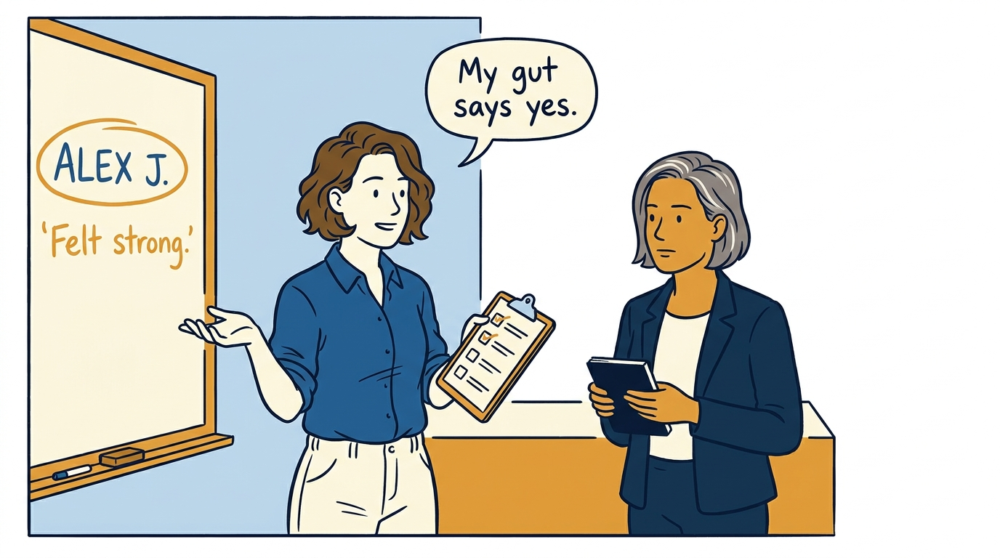
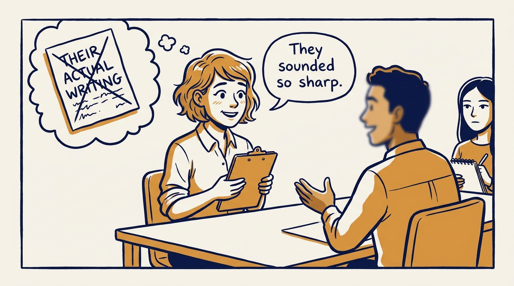
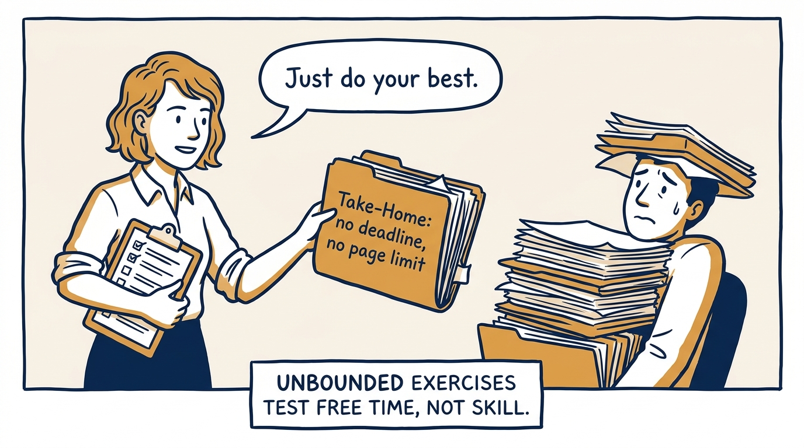
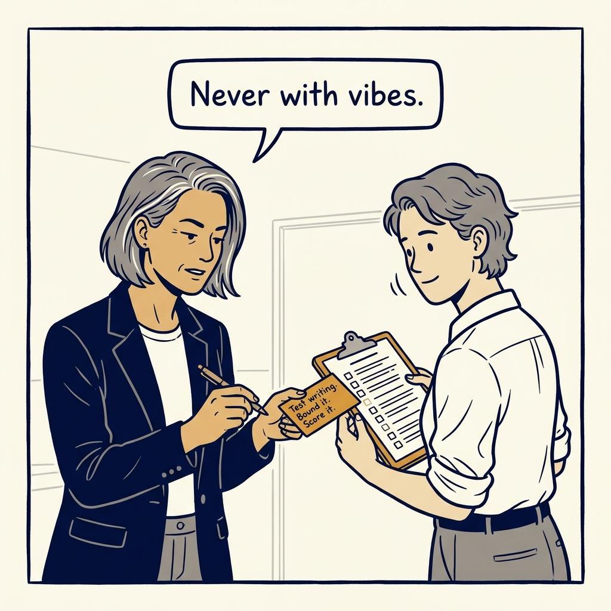
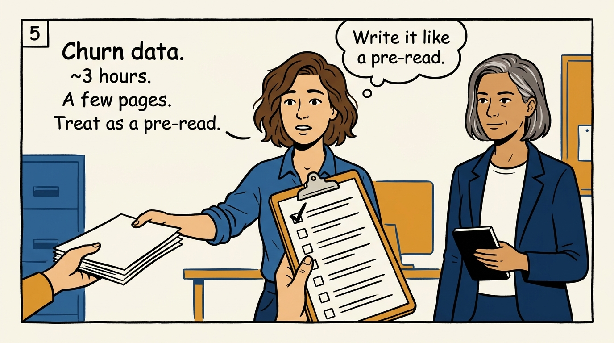
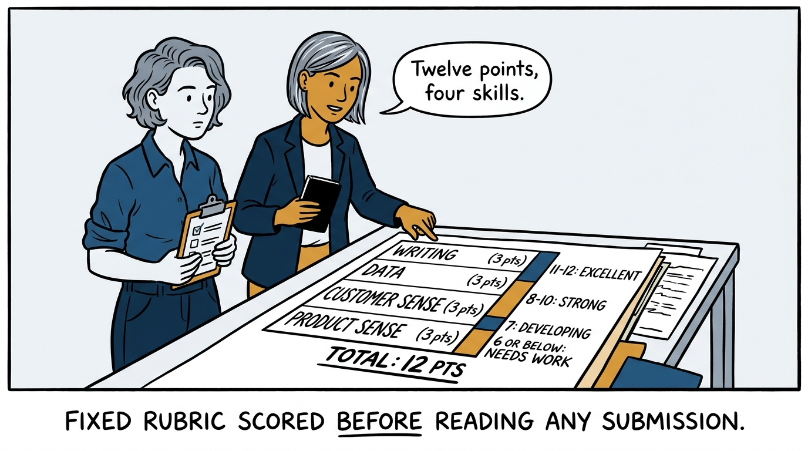
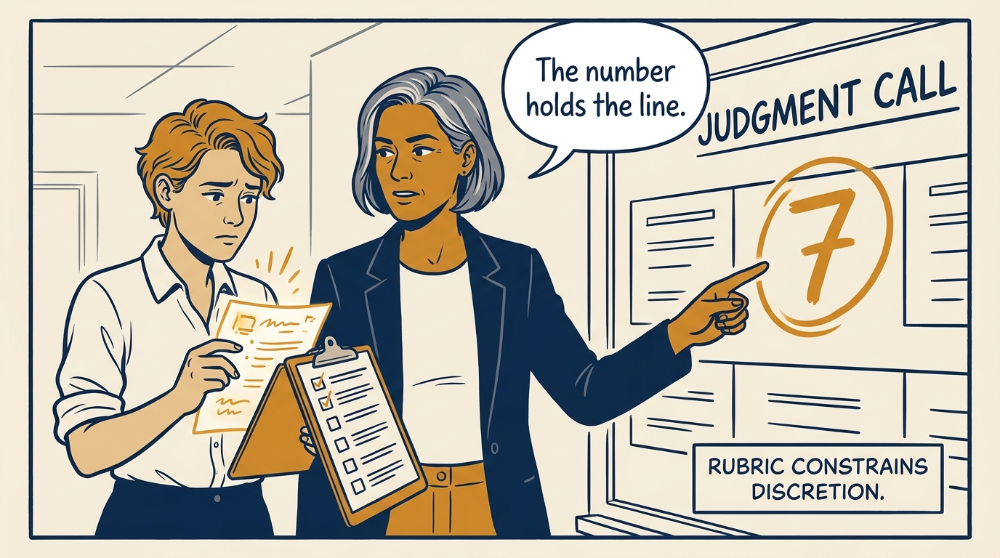
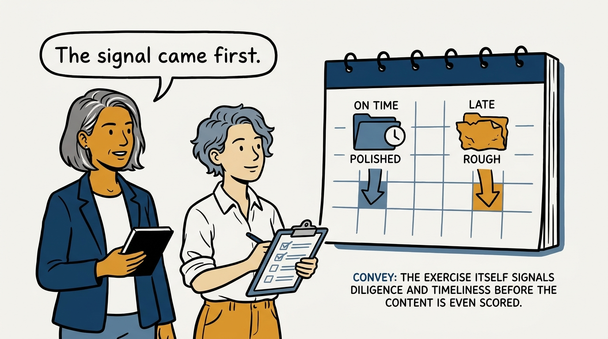

Testing writing with a rubric instead of a gut feeling — in eight panels.

<!-- comic-style
{
  "cast": "VERA: a calm, seasoned executive, short gray-streaked hair, dark blazer over a plain t-shirt, carries a small black notebook. NOA: an earnest first-time people manager, short wavy hair, rolled-up shirt sleeves, carries a clipboard with a long checklist.",
  "style": "Clean two-tone explainer comic, thick ink outlines, flat colors with deep blue and amber accents on a light background, generous white space, hand-lettered speech bubbles with SHORT readable text, no photorealism."
}
-->

**Panel 1:** *The hook: a hiring call made on vibes is a coin flip wearing a suit.*

**Panel 2:** *The problem: how someone talks in a room is not how they write for one.*

**Panel 3:** *The wrong way: no scope, no page limit — testing who has a free weekend.*

**Panel 4:** *The principle: test writing with a bounded, rubric-graded exercise, never with vibes.*

**Panel 5:** *How it runs: a real churn-and-retention prompt, capped at three hours and a few pages, framed as a pre-read.*

**Panel 6:** *The mechanic: four skills at three points each, twelve total, anchored before anyone reads a submission.*

**Panel 7:** *The cost: the score constrains you even when a response reads well — that discipline is the trade-off.*

**Panel 8:** *The closer: a well-built exercise signals diligence and timeliness before you score a single word.*
