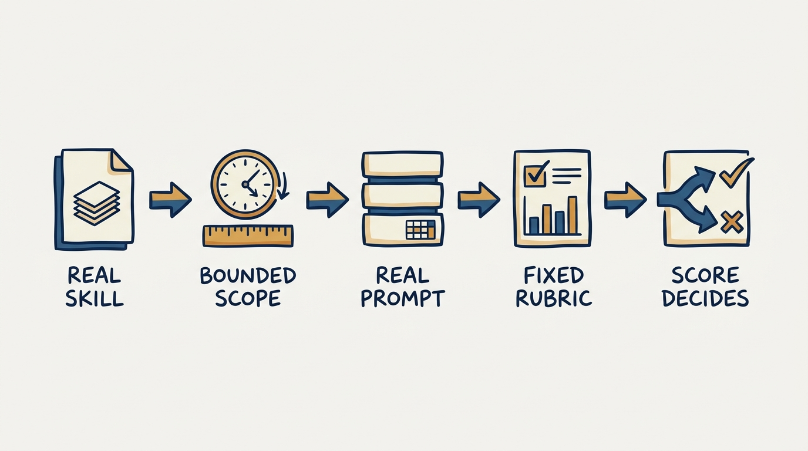
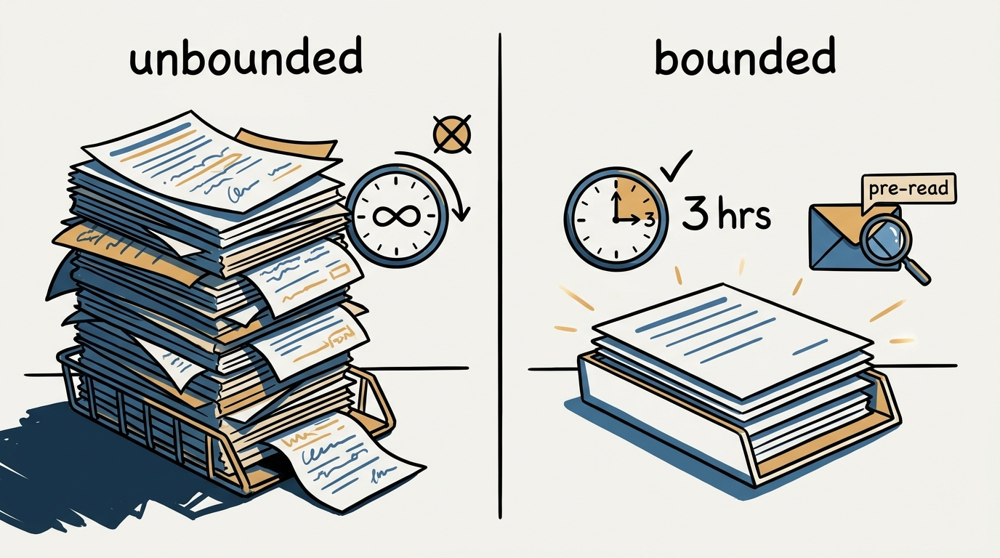
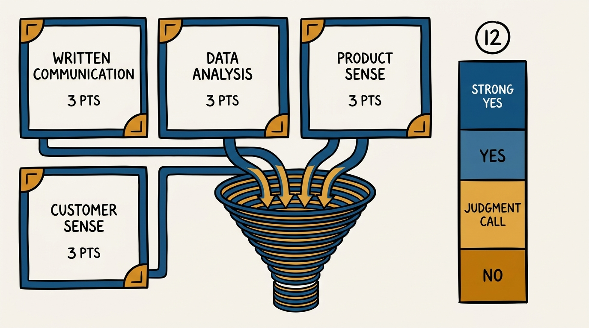

> **Status**: DRAFT
>
> **Principle**: For writing-heavy roles I test writing with a bounded, rubric-graded exercise, never with vibes. I hand the candidate a real problem, a firm scope (about three hours, a few pages, treated as a pre-read I'd send before a meeting), and I score what comes back on a fixed 12-point rubric across written communication, data analysis, customer sense, and product sense. The exercise itself is a signal before I read a single word of the response: whether a candidate returns a quality deliverable on time tells me how much they value timeliness and diligence — the same things I expect from them once they're hired.

## Statement

My operating model for the written exercise has five parts:

- **I test the actual skill, not a proxy for it.** If the role lives and dies on written communication — a PM's narrative doc, a memo that has to survive without the author in the room — I test that skill directly, with a real writing sample, rather than inferring it from how articulate someone sounds in an interview.
- **I bound the exercise tightly.** Roughly three hours of the candidate's time, an output capped at a few pages, and an explicit framing: treat the deliverable as a pre-read I would send before a meeting. An unbounded exercise tests free time, not skill.
- **I give a real prompt with reasonable assumptions allowed.** The candidate gets an example dataset and a scenario — analyze churn, explain what's driving it, propose a prioritized retention roadmap — with all data definitions provided up front so the exercise tests thinking, not archaeology.
- **I score against a fixed rubric before I trust my gut.** Every response gets 3 points each on written communication, data analysis, customer sense, and product sense — 12 points total — scored against poor/good/excellent anchors I wrote down before I read the first submission.
- **The score, not the read, drives the call.** 11–12 is a strong yes, 8–10 is a yes, 7 is a judgment call I make deliberately, and 6 or below is a no. I let the number constrain me even when a response reads well.

**Figure 1:** *The operating model runs as one pipeline: skill, scope, prompt, rubric, decision.*

## How to Read This

This journal is my people-management toolkit — the concrete tools I run management with, not just the principles behind them. This record is grounded in the "Written Exercise Example" and its grading rubric from Claire Hughes Johnson's *Scaling People* companion workbooks, read through a practitioner-executive lens: the workbook hands me a ready-made product-manager exercise and a scoring system; I read it as the operating standard for testing writing in any hiring loop where writing is the job. The runnable tool — the prompt template, the scope guardrails, and the full rubric as tables — lives in the **Checklist** tab of this post.

## Rationale

**A well-built exercise is a signal before I read the response.** The workbook is explicit about this, and I hold onto it as a first-class reason to run the exercise at all: asking candidates to complete a decent, well-constructed written exercise — with clear instructions — is an opportunity to signal that my organization's work culture values timeliness and diligence. Whether a candidate returns a high-quality response on time tells me a great deal about how much they value those same qualities. I get this signal for free, before scoring a single sentence.

**Scope is the control variable.** Three hours of effort and a few pages of output are not arbitrary — they are what keeps the exercise a test of judgment rather than a test of stamina. I frame the deliverable explicitly as a pre-read I would send before a meeting, because that framing forces the same discipline the job will actually demand: say the important thing first, support it with evidence, and don't pad. A candidate who turns in twenty pages has already told me something about how they'll write memos once hired.

**Figure 2:** *Scope is the control variable: bounded to three hours and a few pages, it tests judgment, not stamina.*

**Reasonable assumptions are part of the test, not an escape hatch.** I hand over a real dataset with all data definitions provided, and I explicitly invite the candidate to make reasonable assumptions where the prompt is silent — because a real job never comes with perfectly specified inputs either. I judge how a candidate reasons under incomplete information, not whether they can find the one hidden trick in the prompt.

**Four skills, three points each, no exceptions.** The rubric fixes exactly what I am scoring — written communication, data analysis and the ability to translate data into actions, customer sense, and product sense — at 3 points apiece for a clean 12-point total. I don't let a strong response on one axis quietly compensate for a weak one elsewhere in my head; I score each skill against its own anchors and let the total speak. "Data analysis" is not just running the numbers — it's whether the candidate parses insights into "so-whats," and "customer sense" is not just naming a segment — it's whether that segment is carried through the whole exercise rather than mentioned once and dropped.

**The 12-point scale removes my discretion where I don't want it.** 11–12 is a strong yes, 8–10 is a yes, 7 is a deliberate judgment call, and 6 or below is a no. I built the boundaries before I read anyone's submission, specifically so a response I find personally impressive but that scores low doesn't quietly override the rubric — and so a response I find unremarkable but that scores well doesn't get talked out of a yes.

## What This Means in Practice

| What this record says | What it does **not** say |
| --- | --- |
| Test writing directly with a real writing sample. | Every role needs a written exercise — only writing-heavy roles do. |
| Bound the exercise to ~3 hours and a few pages. | Longer or more exhaustive output is better — the cap is the point. |
| Frame the deliverable as a pre-read before a meeting. | The candidate should format it as a formal report or slide deck. |
| Score 3 points each across communication, data, customer sense, product sense. | A brilliant answer on one skill offsets a weak one elsewhere. |
| Let the 12-point rubric drive the decision. | The rubric replaces judgment — 7 is deliberately left as a judgment call. |
| Give clear instructions and provided data definitions. | Ambiguity in the prompt itself is a valid test of the candidate. |

Concretely: before I open any candidate's submission, the rubric anchors are already written down, the prompt already states the scope in hours and pages, and the interviewer scoring the exercise has not yet seen the candidate's resume open next to it.

**Figure 3:** *Four skills at three points each feed a twelve-point scale with decision bands fixed before scoring begins.*

## Anti-Patterns

- **The unbounded take-home.** No stated time box, no page limit — the exercise quietly tests who has a free weekend, not who thinks well.
- **Scoring from vibes.** "I liked it" or "it felt thin" standing in for a rubric I never wrote down before reading submissions.
- **Rewarding volume.** Treating a fifteen-page response as more thorough rather than recognizing it as a communication failure the pre-read framing was built to catch.
- **Single-segment customer sense.** A candidate names "small business customers" once in paragraph two and never returns to the distinction — scored as if customer sense were demonstrated throughout.
- **Data without so-whats.** A response that presents every cut of the data with no argument for which slices matter, mistaken for rigor because it's exhaustive.
- **Letting 7 become an automatic yes or no.** Treating the judgment-call band as a rounding rule instead of an actual decision the hiring team has to make and own.

## Related Records

- [[interview-loop]] — the exercise is one stage in the loop; this record covers how that specific stage is built and scored.
- [[interview-question-bank]] — the live-conversation counterpart; together they cover both what a candidate says and what a candidate produces unsupervised.
- [[candidate-review]] — where this exercise's 12-point score enters the broader hiring decision alongside interview signal.
- [[hiring]] — the engineering-journal record on hiring practice generally; this record is the writing-specific instrument inside that practice.

## Scope and Revisiting

This record is `draft`. It governs how I build and score a written exercise for any role where writing is core to the job — most directly product management, but adaptable to any writing-heavy seat. I'll revise it when a role's rubric needs a fifth skill the current four don't cover, when the judgment-call band at 7 points proves too blunt in practice, or when I find a prompt shape that signals better than churn-and-retention for roles outside product management.

## Authoritative References

- Claire Hughes Johnson, *Scaling People: Tactics for Management and Company Building* (Stripe Press, 2023) — the companion workbooks, "Written Exercise Example" and its grading rubric (Chapter 3: Exercises and Templates).
