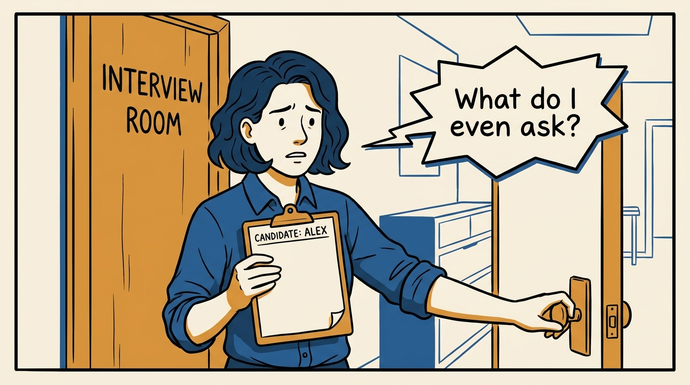
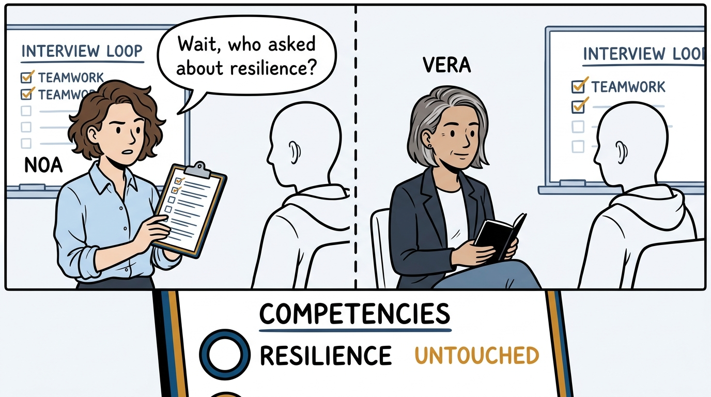
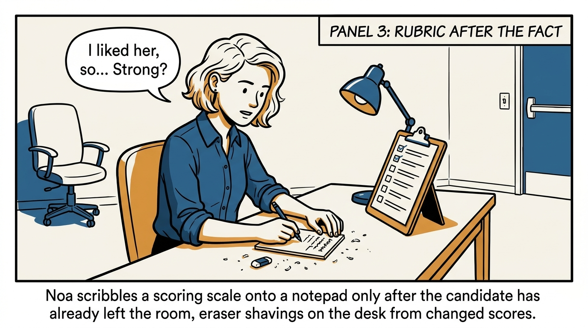
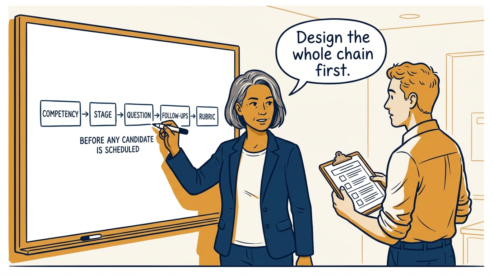
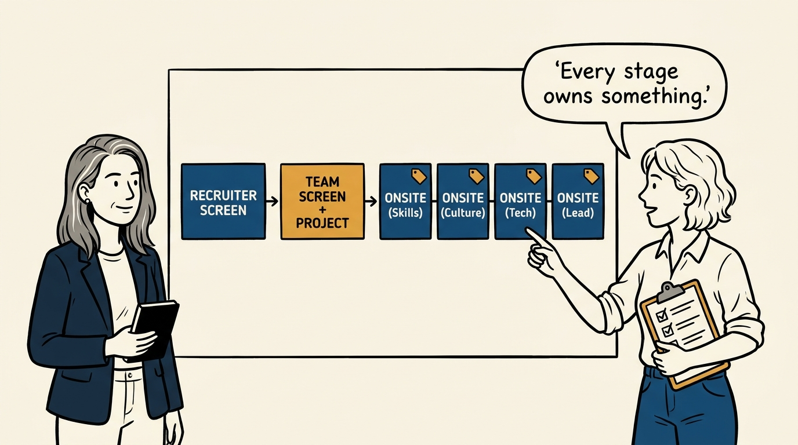
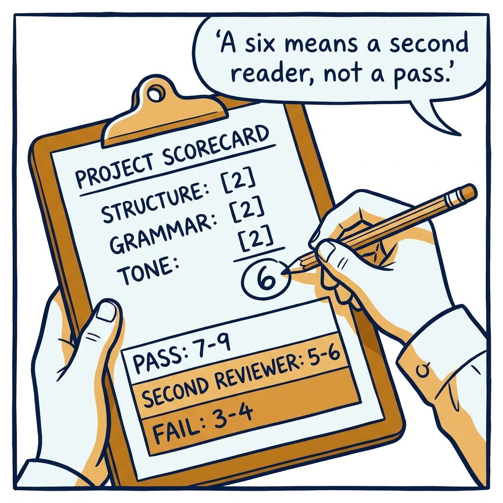
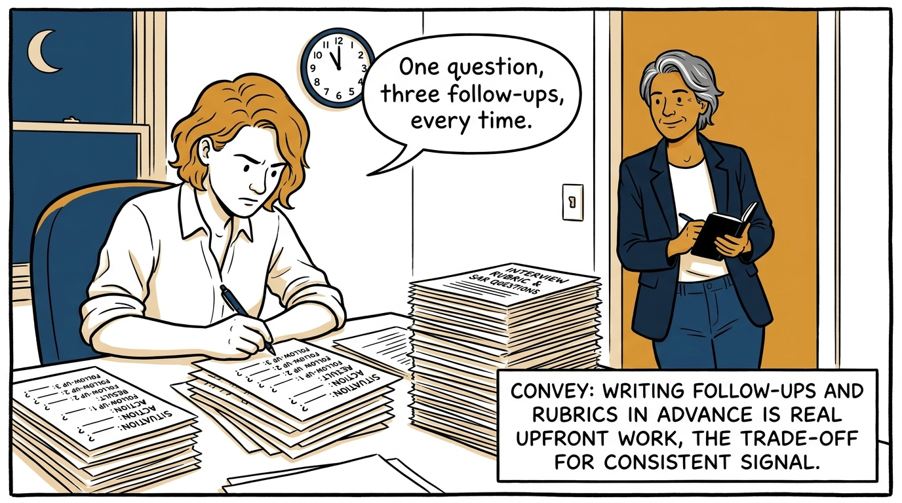
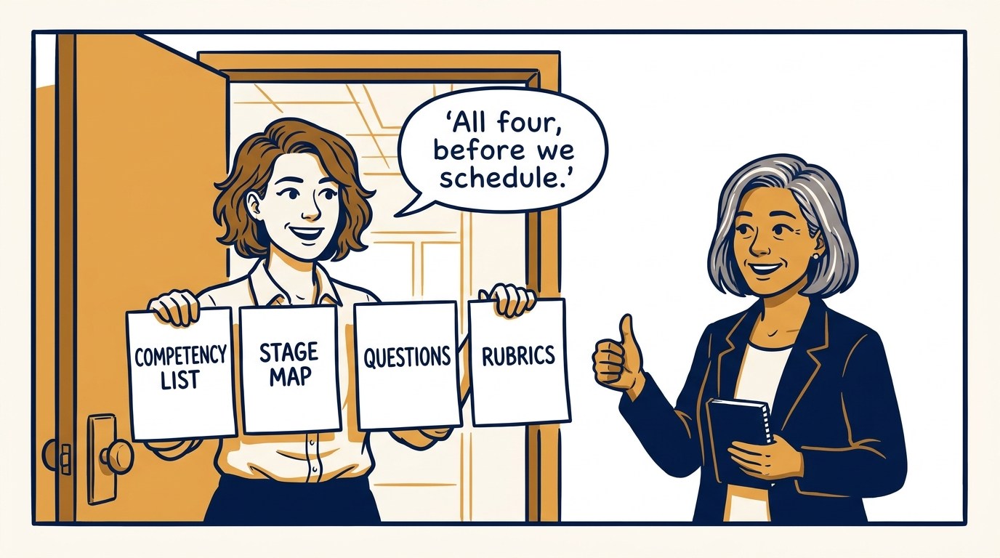

The loop is designed before the first interview is scheduled — in eight panels.

<!-- comic-style
{
  "cast": "VERA: a calm, seasoned executive, short gray-streaked hair, dark blazer over a plain t-shirt, carries a small black notebook. NOA: an earnest first-time people manager, short wavy hair, rolled-up shirt sleeves, carries a clipboard with a long checklist.",
  "style": "Clean two-tone explainer comic, thick ink outlines, flat colors with deep blue and amber accents on a light background, generous white space, hand-lettered speech bubbles with SHORT readable text, no photorealism."
}
-->

**Panel 1:** *The hook: no interviewer should be improvising the questions in the room.*

**Panel 2:** *The problem: without a stage map, two interviewers cover the same ground and one competency goes unchecked.*

**Panel 3:** *The wrong way: a rubric written after the answer is not a rubric, it is a feeling.*

**Panel 4:** *The principle: competency to stage to question to follow-ups to rubric, all written down before scheduling starts.*

**Panel 5:** *How it runs: a screen, a team screen paired with a written project, and four onsites, each owning named competencies.*

**Panel 6:** *The mechanic: 1–3 per area, three areas, and the band decides — 7–9 passes, 5–6 gets a second reviewer, 3–4 fails.*

**Panel 7:** *The cost: writing every follow-up and rubric in advance is real work — the price of comparable scores across candidates.*

**Panel 8:** *The closer: no loop goes live without a competency list, a stage map, questions, and rubrics, whatever the calendar says.*
