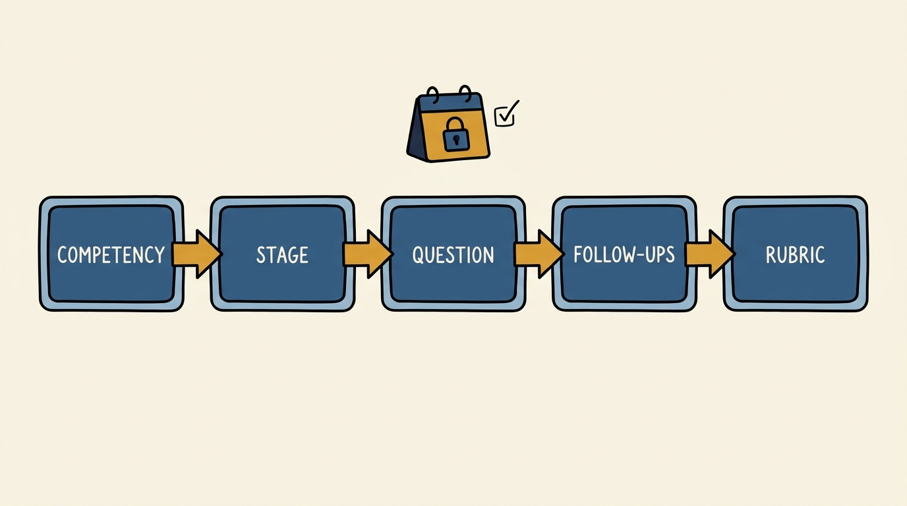
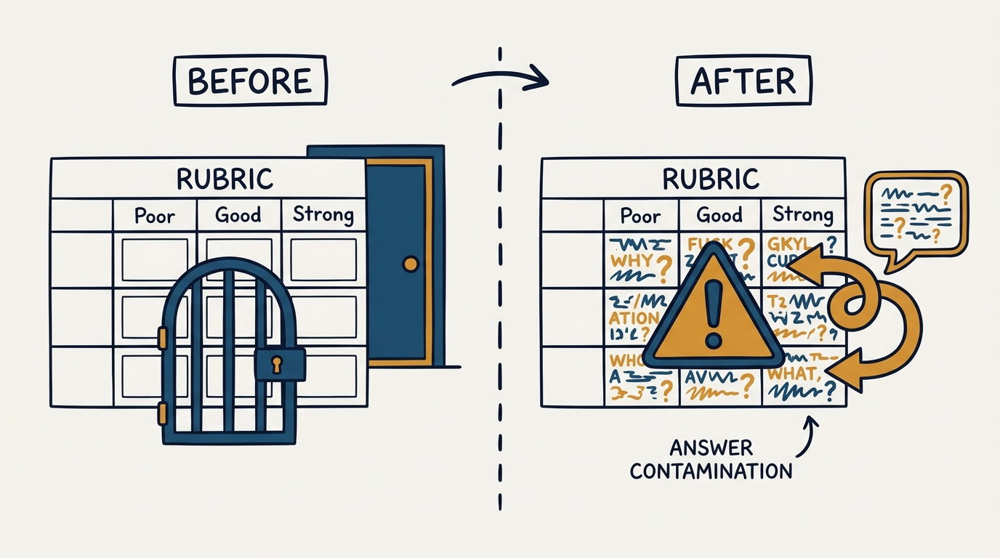
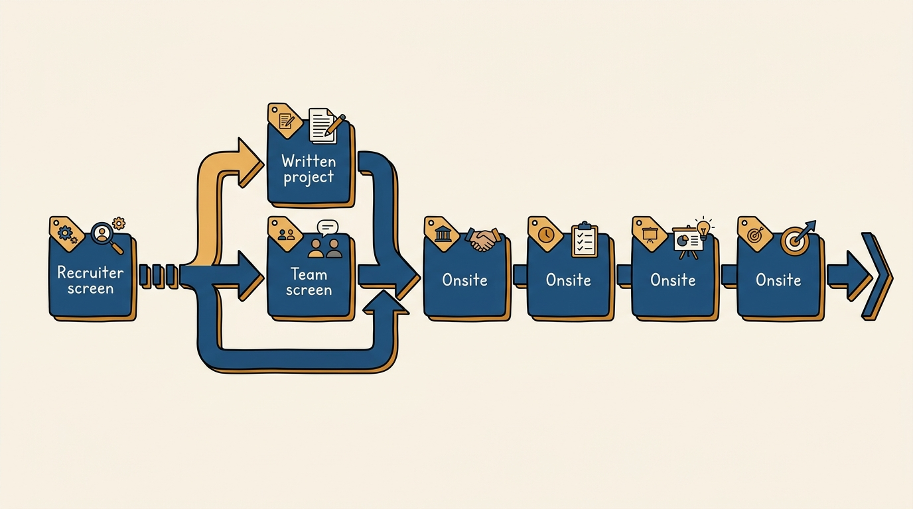

> **Status**: DRAFT
>
> **Principle**: I design the interview loop before I schedule a single interview: I name the competencies the role requires, map each one to a stage, write the questions each stage will ask, write the follow-ups that will deepen a thin answer, and write the Poor/Good/Strong rubric before any candidate walks in. The worked recruiter-role loop in *Scaling People*'s companion workbooks — seven competencies spread across a recruiter screen, a team screen run alongside a written project, and four 45-minute onsites — is not a template for recruiting roles only; it is the pattern I copy every time I open a role, whatever the role is.

## Statement

My operating model for designing an interview loop has five parts:

- **Design the whole loop before the first interview.** Competencies, stages, questions, follow-ups, and rubrics are all written down before a candidate is scheduled. Nothing about the loop is improvised in the room.
- **Name the competencies first, and map each one to exactly one primary stage.** A loop that assesses seven things needs to say, in writing, which stage owns each of the seven — otherwise every interviewer probes whatever they feel like and half the competencies go unchecked while others get asked four times.
- **Every question ships with follow-ups written in advance.** A candidate's first answer is rarely enough signal; a Situation/Action/Result follow-up set is prepared before the interview so a thin first answer gets a fair chance to deepen, and so every interviewer probes the same way.
- **Every question ships with a rubric before anyone answers it.** Poor/Good/Strong (or Poor/Weak/Good/Strong) anchors are written in advance, in the interviewer's own language, so scoring is a comparison to a standard rather than a comparison to the previous candidate.
- **The written exercise gets the same rigor as a live interview.** Where the loop includes writing samples, the scoring bands (numeric per-area scores, a pass threshold, a second-reviewer band, a fail threshold) are fixed before the first sample is read.

**Figure 1:** *The design chain is fixed and finished before the first interview is scheduled: competency to stage to question to follow-ups to rubric.*

## How to Read This

This journal is my people-management toolkit — first-person operating records, each grounded in a named tool from the companion workbooks to Claire Hughes Johnson's *Scaling People: Tactics for Management and Company Building*. This record is built on the **Interview Framework and Rubric: Recruiting for Recruiters (L2+)** tool from Chapter 3 of the workbooks — a complete worked example of a competency-mapped loop, read through a practitioner-executive lens: the workbook builds one loop, for one role, in full; I read it as the pattern every role's loop should follow, not as recruiting-specific content. The runnable tool — a blank design chain for any role, rubric-quality tests, and the worked recruiter loop condensed to reference tables — lives in the **Checklist** tab of this post.

## Rationale

**A loop designed in advance is a different instrument than one improvised live.** The workbook's recruiter loop opens with two lists before a single question is written: seven competencies (collaboration, conscientiousness, willingness to be wrong, intrinsic motivation, structured thinking, resilience, accountability) and a stage map assigning each competency to a specific interview. That ordering is the whole discipline. An interviewer walking into a room without knowing which competency they own will ask whatever feels natural — usually whatever the previous interviewer already asked, or nothing that maps to any competency at all. A loop designed first closes both gaps: every competency has an owner, and no stage duplicates another's job.

**The competency-to-stage map is what prevents redundant coverage and silent gaps.** In the recruiter example, the 30-minute recruiter screen owns conscientiousness and intrinsic motivation (plus the role's functional expertise — a role-specific dimension the workbook checks alongside the seven behavioral competencies, as the written project does for written communication); the 45-minute team screen (paired with the written project) owns accountability and structured thinking; and four 45-minute onsites split the remaining ground — collaboration plus conscientiousness, willingness to be wrong plus intrinsic motivation, structured thinking alone (as a hiring-manager roleplay that walks a full intake meeting in three parts: define the role, build the sourcing-to-hire plan, define how success is measured), and resilience plus accountability. Notice conscientiousness and structured thinking each appear twice, at different depths — a screen-level check and an onsite-level deep dive — and that is a deliberate design choice, not an oversight. When I design a loop, I make that same choice explicit: which competencies get one pass and which earn two, and why.

**Follow-ups are where the signal actually lives, and they have to be written before the interview, not invented during it.** Every onsite question in the workbook ships with a Situation/Action/Result scaffold: what was the situation, what did the candidate actually do, what was the result and what did they learn. A candidate's cold answer to "tell me about a time you were persistent" is rarely differentiating; the follow-ups — what were the obstacles, who did you work with, were you successful, what did you learn — are what separates a rehearsed anecdote from real judgment. If the follow-ups are improvised in the room, different interviewers probe different depths and the resulting scores are not comparable across candidates.

**A rubric written before the candidate answers is the only rubric that is not contaminated by the answer.** Every question in the workbook ships with a Poor/Good/Strong or Poor/Weak/Good/Strong table, written into the tool itself, not into the interviewer's head afterward. The rubrics are concrete enough to score against, down to numbers: the recruiter screen anchors "Strong" volume on the hiring team's own norm of 4–6 unique searches and roughly 7 hires per quarter, and for the diversity-sourcing question "Strong" is defined as being able to name what "diversity" means at role, team, and company level and to create inclusive job descriptions and interview criteria — not a vague sense that the candidate "seemed thoughtful about DEI." A rubric this specific is what keeps five different interviewers scoring the same answer the same way, and what keeps a strong candidate from being downgraded because an interviewer disliked their delivery.

**Figure 2:** *A rubric written before the candidate answers is the only rubric the answer cannot contaminate.*

**The written project earns its own scoring discipline because writing is graded differently than talk.** The workbook's written project — two writing samples, one internal and one external communication, submitted within two to three days — is scored numerically across three named areas (structure, grammar and syntax, tone), each on a 1–3 scale, for a total out of 9. A total of 7–9 passes outright; 5–6 requires a second reviewer; 3–4 fails. That is a real decision procedure, not a vibe check, and it exists because writing samples reward a different kind of rigor than a live conversation does: a recruiter or hiring manager can read them slowly, compare them against a fixed standard, and this record's checklist keeps that scoring band intact rather than letting "second set of eyes" quietly become "pass anyway."

## What This Means in Practice

| What this record says | What it does **not** say |
| --- | --- |
| The loop is designed — competencies, stages, questions, follow-ups, rubrics — before scheduling starts. | Every loop must be built from scratch each time — the recruiter pattern is a template to instantiate, not a rule to reinvent. |
| Each competency maps to a named stage that owns it. | One stage per competency only — a competency can recur at a screen depth and an onsite depth if the design says so, as conscientiousness and structured thinking do here. |
| Every question ships with SAR-style follow-ups written in advance. | Interviewers may never adapt — follow-ups are a floor for probing depth, not a script that forbids a genuinely useful improvised question. |
| Every question ships with a Poor/Good/Strong rubric before any candidate answers. | Rubrics remove judgment — they anchor judgment to a shared standard instead of removing it. |
| The written project is scored on fixed numeric bands (pass 7–9, second reviewer 5–6, fail 3–4). | A 5–6 score is a soft pass — it is a mandatory second read, not a rounding-up. |
| The recruiter loop is the reference pattern for designing any role's loop. | Recruiting-specific content (sourcing volume, the pitch-vs-competition question) transfers to other roles — only the design chain does. |

Concretely: no interview loop in my organization goes live without a written competency list, a stage map naming which stage owns which competency, and a rubric for every question. If a hiring manager cannot produce those four artifacts, the loop is not ready, whatever the calendar says.

**Figure 3:** *Coverage is distributed by design: a screen, a team screen paired with a written project, and four onsites, each owning named ground.*

## Anti-Patterns

- **The improvised loop.** Interviewers picking questions on the fly, in the room, with no shared plan for who covers what. Coverage becomes accidental and unequal across candidates.
- **The rubric written after the answer.** Scoring criteria invented once the candidate has already spoken, unconsciously shaped by whether the interviewer liked them. A rubric written in advance is the only rubric immune to this.
- **Redundant stages, silent gaps.** Two interviewers independently probing the same competency while another competency never gets asked about at all, because no one wrote the stage map down.
- **Follow-up questions invented on the spot.** Some candidates get gently prompted to a deeper answer; others get a flat no-follow-up pass. The workbook's SAR scaffolds exist precisely so this does not depend on interviewer mood.
- **Treating the written project as a formality.** Skimming the writing samples instead of scoring them against the structure/grammar/tone rubric, so a candidate who cannot write clearly slides through on a strong verbal impression.
- **Copying the recruiter content instead of the recruiter pattern.** Reusing sourcing-specific or recruiting-specific questions for an unrelated role because the loop was copied wholesale rather than redesigned competency-first for the role actually being filled.

## Related Records

- [[interview-question-bank]] — the reusable question library; this record is the loop architecture the questions from that bank slot into, stage by stage.
- [[hiring-written-exercises]] — the deeper record on written exercises; this one only places the written project inside the loop and preserves its scoring bands.
- [[candidate-review]] — what happens after the interviews run: the debrief and hire/no-hire decision this loop feeds.
- [[hiring]] — the engineering-executive journal's record on the overall hiring system this loop is one component of.
- [[staffing]] — the product-management journal's record on how people arrive on a team; this record is the mechanism by which the right person is identified before arrival.

## Scope and Revisiting

This record is `draft`. It governs how I design an interview loop for any role in my organization: naming competencies, mapping them to stages, writing questions, writing follow-ups, and writing rubrics before scheduling begins. I will revise it when a loop I design this way misses a competency in practice, when a rubric proves too vague to produce consistent scores across interviewers, or when I find a role whose shape genuinely does not fit the recruiter-loop pattern.

## Authoritative References

- Claire Hughes Johnson, *Scaling People: Tactics for Management and Company Building* (Stripe Press, 2023) — the companion workbooks: the "Interview Framework and Rubric: Recruiting for Recruiters (L2+)" tool (Chapter 3) this record is built on.
