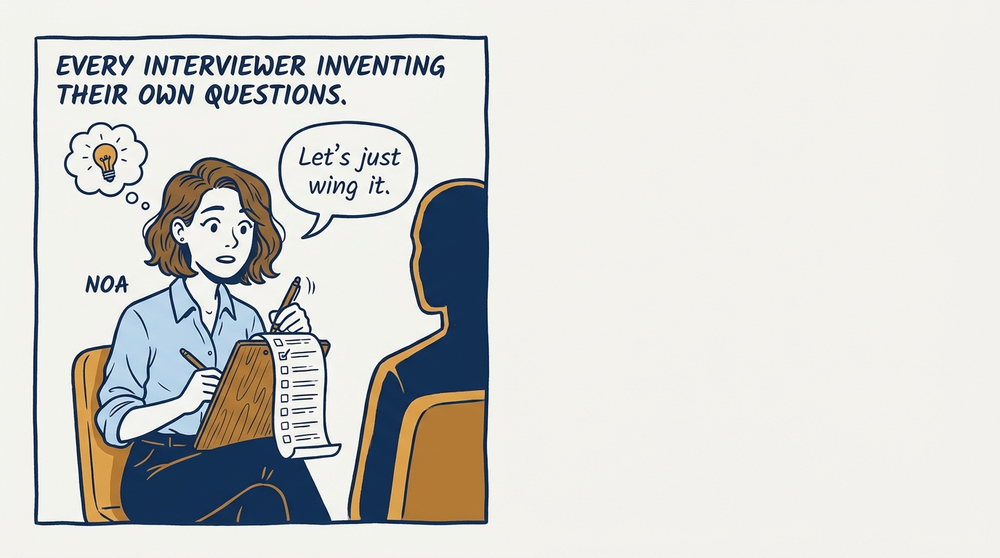
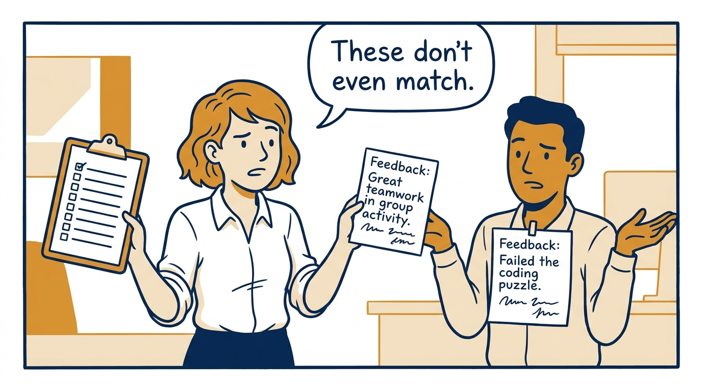
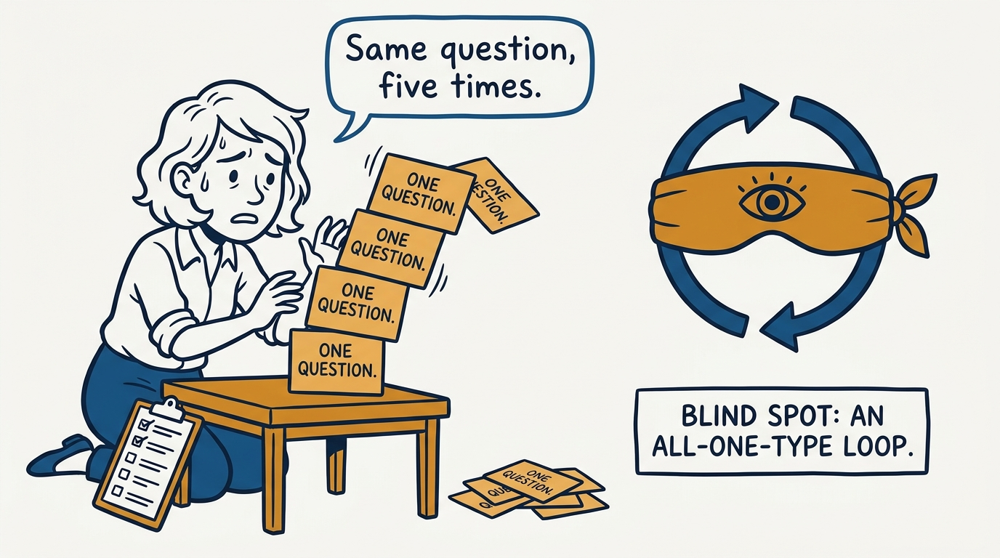
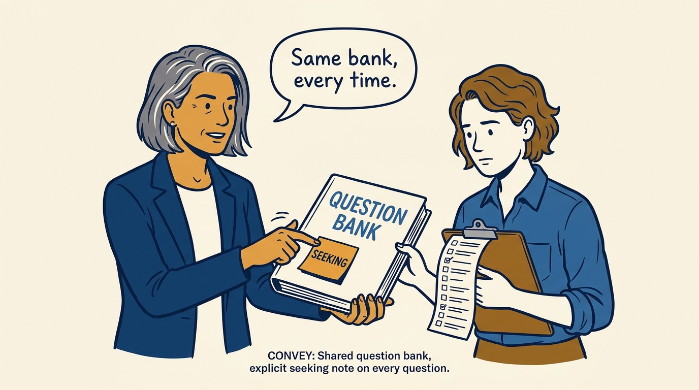
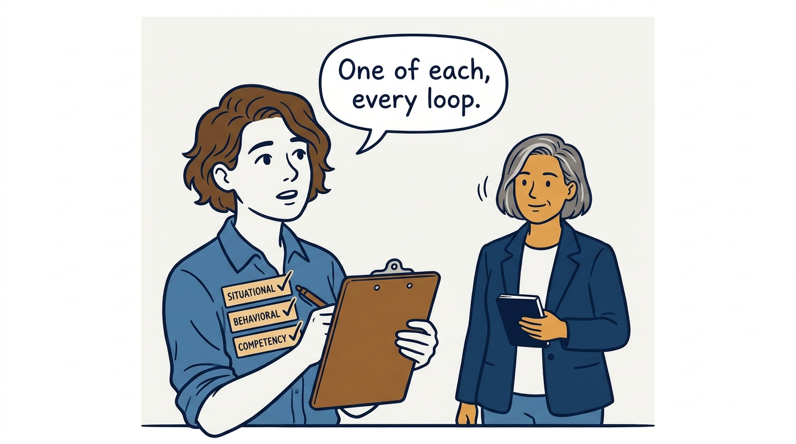
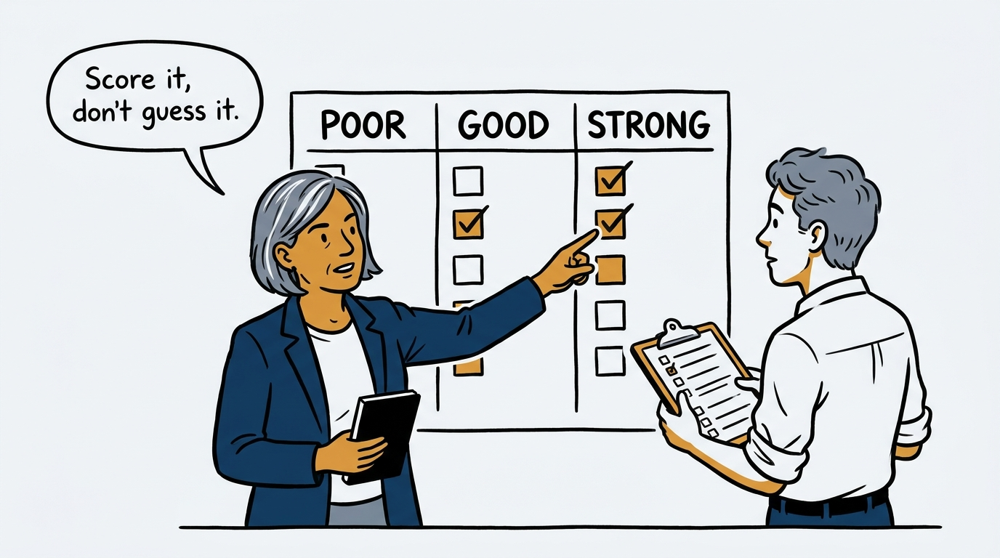
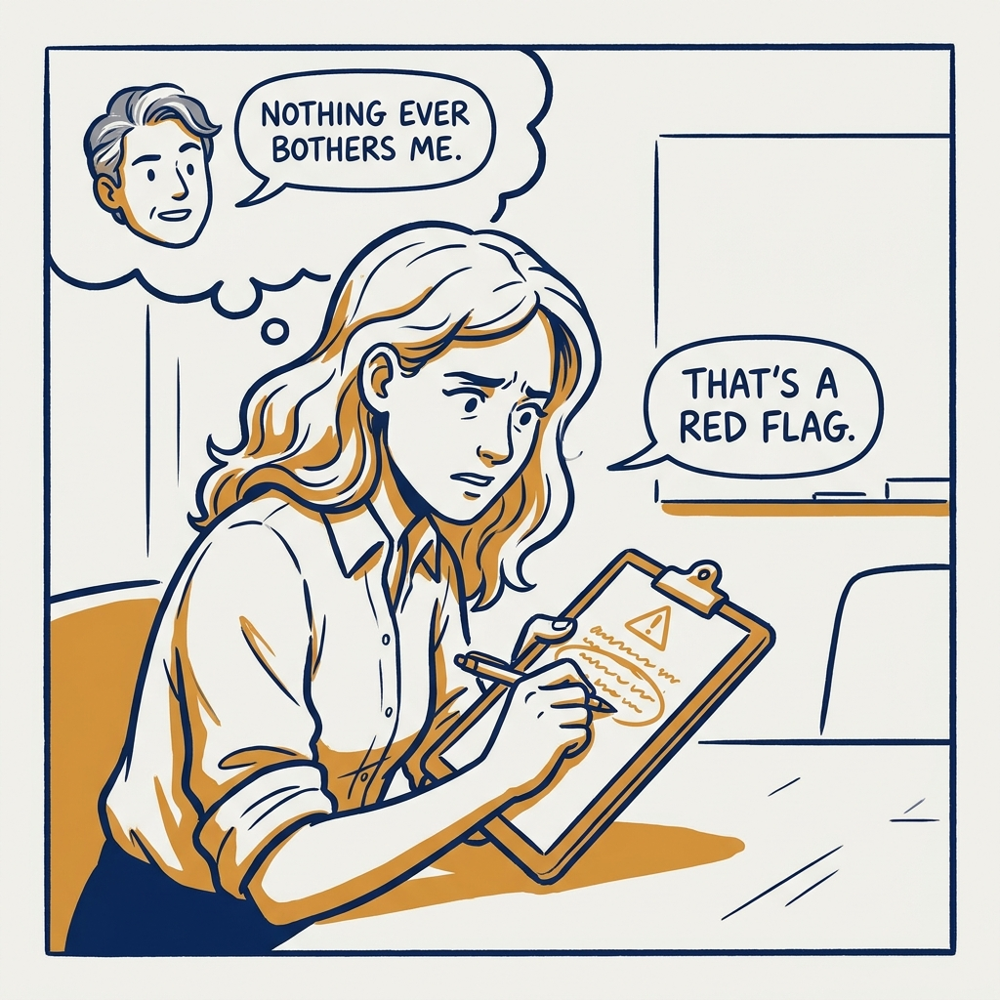
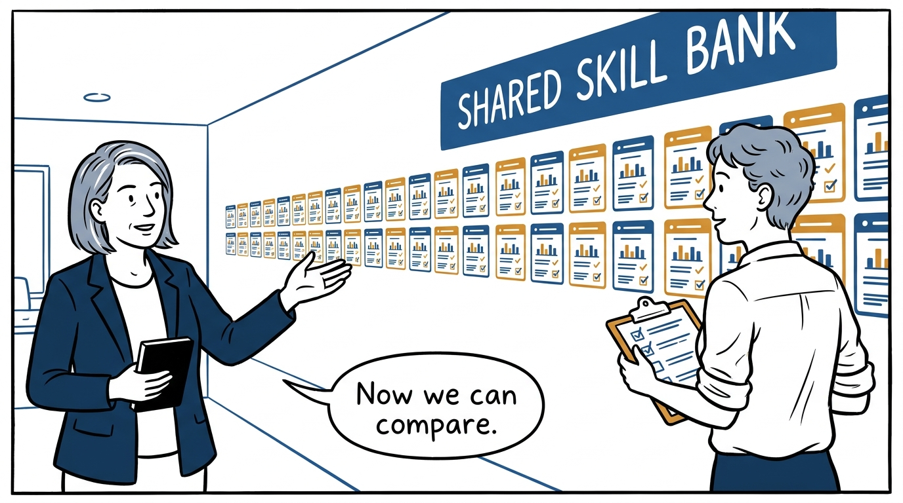

Every interviewer draws from the same bank instead of improvising their own questions — in eight panels.

<!-- comic-style
{
  "cast": "VERA: a calm, seasoned executive, short gray-streaked hair, dark blazer over a plain t-shirt, carries a small black notebook. NOA: an earnest first-time people manager, short wavy hair, rolled-up shirt sleeves, carries a clipboard with a long checklist.",
  "style": "Clean two-tone explainer comic, thick ink outlines, flat colors with deep blue and amber accents on a light background, generous white space, hand-lettered speech bubbles with SHORT readable text, no photorealism."
}
-->

**Panel 1:** *Every interviewer improvising their own questions — the hook.*

**Panel 2:** *The problem: mismatched notes because no two interviewers asked the same thing.*

**Panel 3:** *The wrong way: one question type, over and over, leaves a blind spot.*

**Panel 4:** *The tool: one shared bank, and every question names what it is seeking.*

**Panel 5:** *How it runs: mix situational, behavioral, and competency questions on purpose.*

**Panel 6:** *The mechanic: decision-making is scored against a Poor/Good/Strong rubric.*

**Panel 7:** *The cost: catching red flags and chasing follow-ups takes real discipline.*

**Panel 8:** *The closer: one shared bank, and every candidate's signal finally compares.*
