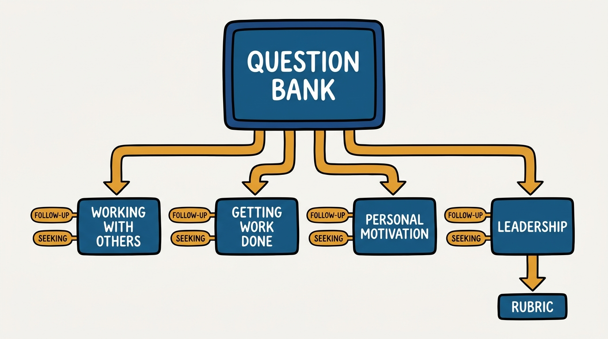
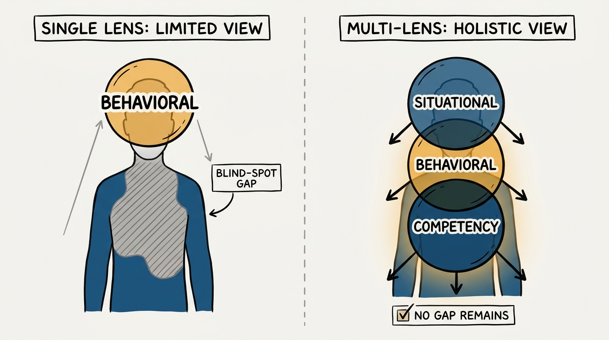
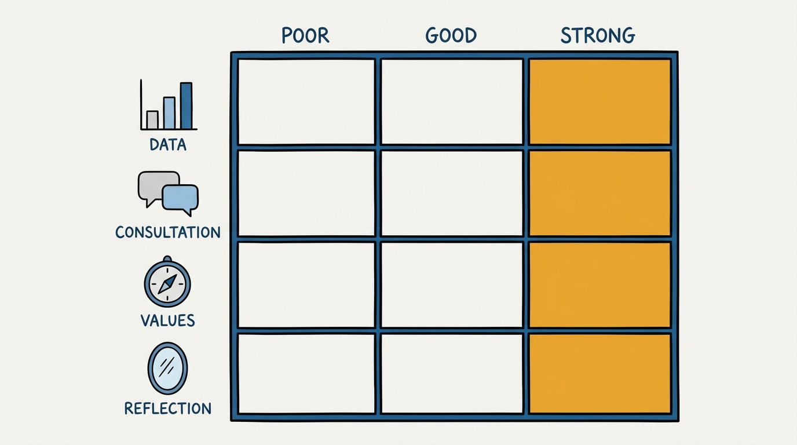

> **Status**: DRAFT
>
> **Principle**: I run interviews from a shared, curated question bank, not from whatever each interviewer improvises on the spot: the same core questions get asked of every candidate, drawn from a deliberate mix of situational, behavioral, and strict competency questions, and every question ships with an explicit "seeking" note that tells the interviewer what a strong answer actually sounds like. Consistency across candidates is what makes signal comparable — an interview loop that asks something different of every candidate is not evaluating candidates, it is evaluating interviewers.

## Statement

My operating model for the interview question bank has five parts:

- **One shared bank, not individual improvisation.** Interviewers draw from a maintained bank of questions rather than inventing their own on the spot. Consistency across candidates is the point — it is what makes one candidate's answer comparable to another's.
- **Mix the question types deliberately.** Every loop combines situational questions ("how would you handle this scenario?"), behavioral questions ("tell me about a challenge you overcame"), and strict competency questions ("describe the last model you built and how"). One type alone tests one thing; the mix tests the candidate.
- **Every question ships with a "seeking."** A question without a stated target is just conversation. Each question in the bank names, in advance, the trait or pattern the interviewer is listening for, so the interviewer scores the answer against a standard rather than against likability.
- **Follow-ups do the real digging.** The headline question opens the door; the follow-up ("what would you do differently?", "what were that leader's weaknesses?") is where the candidate's actual judgment shows up. I treat the follow-up as mandatory, not optional color.
- **Fold in a scored question for the hardest signal.** For decision-making — the trait hardest to fake and hardest to assess informally — I use a structured Situation/Action/Result question and score the answer against an explicit Poor/Good/Strong rubric, not against gut feel.

**Figure 1:** *One bank, four groups, each question carrying its follow-up and its seeking note.*

## How to Read This

This journal is my people-management toolkit — first-person operating records, each grounded in a named tool from the companion workbooks to Claire Hughes Johnson's *Scaling People: Tactics for Management and Company Building*. This record is built on the Chapter 3 "Sample Interview Questions" tool, with the preceding decision-making interview question and its Poor/Good/Strong rubric folded in as the bank's leadership deep dive, read through a practitioner-executive lens. Many of the questions are credited by the workbook to Stripe's CTO, David Singleton; I carry that credit forward rather than presenting the bank as my own invention. The runnable tool — every question, its follow-ups, and its "seeking" guidance — lives in the **Checklist** tab of this post.

## Rationale

**Consistency is what makes signal comparable.** The workbook is blunt about this: there are countless interview questions available online, and the key is not finding the perfect ones — it is being consistent in what you ask. If interviewer A asks about teamwork and interviewer B asks about a coding puzzle, I cannot compare candidate A to candidate B; I can only compare interviewer A's read to interviewer B's read. A shared bank turns a set of individual impressions into one coherent evaluation.

**The three question types test different failure modes.** A situational question tests judgment about a hypothetical; a behavioral question tests what the candidate actually did under real pressure; a strict competency question tests whether the skill is real rather than described. A loop built from only one type has a blind spot: all-behavioral misses raw skill, all-competency misses judgment and self-awareness, all-situational lets a well-rehearsed candidate answer in the abstract and never ground it in something that happened. Mixing all three is not stylistic variety — it closes the gaps each type leaves open.

**Figure 2:** *One question type leaves a gap; situational, behavioral, and competency together close it.*

**"Seeking" is what turns a question into an assessment.** Every question in the bank names, in advance, what a strong answer looks like: for "tell me about the lowest-morale team you've been part of," I am seeking whether the candidate brought levity, tried to fix the situation, or ran away. Without that stated target, two interviewers can hear the same answer and reach opposite conclusions — one charmed by confidence, one unmoved. The "seeking" note is the rubric hiding inside an ordinary-sounding question.

**Red flags are signal, not noise.** The personal-motivation question about balancing competing demands has an explicit "avoid" case: reliance primarily on colleagues to get through hard periods, or "nothing ever bothers me" as a stated coping style — a claim of invulnerability rather than an account of a real coping mechanism. The job-dislike question separates fixers from complainers by whether the candidate tried to fix the thing they described, not merely named it. I score for these red flags on purpose; they are cheaper to catch at the interview stage than after the hire.

**A rubric turns judgment into a shared standard.** The decision-making question — describe a difficult decision about your team's priorities or strategy — is the one question in the chapter that ships with a full Poor/Good/Strong rubric across four dimensions: whether decisions are data-informed rather than rash, whether the candidate consulted widely rather than unilaterally, whether they can articulate how company values shaped the decision rather than treating values as decoration, and whether they can reflect honestly on the outcome, including its gaps. I fold this question into the bank as leadership material because decision-making under real stakes is exactly what the leadership questions are probing for, and because a rubric this explicit deserves to travel with the rest of the structured tool rather than sit orphaned earlier in the chapter.

**Figure 3:** *The decision-making rubric: four dimensions, each scored Poor, Good, or Strong.*

## What This Means in Practice

| What this record says | What it does **not** say |
| --- | --- |
| Ask from a shared, maintained question bank. | Every interviewer asks identical words — follow-ups and phrasing adapt; the core questions and their targets do not. |
| Mix situational, behavioral, and strict competency questions. | Any one question type is sufficient on its own — each type alone leaves a blind spot the others cover. |
| Every question carries an explicit "seeking." | The "seeking" note is disclosed to the candidate — it is the interviewer's scoring key, not talking points. |
| Score decision-making against the Poor/Good/Strong rubric. | The rubric replaces judgment — it structures judgment so two interviewers land on the same read. |
| Treat "nothing ever bothers me" and complaining-without-fixing as red flags. | One red flag disqualifies a candidate — it is one data point weighed with the rest of the loop. |
| Ask "who was the best hire you ever made?" for a specific, named individual. | A vague or hypothetical answer is acceptable — the follow-ups exist to force specificity. |

Concretely: no interviewer in my organization freelances a set of questions for a loop; they draw from the bank, ask the follow-ups, and write feedback against the stated "seeking," not against a general impression. Any interviewer asking a decision-making question scores it against the Poor/Good/Strong rubric explicitly in the written debrief.

## Anti-Patterns

- **Interviewer improvisation.** Each interviewer bringing their own favorite questions produces incomparable signal across candidates — a loop that evaluates interviewers more than it evaluates the candidate.
- **Single-type loops.** All-behavioral or all-competency loops that never test judgment on a hypothetical, or never verify a skill was actually applied under pressure.
- **The stated question with no target.** Asking "tell me about a challenge you overcame" without an internal answer to "what am I listening for" turns the interview into a performance review of storytelling.
- **Skipping the follow-up.** Taking the headline answer at face value and never asking what the candidate would do differently, or what the admired leader's weaknesses were — the follow-up is where the real signal lives.
- **Missing the red flags.** Hearing "nothing ever bothers me" or a string of complaints with no attempted fix and coding it as confidence or bluntness rather than the warning it is.
- **Scoring decisions on vibes.** Judging a decision-making answer as "sounded confident" instead of walking it against the rubric's four dimensions: data, consultation, values, reflection.

## Related Records

- [[interview-loop]] — designs the loop itself (stages, interviewer assignments, focus areas); this record supplies the questions the loop asks.
- [[hiring-written-exercises]] — the written-exercise signal is a separate tool from live questioning; this bank covers what happens in the room.
- [[candidate-review]] — where the answers scored against this bank's "seeking" guidance get debriefed and decided on.
- [[hiring]] — the engineering-journal record on the overall hiring system this question bank plugs into as one component.

## Scope and Revisiting

This record is `draft`. It governs the question bank every interviewer in my organization draws from, including the decision-making question and its rubric. I will revise it when a question stops discriminating between strong and weak candidates in practice, when a new competency needs its own bank entry, or when the rubric proves too coarse for the decisions I most need signal on.

## Authoritative References

- Claire Hughes Johnson, *Scaling People: Tactics for Management and Company Building* (Stripe Press, 2023) — the companion workbooks: the Chapter 3 "Sample Interview Questions" tool and the preceding decision-making interview question with its Poor/Good/Strong rubric.
- Many of the bank's questions are credited by the workbook to Stripe's CTO, David Singleton, whose credit the workbook carries and this record preserves.
