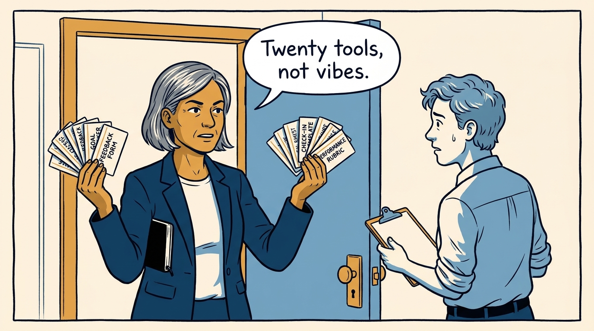
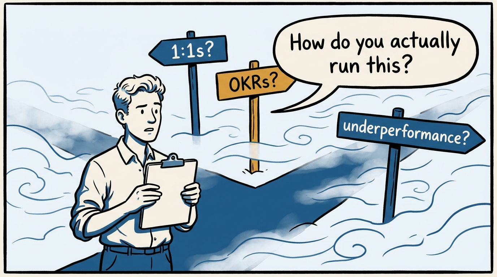
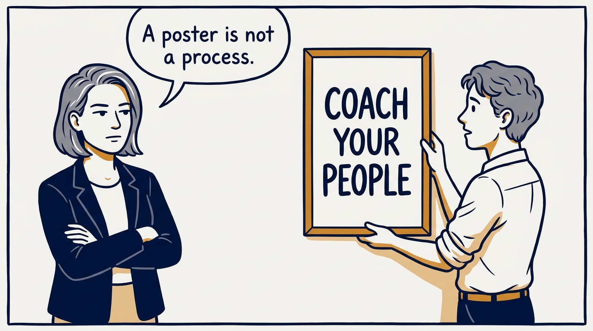
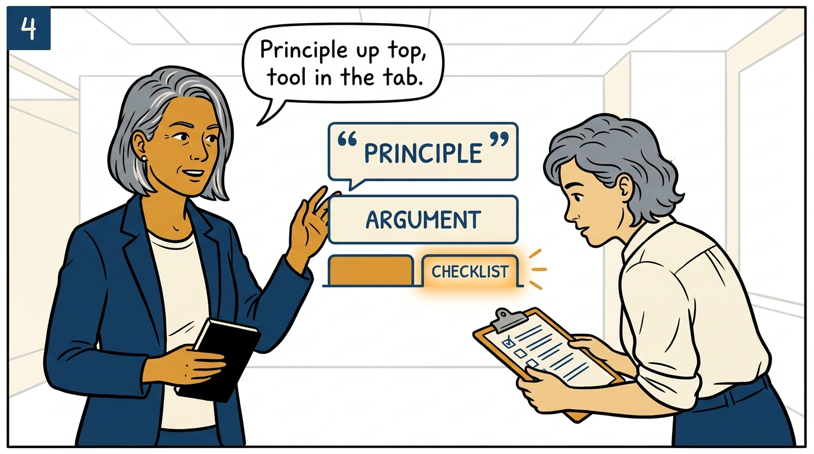
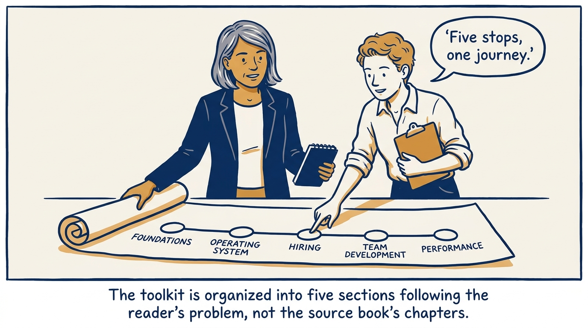
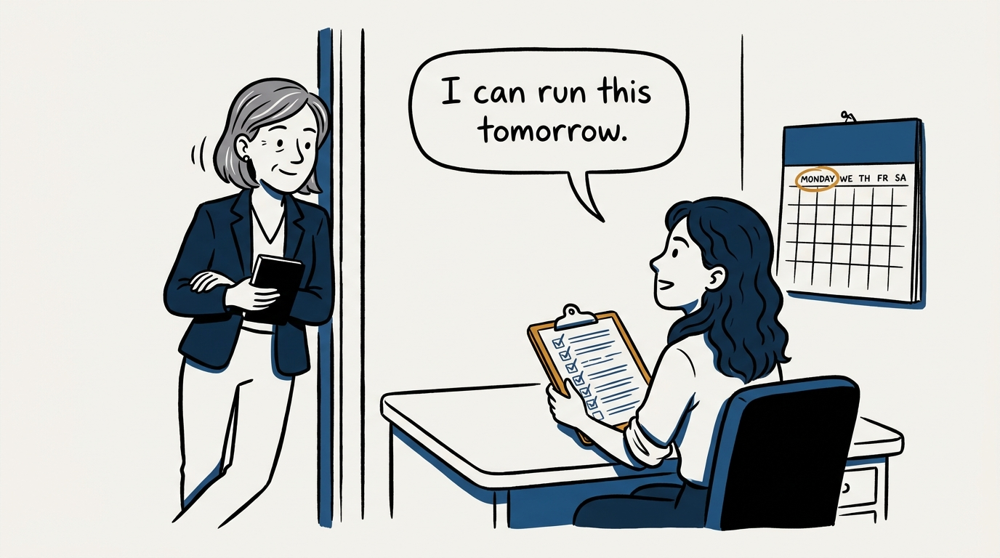
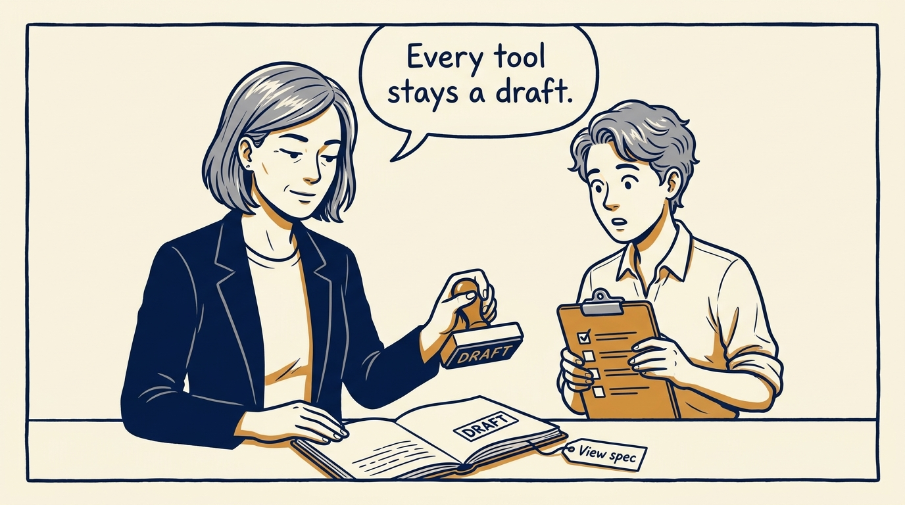
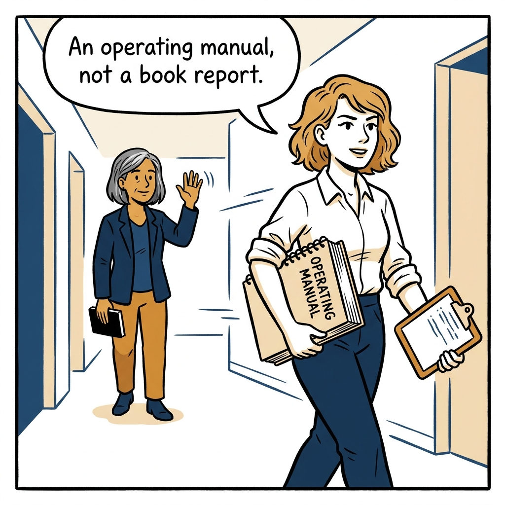

Noa meets the journal — twenty tools instead of vibes, in eight panels.

<!-- comic-style
{
  "cast": "VERA: a calm, seasoned executive, short gray-streaked hair, dark blazer over a plain t-shirt, carries a small black notebook. NOA: an earnest first-time people manager, short wavy hair, rolled-up shirt sleeves, carries a clipboard with a long checklist.",
  "style": "Clean two-tone explainer comic, thick ink outlines, flat colors with deep blue and amber accents on a light background, generous white space, hand-lettered speech bubbles with SHORT readable text, no photorealism."
}
-->

**Panel 1:** *The hook: this journal is twenty tools, not a personality.*

**Panel 2:** *The problem: an org doesn't experience intentions, it experiences mechanisms.*

**Panel 3:** *The wrong way: a principle on the wall with no tool underneath it decays into a poster.*

**Panel 4:** *The anatomy: every record states the principle, then ships the tool in its Checklist tab.*

**Panel 5:** *How it runs: five sections, from foundations through hiring to performance, chained by workflow.*

**Panel 6:** *The mechanic: a checklist you run tomorrow, not a slide you admire today.*

**Panel 7:** *The cost: every tool ships as a draft, open to revision — nothing here is finished.*

**Panel 8:** *The closer: read it as an operating manual — twenty tools you run, not a book you review.*
