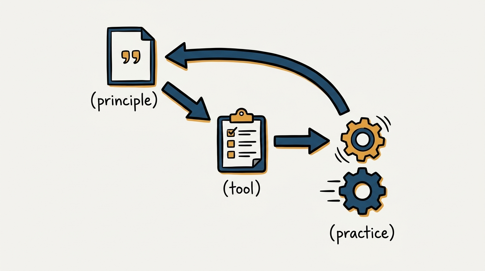
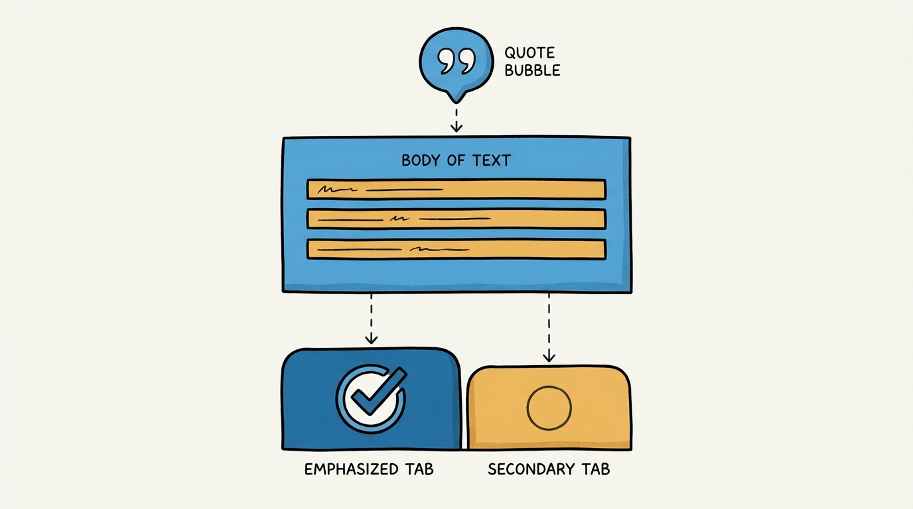
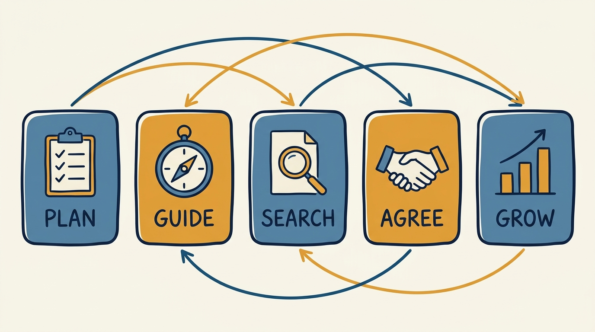

> **KEY POINTS:**
>
> * **This journal is my people-management toolkit, written down** — 20 records covering the concrete instruments I manage with, from the baseline hygiene checklist to hiring loops, operating cadences, and performance processes, grounded in the companion workbooks to Claire Hughes Johnson's *Scaling People*.
> * **Every record ships the tool, not just the argument** — the article states the principle I commit to and why; the **Checklist** tab carries the runnable tool itself: the checklist, template, rubric, or process you can execute tomorrow.
> * **Read it as an operating manual, not a book report** — the tools are adapted from Stripe's practice through my own lens; where my practice differs from the source, the record says so, and every record names the conditions under which I would revise it.

 

If you work with me — as a manager in my organization, as my peer, or as my own manager — you should not have to guess how I run the mechanics of people management. My other journals state principles; this one states *tools*. Twenty records, each built around a concrete instrument: a checklist I actually run, a template I actually fill in, a rubric I actually score against. The argument for each tool lives in the article; the tool itself lives in the record's **Checklist** tab, ready to use.

**Figure 1:** *The shape of this journal: a principle written down, a tool that makes it runnable, and practice that feeds back to revise both.*

## Why an Executive Writes Down a Toolkit

Because management quality at scale is a systems property, not a personality trait. An organization does not experience my intentions; it experiences my mechanisms — whether 1:1s happen and develop people, whether goals are written so they can fail visibly, whether hiring decisions rest on rubrics or on charisma, whether underperformance is met early and in writing or late and by surprise. Principles without tools decay into vibes; tools without principles decay into bureaucracy. This journal holds the two together: every record states the principle first and then hands you the instrument that makes it real.

There is a second reason, inherited from this journal's siblings. My [engineering-executive journal](../grounded-engineering-executive/introduction.html) commits me to an operating model that is inspectable — written down, argued, and concrete enough to check me against. The [product-management journal](../grounded-product-management/introduction.html) extends that across the product boundary. This journal extends it downward, into the mechanics: if I claim that coaching is job #1 or that trust is inspected, these are the checklists, templates, and cadences with which those claims are kept or broken.

## What a Record Looks Like

Every record follows the same shape, so you always know where to look:

| Part | What it gives you |
| --- | --- |
| **Status / Principle** blockquote | The operating principle behind the tool in one quotable paragraph. |
| **Statement → Rationale → Anti-Patterns** | The ADR-shaped body: what I commit to, why the tool works, what it does *not* say, and the failure modes it guards against. |
| **Checklist** tab | The tool itself — the runnable checklist, template, rubric, or process, adapted and condensed from the source workbook. |
| **View spec** link | The authoring contract behind the post — intent, success criteria, and a decision log, versioned like everything else. |

**Figure 2:** *Every record's anatomy: principle, argument, and the runnable tool sitting one tab away.*

Every record carries `status: draft`, deliberately: these tools are adopted from a source I trust and adapted ahead of being fully worn in at my current scope, and each record names its own revisiting conditions.

## Where the Material Comes From

The toolkit is grounded, openly and per record, in the companion workbooks to Claire Hughes Johnson's *Scaling People: Tactics for Management and Company Building* (Stripe Press, 2023) — the exercises and templates Stripe's former COO published alongside the book. The workbooks carry their own credits, and the records preserve them: the values exercises adapt Stan Slap; the OKR guide and the unblocking process come from Stripe's teams with CTO David Singleton; the QBR documents were written by Kailey Stockenbojer of Stripe's finance team. The workbooks describe what a well-run company documents; these records state what *I* will run, in first person, with the adaptations I have made and the trade-offs I accept.

## The Map

Five sections, following the arc of the workbooks:

- **Management Foundations** — the entry bar and the inner work: [[management-prerequisites]], [[self-awareness]].
- **The Operating System** — the written core of how a team runs: [[operating-principles]], [[team-charter]], [[writing-okrs]], [[quarterly-business-reviews]].
- **Hiring and Onboarding** — the full talent pipeline: [[interview-loop]], [[interview-question-bank]], [[hiring-written-exercises]], [[candidate-review]], [[manager-transitions]], [[working-with-me]], [[new-leader-onboarding]].
- **Team Development** — developing the team you have: [[career-conversations]], [[team-offsites]], [[leadership-team-updates]], [[unblocking-process]].
- **Feedback and Performance** — the conversations nobody enjoys and everybody needs: [[performance-reviews]], [[compensation-conversations]], [[managing-underperformance]].

**Figure 3:** *The map: five sections, cross-linked into workflows rather than a strict reading order.*

The records chain into workflows: the loop designed in [[interview-loop]] draws its questions from [[interview-question-bank]] and lands its decisions in [[candidate-review]]; the goals written with [[writing-okrs]] are the ones [[quarterly-business-reviews]] reports on candidly; the feedback documented per [[managing-underperformance]] presupposes the hygiene of [[management-prerequisites]]. Follow the links rather than the section order if a thread pulls you.

## How to Read This Journal

- **If you are a manager in my organization** — [[management-prerequisites]] is the bar; run it against yourself first. Then take whichever tool your current problem needs; the Checklist tabs are written to be executed, not admired.
- **If you are my peer or my manager** — read the Status/Principle blockquotes across the five sections; that is the whole toolkit in fifteen minutes and it tells you what mechanisms you can expect me to have in place.
- **If you are building your own toolkit** — take the checklists and adapt them; that is what I did. The source workbooks are freely worth your time, and disagreeing with my adaptations is a fine way to find your own.

## Status and Revisiting

This journal is a living document. Records move from `draft` to `accepted` as practice wears them in, each on the revisiting conditions it declares for itself — and this introduction gets updated whenever the journal's shape changes.

## Authoritative References

- Claire Hughes Johnson, *Scaling People: Tactics for Management and Company Building* (Stripe Press, 2023) — the companion workbooks ("Scaling People: The Workbooks") ground every record in this journal.
