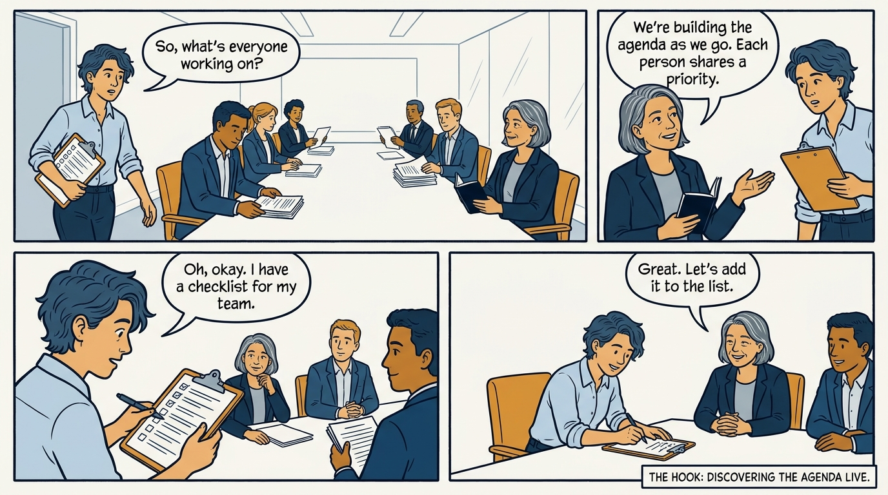
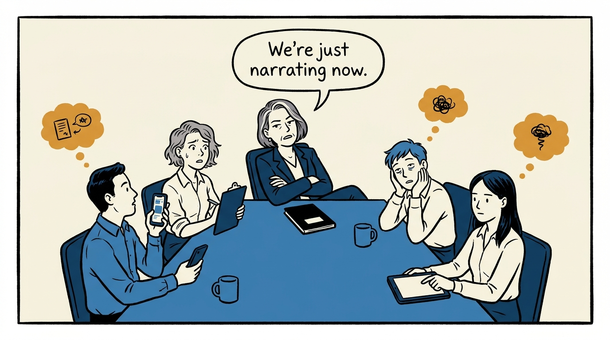
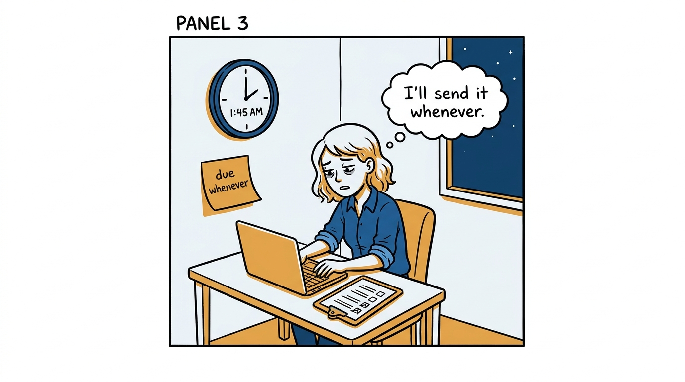
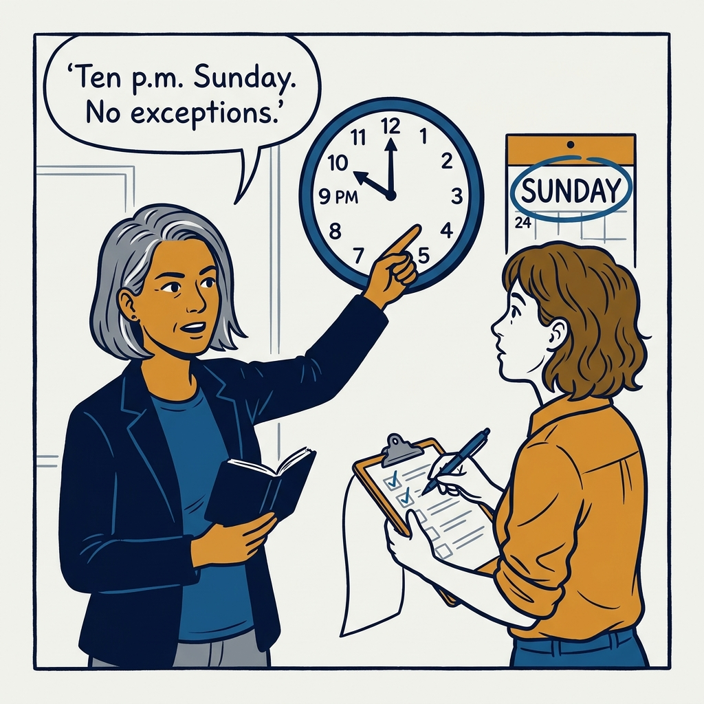
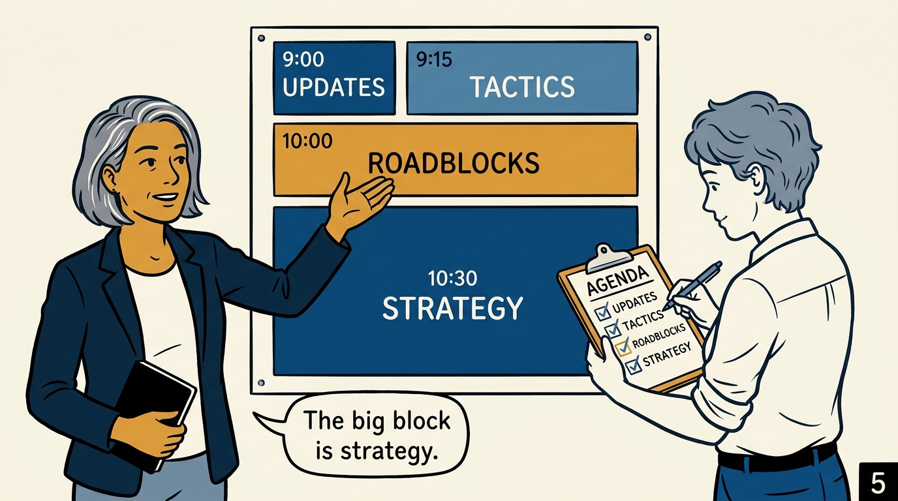
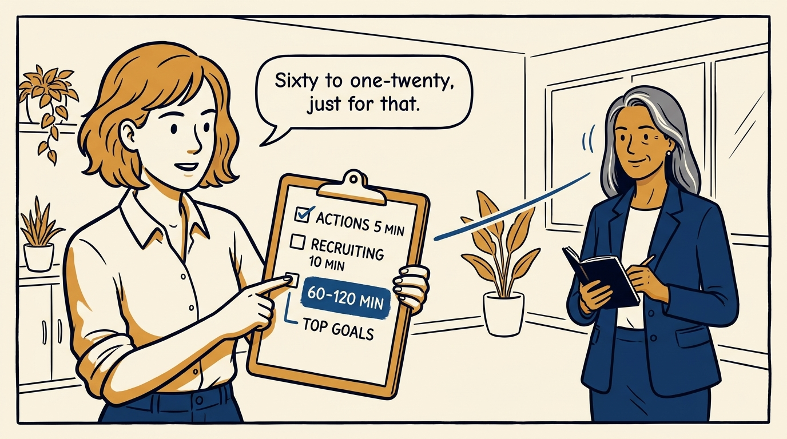
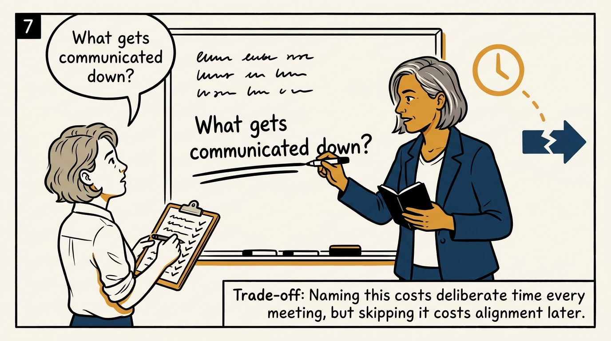
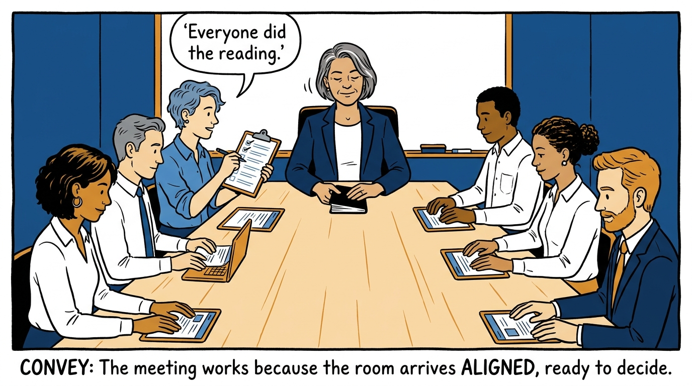

A leadership meeting runs on a written pre-read with a deadline, not on live status reporting — in eight panels.

<!-- comic-style
{
  "cast": "VERA: a calm, seasoned executive, short gray-streaked hair, dark blazer over a plain t-shirt, carries a small black notebook. NOA: an earnest first-time people manager, short wavy hair, rolled-up shirt sleeves, carries a clipboard with a long checklist.",
  "style": "Clean two-tone explainer comic, thick ink outlines, flat colors with deep blue and amber accents on a light background, generous white space, hand-lettered speech bubbles with SHORT readable text, no photorealism."
}
-->

**Panel 1:** *The hook: a meeting that discovers its own agenda live has already gone wrong.*

**Panel 2:** *The problem: without a pre-read, the meeting reverts to status theater.*

**Panel 3:** *The wrong way: a pre-read with a soft deadline is just a suggestion.*

**Panel 4:** *The principle: a hard Sunday-night deadline, not live status reporting.*

**Panel 5:** *How it runs: a timed agenda where the biggest block is reserved for strategy.*

**Panel 6:** *The mechanic: 60 to 120 minutes for top goals — the room's scarcest time, spent on purpose.*

**Panel 7:** *The cost: naming what goes down to the wider team takes time every meeting — skipping it costs more later.*

**Panel 8:** *The closer: everyone did the reading, so the room is free to decide.*
