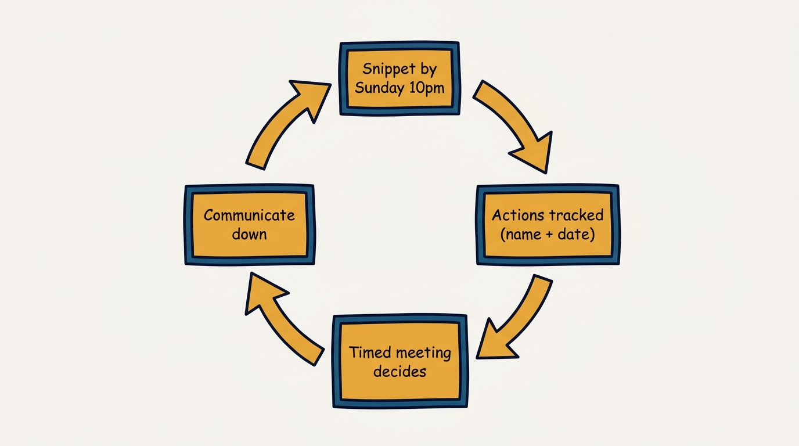
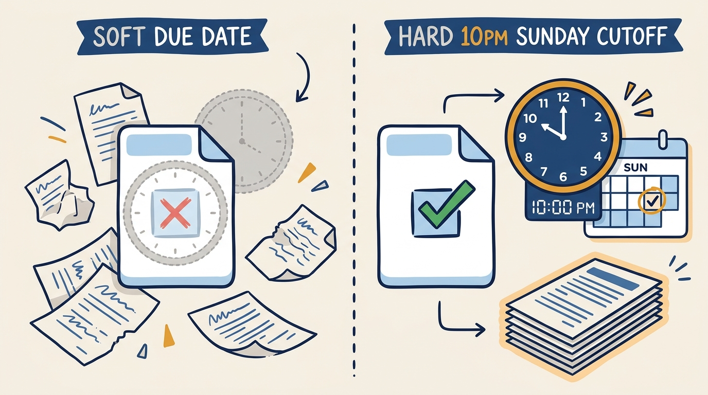
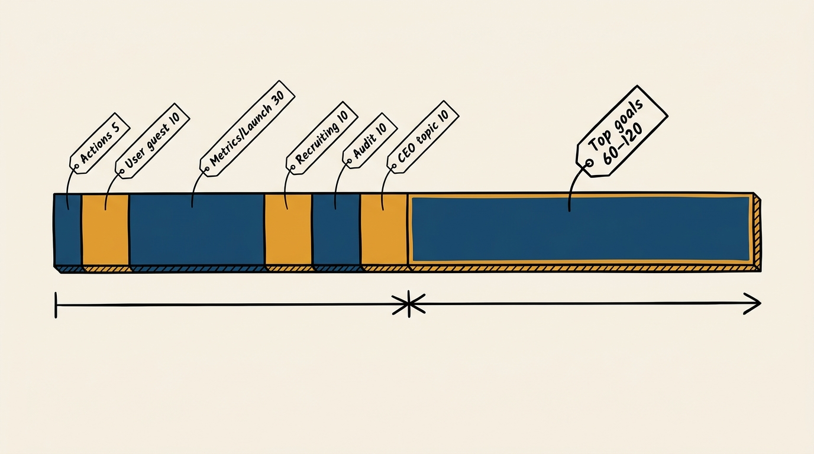

> **Status**: DRAFT
>
> **Principle**: My leadership team runs on a written pre-read — the Leadership Team Snippets and Updates — due by 10 p.m. the Sunday night before we meet, not on live status reporting. Actions carry a name and a due date and live in a tracking spreadsheet everyone can see before the meeting starts. The agenda is timed and structured so the room spends its scarce synchronous time deciding, not narrating, and every single meeting closes by explicitly deciding what gets communicated down to the wider leadership team and the company.

## Statement

My operating model for leadership team updates has five parts:

- **The pre-read has a hard deadline.** Every leadership team member updates their snippet by 10 p.m. the Sunday night before the meeting. No deadline means no pre-read, and no pre-read means the meeting reverts to live status theater.
- **Actions have a name, an action, and a due date.** Every open action is tracked in a shared spreadsheet linked from the pre-read, not scattered across memory and side channels.
- **The agenda is timed and mostly about deciding.** Actions get 5 minutes. Metrics review gets 30, alternating weekly with a launch review. Recruiting, internal audit, and a CEO topic each get their fixed slot. The single largest block — 60 to 120 minutes — goes to reviewing top goals and strategic priorities, because that is the decision this team exists to make together.
- **Four questions are asked every meeting, without exception.** QBR reflections from the past week; anything worth sharing wider or company-wide; anything anyone objects to passing down in staff meetings; and, explicitly, what decisions were made and what must be clearly communicated to the wider leadership team.
- **Every executive writes their own snippet.** Action-item updates, whereabouts, potential discussion topics and why they matter, status and learnings on major initiatives, customer meeting notes, launch and PR plans in flight, and information on top talent — written by the person who owns it, not summarized secondhand by someone else.

**Figure 1:** *The operating model is a weekly loop, not a single meeting: the pre-read and the agenda feed each other every cycle.*

## How to Read This

This journal is my people-management toolkit, and this record is grounded in the **Leadership Team Snippets and Updates** template from the companion workbooks to Claire Hughes Johnson's *Scaling People: Tactics for Management and Company Building* (Stripe Press, 2023), read through a practitioner-executive lens: a fixed pre-read document and a timed standing agenda that turn a recurring leadership meeting into a decision-making instrument rather than a status ritual. The runnable tool — the pre-read fields, the agenda timing, and the standing questions — lives in the **Checklist** tab.

## Rationale

**A deadline is what makes a pre-read real.** A pre-read without an enforced due date is a suggestion, and suggestions get skipped under pressure — which is exactly when the leadership team most needs the discipline. Setting the deadline at 10 p.m. the Sunday night before the meeting gives every member a fixed, predictable window to write, gives everyone else time to actually read before walking in, and gives the facilitator a clean cutoff to notice who did not update. The deadline is not a courtesy; it is the mechanism that converts "we should all be aligned" into "we are aligned because we all did the reading."

**Figure 2:** *A soft due date is a suggestion; a hard 10 p.m. Sunday cutoff is the mechanism that makes the pre-read real.*

**Actions need a name and a date or they evaporate.** An action item that lives only in a meeting's memory dies the moment the meeting ends. Linking the pre-read to a tracking spreadsheet, and recording every action as name, action, and due date, means nothing open is anonymous and nothing open is timeless. The 5-minute actions slot at the top of the agenda is not for re-litigating each item — it is for surfacing the ones that slipped, because the spreadsheet already told everyone what is done.

**A timed agenda is a budget, and budgets force priority.** Fixed minutes per topic — actions at 5, the user guest at 10, metrics or launch review at 30, recruiting at 10, quarterly internal audit at 10, a CEO topic at 10 — are not bureaucratic decoration. They are a forcing function: if a topic cannot be handled in its slot, it gets escalated to the largest block (60 to 120 minutes for top goals and strategic priorities) or taken offline, rather than quietly consuming everyone else's time. Alternating the metrics review with a launch review weekly keeps both current without doubling the agenda's length every week.

**Figure 3:** *The agenda is a budget: every fixed slot is small next to the one block reserved for strategic priorities.*

**The standing questions are how culture gets audited on a schedule.** Four questions recur at every single meeting regardless of what else is on the agenda: reflections from the past week's QBRs, anything worth sharing wider or company-wide, anything anyone objects to passing down in staff meetings, and — the one I weight most heavily — what decisions were made and what must be clearly communicated to the wider leadership team. That last question is not optional color; it is the moment the leadership team takes explicit ownership of what the rest of the company will hear, and when, rather than leaving downstream communication to chance or to whoever happens to mention it first.

**Snippets keep the team's peripheral vision intact.** Beyond actions and decisions, each executive's own snippet — potential discussion topics and why, status and learnings on major initiatives, customer meeting notes, launch and PR plans in flight, top-talent news, and simple whereabouts — is what keeps the team from surprising each other. A leadership team that only talks about the agenda's fixed items slowly loses track of what its own members are actually doing; the snippet is deliberately broader than the agenda so that context, not just decisions, keeps flowing.

## What This Means in Practice

| What this record says | What it does **not** say |
| --- | --- |
| The pre-read is due by 10 p.m. the Sunday before the meeting, without exception. | The deadline is a soft target that slides when someone is busy. |
| Actions are tracked as name, action, and due date in a shared spreadsheet. | Actions live in the meeting notes or in someone's head until the next meeting. |
| The agenda has fixed minutes per topic, including a large block for top goals and strategic priorities. | Every topic gets whatever time the room feels like giving it that week. |
| Every meeting explicitly decides what gets communicated down to wider leadership. | Downward communication happens informally, if and when someone remembers. |
| Each executive writes their own snippet — customer notes, initiative status, top talent. | A chief of staff or note-taker reconstructs everyone's updates after the fact. |
| Metrics review and launch review alternate weekly so both stay current. | Metrics and launch status are reviewed only when there is spare time. |

Concretely: I do not open a leadership meeting without having read every snippet first, and I do not let the meeting run past its timed agenda without naming the trade-off out loud. If the "what must we communicate down" question produces no answer some week, I treat that as a signal to ask harder, not as evidence there is nothing to say.

## Anti-Patterns

- **The pre-read as an afterthought.** Snippets written five minutes before the meeting starts, or not written at all, turn the meeting back into a status-reporting exercise the pre-read was supposed to replace.
- **Actions with no owner or no date.** An action item recorded as "we should look into this" is not an action — it is a wish that will resurface unchanged in three months.
- **An untimed agenda that always runs long on the easy topics.** Comfortable topics expand to fill available time; the strategic-priorities block gets squeezed to the last ten minutes of a two-hour meeting.
- **Silence on downward communication.** The team discusses and decides, then nobody agrees on what the rest of the organization should hear — so three different versions of the decision circulate in staff meetings by Friday.
- **Snippets ghost-written by an assistant.** A summary written by someone other than the executive loses the "why this matters" judgment only the owner can supply, and quietly removes their accountability for the update.
- **Customer issues and wins that never surface.** Without a standing customer-issues and customer-wins section, the leadership team only hears about customers when something has already gone wrong enough to escalate.

## Related Records

- [[quarterly-business-reviews]] — the QBR is the deeper business-health review; the standing question "QBR reflections from the past week" is how its output feeds directly into this weekly cadence.
- [[team-offsites]] — offsites handle the strategic work too large for a weekly slot; leadership updates handle the weekly cadence that keeps the team aligned between offsites.
- [[meetings]] — the engineering-journal record on what makes a meeting worth holding; this record is the leadership-team-specific application: a pre-read deadline plus a timed agenda that spends its time deciding.
- [[internal-communication]] — the engineering-journal record on communicating deliberately across an organization; the standing "what must be communicated down" question is this template's concrete answer for the leadership team specifically.

## Scope and Revisiting

This record is `draft`. It governs the leadership team's own recurring pre-read and meeting cadence — the deadline, the actions tracker, the timed agenda, the standing questions, and the per-executive snippet — not the broader quarterly or offsite cadences it links to. I will revise it if the team's size or structure changes the right agenda timing, if the deadline stops being honored and needs a different enforcement mechanism, or if the standing questions prove to miss something the team consistently needs to surface.

## Authoritative References

- Claire Hughes Johnson, *Scaling People: Tactics for Management and Company Building* (Stripe Press, 2023) — the companion workbooks, "Leadership Team Snippets and Updates" template (Chapter 4: Exercises and Templates).
