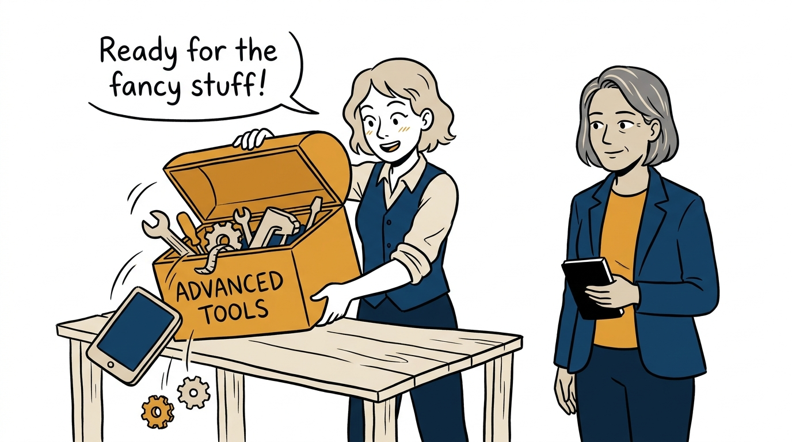
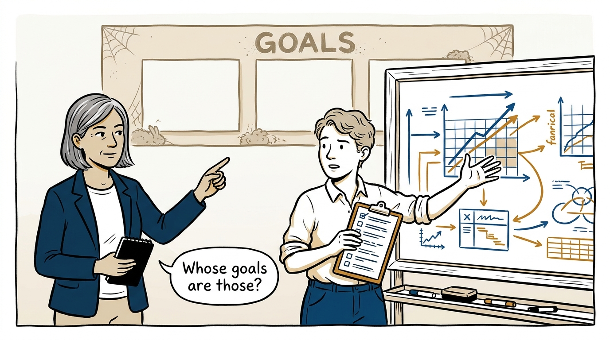
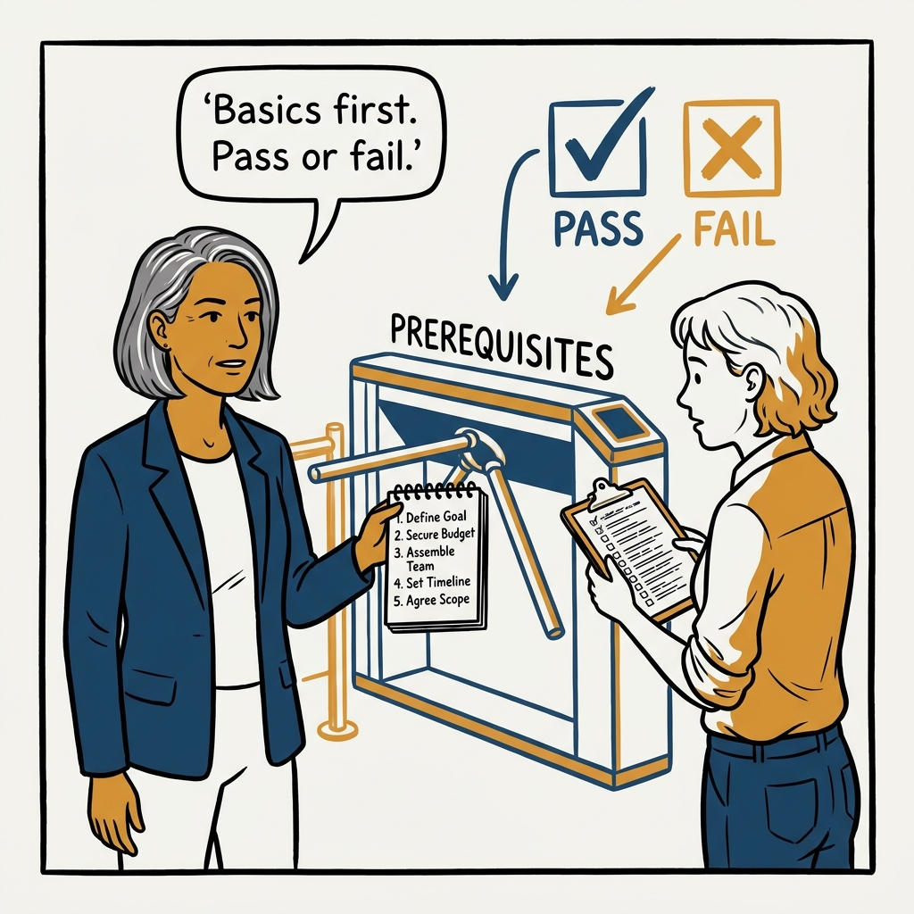
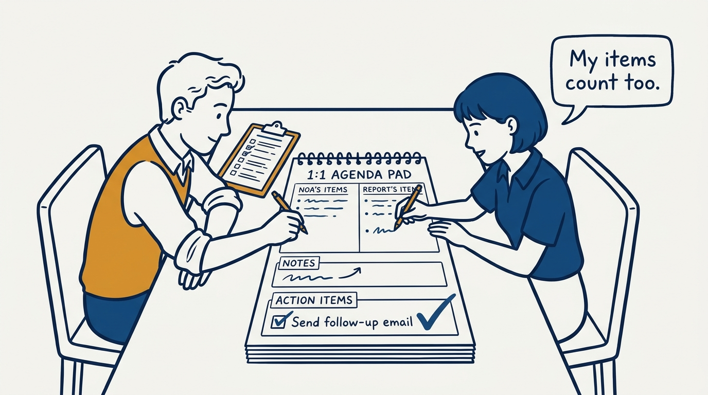
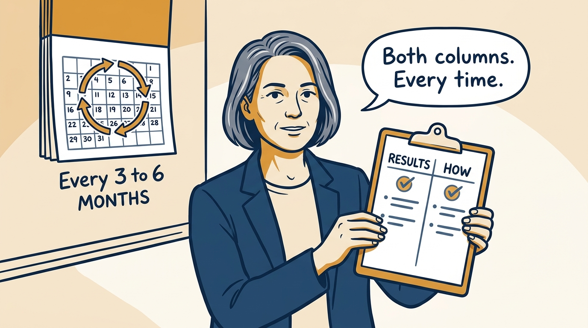
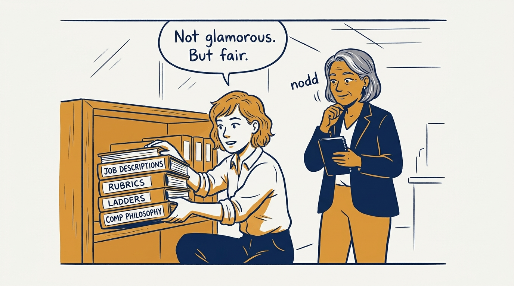
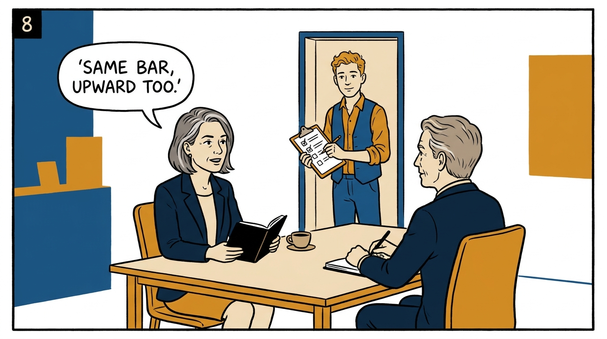

Before any advanced tool, the basics have to be in place — in eight panels.

<!-- comic-style
{
  "cast": "VERA: a calm, seasoned executive, short gray-streaked hair, dark blazer over a plain t-shirt, carries a small black notebook. NOA: an earnest first-time people manager, short wavy hair, rolled-up shirt sleeves, carries a clipboard with a long checklist.",
  "style": "Clean two-tone explainer comic, thick ink outlines, flat colors with deep blue and amber accents on a light background, generous white space, hand-lettered speech bubbles with SHORT readable text, no photorealism."
}
-->

**Panel 1:** *Every advanced tool needs somewhere solid to sit.*

**Panel 2:** *A calibration process on top of goals nobody tracks is arithmetic on fiction.*

**Panel 3:** *A 1:1 that is constantly moved tells the report exactly where they rank.*

**Panel 4:** *Not a maturity model. A pass/fail entry bar — for every manager, starting with me.*

**Panel 5:** *Agendas both sides fill, notes taken, actions agreed — the mechanics are what make it management.*

**Panel 6:** *Results without the how rewards toxic wins; how without results rewards pleasant drift.*

**Panel 7:** *Without a rubric, hiring is taste. Without a framework, pay is negotiation skill.*

**Panel 8:** *The exempt manager is the one anti-pattern with no excuse: the bar applies upward too.*
