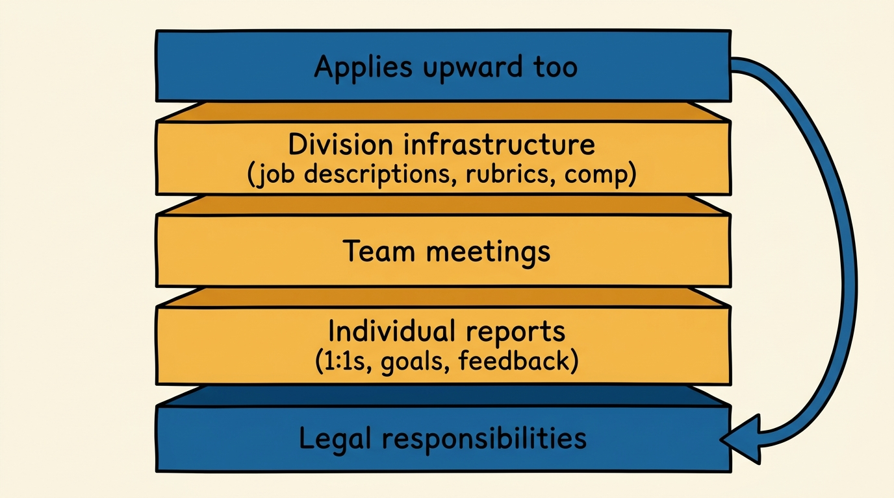
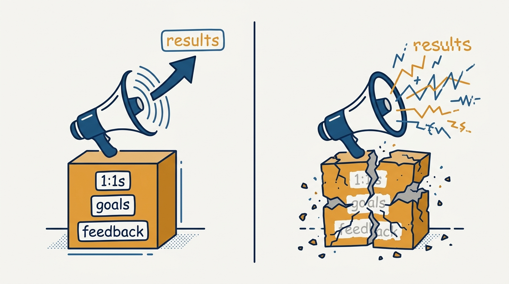
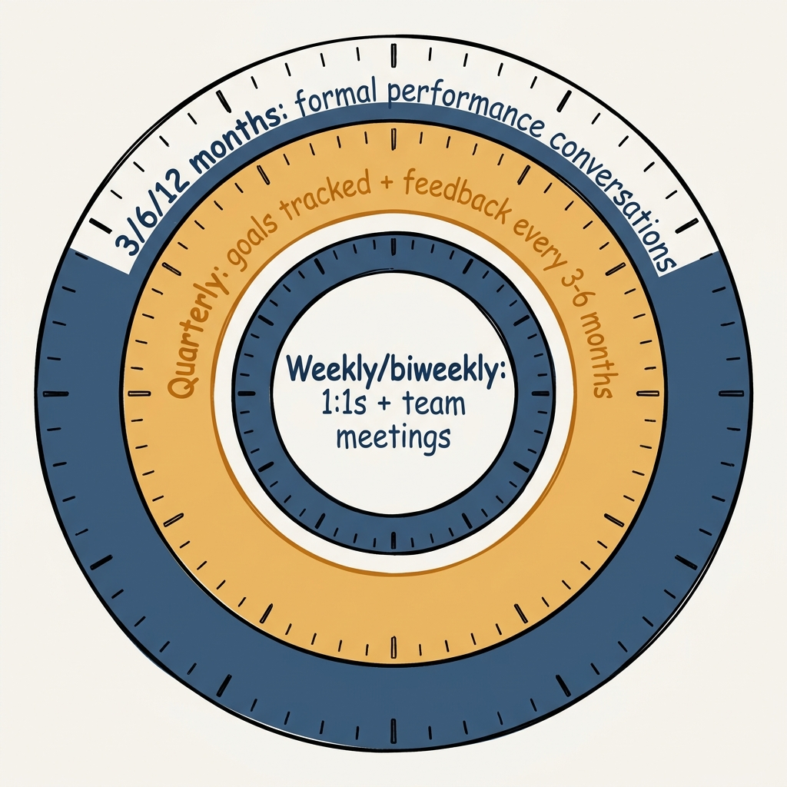

> **Status**: DRAFT
>
> **Principle**: None of the advanced tools in this journal work until the basics are in place. Before I coach, calibrate, or restructure, I verify the prerequisites: I know my legal responsibilities as a manager; my reports get regular, rarely-rescheduled 1:1s with two-sided agendas, quarterly goals we track together, and performance conversations on a fixed cadence covering both results and *how*; my team meetings earn their time; my division has job descriptions, interview rubrics, ladders, and a compensation philosophy people understand; and I hold myself to the same bar upward. This checklist is the entry ticket to managing in my organization — including for me.

## Statement

My operating model for management prerequisites has six parts:

- **Basics before tools.** No manager in my organization gets to run advanced practices — reorgs, calibration, empowerment models — while failing the baseline hygiene. The prerequisites are pass/fail, not aspirational.
- **The 1:1 is sacred infrastructure.** Every report gets a 1:1 on a weekly or biweekly cadence that is rarely rescheduled, with an agenda both sides contribute to, notes, and agreed-upon actions.
- **Goals and feedback run on a clock.** Every report has quarterly goals we track together, a bidirectional feedback session every three to six months, and a more formal performance conversation every 3, 6, or 12 months — the faster the company is changing, the more often — that covers both the results and *how* they were achieved.
- **Team meetings earn their time.** I hold weekly or biweekly team meetings, show up on time, avoid rescheduling them, and make sure the time together produces something — aligned plans, decisions made, or challenges workshopped.
- **The division runs on documents, not vibes.** Every role we hire for has a job description and an interview rubric; ladders and levels are clearly communicated; a compensation philosophy and framework exist and employees understand them.
- **The bar applies upward.** I understand my own job description and my team's function, I have quarterly goals agreed with my own manager, I have 1:1s with them on a regular cadence, and I can access regular context on overall company priorities and goals. I am aware of my legal responsibilities as a manager in every jurisdiction I operate in.

**Figure 1:** *Five layers, one bar — and the top layer loops back to the manager's own manager.*

## How to Read This

This journal is my people-management toolkit — first-person operating records built on the companion workbooks to Claire Hughes Johnson's *Scaling People: Tactics for Management and Company Building*. This record is grounded in the workbooks' opening tool, the Management Prerequisites Checklist, read through a practitioner-executive lens: the workbook offers it as a self-check; I read it as the entry bar I hold every manager in my organization to, starting with myself. It opens this journal because the workbook opens with it — every other tool here assumes it. The runnable tool lives in the **Checklist** tab of this post.

## Rationale

**Advanced tools amplify whatever they sit on — including nothing.** A career framework on top of skipped 1:1s is theater. A calibration process on top of goals nobody tracks is arithmetic on fiction. Every sophisticated practice in this journal assumes a manager who already talks to their people regularly, writes goals down, and gives feedback before the annual review forces it. That is why this checklist comes first and why it is pass/fail: a manager who fails it does not need better tools, they need to do the job.

**Figure 2:** *Advanced tools amplify whatever they sit on — including nothing.*

**The 1:1 mechanics matter more than the 1:1 slot.** The workbook is specific, and I keep its specifics: weekly or biweekly, *rarely rescheduled*, with agendas that include contributions from both sides, notes, and agreed-upon actions. Each clause earns its place. A 1:1 that is constantly moved tells the report exactly where they rank. An agenda only the manager fills is a status download, not a conversation. No notes and no actions means the same topics resurface forever. The cadence is the cheap part — the mechanics are what make it management.

**Feedback on a clock beats feedback on courage.** Left to nerve and mood, feedback arrives late and lands badly. So the prerequisites put it on a schedule: bidirectional feedback every three to six months, and a more formal performance conversation every 3, 6, or 12 months — with the workbook's sharp qualifier that the faster the company is changing, the more often these should happen. And the conversation covers two things, not one: the results the person achieved (or didn't), and *how* they did or did not achieve them. Results without the *how* rewards toxic wins; *how* without results rewards pleasant drift.

**A meeting that doesn't earn its time is a tax on everyone in it.** Team meetings are in the prerequisites for the same reason 1:1s are — they are where alignment actually happens — but the bar is not merely holding them. I show up on time, I do not casually reschedule, and the test is whether the group *benefits from the time together*: aligning on plans, making decisions, or workshopping challenges so people can help each other get the work done. A standing meeting that fails that test is not a prerequisite met; it is a prerequisite faked.

**Division-level infrastructure is what makes individual management fair.** Job descriptions and interview rubrics for open roles, ladders and levels people have actually been told about, a compensation philosophy employees understand — none of this is bureaucracy. It is the difference between decisions and favors. Without a rubric, hiring is taste. Without communicated levels, promotion is politics. Without a compensation framework, pay is negotiation skill. And underneath all of it sits the least glamorous line on the checklist: knowing my legal responsibilities as a manager in the jurisdiction I operate in — because the floor under everything else is the law, not my goodwill.

## What This Means in Practice

| What this record says | What it does **not** say |
| --- | --- |
| Every report gets a weekly or biweekly 1:1 that is rarely rescheduled. | Never rescheduled — life happens; a pattern of rescheduling is the failure, not one exception. |
| Agendas are two-sided, with notes and agreed actions. | The manager owns the agenda — the report's items carry equal weight. |
| Quarterly goals exist and are tracked together. | Goals are set once and filed — tracking together is the requirement, not the paperwork. |
| Formal performance conversations happen every 3, 6, or 12 months and cover results **and** how. | The annual review is enough everywhere — the faster the company changes, the shorter the cycle. |
| Job descriptions, rubrics, ladders, and a compensation philosophy exist and are understood. | Every manager writes these alone — they are division-level infrastructure; my job is to ensure they exist and my people know them. |
| I hold myself to the same bar with my own manager. | The prerequisites are for my reports only — a manager without goals, 1:1s, and company context cannot pass context down. |

**Figure 3:** *Every prerequisite runs on its own clock — and none of them wait for the annual review.*

Concretely: I can name, for each of my reports, the date of our last 1:1, their current quarterly goals, and when our last feedback exchange and last formal performance conversation happened. Any manager in my organization should be able to do the same on the spot — that is the audit, and it takes five minutes.

## Anti-Patterns

- **The perpetually rescheduled 1:1.** The slot exists; the meeting rarely happens. The report reads the priority signal correctly, and trust erodes on schedule.
- **The one-sided agenda.** The manager arrives with a list, the report arrives to listen. Without both sides contributing — and without notes and actions — it is a broadcast, not a 1:1.
- **Goals set in January, remembered in December.** Quarterly goals that are written but never tracked together turn the performance conversation into an ambush.
- **Feedback saved for the formal review.** Six months of accumulated observations delivered in one sitting is not feedback; it is a verdict the person never got to appeal.
- **Results-only performance conversations.** Celebrating the numbers while ignoring *how* they were achieved teaches the organization that behavior is free.
- **Vibes-based hiring and pay.** No job description, no rubric, no communicated levels, no compensation philosophy — every people decision becomes an argument from authority, and the manager cannot explain any of them.
- **The exempt manager.** Holding reports to a hygiene bar while having no goals, no 1:1s, and no company context of my own — prerequisites enforced downward and waived upward.

## Related Records

- [[writing-okrs]] — how the quarterly goals this record requires actually get written.
- [[performance-reviews]] — the formal performance conversation, run properly, once this record has established its cadence.
- [[compensation-conversations]] — the conversation that the division-level compensation philosophy makes honest.
- [[interview-loop]] — the hiring machinery that the required job descriptions and rubrics feed.
- [[working-with-me]] — the user-guide document that makes my side of the 1:1 agenda legible.
- [[meetings]] — the engineering-executive record on making synchronous time earn its cost; the team-meeting prerequisite in miniature.

## Scope and Revisiting

This record is `draft`. It governs the baseline I verify before applying any other tool in this journal — for my own reports, for every manager in my organization, and for myself upward. I will revise it if my organization's operating cadence changes enough to shift the conversation frequencies (the workbook's own rule: faster change, shorter cycles), if a jurisdiction we operate in adds manager obligations that belong on the list, or if auditing managers against it reveals a recurring failure the checklist does not catch.

## Authoritative References

- Claire Hughes Johnson, *Scaling People: Tactics for Management and Company Building* (Stripe Press, 2023) — the companion workbooks' Management Prerequisites Checklist (Chapter 1), which this record distills.
