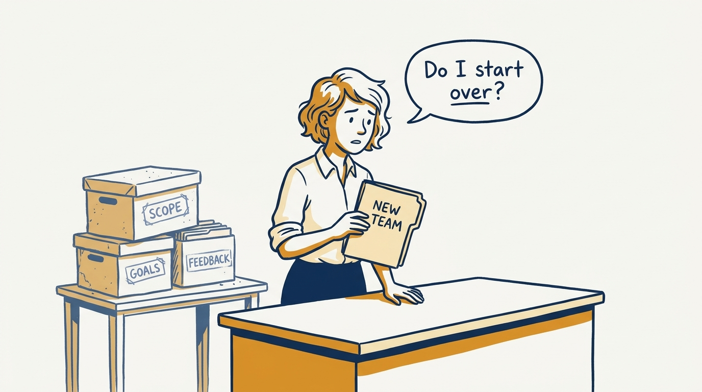
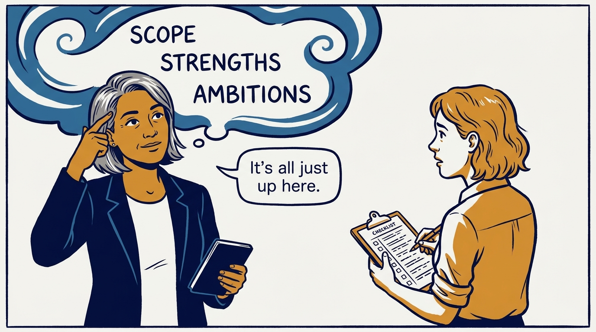
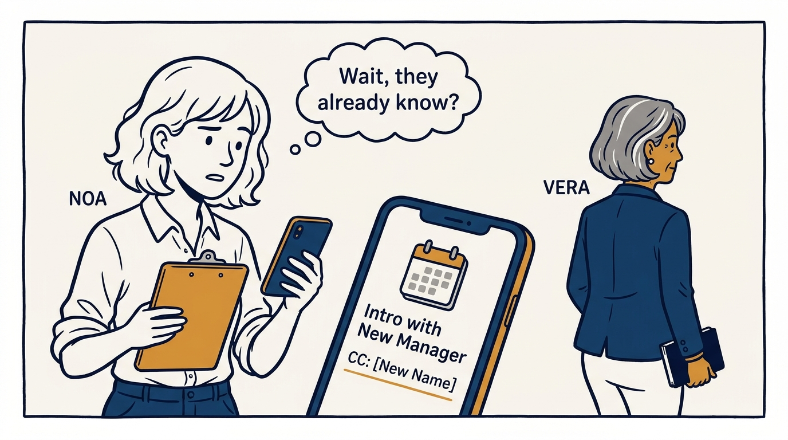
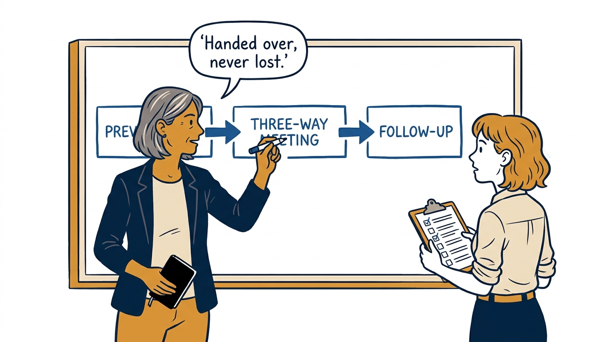
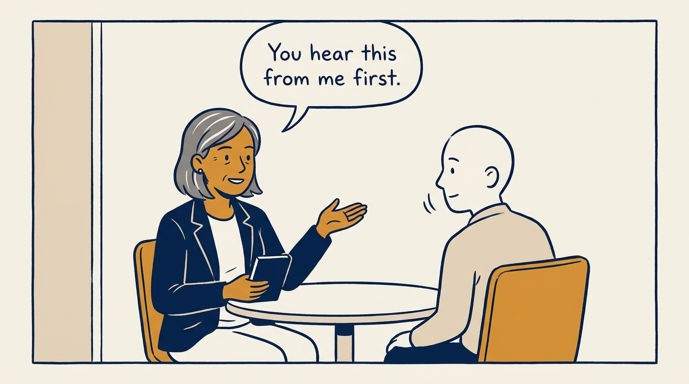
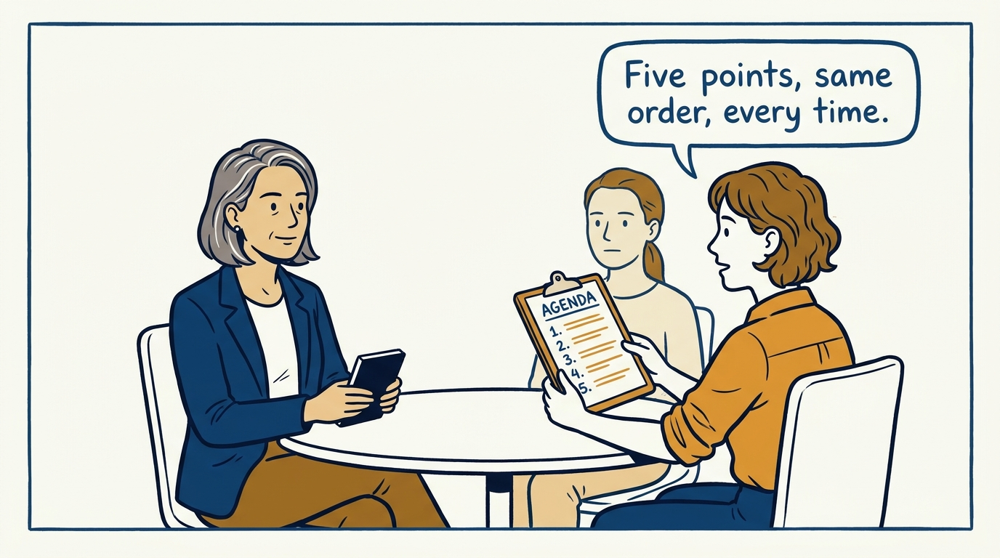
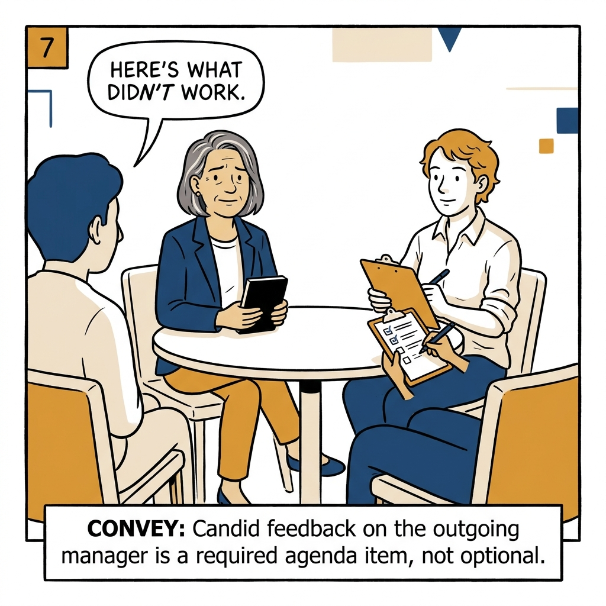
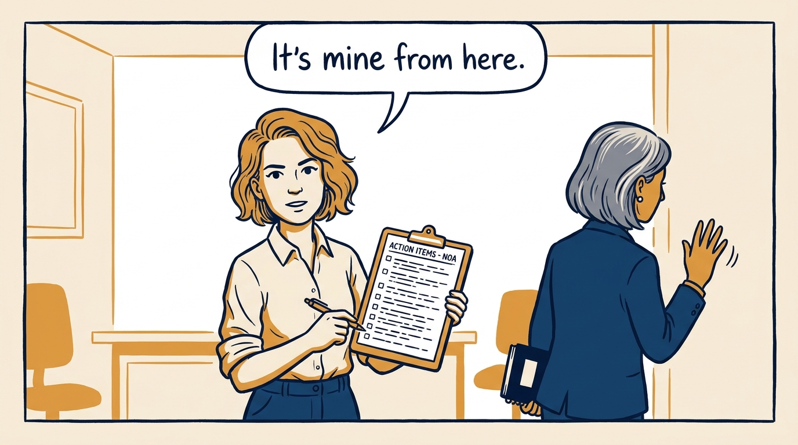

A manager change should be a deliberate handoff, not a reset button — in eight panels.

<!-- comic-style
{
  "cast": "VERA: a calm, seasoned executive, short gray-streaked hair, dark blazer over a plain t-shirt, carries a small black notebook. NOA: an earnest first-time people manager, short wavy hair, rolled-up shirt sleeves, carries a clipboard with a long checklist.",
  "style": "Clean two-tone explainer comic, thick ink outlines, flat colors with deep blue and amber accents on a light background, generous white space, hand-lettered speech bubbles with SHORT readable text, no photorealism."
}
-->

**Panel 1:** *The hook: a manager change can quietly erase months of context.*

**Panel 2:** *The problem: context lives in one manager's head, and heads don't hand themselves over.*

**Panel 3:** *The wrong way: a silent handoff, where the person is the last to know.*

**Panel 4:** *The principle: a deliberate three-step handoff, not a passive introduction.*

**Panel 5:** *How it runs: the current manager previews the move, one-on-one, first.*

**Panel 6:** *The mechanic: one meeting, three people, five agenda points, always the same order.*

**Panel 7:** *The cost: honest feedback on the old manager is required, not optional.*

**Panel 8:** *The closer: ownership transfers completely — no shadow manager, no restart from zero.*
