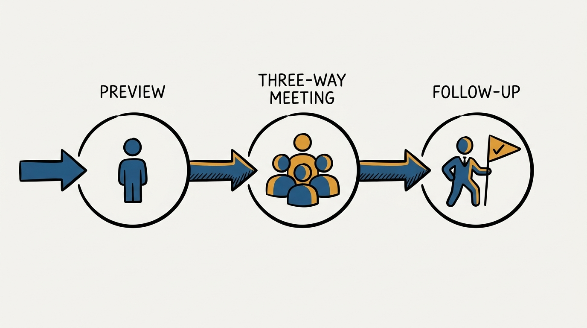
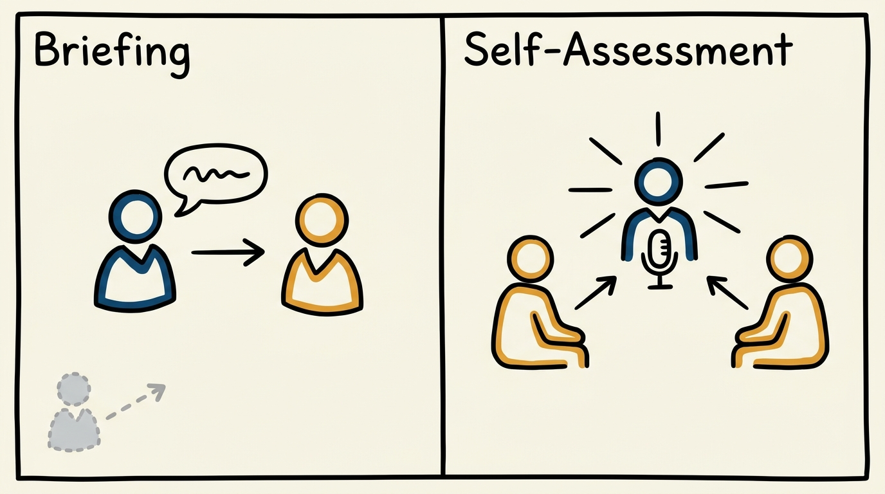
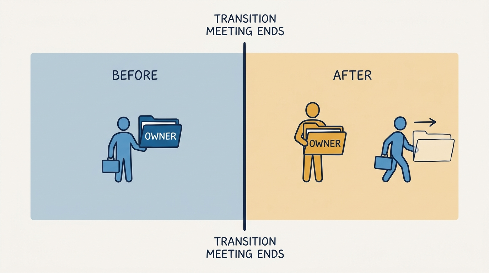

> **Status**: DRAFT
>
> **Principle**: I treat a manager change as a moment where a report's development context is either handed over deliberately or lost — and I don't let reports restart from zero. Every internal transfer runs a fixed three-step sequence: the current manager previews the move with the person directly, the current manager convenes a three-way transition meeting against a written agenda that surfaces scope, strengths, ambitions, and candid feedback, and the new manager owns follow-up on whatever comes out of it, because they own the relationship going forward.

## Statement

My operating model for manager transitions has four parts:

- **The context is an asset, and assets get handed over.** Scope, projects, goals, strengths, development areas, ambitions, and preferred ways of working do not live in a system of record — they live in the outgoing manager's head. A transition without a deliberate handoff throws that asset away.
- **The current manager previews before anyone else is looped in.** The person hears about their own transition from their own manager, first, in a direct conversation — not via a calendar invite with a new manager already cc'd.
- **The three-way meeting has a fixed agenda, not a vibe.** One meeting, three people, five discussion points, always in the same order: current scope, strengths and development areas, ambitions, ways of working plus feedback on me, and a recap of next steps.
- **Ownership of follow-up transfers completely, on schedule.** The moment the transition meeting ends, the new manager owns the relationship and whatever action items came out of it. I do not stay the shadow manager.

**Figure 1:** *One fixed sequence, three distinct owners: preview, three-way meeting, follow-up.*

## How to Read This

This journal is my people-management toolkit, grounded in the companion workbooks to Claire Hughes Johnson's *Scaling People: Tactics for Management and Company Building* (Stripe Press, 2023), read through a practitioner-executive lens. This record is grounded in the workbook's Manager Transitions Guide (Chapter 3): a three-step process for when a report moves to another team internally. The runnable tool — the preview checklist and the email agenda template — lives in the **Checklist** tab of this post.

## Rationale

**Internal moves are where context quietly evaporates.** An external hire gets an onboarding plan by default; an internal transfer often gets nothing more than an updated line in the org chart. That asymmetry is backwards — the internal mover has months or years of performance history, working style, and half-finished development plans that a new manager has no way to reconstruct on their own. Without a structured handoff, the new manager starts blind and the person effectively restarts their development from zero, regardless of how much progress they had already made.

**The preview conversation is about dignity, not process.** Before any meeting gets scheduled, the current manager tells the person directly: confirm the formal move date in the HR system, say when the new manager gains access to their information and performance reviews, give a heads-up that a transition meeting is coming, and take their questions. Skipping this step and going straight to a three-way invite treats the person as a line item being reassigned rather than someone owed a direct conversation about their own career.

**A written agenda turns a fuzzy handoff into a repeatable one.** Left unstructured, transition meetings drift into small talk or a one-sided data dump from the outgoing manager. The workbook's email template fixes the order: the employee shares their current scope, projects, and goals; the employee shares their own view of strengths and development areas, with the outgoing manager adding what the two of them have already worked on together; the three of them discuss, together, how the new manager can support the person's ambitions; the employee shares preferred ways of working, plus whatever feedback about the outgoing manager would be useful for the new one to hear; and the group recaps concrete next steps before closing. The order matters — the employee speaks first on scope and on their own strengths, so the meeting starts from their self-assessment rather than a handoff briefing about them.

**Figure 2:** *The order matters: the employee speaks first on their own scope and strengths, not last.*

**Feedback on the old manager is the hardest line and the most valuable one.** Asking a person to offer, in front of both managers, feedback on how the outgoing manager worked with them is uncomfortable by design — and it is exactly the information a new manager cannot get any other way. Cutting this item to keep the meeting comfortable throws away the most useful signal in the whole agenda.

**Clean ownership handoff prevents the worst failure mode: two managers, no manager.** Once the transition meeting closes, the new manager owns every action item and owns the relationship going forward. I do not let the old manager stay involved as an informal backchannel — that produces exactly the confusion a transition is supposed to prevent, where the person is unsure who actually has authority over their next review, their next raise, or their next hard conversation.

## What This Means in Practice

| What this record says | What it does **not** say |
| --- | --- |
| Every internal move gets a preview conversation, a three-way meeting, and a named follow-up owner. | A transition is a Slack message and an updated reporting line. |
| The current manager convenes and runs the transition meeting. | The new manager is left to introduce themselves cold and reconstruct history on their own. |
| The employee speaks first on their own scope and strengths. | The meeting opens with the outgoing manager briefing the new one about the person as if they weren't in the room. |
| Feedback on the outgoing manager is an explicit agenda item. | Feedback on the outgoing manager is optional, or saved for an exit interview format. |
| The new manager owns follow-up from the moment the meeting ends. | The outgoing manager stays the de facto manager for a transition period. |
| The formal HR-system date and new-manager access are confirmed before the meeting. | The paperwork catches up whenever it catches up, independent of the conversation. |

Concretely: I expect every internal transfer in my organization to produce, before the person's official start date on the new team, a preview conversation that already happened, a scheduled three-way meeting using the fixed agenda, and a visible list of next steps that the new manager has already claimed.

**Figure 3:** *Ownership moves at one clean line — no overlapping shadow-manager period.*

## Anti-Patterns

- **The silent handoff.** The person learns about their own transition secondhand, or in a group message that also includes the new manager.
- **The one-way briefing.** The outgoing manager tells the new manager everything about the person, in a side conversation the person is never part of. Context transfers; consent and voice do not.
- **The agenda-free meeting.** A well-intentioned coffee chat that never gets to ambitions, ways of working, or feedback, because nobody wrote down what the meeting was actually for.
- **The sanitized handoff.** Strengths get mentioned; development areas and honest feedback on the old manager get quietly dropped to keep the mood pleasant.
- **The lingering shadow manager.** The outgoing manager keeps fielding questions and approving requests weeks after the transition meeting, because ownership was never cleanly stated.
- **The dropped action item.** Next steps get recapped in the meeting and then nobody follows up, because no single owner was named before everyone left the room.

## Related Records

- [[career-conversations]] — the recurring development dialogue this transition must reconnect to; the new manager inherits the thread, not a blank page.
- [[working-with-me]] — how I operate with a direct report day to day; preferred ways of working is exactly the item the transition meeting is meant to carry forward.
- [[new-leader-onboarding]] — the parallel record for when a *leader* arrives into new scope; this one is the mirror case of an individual report moving between existing teams.
- [[management-prerequisites]] — the baseline expectations every manager owes their reports; a transition is a stress test of whether those baselines actually travel with the person.

## Scope and Revisiting

This record is `draft`. It governs how I run internal manager transitions in my organization: the preview conversation, the three-way meeting and its agenda, and the follow-up ownership handoff. I revisit it if transitions in practice regularly surface a sixth discussion point the agenda is missing, if the preview-conversation step keeps getting skipped despite being named here, or if reorganizations at scale (many people moving at once) show the one-at-a-time meeting format does not hold up.

## Authoritative References

- Claire Hughes Johnson, *Scaling People: Tactics for Management and Company Building* (Stripe Press, 2023) — the companion workbooks, Chapter 3, "Manager Transitions Guide" (pp. 78–79), the tool this record distills.
