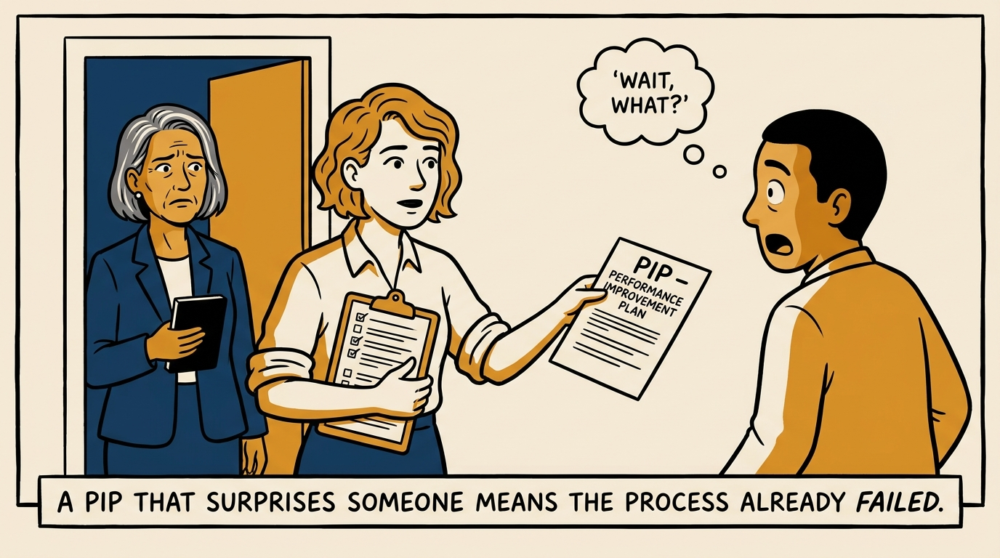
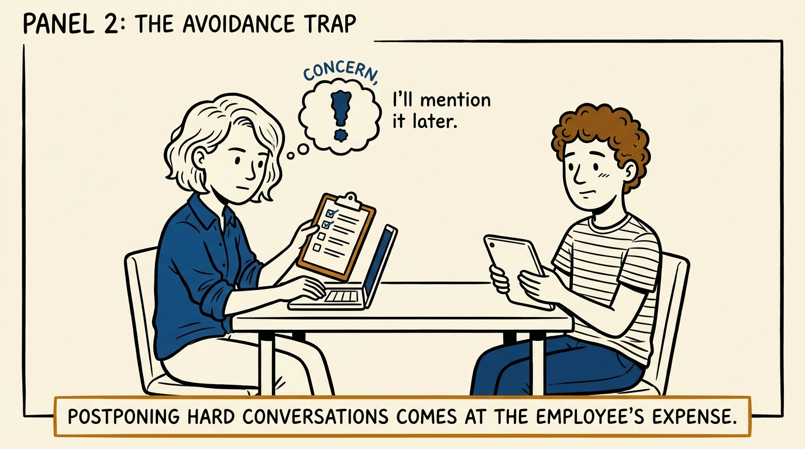
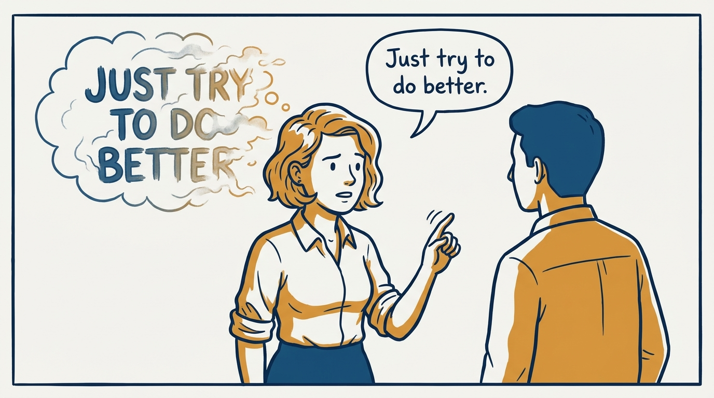
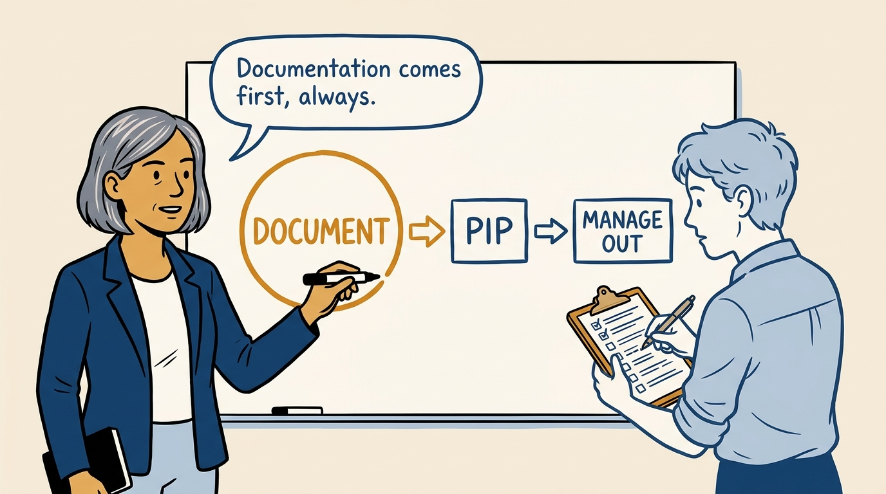
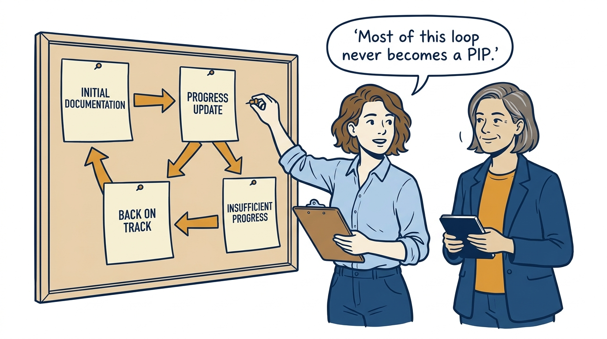
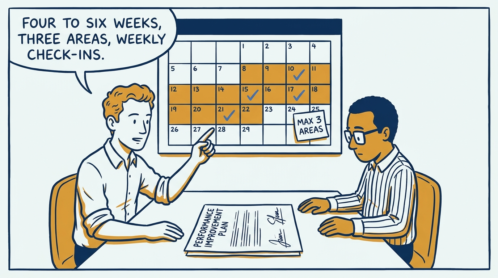
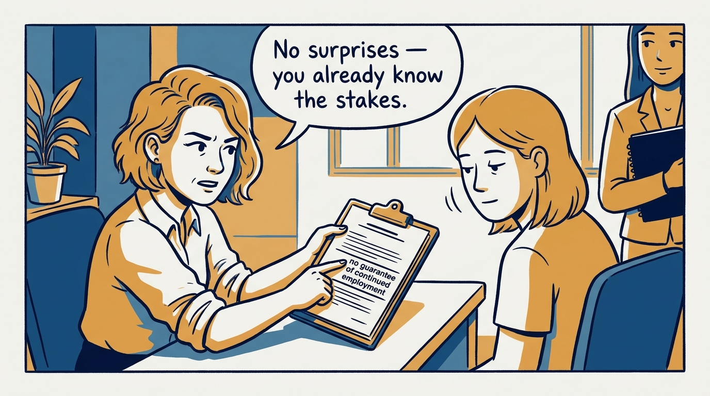
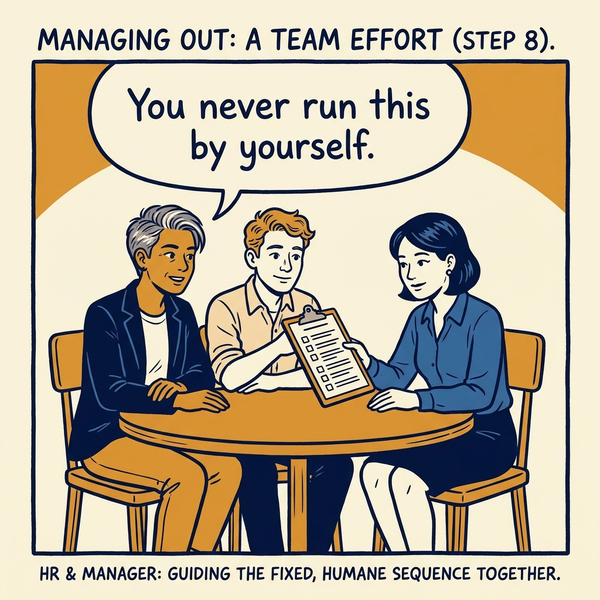

How I handle underperformance as one arc — documented feedback first, a PIP only if it persists, and a humane exit only if it still does not resolve — in eight panels.

<!-- comic-style
{
  "cast": "VERA: a calm, seasoned executive, short gray-streaked hair, dark blazer over a plain t-shirt, carries a small black notebook. NOA: an earnest first-time people manager, short wavy hair, rolled-up shirt sleeves, carries a clipboard with a long checklist.",
  "style": "Clean two-tone explainer comic, thick ink outlines, flat colors with deep blue and amber accents on a light background, generous white space, hand-lettered speech bubbles with SHORT readable text, no photorealism."
}
-->

**Panel 1:** *The hook: if a PIP surprises anyone, the manager already failed.*

**Panel 2:** *The problem: silence about a gap is not mercy, it is a debt that grows.*

**Panel 3:** *The wrong way: feedback with no date, no example, and no paper trail helps no one.*

**Panel 4:** *The principle: document early and in writing; a PIP is an escalation, never an opener.*

**Panel 5:** *How it runs: initial documentation, a progress update, then back on track or insufficient progress.*

**Panel 6:** *The mechanic: four to six weeks, up to three improvement areas, weekly progress checks.*

**Panel 7:** *The cost: naming the stakes plainly is harder than softening them, but softening them is what blindsides people later.*

**Panel 8:** *The closer: managing out is a sequence you run with others, not a failure you carry alone.*
