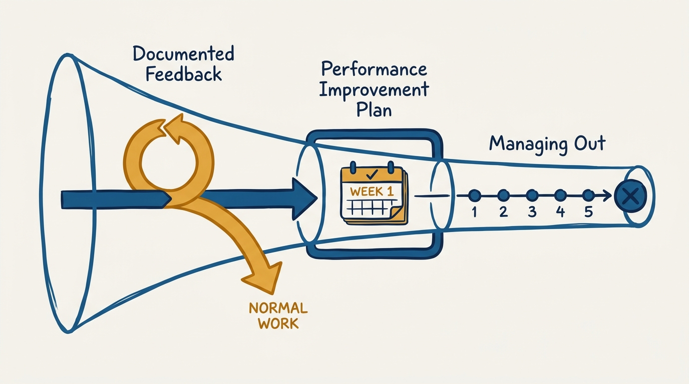
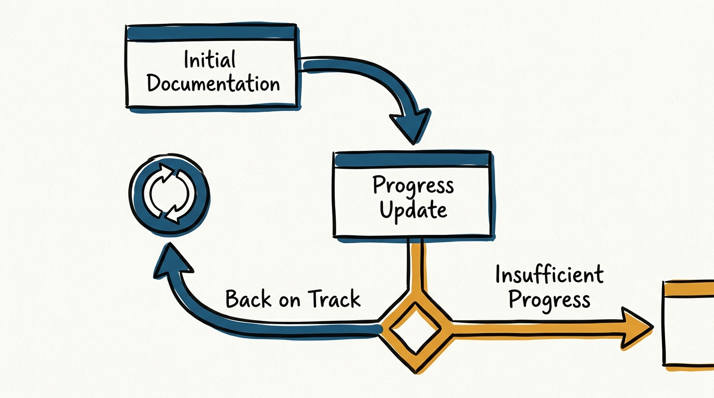
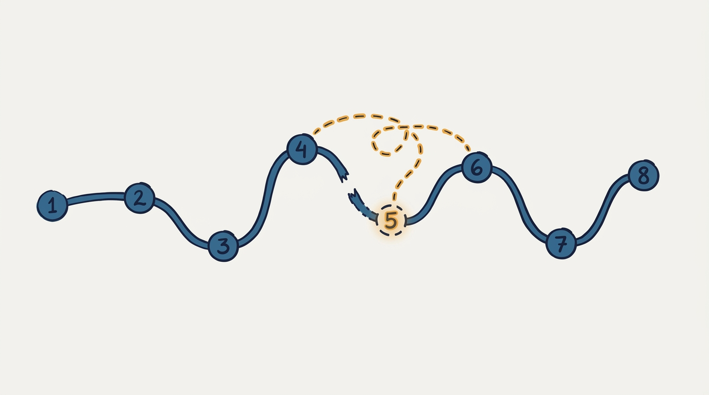

> **Status**: DRAFT
>
> **Principle**: I handle underperformance early, in writing, and humanely: the moment a 1:1 or review surfaces a gap, I document it — expectation, dated examples, and a concrete next step — long before any formal process starts. A Performance Improvement Plan is never the first time someone hears they are falling short; it is the escalation I reach for only when documented, supported feedback has not closed the gap. And if the arc still does not resolve, I manage the person out on a bounded timeline, in person, with HR alongside me. A PIP that surprises anyone is a failure of my management, not of the employee's performance.

## Statement

My operating model for managing underperformance has five parts:

- **Documentation starts at the first sign, not at the end.** The moment a 1:1 or a "partially meets expectations" review surfaces a gap, I write it down and send it: the expectation, the gap, dated situation/behavior/impact examples, and actionable next steps — with weekly check-ins for a stated number of weeks.
- **The letters form a loop, not a ladder to termination.** Initial documentation leads to a progress update, and a progress update leads one of two ways: back on track (confirmed, sustained, congratulated) or insufficient progress (recapped, and followed by a realistic conversation about whether the role is still a fit).
- **A PIP is an escalation, never an opener.** I only start a formal Performance Improvement Plan after several documented conversations have already named the gap, offered examples, and offered support. If I am reaching for a PIP template as the first written feedback, I have already failed at the job.
- **The PIP is short, specific, and honest about the stakes.** Four to six weeks, up to three improvement areas each with a standard, a gap, and dated examples, goals and milestones with real deadlines, a named HR partner, weekly check-ins, and explicit language that passing does not lower the bar afterward and that employment stays at-will throughout.
- **Managing out follows a fixed sequence, adapted to law and place.** Feedback, then documentation, then a formal process if warranted, then a check against local employment regulations, then informing my manager and HR, then the coaching-out conversation, then an agreed timeline and communication plan, then the announcement — in that order, every time, adapted to the jurisdiction I am operating in.

**Figure 1:** *The arc is one escalating sequence, not three separate tools — most cases resolve before a PIP is ever needed.*

## How to Read This

This journal is my people-management toolkit — first-person operating records built on the companion workbooks to Claire Hughes Johnson's *Scaling People: Tactics for Management and Company Building*. This record is grounded in three of the workbooks' tools, read as one continuous arc rather than three separate documents: the Performance Improvement Documentation Templates, the Performance Improvement Plan Template, and the Managing Out Checklist. The workbook offers them as templates to fill in; I read them as the sequence I owe every underperforming report before anything becomes irreversible. The runnable tool — all four letters, the full PIP structure, and the eight-step checklist — lives in the **Checklist** tab of this post.

## Rationale

**Documentation is protection for the person, not a paper trail against them.** The instinct is to treat a documented performance conversation as evidence-gathering for an eventual exit. I read it the other way: writing down the expectation, the gap, and dated examples the same week they happen is what gives the person a real chance to close the gap, because vague feedback cannot be acted on. An "initial documentation" letter that names the situation, the observable behavior, and the impact — followed by next steps stated as actions, not verdicts — is the clearest, kindest thing I can hand someone who is struggling. Silence is not mercy; it is a manager postponing a hard conversation at the employee's expense.

**The letters do the work an opener PIP never could: they make the gap undeniable and the support real, in writing, before anything formal starts.** The workbook's four templates form a deliberate arc: initial documentation states the gap and starts a weekly check-in cadence; a progress update restates the expectation, cites new examples, and is explicit about what still needs to change and why it sits inside the core of the role; back on track confirms the expectations are now met, states that I expect the performance to be sustained, and closes with a genuine congratulation; insufficient progress recaps what has already been raised and moves to a realistic, honest conversation about whether the person can meet expectations at all. Three of those four outcomes never touch a formal process — which is the point. Most underperformance resolves in this loop when it is caught and documented early.

**Figure 2:** *The letters form a loop, not a ladder — most paths through it end back at normal work, not at a PIP.*

**A PIP is a signed contract with real deadlines, not a soft warning with paperwork.** When the loop above does not close the gap, the workbook's Performance Improvement Plan Template is explicit that it is "a signed, standalone document" running "typically four to six weeks" — long enough to fairly assess performance against set goals, short enough that it does not drift into indefinite probation. It states role expectations as three to five points pulled from the job description, level, and ladder; up to three improvement areas, each with the expected standard, the gap and its impact, and dated examples; goals and deliverables with real timeframes and definitions of what success looks like; milestones with deadlines; the resources available, including a named HR partner; and a weekly cadence of progress checks. None of that is bureaucratic decoration — each element is what makes the plan fair rather than arbitrary.

**A PIP protects everyone precisely because it is honest about the stakes.** The template does not soften what a PIP is: it says plainly that the PIP may be ended early, that entering one "in no way guarantees employment," that the at-will nature of employment is unchanged throughout, and that even successfully completing a PIP requires *sustained* performance afterward — further underperformance can end employment without a second PIP. I keep every one of those caveats in the document I sign with someone, because ambiguity there is what turns a PIP into a false hope or a legal landmine. The workbook is also explicit that the template "may need to be adapted for different geographical jurisdictions" — I treat that as a standing instruction, not a footnote, and check local employment law before I use any of this language as written.

**Managing out is a sequence, and skipping steps is where humane process breaks down.** The Managing Out Checklist orders eight steps: give feedback, document the feedback, run a formal process if relevant, check local employment regulations, inform my manager and HR partner, hold the coaching-out conversation, agree on the timeline and communication plan, and announce the departure with transition details if the role needs immediate coverage. Every step in that order exists because I have seen what happens when one is skipped: managers who inform HR before their own manager, who announce before the person has heard it directly from them, or who skip the local-law check because "we've always done it this way" elsewhere. The sequence is not ceremony — it is what keeps the exit from becoming a second injury on top of the first.

**Figure 3:** *The Managing Out Checklist is a fixed route, not a menu — skipping a waypoint is where the exit turns into a second injury.*

## What This Means in Practice

| What this record says | What it does **not** say |
| --- | --- |
| Documentation starts at the first "partially meets expectations" signal. | Documentation is punitive — it is the same act of care as any other specific, timely feedback. |
| Weekly check-ins follow initial documentation, for a stated number of weeks. | The check-in cadence is optional or informal — it is named explicitly in the letter and kept. |
| A PIP follows several already-documented conversations. | A PIP can substitute for earlier feedback — if it is the first document, I have already failed. |
| The PIP names up to three improvement areas with a standard, a gap, and dated examples. | The PIP lists every shortcoming — up to three keeps it actionable rather than overwhelming. |
| The PIP states plainly that it may end early and guarantees nothing. | The PIP is a formality that always runs its full course — it can and does end sooner, either way. |
| The Managing Out Checklist runs in a fixed order, adapted to local law. | The templates are used verbatim everywhere — the workbook itself says they need legal adaptation per jurisdiction. |

Concretely: before I ever open the PIP template for someone, I can point to at least one dated documentation letter that already named the gap and the examples. Before I announce any departure, I can confirm feedback, documentation, my manager, HR, the coaching-out conversation, and the timeline all happened, in that order — the checklist is the audit, and I run it on myself.

## Anti-Patterns

- **The surprise PIP.** A performance improvement plan lands with no history of documented conversations behind it. If the person is shocked, the process already failed before it started.
- **Vague documentation.** "You need to improve" with no dated example, no stated impact, and no actionable next step — a letter that cannot be acted on is not feedback, it is a formality.
- **The check-in that never happens.** A letter promises weekly check-ins "for the next X weeks" and then the calendar goes quiet. The person is left guessing whether they are on track.
- **A PIP with more than three improvement areas.** Everything wrong at once, all at maximum stakes — a list this long is not a plan, it is a case being built.
- **Softening the caveats.** Leaving out the at-will language, the no-guarantee language, or the sustained-performance-after-passing language to make the document feel kinder. It does the opposite: it sets someone up to be blindsided later.
- **Skipping the sequence.** Announcing before the coaching-out conversation, or telling HR before my own manager, or using a template unchanged in a jurisdiction with different rules. The order in the Managing Out Checklist is the safeguard, not a suggestion.
- **Treating managing out as a private failure to hide.** Avoiding HR, avoiding my manager, and running the whole thing solo because it feels easier — the checklist's early steps exist precisely so no manager carries this alone.

## Related Records

- [[performance-reviews]] — the regular review cycle where a "partially meets expectations" rating is often the first signal that starts this record's documentation loop.
- [[compensation-conversations]] — a separate conversation; I keep pay decisions distinct from a PIP in progress rather than letting one leak into the other.
- [[management-prerequisites]] — the baseline cadence (regular 1:1s, tracked goals, feedback on a clock) that makes early documentation possible in the first place; without it, gaps go unnoticed until they are severe.
- [[careers-and-performance]] — the engineering-executive journal's record on calibrating performance across a broader organization; this record is what happens when an individual's calibration does not hold.

## Scope and Revisiting

This record is `draft`. It governs how I and every manager reporting to me handle a performance gap from the first documented conversation through a possible PIP to a possible managing-out process. I will revise it if a jurisdiction I operate in requires materially different documentation or notice practices, if the workbook's cadences (weekly check-ins, four-to-six-week PIPs) prove wrong for my organization's pace, or if I see the arc skipped in practice — a PIP with no documentation behind it, or a departure announced out of sequence.

## Authoritative References

- Claire Hughes Johnson, *Scaling People: Tactics for Management and Company Building* (Stripe Press, 2023) — the companion workbooks' Performance Improvement Documentation Templates, Performance Improvement Plan Template, and Managing Out Checklist (Chapter 5), which this record distills.
