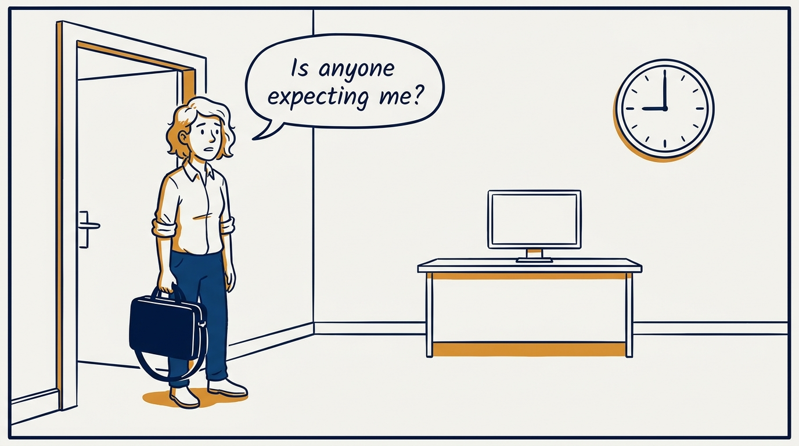
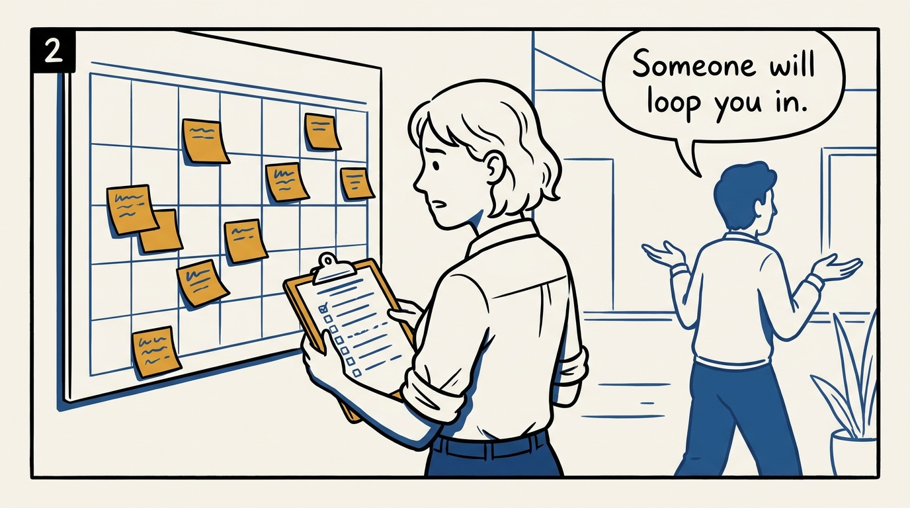
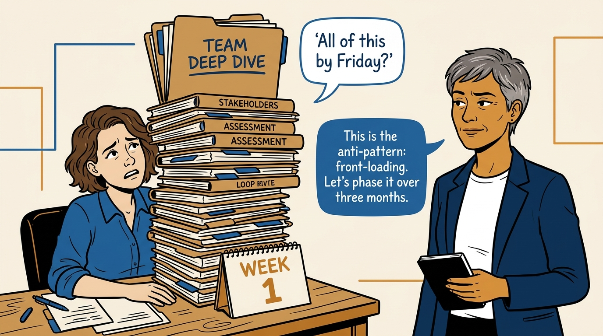
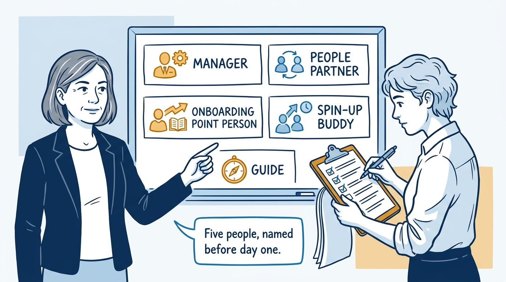
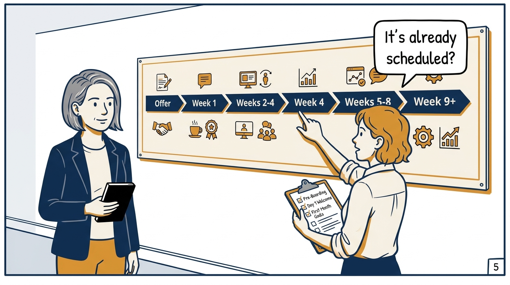
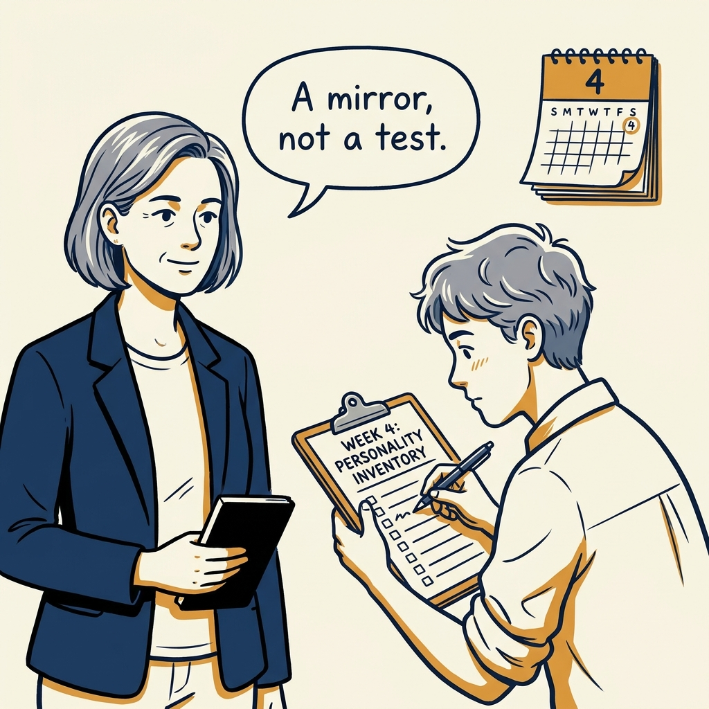
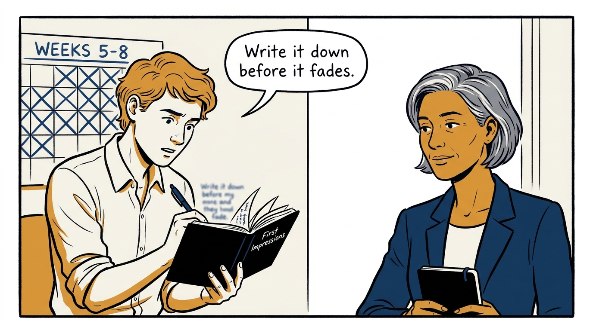
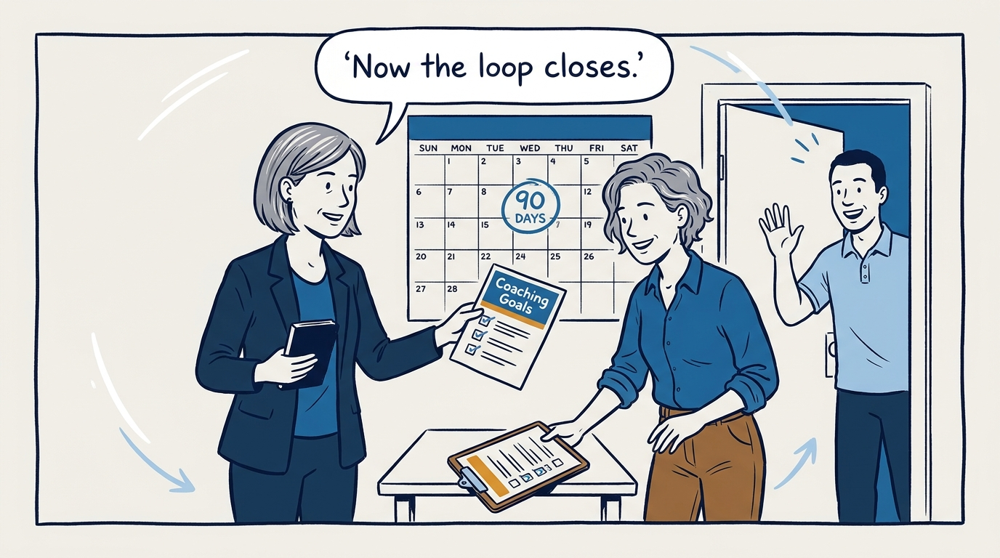

A new leader's first ninety days should not happen by accident — in eight panels.

<!-- comic-style
{
  "cast": "VERA: a calm, seasoned executive, short gray-streaked hair, dark blazer over a plain t-shirt, carries a small black notebook. NOA: an earnest first-time people manager, short wavy hair, rolled-up shirt sleeves, carries a clipboard with a long checklist.",
  "style": "Clean two-tone explainer comic, thick ink outlines, flat colors with deep blue and amber accents on a light background, generous white space, hand-lettered speech bubbles with SHORT readable text, no photorealism."
}
-->

**Panel 1:** *The hook: a new leader's first ninety days should not happen by accident.*

**Panel 2:** *The problem: senior hires fail from missing context and missing feedback, not missing skill.*

**Panel 3:** *The wrong way: cramming three months of context into week one.*

**Panel 4:** *The tool: a New Leader Experience with a named cast, not an implied one.*

**Panel 5:** *How it runs: pre-populated, phase by phase, so nobody invents it under pressure.*

**Panel 6:** *The mechanic: a leadership assessment at week four — a mirror, not a gate.*

**Panel 7:** *The cost: fresh outside perspective decays fast, so capturing it is a scheduled job, not an afterthought.*

**Panel 8:** *The closer: at ninety days, first impressions become coaching goals — and the loop closes.*
