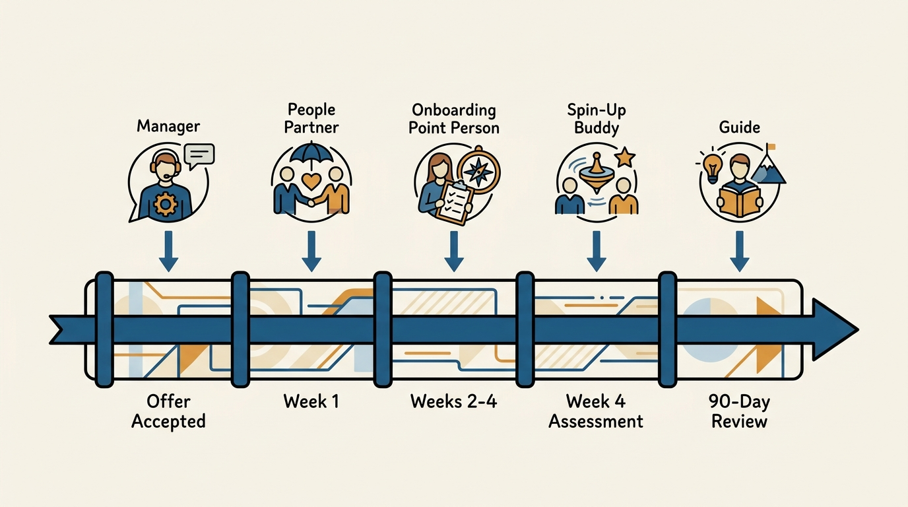
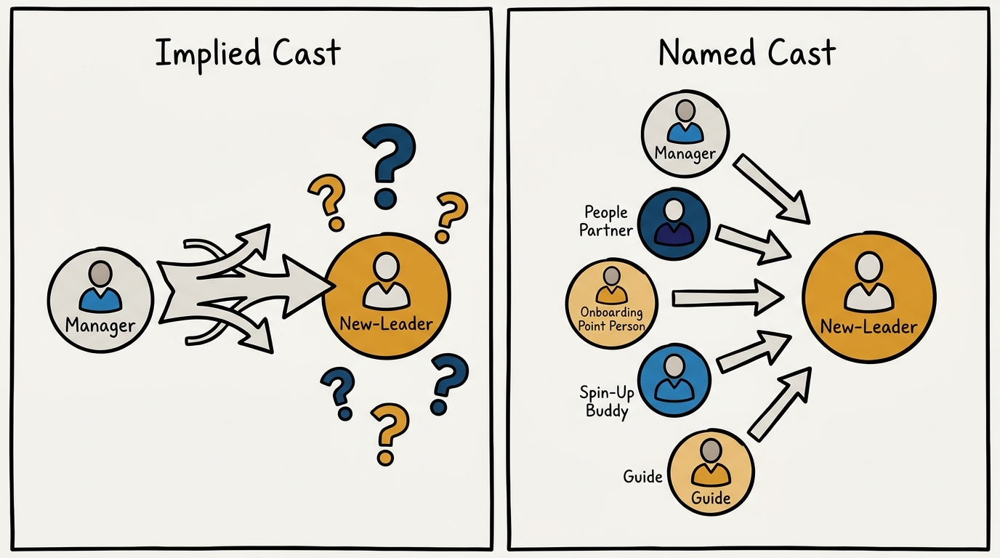
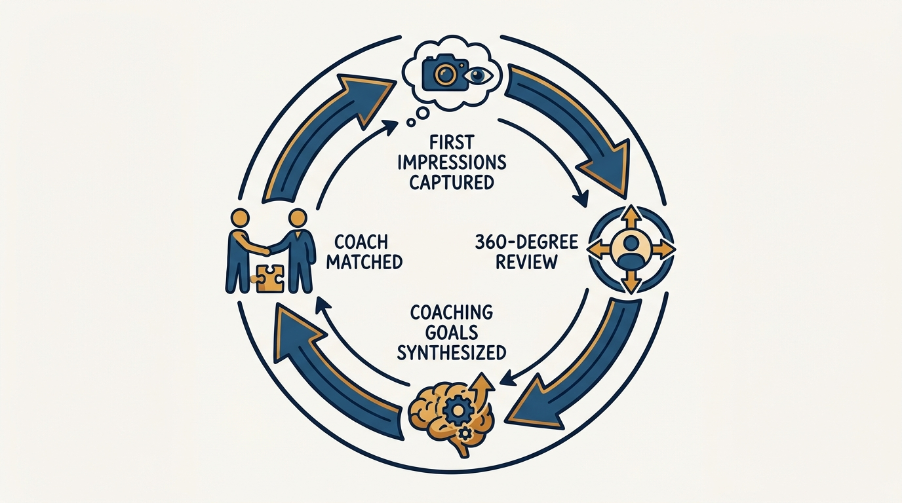

> **Status**: DRAFT
>
> **Principle**: A new leader's first ninety days are too important to leave to whoever happens to grab lunch with them. I run a New Leader Experience: welcome emails and pre-reads before the start date, a named support cast — hiring manager, people partner, onboarding point person, spin-up buddy, and guide — a phased schedule of meetings from offer acceptance through month three, a leadership assessment, a coach for six months, and a 360° review at ninety days that turns first impressions into coaching goals. Senior hires fail from missing context and missing feedback, not missing skill, and this is the structure that supplies both.

## Statement

My operating model for onboarding a new leader has five parts:

- **Onboarding is a designed experience, not a calendar of intros.** Every new leader gets a New Leader Experience (NLE): welcome communications, prescheduled meetings and pre-reads, a leadership assessment, a coach for six months, phased actions from offer acceptance through week 9+, and a 90-day 360° review. None of it is left to whoever remembers to reach out.
- **The support cast is named before day one.** A hiring manager, a people partner, an onboarding point person, a spin-up buddy for day-to-day questions, and a guide — an expert outside the new leader's own team who offers a safe space for questions and observations — are assigned and introduced before the leader starts.
- **The schedule is phased and pre-populated.** From the moment the offer is accepted through roughly three months in, I know who does what, week by week: welcome emails, weekly cast check-ins in week 1, team deep dives and stakeholder meetings in weeks 2–4, the leadership assessment around week 4, broader organizational immersion in weeks 5–8, and documentation and reflection from week 9 onward.
- **The assessment measures the leader, not just their team.** The Hogan Personality Inventory runs early — around week 4 — so the leader gets a structured read on their own tendencies before those tendencies get set by habit in the new role.
- **Ninety days closes the loop with a coach, not just a checklist.** A 360° review at roughly three months synthesizes how the first quarter actually landed, translates that into coaching goals, and hands the leader a matched coach for their first session — the feedback loop the rest of onboarding was building toward.

**Figure 1:** *The New Leader Experience is one designed pipeline, not five disconnected favors.*

## How to Read This

This journal is my people-management toolkit — first-person operating records built on the companion workbooks to Claire Hughes Johnson's *Scaling People: Tactics for Management and Company Building*. This record is grounded in the workbooks' New Leader Experience tool (Chapter 3), read through a practitioner-executive lens: the workbook offers it as a spin-up template for the team receiving a new leader; I read it as the onboarding standard I hold my organization to for every leadership hire, promotion, or transfer into a new remit. The runnable tool — the full phased WHO/WHAT schedule — lives in the **Checklist** tab of this post.

## Rationale

**Senior hires fail from missing context and missing feedback, not missing skill.** I did not hire this person for their competence to be in question — I hired them because it wasn't. What derails senior hires is different: nobody told them how decisions actually get made here, who the real stakeholders are, or how their first quarter is actually landing until it's too late to adjust. The New Leader Experience exists because those two failure modes — context and feedback — are structural problems, and structural problems need a structure, not good intentions.

**A named cast beats an implied one.** The workbook is specific about who shows up around a new leader: the hiring manager, a people partner, an onboarding point person who coordinates the mechanics, a spin-up buddy for the day-to-day questions too small to escalate, and the guide described above. Each role has a distinct job. Collapse them into "the manager will handle it" and the leader has no one to ask the questions a manager is the wrong person to hear.

**Figure 2:** *One overloaded role leaves questions unanswered; five named roles each answer a different kind of question.*

**The schedule is pre-populated so nobody has to invent it under pressure.** From the moment the offer is accepted, the onboarding point person is already assigning roles, sending welcome material, and scheduling meetings — weeks before the leader's first day. Week 1 is the cast: manager, buddy, guide, and people partner, checking in weekly for the first four weeks. Weeks 2 through 4 widen to team deep dives, new direct reports, skip-levels, and the finance and recruiting partners the leader will need. Week 4 adds the people-transition meetings — the new leader meeting each direct report's *former* manager, closing a context gap that otherwise takes months to surface on its own — plus the Hogan assessment. Weeks 5 through 8 widen further still: key partners, other divisional leaders, company-wide forums, and a standing reminder to document first impressions while they're still fresh and useful, before the new leader's eye adjusts to what's normal here. Nothing here is invented in week 3 because someone finally asked what should happen next.

**First impressions decay if nobody captures them.** A new leader's outside perspective is valuable for exactly as long as it's still outside — every week they stay, the organization's blind spots become their blind spots too. That's why the schedule builds in an explicit reminder to document first impressions and reflections during weeks 5–8, and why week 9 onward turns that into artifacts: a personal development plan, a "Working with Me" document, and 90-day reflections. Waiting until the 90-day review to ask "what did you notice" wastes the two months where the noticing was still sharp.

**The 90-day review is where the loop closes.** Everything before this point is setup. At roughly three months, the people partner runs 360° interviews, synthesizes what they hear, and turns it into coaching goals — not a verdict, a plan. Org dev matches a coach to those goals, and the coach runs a six-month engagement starting with the first session. The leader who started with pre-reads and a support cast now gets a structured, evidence-based read on how the first quarter actually went, from the people who watched it happen, with six months of coaching lined up to work the gaps. Onboarding that stops at week 1 orientation and skips this step never finds out whether it worked.

## What This Means in Practice

| What this record says | What it does **not** say |
| --- | --- |
| Every new leader gets a named cast — manager, people partner, onboarding point person, spin-up buddy, guide — before day one. | The hiring manager can handle it alone — each role exists because the manager is the wrong person for some of these conversations. |
| The onboarding schedule is pre-populated from offer acceptance through ~3 months. | The schedule is improvised week by week — the point is that nobody has to invent it under time pressure. |
| The Hogan assessment runs around week 4, early in the leader's tenure. | The assessment is a gate the leader must pass — it's a self-awareness tool, not a scorecard for anyone else. |
| First impressions are documented during weeks 5–8, while they're still fresh. | Reflection waits for the 90-day review — by then the leader has already stopped noticing half of what they'd have flagged in week 6. |
| A 90-day 360° review synthesizes findings into coaching goals and a matched coach. | The 360° is a performance verdict — it feeds coaching, not a judgment of whether the hire was right. |
| The guide is someone outside the new leader's own team. | Any senior colleague can be the guide — the value is specifically in having no reporting-line stake in the answers. |

**Figure 3:** *The 90-day review is not an ending — it closes a feedback loop back into the leader's growth.*

Concretely: before any new leader's start date, I can name their manager, people partner, onboarding point person, spin-up buddy, and guide, and I can point to a populated week-by-week schedule through month three. At the 90-day mark, I expect a synthesized set of coaching goals and a scheduled first coaching session — not a shrug and "how's it going."

## Anti-Patterns

- **Onboarding as vibes.** No named cast, no schedule, just an assumption that smart senior people will figure it out. They will — slower, and with avoidable scar tissue.
- **The absent guide.** Skipping the outside-the-team guide because "their manager can answer anything." Some things a new leader will only ask someone with nothing to lose by hearing the question.
- **Front-loading everything into week 1.** Cramming team deep dives, stakeholder meetings, and the assessment into the first week because onboarding "should be fast." The workbook's own phasing spreads this across three months for a reason — a new leader absorbs context in stages, not all at once.
- **Skipping the people-transition meetings.** Letting new direct reports' former managers disappear without a handoff conversation. The context that leaves with them is expensive to reconstruct later.
- **First impressions never captured.** No reminder, no artifact — the freshest, most valuable outside perspective the organization will ever get from this person evaporates by month four.
- **The 360° that never happens.** Onboarding budget and attention run out at week 4, and the 90-day review — the actual feedback loop — quietly does not happen.
- **Coaching as an afterthought.** Treating the coach match as a nice-to-have that org dev gets to eventually, rather than a scheduled deliverable of the 90-day process.

## Related Records

- [[manager-transitions]] — the adjacent record for a leader moving into a *different* role or team rather than joining fresh; shares the coaching and context concerns but not the same cast or schedule.
- [[working-with-me]] — the document the NLE schedule asks every new leader to produce at week 9+, so their own working style becomes legible fast.
- [[career-conversations]] — where the 90-day coaching goals eventually connect to a longer-run development and career conversation.
- [[management-prerequisites]] — the baseline 1:1 and feedback infrastructure the NLE's weekly check-ins and 360° review assume is already running.
- [[onboarding-peer-executives]] — the engineering-executive journal's record on onboarding peer-level executives; a closely related structure told from the peer's-eye view rather than the organization's.
- [[engineering-onboarding]] — the engineering-executive journal's record on onboarding engineers into a codebase and team; a different onboarding problem — context and judgment here, code and systems there.

## Scope and Revisiting

This record is `draft`. It governs how I onboard a new leader — hired, promoted, or transferred into a new remit — from offer acceptance through the 90-day review. I will revise it if the phased schedule needs different cadences for different levels of seniority, if the assessment tool changes, or if a 90-day review surfaces a systemic gap this checklist does not catch.

## Authoritative References

- Claire Hughes Johnson, *Scaling People: Tactics for Management and Company Building* (Stripe Press, 2023) — the companion workbooks' New Leader Experience tool (Chapter 3), which this record distills.
