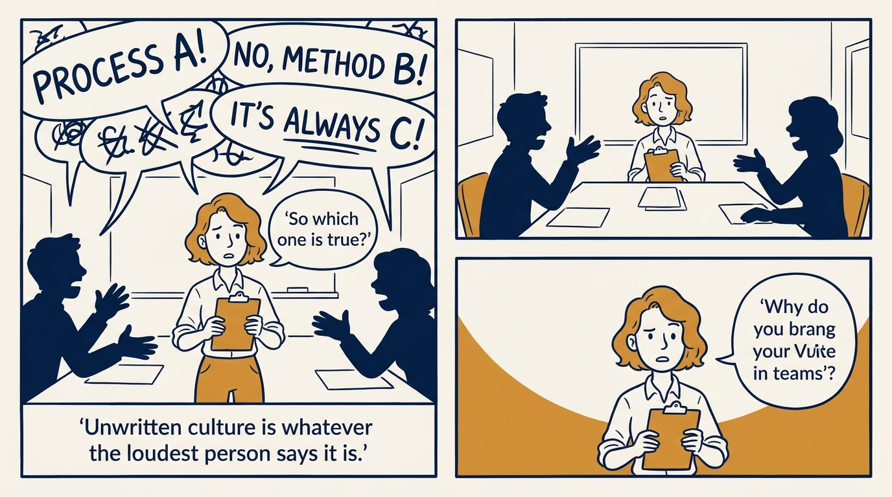
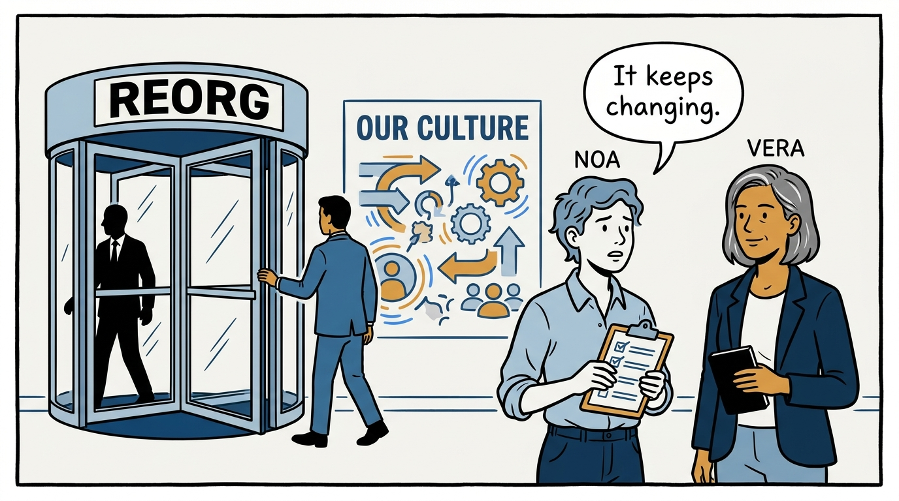
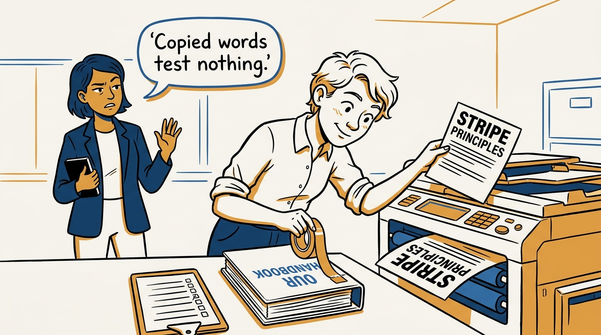
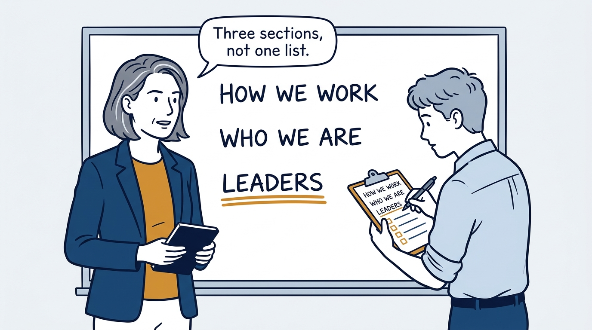
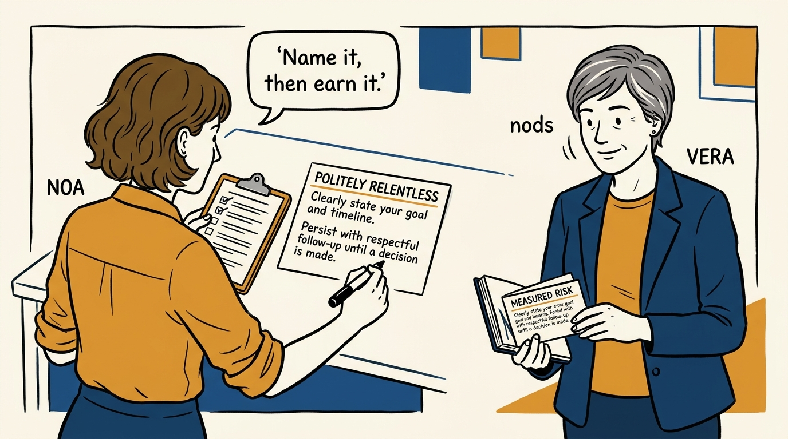
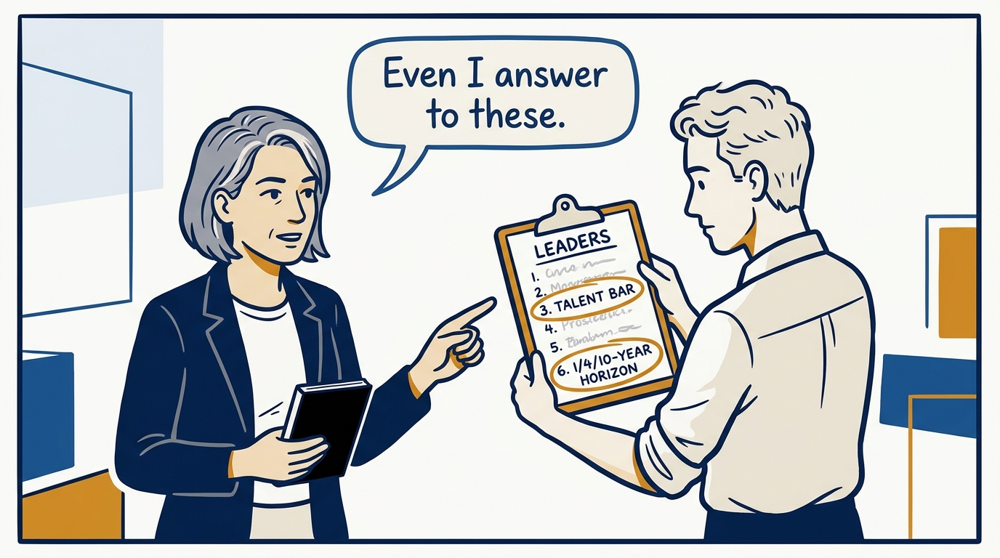
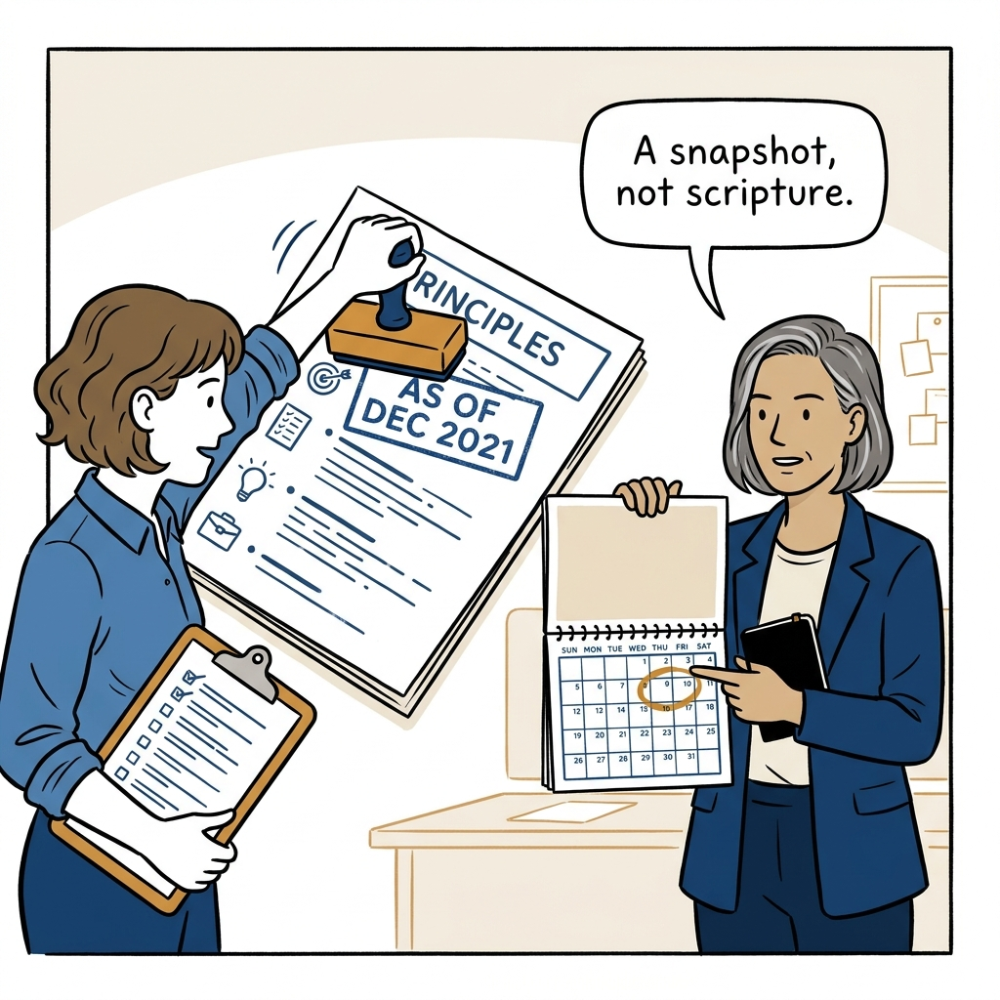
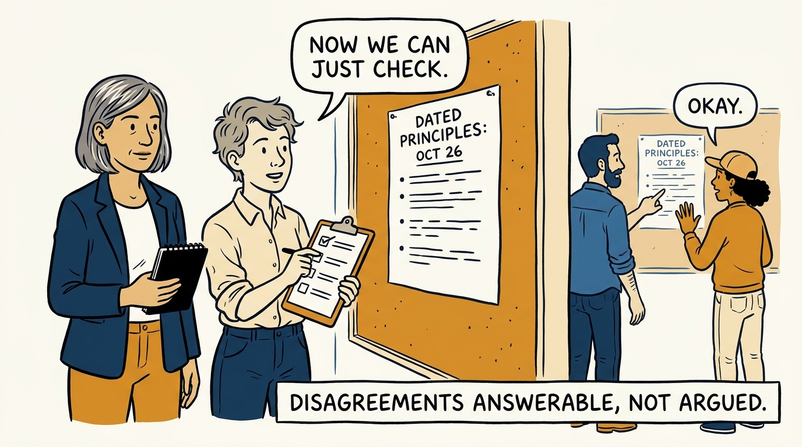

Culture that only lives in people's heads is whatever the loudest voice says it is — write it down instead, in eight panels.

<!-- comic-style
{
  "cast": "VERA: a calm, seasoned executive, short gray-streaked hair, dark blazer over a plain t-shirt, carries a small black notebook. NOA: an earnest first-time people manager, short wavy hair, rolled-up shirt sleeves, carries a clipboard with a long checklist.",
  "style": "Clean two-tone explainer comic, thick ink outlines, flat colors with deep blue and amber accents on a light background, generous white space, hand-lettered speech bubbles with SHORT readable text, no photorealism."
}
-->

**Panel 1:** *Unwritten culture is whatever the loudest person in the room says it is.*

**Panel 2:** *Folklore drifts with every reorg — nothing survives turnover unless it's written down.*

**Panel 3:** *Copy-paste culture: a borrowed sentence was tested against someone else's decisions, not yours.*

**Panel 4:** *Three sections, not one list — and leaders get the harder tier.*

**Panel 5:** *Name it, then earn the name in two or three sentences that take a side.*

**Panel 6:** *Six demands, not aspirations — talent bar, ambition horizon, pace, accountability, clarity, persistence.*

**Panel 7:** *The date stamp is an admission: this is a snapshot, and revising it is the cost of keeping it honest.*

**Panel 8:** *Written down, a culture disagreement becomes answerable instead of argued from vibes.*
