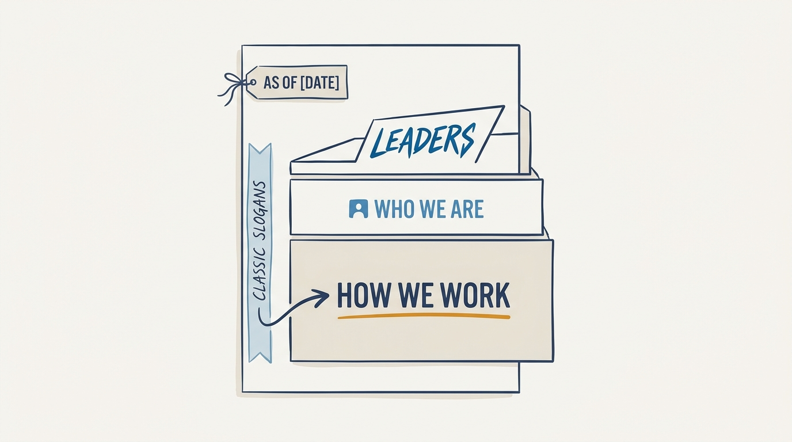
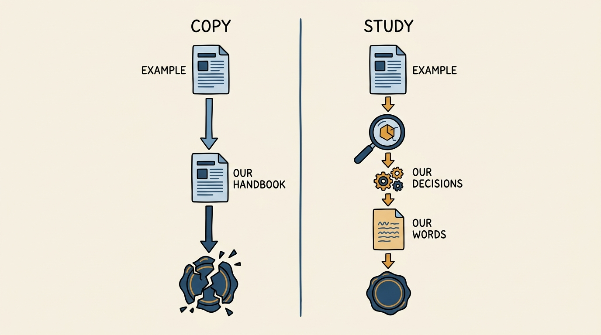
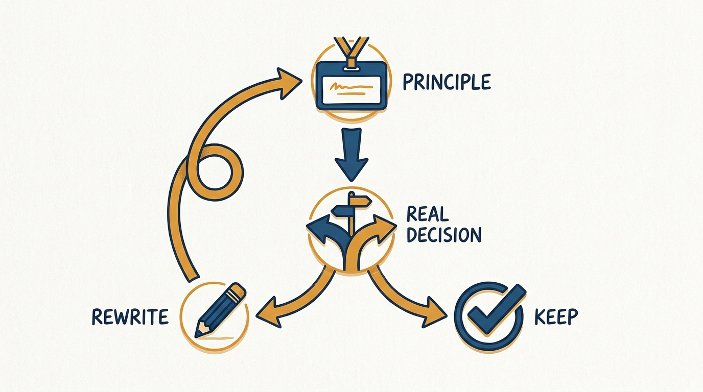

> **Status**: DRAFT
>
> **Principle**: My organization's culture is not what I say in an all-hands — it is what I write down and hold people to. I put it in three short, named sections: how we work, who we are, and what I expect of leaders, each with a handful of two- or three-sentence principles that name a real tension and take a side. I date the page, because the set is a snapshot, not scripture. I study Stripe's December 2021 operating principles as a model of the form — I do not copy its words.

## Statement

My operating model for written operating principles has five parts:

- **Three sections, not one list.** How we work covers method — the behaviors that get things done. Who we are covers character — the disposition I want in every hire regardless of role. What I expect of leaders is a separate, harder section: leaders are held to demands the rest of the organization is not.
- **Name it, then earn the name in two or three sentences.** Every principle gets a short, memorable name (two or three words) followed by a tight paragraph that states the tension it resolves and which side it takes. A principle that reads as safe on every axis was not worth writing down.
- **Study the model, write my own words.** I read Stripe's set closely for its shape — how many principles per section, how much space each gets, how leaders are treated as a distinct tier — and then I write principles that name my organization's actual tensions. Copying another company's language produces a document nobody believes, because it was never tested against our decisions.
- **Date the page and expect to revise it.** The set carries a visible "as of" date. An organization that is still changing should expect its principles to change with it; a set that has not been touched in years is either finished growing or has stopped being read.
- **Keep a secondary layer of slogans, lightly.** Alongside the numbered principles, a short list of memorable one-line slogans — the "classic" phrases that predate or outlive any particular version of the formal set — can carry cultural memory without demanding the same rigor as the named principles.

**Figure 1:** *Three named sections stacked, with leaders as the narrowest, sharpest tier — not one undifferentiated list.*

## How to Read This

This journal is my people-management toolkit, grounded in the companion workbooks to Claire Hughes Johnson's *Scaling People: Tactics for Management and Company Building*. This record is grounded in "Stripe's Operating Principles" — the worked example the workbook presents as of December 2021 — read through a practitioner-executive lens: the workbook offers it as a model to study before writing your own; I read it as the standard for what a written culture document should look like, and the discipline of writing one for my own organization rather than adopting someone else's. The runnable write-your-own kit lives in the **Checklist** tab of this post.

## Rationale

**Unwritten culture is whatever the loudest person in the room says it is.** If "how we work" only exists as institutional folklore, it drifts with every reorg and gets reinvented by every new leader who wasn't there for the founding conversations. Writing it down — three named sections, a small number of principles each — fixes a reference point that survives turnover. The point is not the document; the point is that disagreements about "is this how we operate" become answerable instead of argued from vibes.

**The three-part shape does real work.** Method, character, and leadership are different questions and blurring them produces a document that reads as generic values-poster filler. "How we work" is about method under pressure — speed versus polish, feedback versus certainty, ownership versus process. "Who we are" is about disposition — the traits I want in a hire regardless of what they build. "Leaders" is a separate, harder tier: a demand layer, not an aspiration layer, because the people with the most leverage over everyone else's experience of the culture need the sharpest and least negotiable expectations. A set that only has one section, or that folds leadership expectations into the general list, quietly excuses leaders from the harder half of the bargain.

**Naming plus a short paragraph is the right unit of length.** A principle needs a name short enough to become shorthand in a meeting ("that's not politely relentless") and a body short enough to fit in one glance — two or three sentences, not a page. The name is what people actually remember and invoke months later; the paragraph is what keeps the name from becoming an empty slogan by stating, concretely, which side of a real tradeoff the principle takes. A principle that could describe any company, or that avoids taking a side, has failed the test before it is even used.

**A studied model beats an inherited one.** The temptation with any famous example — Stripe's or anyone else's — is to paste the words into a handbook and call it done. That fails for a mechanical reason: a principle only means something once it has been tested against a real decision your organization actually had to make, and a borrowed sentence was tested against someone else's decisions, not yours. So I treat a published set the way I'd treat a strong essay: read it for structure, argument density, and what it dares to say plainly, then close the tab and write from what I actually believe about how my organization should behave under pressure.

**Figure 2:** *Study the shape, test the words against your own decisions — copying the example is the dead end.*

**The date stamp is an admission, not a formality.** Every version of a written culture document is provisional — true for this stage of the company, this market, this team's scars. Marking it "as of" a date does two things: it tells the reader they are looking at a snapshot, not a constitution, and it commits me to revisiting it rather than letting a stale version calcify into unquestioned scripture. An organization proud enough of its principles to publish them should be honest enough to admit they will need rewriting.

## What This Means in Practice

| What this record says | What it does **not** say |
| --- | --- |
| Culture is written down in three named sections: how we work, who we are, what leaders are held to. | One undifferentiated list of values covers the same ground — method, character, and leadership expectations are different questions. |
| Each principle gets a short name and a two- or three-sentence body that takes a side. | Longer is better — a principle that needs a page to explain has not found its point yet. |
| Leaders get a separate, harder section of demands. | Leadership expectations are folded into the general list — leaders answer to a distinct, sharper bar. |
| I study a strong published example for its form. | I adopt another company's words — a borrowed principle was tested against someone else's decisions. |
| The document carries a visible date and gets revisited. | The set is finished once published — it is a living document, not a plaque. |
| A short slogan layer can carry memory alongside the formal set. | The slogans replace the principles — they are a lighter secondary layer, not the substance. |

Concretely: my organization's operating principles live in a single page, three headed sections, each principle two or three sentences under a short bold name, with a visible "as of" date at the top. I can point to a real decision each principle would have changed if we had ignored it — if I cannot, the principle is decoration and needs rewriting.

**Figure 3:** *Every principle runs this loop: tested against a real decision, kept if it would have changed the outcome, rewritten if not.*

## Anti-Patterns

- **The values poster.** Aspirational words with no teeth — nothing in the document would ever cost the organization a convenient decision. Every principle passes every test, which means none of them are principles.
- **Copy-paste culture.** Another company's operating principles, lightly reworded, presented as ours. Nobody in the room can explain why line three matters here, because it was never tested against our decisions.
- **One list, no tiers.** Method, character, and leadership expectations mashed into a single undifferentiated bullet list, so leaders escape the sharper bar they should be held to.
- **The undated relic.** A set written three reorgs ago, never revisited, quietly ignored because everyone knows it no longer describes how the place actually runs.
- **All slogan, no substance.** A wall of punchy one-liners with no named-principle layer behind them — memorable, but with nothing concrete enough to invoke in an actual disagreement.
- **Leader exemption.** A leaders' section that reads as softer or vaguer than the sections applied to everyone else, instead of the sharpest, least negotiable tier in the document.

## Related Records

- [[organizational-values]] — the engineering-journal record on how values are lived and tested day to day; this record is the tool for writing the document those values get judged against.
- [[team-charter]] — a single team's mission and scope; operating principles apply organization-wide, a team charter applies to one team's slice of it.
- [[working-with-me]] — one leader's personal user guide; operating principles are the shared standard every leader is measured against, including through their own user guide.
- [[management-prerequisites]] — the baseline hygiene every manager must clear before any written principle means anything in practice.
- [[performance-reviews]] — where "who we are" and the leaders' demands actually get tested against a person's year.

## Scope and Revisiting

This record is `draft`. It governs how I write and maintain my organization's operating principles document — not the specific words of any one version, which will change. I will revise it when a revision of the actual principles document teaches me something about the form (a section that didn't earn its keep, a principle nobody ever invoked), or when I notice leaders being held to a softer bar than the rest of the organization.

## Authoritative References

- Claire Hughes Johnson, *Scaling People: Tactics for Management and Company Building* (Stripe Press, 2023) — the companion workbooks' "Stripe's Operating Principles" exercise (Chapter 2), presenting Stripe's operating principles as of December 2021 as the worked example this record studies.
