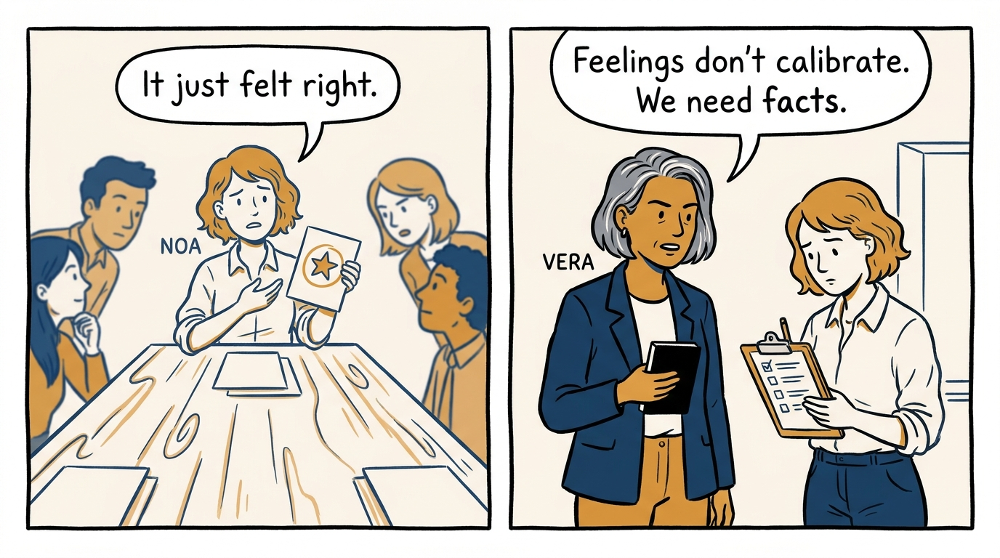
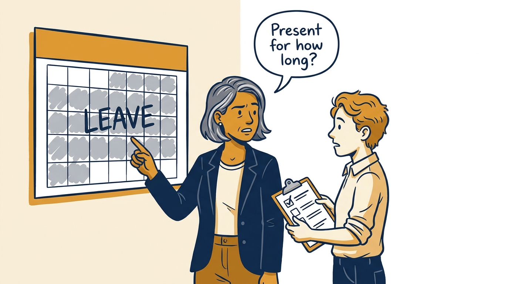
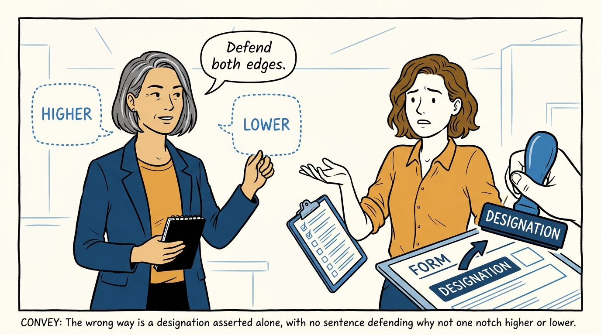
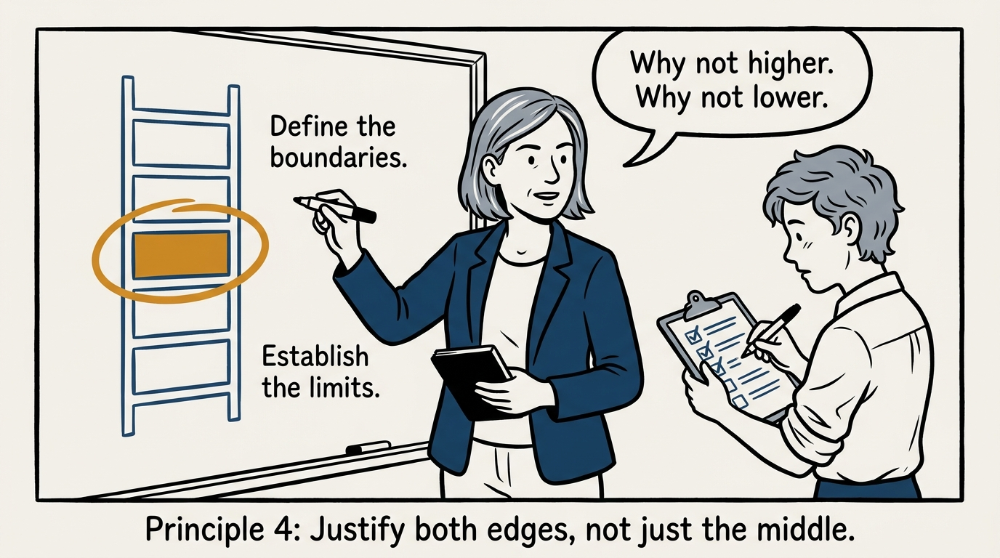
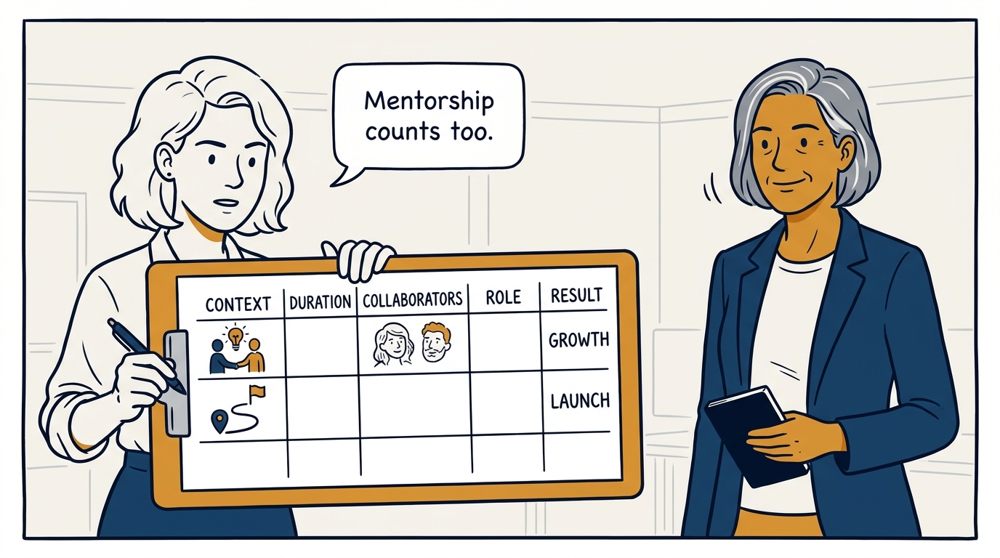
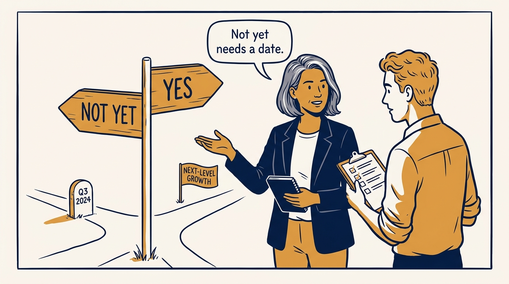
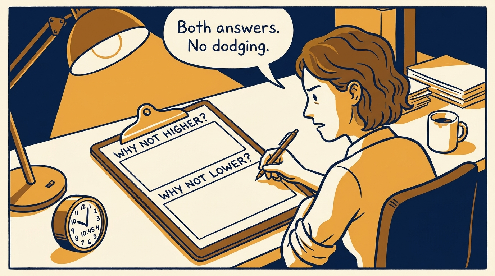
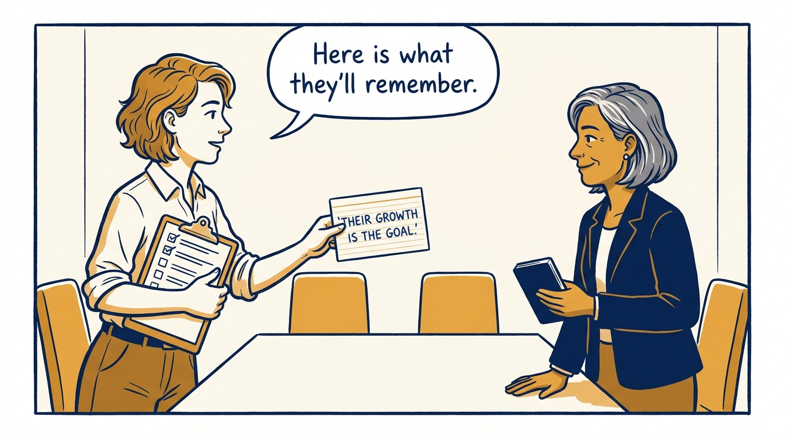

A performance review has to survive calibration, not just the meeting it was written for — in eight panels.

<!-- comic-style
{
  "cast": "VERA: a calm, seasoned executive, short gray-streaked hair, dark blazer over a plain t-shirt, carries a small black notebook. NOA: an earnest first-time people manager, short wavy hair, rolled-up shirt sleeves, carries a clipboard with a long checklist.",
  "style": "Clean two-tone explainer comic, thick ink outlines, flat colors with deep blue and amber accents on a light background, generous white space, hand-lettered speech bubbles with SHORT readable text, no photorealism."
}
-->

**Panel 1:** *A review written for one reader collapses the moment it meets the calibration room.*

**Panel 2:** *A designation set against the wrong denominator is one I will retract in calibration.*

**Panel 3:** *A designation asserted alone is a guess dressed as a rating.*

**Panel 4:** *Why not one notch higher, why not one notch lower — the two sentences that make a designation an argument.*

**Panel 5:** *Impact is named work — context, duration, collaborators, role, result — and mentorship counts on equal footing.*

**Panel 6:** *"Not yet" states a date and a bar to clear. "Yes" states the next step, not a blocker.*

**Panel 7:** *The cost: the two edge questions make you defend the designation in both directions.*

**Panel 8:** *If I can write that sentence honestly before the meeting, I am ready for the room.*
