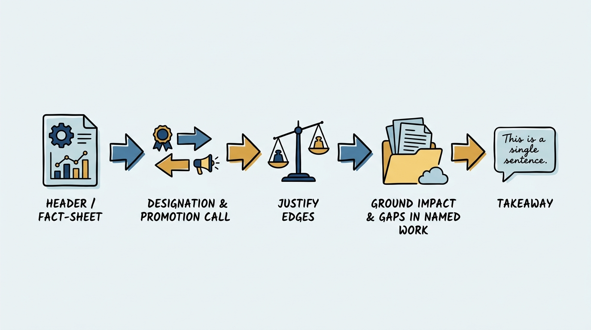
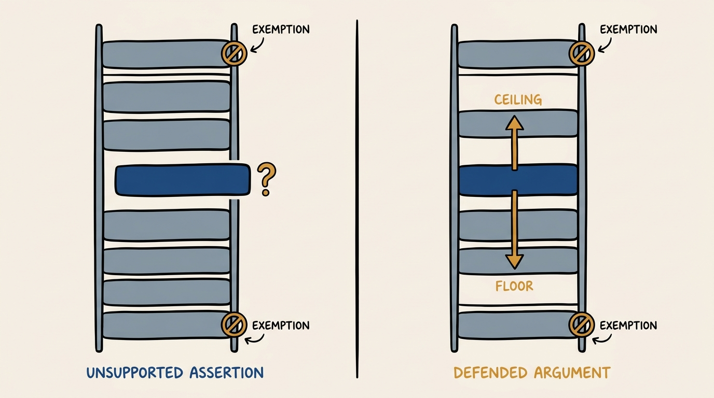
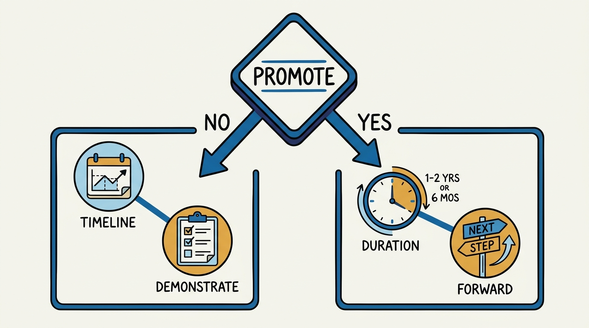

> **Status**: DRAFT
>
> **Principle**: I write every performance review to do two jobs at once — tell the person the truth about their half, and prepare me to defend that truth in a calibration room full of other managers. The review states a proposed designation and a proposed promotion call, then forces two sentences I cannot dodge: why not the designation one notch higher, and why not one notch lower. It closes with the one sentence I actually want the person to remember. If I cannot write that sentence honestly before the meeting, I am not ready to have it.

## Statement

My operating model for performance reviews has five parts:

- **Header discipline before narrative.** Before I write a word of prose, I fix the facts: name, current level, start date in role, and how much of the review period the person was actually present, net of leave. A designation set against the wrong denominator is a designation I will have to retract in calibration.
- **State the designation and the promotion call up front.** Every review carries a proposed designation and an explicit promotion yes/no. I do not bury these in the narrative — they are the two decisions the whole document exists to support.
- **Justify the edges, not just the middle.** For every designation I write one sentence on why I did not choose the designation one notch higher, and one sentence on why I did not choose one notch lower. Two "N/A"s are allowed only at the true extremes — "greatly exceeds" has no higher edge to defend, "does not meet" has no lower one.
- **Ground impact, strengths, and gaps in named work.** The 2–3 highest-impact projects, the 1–2 strengths, and the 1–2 development areas all get context, difficulty, duration, collaborators, expected role, and a result measured against that expectation — not adjectives.
- **Write the takeaway before the meeting, not during it.** I write, in one sentence, the message I want this person to leave the review remembering. If I cannot write it cleanly, I write the review again until I can.

**Figure 1:** *The five parts run in order — each one gates the next, ending in a sentence written before the meeting.*

## How to Read This

This journal is my people-management toolkit, grounded in the companion workbooks to Claire Hughes Johnson's *Scaling People: Tactics for Management and Company Building* (Stripe Press, 2023), read through a practitioner-executive lens. This record is grounded in the workbook's Performance Review Template — the tool a manager fills in to draft a written review and to walk into calibration already knowing where they stand and why. The runnable tool — the exact header fields, impact prompts, strengths/gaps structure, and promotion-proposal branches — lives in the **Checklist** tab.

## Rationale

**A review is a calibration document before it is a conversation document.** The workbook is explicit that this template exists to help a manager draft the written review *and* prepare for the calibration conversation that follows it — two audiences, one document. A review written only for the person being reviewed reads well and collapses the moment a peer manager in calibration asks "why not the level above?" I write for both audiences from the first line, because the calibration room is where an unexamined designation gets found out.

**The header is not paperwork — it is the frame the rest of the review has to fit inside.** Name, current level, start date in role, and time present during the period sound like fields a form generator could fill in, but the last one is a trap I do not skip: a half with substantial leave is not the same half as one worked in full, and a designation that does not account for that gap is comparing the person to a bar they did not have full time to clear. Fix the frame first; write the verdict second.

**Why-not-higher and why-not-lower is the discipline that makes the designation honest.** A designation stated alone is an assertion. A designation defended on both edges is an argument — because the "why not higher" sentence forces me to name the ceiling I saw and hit, and the "why not lower" sentence forces me to name the floor the person cleared. The only exemptions are the true extremes: "N/A for greatly exceeds" and "N/A for does not meet," because those bands have no edge above or below them to defend. Everywhere else, if I cannot write both sentences, I have not actually decided — I have guessed and dressed it as a rating.

**Figure 2:** *A designation stated alone is an assertion. Defended on both edges, it becomes an argument.*

**Impact has to be named work, not a mood.** For each of the 2–3 highest-impact areas the workbook wants the project or area, its context and difficulty, the duration of the person's contribution, the key collaborators, their role and the expected impact for that role, and the resulting impact against that expectation, with metrics where I have them. Company-building work counts on equal footing when it is substantial: mentorship, recruiting, and DEI contributions are not asterisks on "real" impact, they are impact, and a review that only credits roadmap delivery is measuring half the job.

**Strengths and development areas get the same rigor as impact — designation, then evidence.** One or two strengths, one or two development areas, each with an approximate designation relative to the person's current level and one or two supporting examples — and for development areas, concrete ideas for how to improve, not just a diagnosis. For people managers, I read strengths and gaps against the manager ladder and the manager principles, not just the individual-contributor bar, because the standard the workbook expects for a manager's review is manager behavior.

**The promotion call has its own logic, and "not yet" is not a verdict, it is a plan.** If the answer is no, I write when the person might plausibly be ready — this half, next half, or later — and what they concretely need to demonstrate to get there. If the answer is yes, I write how long they have already been demonstrating next-level capabilities and behaviors, with examples, and then the primary development area *at the next level*. The workbook is explicit that this last item is not meant to prevent upleveling or hold the promotion hostage — it is proactively identifying the person's next step, stated the same week I say yes, not held back as a hedge.

## What This Means in Practice

| What this record says | What it does **not** say |
| --- | --- |
| Fix the header facts — level, start date, time present net of leave — before writing the verdict. | The header is bureaucratic filler; only the narrative sections matter. |
| State the proposed designation and the promotion yes/no explicitly. | Designation and promotion can stay implicit in the prose and be inferred later. |
| Write one sentence each on why not higher and why not lower. | The edge sentences are optional commentary — most reviews still need both. |
| Credit company-building work (mentorship, recruiting, DEI) as impact when it is substantial. | Only roadmap or ticket-shaped delivery counts as real impact. |
| Ground strengths and development areas in an approximate designation plus 1–2 examples. | Adjectives ("strong," "needs work") are sufficient without evidence. |
| A "no" on promotion states a timeline and concrete next steps; a "yes" states the next-level development area as a proactive next step. | "No" is a closed door, or "yes" means the person has nothing left to develop. |

Concretely: I do not start writing prose until the header fields are filled and accurate, including the leave adjustment. I do not submit a review to calibration without both edge sentences written for the proposed designation. And I write the one-sentence takeaway before the meeting, not while sitting across from the person — if I have to improvise it in the room, I have not finished the review.

**Figure 3:** *"Not yet" is a plan with a date. "Yes" is a proactive next step, not a blocker.*

## Anti-Patterns

- **The vibes designation.** A rating chosen because it "feels right," with no sentence defending why it is not one notch in either direction — indefensible the moment a peer manager in calibration pushes back.
- **The header skip.** Level, start date, and time-present fields left blank or copied forward, so the designation is being compared against the wrong period or the wrong bar.
- **Company-building erased.** Mentorship, recruiting, and DEI contributions left out of impact entirely because they don't look like the roadmap — punishing exactly the work that makes the organization better.
- **The adjective strength.** "Great communicator" with no designation and no example — unfalsifiable, and useless as a coaching input for next half.
- **The silent no.** A promotion declined with no stated timeline and no stated bar to clear — leaving the person guessing at what "not yet" actually requires.
- **The unearned yes.** A promotion granted with no next-level development area named — signaling the person has nothing left to grow into, which is never true and undersells the next conversation.
- **The improvised takeaway.** Walking into the review without having written the one sentence the person should leave with — so the actual message gets buried under whichever detail comes up first.

## Related Records

- [[career-conversations]] — the review states where someone stands today; the career conversation is where we work the trajectory from here.
- [[compensation-conversations]] — the promotion and designation decided here are frequently the direct inputs to the compensation conversation that follows.
- [[managing-underperformance]] — when the designation trends toward "does not meet," the review is the paper trail that record's process builds on.
- [[careers-and-performance]] — the engineering-journal record on the level system and designation bands this review's proposed designation has to sit inside.
- [[calibrating-your-standards]] — the engineering-journal record on keeping the bar itself honest; this record is how one manager's review survives contact with that bar in calibration.

## Scope and Revisiting

This record is `draft`. It governs how I draft a written performance review and prepare for the calibration conversation that follows — the header, the impact and strengths/gaps sections, and the promotion-proposal logic. It does not define the level ladder itself, the calibration process across managers, or compensation mechanics. I revisit it if my organization's designation bands change, if calibration surfaces a pattern of reviews failing the why-not-higher/why-not-lower test, or if the promotion-proposal structure stops matching how leveling actually works here.

## Authoritative References

- Claire Hughes Johnson, *Scaling People: Tactics for Management and Company Building* (Stripe Press, 2023) — the companion workbooks, Performance Review Template.
