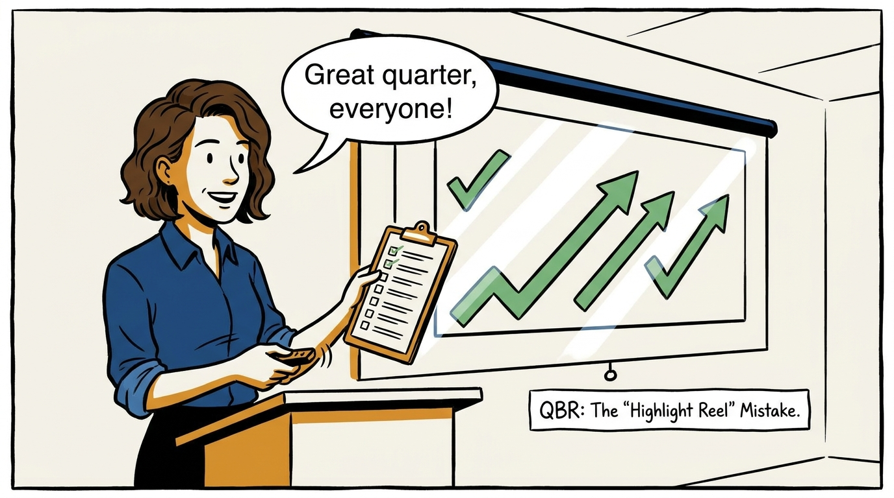
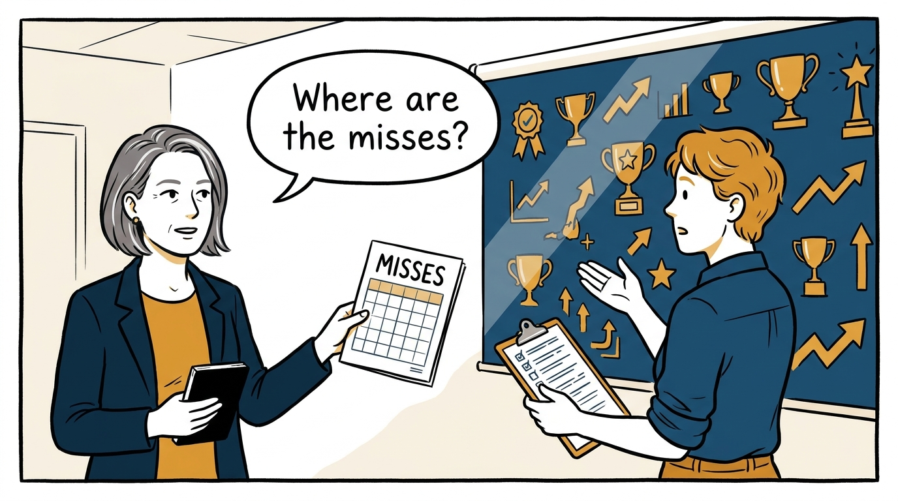
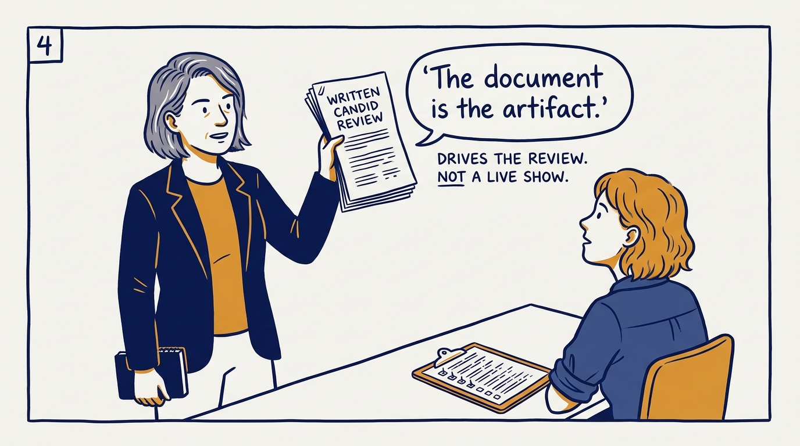
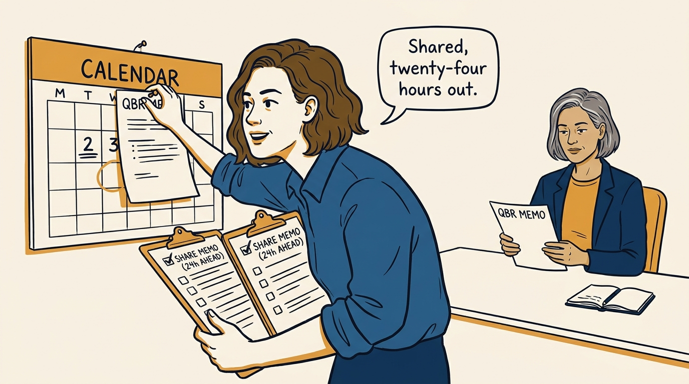
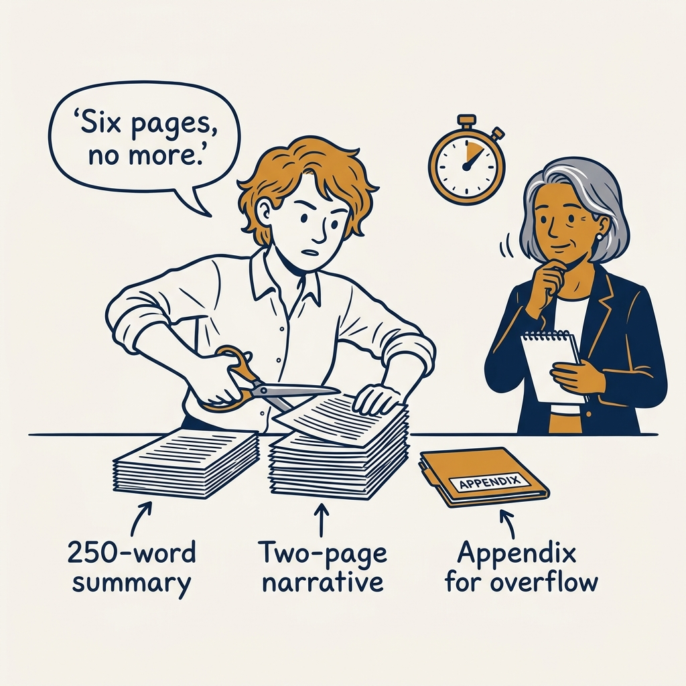
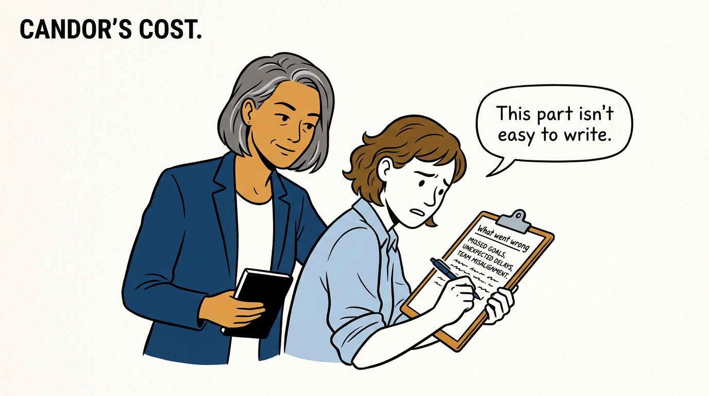
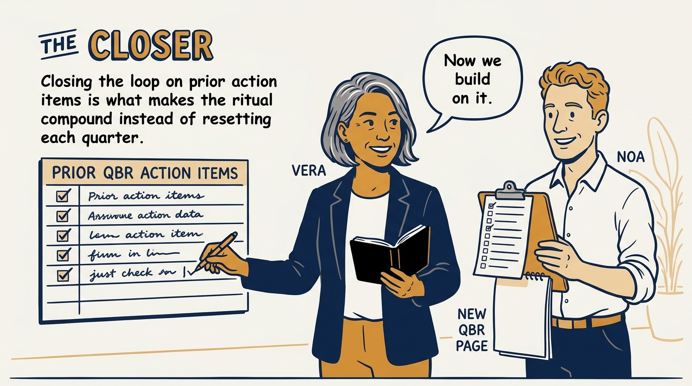

The QBR is a written, candid, six-page accountability ritual, not a showcase — in eight panels.

<!-- comic-style
{
  "cast": "VERA: a calm, seasoned executive, short gray-streaked hair, dark blazer over a plain t-shirt, carries a small black notebook. NOA: an earnest first-time people manager, short wavy hair, rolled-up shirt sleeves, carries a clipboard with a long checklist.",
  "style": "Clean two-tone explainer comic, thick ink outlines, flat colors with deep blue and amber accents on a light background, generous white space, hand-lettered speech bubbles with SHORT readable text, no photorealism."
}
-->

**Panel 1:** *The hook: a QBR that only shows the wins isn't a QBR.*

**Panel 2:** *The problem: no pre-read means the room narrates instead of discusses.*

**Panel 3:** *The wrong way: a showcase of successes is not a candid assessment.*

**Panel 4:** *The principle: a QBR is a written, candid, six-page accountability ritual.*

**Panel 5:** *How it runs: shared at least 24 hours ahead, reading time protected in the room.*

**Panel 6:** *The mechanic: 250-word summary, two-page narrative, six pages total, everything else in the appendix.*

**Panel 7:** *The cost: candor means the lowlights get real space, even when it's uncomfortable.*

**Panel 8:** *The closer: close the loop on last quarter, and the ritual compounds instead of resetting.*
