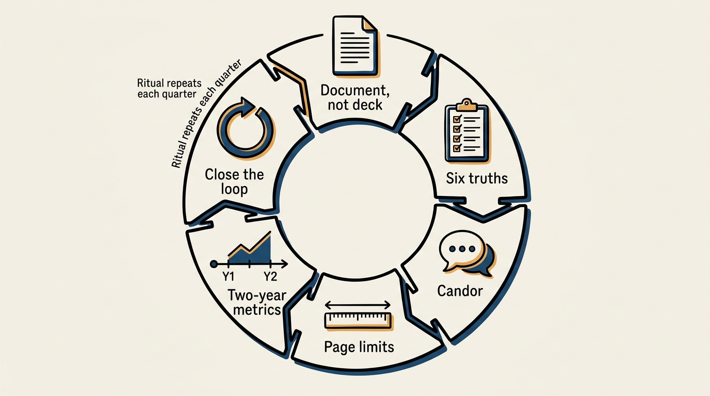
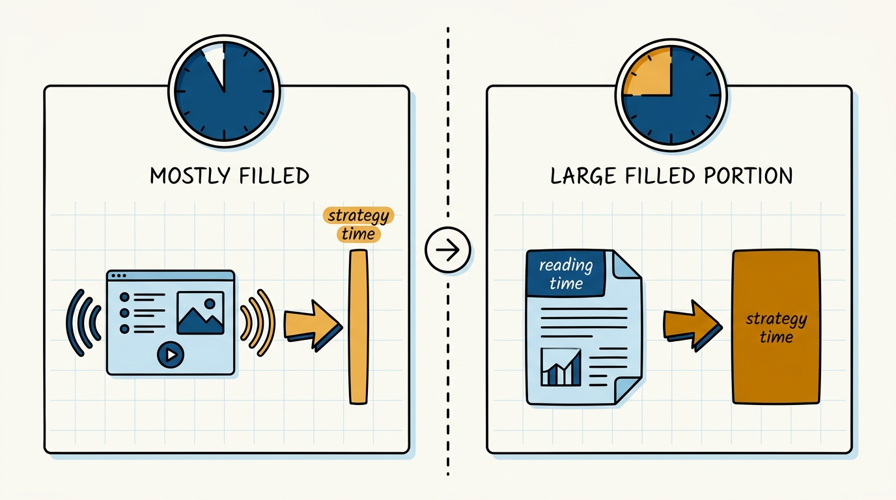
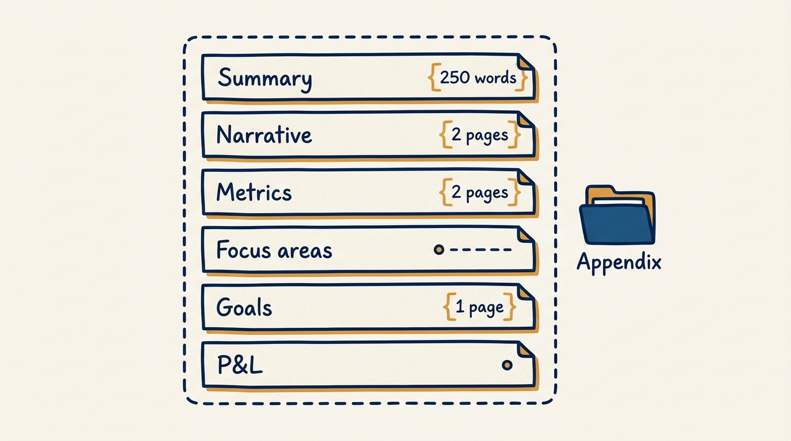

> **Status**: DRAFT
>
> **Principle**: I treat the Quarterly Business Review as a written, candid, six-page accountability ritual, not a showcase of successes. The document — shared at least 24 hours ahead — must leave every reader able to answer "where do we want to be in two years, and are we on track?", must name which goals we executed and which we did not and why, must set investment against what the area is producing, and must surface the obstacles leadership can actually unblock. The meeting itself is a discussion informed by the memo, not a presentation of it — attendees arrive having read it, and we spend the room's time on strategy and outlook, not narration.

## Statement

My operating model for the QBR has six parts:

- **The document is the artifact, the meeting is the discussion.** A QBR is a six-page narrative plus an appendix, shared at least 24 hours before the meeting, with reading time protected inside the meeting itself. The room's job is to discuss the memo, not hear it read aloud for the first time.
- **Six statements must be true when it's over.** After every QBR, participants can state: the charter and operating metrics with targets through year end and whether we're on track for two years out; which goals were executed, which were not, and why; investment against production; mutual expectations for the coming period; the obstacles ahead; and what leadership can unblock.
- **Candor over performance.** The executive summary is a candid assessment, not a summary of successes. If goals were missed, the narrative skews toward lowlights and explains why. Results-focus beats a winding discussion of plans we merely intended to execute.
- **Concision is enforced by page limits, not goodwill.** Executive summary under 250 words, narrative under two pages, progress-on-goals under one page — everything else moves to the appendix. The limits are the discipline; without them, a QBR grows to however long its author is comfortable writing.
- **Metrics carry a two-year horizon, not a quarter.** Charter (long-term) and operating (short-term) metrics both get quarterly targets through year end, and the charts look back roughly two years so a reader can see trajectory, not a snapshot. Revised targets are shown alongside the original.
- **Every review closes the loop on the last one.** Prior action items get a status update before new ones are added, and the QBR itself gets a retrospective — what to improve, what to change next time.

**Figure 1:** *The QBR is a closed loop, not a one-off event — each quarter's close-out feeds the next quarter's start.*

## How to Read This

This journal is my people-management toolkit — first-person operating records, each grounded in a named tool from the companion workbooks to Claire Hughes Johnson's *Scaling People: Tactics for Management and Company Building*. This record is built on the Chapter 2 "Quarterly Business Reviews (QBRs)" tool — the QBR guidelines, the before/during/after meeting checklists, the six-page document outline with its limits, the example outline, and the Appendix A required tables — written by Kailey Stockenbojer of the Stripe finance team in consultation with Stripe leaders, read through a practitioner-executive lens. The runnable tool — the full document skeleton, the meeting checklists, and the required tables — lives in the **Checklist** tab of this post.

## Rationale

**A QBR is a written commitment device, not a status update.** The six-page limit is not an arbitrary style rule — it forces the same discipline that a written narrative always forces: you cannot hide a weak argument behind slides and a confident voiceover when the words themselves have to carry the case. Sharing the document at least 24 hours ahead and protecting reading time inside the meeting means the room's synchronous time goes to the parts that actually need a live discussion — strategy and outlook — not to a leader narrating their own memo. I expect at least half of every QBR discussion to land on strategy and the next two years, not on relitigating the quarter that already happened.

**Figure 2:** *Live narration spends the room's time on delivery; a pre-read memo spends it on strategy and outlook.*

**Candor is the point of the executive summary, and it is the easiest thing to lose.** Left unchecked, an executive summary drifts toward a highlight reel — the natural instinct of anyone presenting their own work to leadership. I hold the line the workbook draws explicitly: the summary is a candid assessment of what the team has accomplished, what it needs to do better at, and what it plans to do — not a summary of successes. When goals were missed, the narrative should skew toward lowlights and explain why, even when the team also met other goals worth celebrating. A QBR that reads as uniformly positive has usually failed at its actual job.

**The six post-meeting truths are the acceptance test.** I don't judge a QBR by whether it was well delivered; I judge it by whether, afterward, every participant can answer six questions: are we on track against our charter and operating metrics for where we said we'd be in two years; which goals did we execute, which did we not, and why; how much are we investing relative to what the area produces; what do we now mutually expect from each other for the coming period; what obstacles do we see ahead; and what, specifically, can leadership unblock. A meeting that produced good energy but left any of these six unanswered was not a QBR — it was a nice conversation.

**Two-year metric horizons turn a snapshot into a trajectory.** Charter metrics (long-term) and operating metrics (short-term) both need quarterly targets running through the end of the year, and the charts behind them should reach back roughly two years wherever the data exists — not just the current quarter. That horizon is what lets someone glance at a chart and answer "where do we want to be in two years, and are we on track?" without reading a paragraph of caveats. When targets get revised mid-cycle, the original and the revised target both stay on the chart — a silently moved goalpost is not a trajectory, it's a cover story.

**Closing the loop is what makes the ritual compound.** A QBR that doesn't address its own prior action items, and doesn't reflect on its own quality, resets to zero every quarter instead of building. Prior action items get a status update before new ones are opened. After the meeting, the leader reflects explicitly on the quality of the QBR and its metrics, gathers feedback from partners and leadership if it wasn't offered freely, and names what changes next time. A QBR practice that never asks "was that any good?" will drift in quality without anyone noticing until it's bad.

## What This Means in Practice

| What this record says | What it does **not** say |
| --- | --- |
| Share the document at least 24 hours ahead and protect reading time in the meeting. | The meeting is a formality — it's where strategy and outlook actually get debated. |
| The executive summary is a candid assessment. | Candor means only bad news — met goals still get named; the point is honesty, not pessimism. |
| Six pages plus appendix, with hard limits per section. | Shorter means shallower — the limits force prioritization, not omission of substance. |
| Metrics carry roughly a two-year horizon with original and revised targets shown. | Only the current quarter's numbers matter — trajectory is the point, not a snapshot. |
| Missed goals get named and explained, with lowlights given real space. | Missing goals is a failure to hide — it's a prompt for "why" and "what changes." |
| Prior action items get addressed before new ones are added. | Each QBR starts fresh — it's a chain, and unresolved items carry forward visibly. |

Concretely: every QBR I sponsor is a document first, checked against the six-page and per-section limits, shared at least 24 hours before the meeting with reading time reserved inside it. Every QBR opens by resolving the previous QBR's action items and closes with a short retrospective on its own quality.

**Figure 3:** *Six pages, each with its own hard limit — everything else moves outside the boundary into the appendix.*

## Anti-Patterns

- **The highlight-reel exec summary.** 250 words of accomplishments and none of the hard truths. If leadership can't tell what's not working from the summary alone, it isn't a summary — it's marketing.
- **The narrative that skips lowlights.** Goals were missed, but the two pages read as if everything is fine. Skewing toward lowlights when goals are missed is not optional under this record.
- **Slides instead of a memo.** A deck with bullet points and a live narration substitutes performance for rigor. The written narrative is the artifact; a deck cannot expose weak logic the way full sentences do.
- **Same-day distribution.** Sending the document an hour before the meeting and then narrating it live defeats the entire purpose of a pre-read. Twenty-four hours minimum, with reading time still protected in the room.
- **One-quarter metrics.** Charts that show only the current quarter hide whether a target was ever realistic and whether it was quietly revised. The two-year horizon is what makes the trajectory question answerable.
- **Action items that vanish.** Prior action items never resurface, and no one checks whether they were done. Every QBR is disconnected from the last, and nothing compounds.
- **No retrospective on the QBR itself.** The meeting happens, everyone moves on, and the quality of the review — its metrics, its candor, its usefulness — never gets examined or improved.

## Related Records

- [[writing-okrs]] — where the goals scored in a QBR are first written; this record produces the inputs the review depends on.
- [[leadership-team-updates]] — the lightweight recurring update cadence; the QBR is the deep quarterly review that the lighter cadence cannot replace.
- [[team-charter]] — the long-term charter metrics a QBR reports progress against; this record consumes that charter rather than redefining it.
- [[measuring-engineering-organizations]] — the engineering-journal record on what to measure; this record is about how those measurements get reviewed on a cadence.
- [[inspected-trust]] — the engineering-journal record on trust with verification; the QBR is the periodic, structured instance of that inspection at the business level.
- [[unblocking-process]] — the mechanism leadership uses to act on the obstacles a QBR surfaces; this record is where those obstacles first get named on the record.

## Scope and Revisiting

This record is `draft`. It governs how I and every leader in my organization prepare, run, and follow up on a Quarterly Business Review: the document's shape and limits, the meeting mechanics, and the required tables. I will revise it once a full year of QBR cycles shows whether the six-page limit and the two-year metric horizon hold up for teams of different sizes and maturity, and whenever a QBR retrospective surfaces a structural gap rather than a one-off execution miss.

## Authoritative References

- Claire Hughes Johnson, *Scaling People: Tactics for Management and Company Building* (Stripe Press, 2023) — the companion workbooks, Chapter 2, "Quarterly Business Reviews (QBRs)."
- The QBR documents and guidelines were written by Kailey Stockenbojer of the Stripe finance team, in consultation with various Stripe leaders, whose credit the workbook carries.
