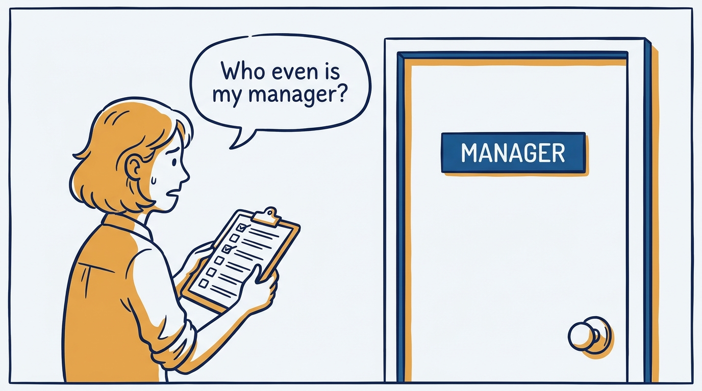
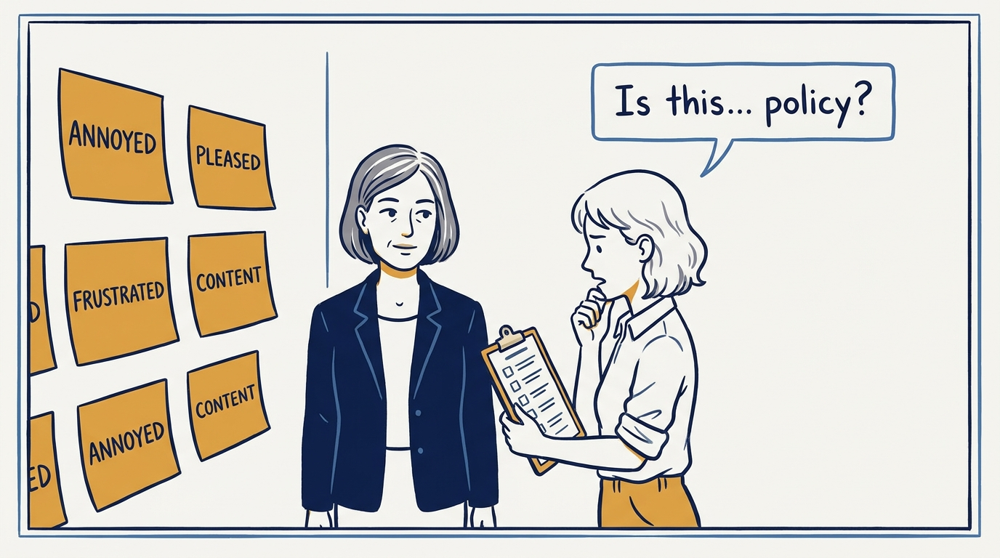
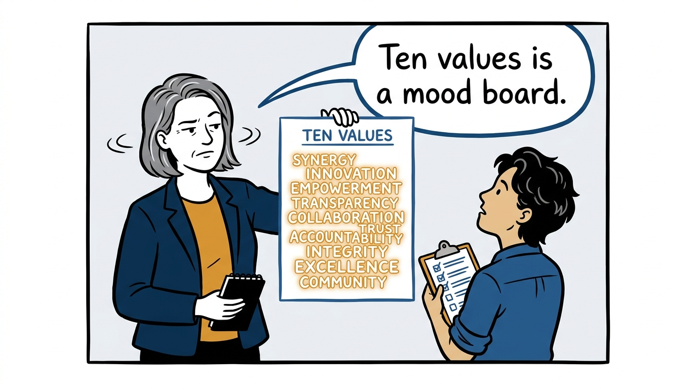
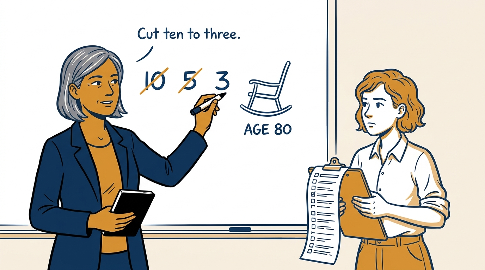
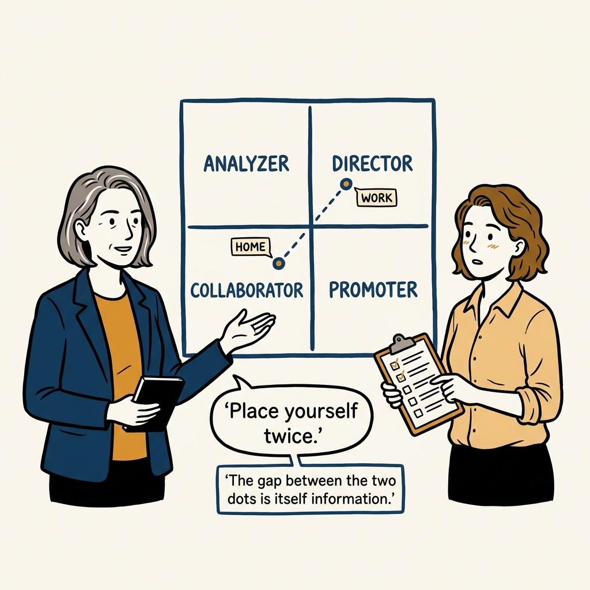
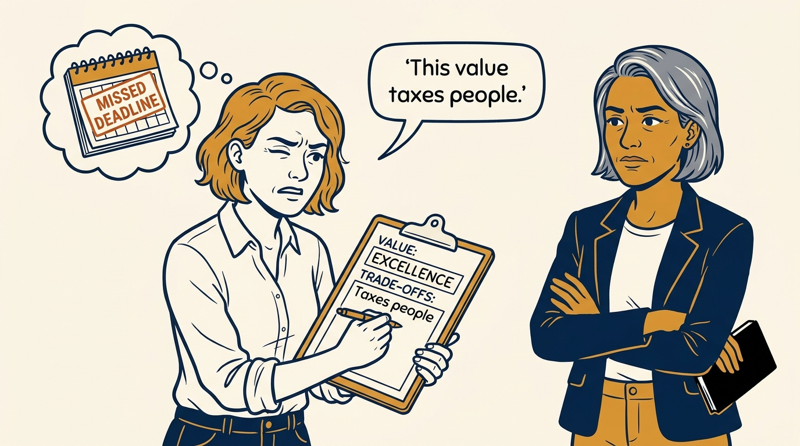
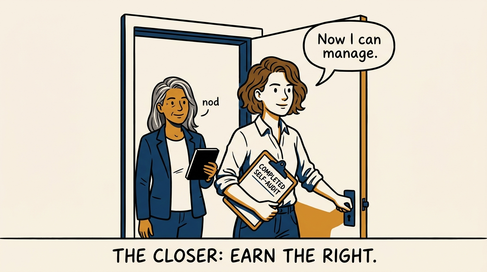

Management quality is downstream of self-awareness — the first tool I run on myself, in eight panels.

<!-- comic-style
{
  "cast": "VERA: a calm, seasoned executive, short gray-streaked hair, dark blazer over a plain t-shirt, carries a small black notebook. NOA: an earnest first-time people manager, short wavy hair, rolled-up shirt sleeves, carries a clipboard with a long checklist.",
  "style": "Clean two-tone explainer comic, thick ink outlines, flat colors with deep blue and amber accents on a light background, generous white space, hand-lettered speech bubbles with SHORT readable text, no photorealism."
}
-->

**Panel 1:** *A manager who has not written down who they are is asking people to work for a stranger.*

**Panel 2:** *An unexamined filter isn't neutral — the team experiences it as policy.*

**Panel 3:** *Ten flattering words is a mood board, not self-awareness.*

**Panel 4:** *Imagine yourself at 80, list ten values that gave that life meaning, narrow to five, then three.*

**Panel 5:** *The worksheet has four columns: value, activities, positive outcomes, and trade-offs.*

**Panel 6:** *Analyzer, Director, Collaborator, Promoter — placed once at home, once at work. The gap is the signal.*

**Panel 7:** *Every value taxes someone. Writing the tax down is the cost — and the point.*

**Panel 8:** *Only after the written self-audit do I earn the right to manage anyone else's.*
