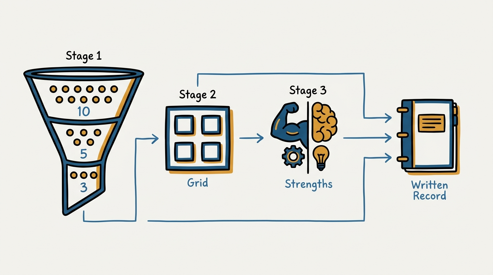
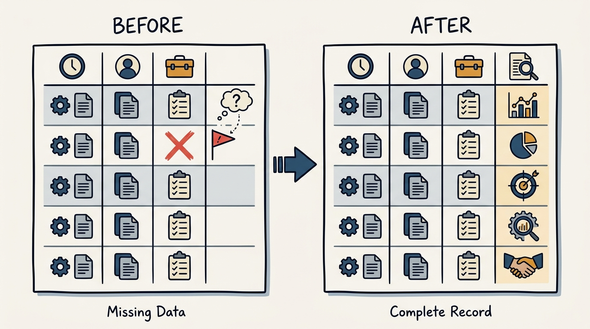
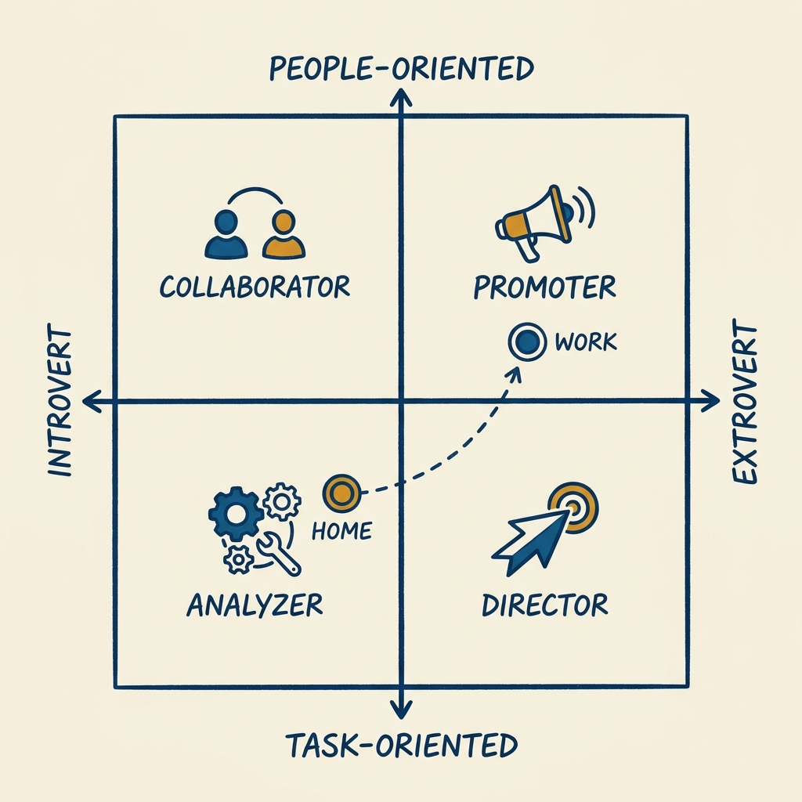

> **Status**: DRAFT
>
> **Principle**: Management quality is downstream of self-awareness, so I do this work on myself first, in writing, before I ask anyone to accept my management. I know my three core values — narrowed from ten, not picked to flatter — and I have written down not only the good work they produce but the trade-offs they cost the people around me. I know where I sit on the introvert–extrovert and task–people axes, at home and at work, and which strengths of mine are innate versus acquired. Only after that written self-audit do I earn the right to manage anyone else's.

## Statement

My operating model for self-awareness has five parts:

- **I do the work on myself first.** Every tool in this journal — charters, reviews, feedback, hiring — assumes a manager who knows what they value, how they work, and where they are strong. I run these exercises on myself before I point any instrument at my team, and I redo them when my role changes.
- **I narrow my values until they hurt.** Using the six-step exercise the workbook adapts from Stan Slap, I imagine myself at 80 reflecting on my career, list the ten values represented in that fulfilled life, cut to five, then to three. Ten values is a mood board; three is an identity.
- **I write the trade-offs, not just the virtues.** For each core value I record the work activities it drives, the positive outcomes it produces, *and* what it costs — valuing excellence means high-quality work, and it also means missed deadlines and trouble sacrificing quality when the situation warrants it. A values list without the trade-offs column is self-marketing.
- **I place my work style honestly on the 2×2.** Introvert–extrovert on one axis, task-oriented–people-oriented on the other: Analyzer, Director, Collaborator, Promoter. I place myself twice — at-home preferences and at-work behavior — because the gap between the two placements is itself information about the energy my job costs me.
- **I split my strengths into innate and acquired.** For each strength I separate the skills and capabilities I was born with from the ones I built. What is innate I can lean on anywhere; what is acquired tells me — and the people I coach — that the rest can be built too.

**Figure 1:** *The self-awareness tool has one shape: narrow the values, place the work style, split the strengths — and write all of it down.*

## How to Read This

This journal is my people-management toolkit: first-person records, each one grounded in a named tool from the companion workbooks to Claire Hughes Johnson's *Scaling People* (Stripe Press, 2023), read through a practitioner-executive lens. This record covers the Chapter 1 self-awareness exercises — "Understand Your Values" (adapted from an exercise by Stan Slap), the values worksheet, the articulate-your-values template, the work-style grid, and "Identify your strengths." The workbook offers them to any reader; I read them as the entry ticket to managing people in my organization, starting with me. The runnable tool lives in the **Checklist** tab of this post.

## Rationale

**Everything I do as a manager is filtered through who I am, so the filter must be documented.** My values decide what I praise and what I quietly deprioritize; my work style decides which meetings energize me and which people I unconsciously avoid; my strengths decide what I model well and what I model badly. If I have not examined the filter, my team experiences my unexamined preferences as policy. The workbook's move is to make the filter explicit and written — and writing is the operative word, because a value I cannot put in a worksheet row is a value I do not actually hold.

**The narrowing is the exercise.** The six steps are deliberate: imagine myself at 80 asking what in my work life gave me fulfillment and meaning, write down the ten core values represented in that life, narrow to five, then to three. Anyone can hold ten values; the list only becomes true when I am forced to cut seven of them. The 80-year-old framing matters too — it asks what gave my life meaning, not what looks good on a slide this quarter. The three values that survive that cut are the ones my team is already living with, whether I have named them or not.

**The trade-offs column is where self-awareness starts.** The workbook's sixth step is the one most managers skip: after recording each value's activities and positive outcomes, reflect on the trade-offs. Excellence delivers high-quality work — and often misses deadlines, and struggles to sacrifice quality even when a specific situation warrants it. Every value I hold taxes someone on my team. Writing the tax down is the difference between self-awareness and self-congratulation, and it is what makes the later conversation — "here is what working with me costs, and here is what you get for it" — honest rather than performative.

**Figure 2:** *A values worksheet with only activities and outcomes is self-marketing. The fourth column, trade-offs, is what makes it self-awareness.*

**Values become usable when they carry a story.** The articulate-your-values template forces three columns per value: the value, why it matters to me, and an example story of it appearing in my life — the workbook's own example is a person who valued impact and skipped law school after realizing business leaders had more influence on economic well-being and policy. The why makes the value mine rather than borrowed; the story makes it verifiable. A value I can name but not narrate is an aspiration, not a value — and stories are what a team can actually remember and test me against.

**Work style and strengths tell me what my management will feel like to others.** The 2×2 — Analyzer (introvert, task-oriented), Director (extrovert, task-oriented), Collaborator (introvert, people-oriented), Promoter (extrovert, people-oriented) — is not a personality verdict; it is a prediction of my defaults under load, and the at-home versus at-work placement shows me where I am spending energy to act against type. The strengths exercise completes the picture: for each strength, which skills and capabilities are innate and which are acquired. Communication as a strength decomposes into innate skills like listening well and acquired ones like public speaking and memo writing. That decomposition keeps me humble about what was given and precise about what can be taught.

**Figure 3:** *The same person, placed twice. The gap between the home marker and the work marker is itself information.*

**A team that shares this work finds its mission.** The workbook notes the values worksheet also runs as a group exercise: each person shares their three key values and the stories behind them in small groups, and the team homes in on the three values it shares — which can become the team's mission. Self-awareness scales: the same instrument that keeps me honest as an individual gives a leadership team a vocabulary for what it collectively refuses to trade away.

## What This Means in Practice

| What this record says | What it does **not** say |
| --- | --- |
| I narrow my values to three and can defend each cut. | Three values are permanent — I redo the exercise when life or role changes the answer at 80. |
| Every value gets a trade-offs entry, written down. | My trade-offs are excuses — naming a cost is the start of managing it, not a license to bill it to my team. |
| I place my work style on the 2×2, at home and at work. | The quadrant is my ceiling — Analyzer, Director, Collaborator, Promoter are defaults to manage, not boxes to live in. |
| I split strengths into innate and acquired. | Innate means untouchable — the acquired column is proof that most of the job can be learned. |
| The exercises can run as a team to find shared values. | I impose my three values on the team — shared values are discovered in the group exercise, not decreed. |
| This written self-work precedes managing anyone. | The write-up is public in full — what I publish is the digest ([[working-with-me]]); the raw worksheets are mine. |

## Anti-Patterns

- **The aspirational values list.** Ten flattering words chosen for how they sound in a town hall, none of which survive the cut to three or come with a story. Values selected for the audience are branding, not self-awareness.
- **The missing trade-offs column.** Positive outcomes lovingly documented, costs omitted. The manager who cannot name what their excellence or drive costs the team has done half the exercise and kept the flattering half.
- **The unexamined filter.** Managing for years on undocumented preferences and calling the result "my style." The team pays the tuition for every insight the manager never wrote down.
- **The quadrant as identity.** "I'm a Director, deal with it" — using the 2×2 as a permission slip instead of a map of defaults to compensate for. The grid predicts my failure modes precisely so I can manage them.
- **Skipping the at-home placement.** Only mapping the work self and missing the gap between the two placements — the clearest written signal of where the role is draining energy and where burnout will come from.
- **Doing it once, at promotion.** Treating self-awareness as an onboarding form rather than a living record. The answers at 80 change as I do; a five-year-old worksheet describes a manager who no longer exists.

## Related Records

- [[management-prerequisites]] — the gate this record feeds: the self-work here is part of what qualifies anyone, including me, to manage.
- [[working-with-me]] — the published digest of this private work; colleagues get the user guide, this record is the source material.
- [[operating-principles]] — my management principles; they are only honest because the values and trade-offs here were written first.
- [[career-conversations]] — the same 80-year-old, values-first lens turned toward the people I manage.
- [[organizational-values]] — the engineering-executive record on values for an organization; the team version of this worksheet is where the two meet.
- [[leadership-styles]] — the engineering-executive record on flexing between styles; the 2×2 here tells me which flexes cost me energy.

## Scope and Revisiting

This record is `draft`. It governs the written self-awareness work I maintain on myself — values with trade-offs, work-style placement, strengths breakdown — and the group form of the values exercise I run with leadership teams. I will revise it when I redo the exercises after a significant role change and the outputs shift, when running the team version surfaces a mechanic the record misses, or when a report's feedback shows my written self-assessment and my observed behavior have drifted apart.

## Authoritative References

- Claire Hughes Johnson, *Scaling People: Tactics for Management and Company Building* (Stripe Press, 2023) — the companion workbooks, Chapter 1 exercises and templates this record is grounded in.
- Stan Slap, *Bury My Heart at Conference Room B* — the values exercise the workbook adapts, and the full list of 50 example values the workbook samples.
