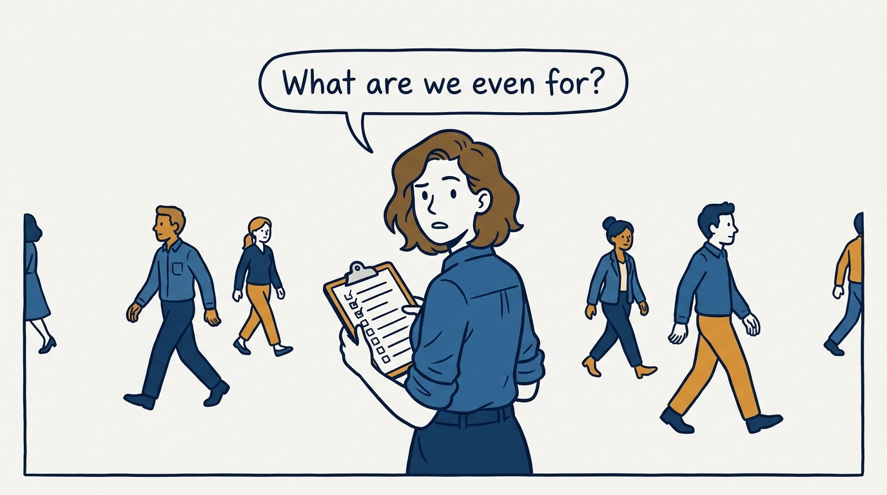
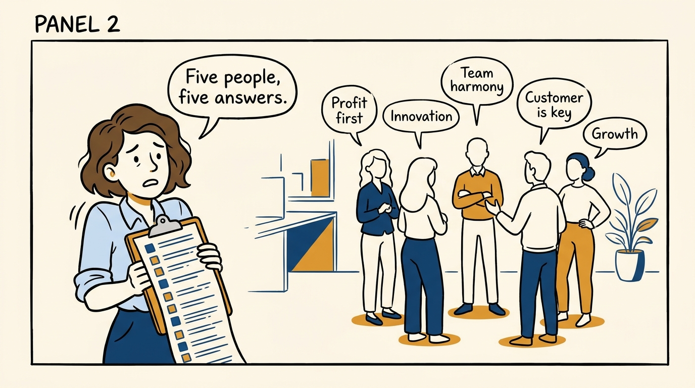
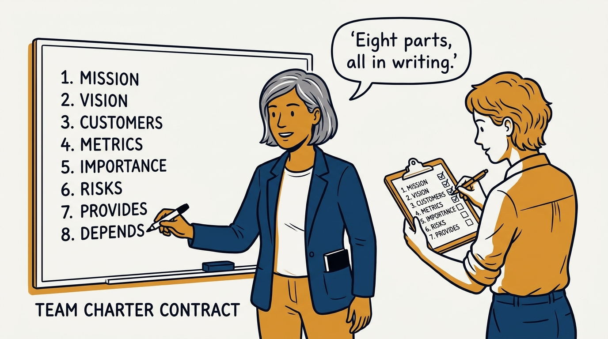
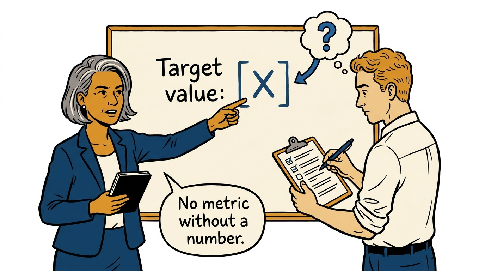
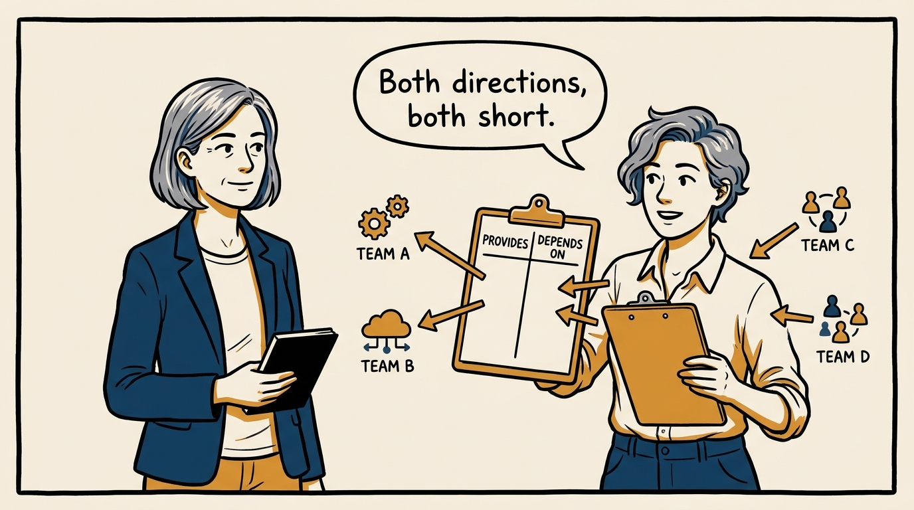
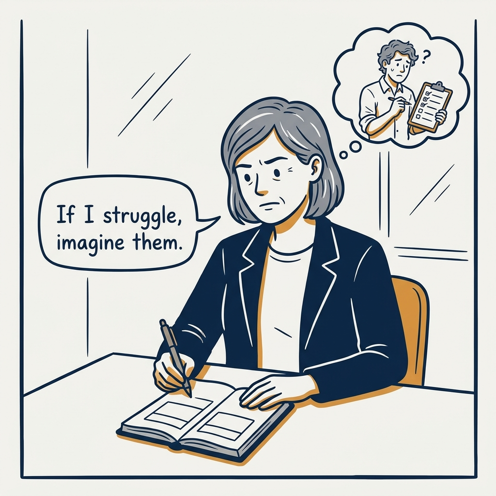
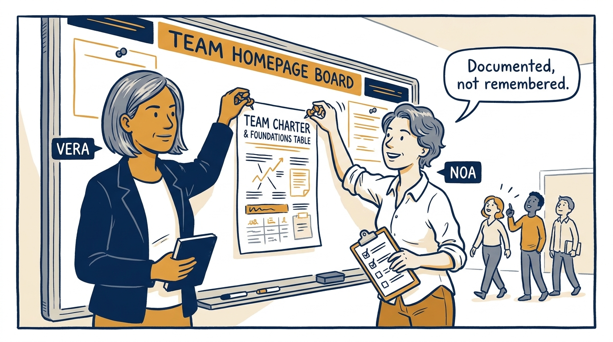

A written charter is the price of running a team, not optional paperwork — in eight panels.

<!-- comic-style
{
  "cast": "VERA: a calm, seasoned executive, short gray-streaked hair, dark blazer over a plain t-shirt, carries a small black notebook. NOA: an earnest first-time people manager, short wavy hair, rolled-up shirt sleeves, carries a clipboard with a long checklist.",
  "style": "Clean two-tone explainer comic, thick ink outlines, flat colors with deep blue and amber accents on a light background, generous white space, hand-lettered speech bubbles with SHORT readable text, no photorealism."
}
-->

**Panel 1:** *The hook: an unchartered team drifts in five directions at once.*

**Panel 2:** *The problem: ask five people what the team is for and get five different answers.*

**Panel 3:** *The wrong way: a charter written once and never revisited is already stale.*

**Panel 4:** *The tool: an eight-section charter, written down before the team runs on assumptions.*

**Panel 5:** *How it runs: a metric without a target value is decoration, not a commitment.*

**Panel 6:** *The mechanic: interfaces declared both ways turn hidden coupling into visible risk.*

**Panel 7:** *The cost: trouble filling in the table means the operating system isn't documented at all.*

**Panel 8:** *The closer: a charter is only real once it is documented and findable, not remembered.*
