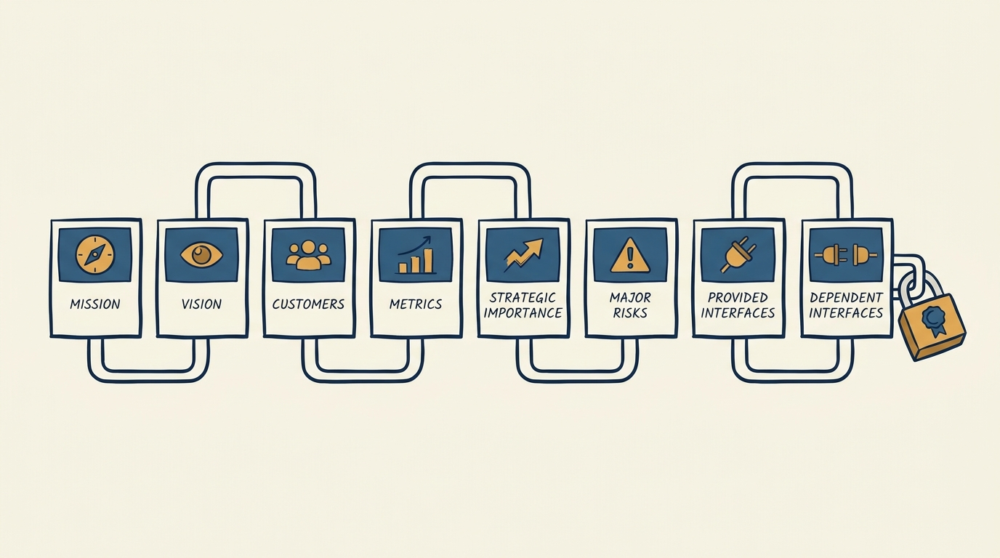
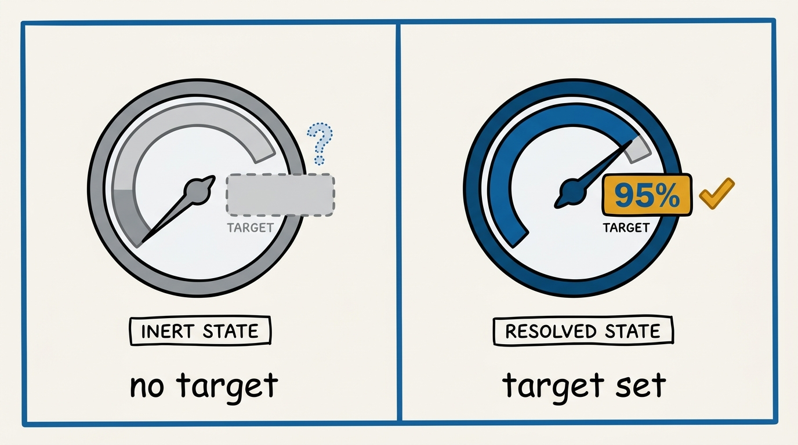
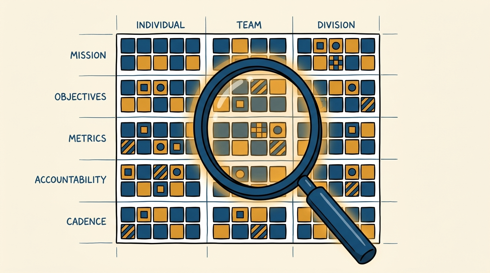

> **Status**: DRAFT
>
> **Principle**: Every team I run has a written charter answering who it serves, what it owes, and what it depends on. The charter is not a slide for a kickoff — it is a living contract with eight fixed parts: mission, vision, named customers, metrics with target values, strategic importance, major risks, what the team provides to others, and what the team depends on from others. My operating system is only real if I can fill in the same information — mission, objectives with an owner, key metrics, accountability mechanisms, operating cadence — for an individual, a team, and a division from documentation alone, not from memory.

## Statement

My operating model for team definition has five parts:

- **Every team writes a charter before it is staffed or tasked.** Mission, vision, customers, metrics, strategic importance, major risks, provided interfaces, dependent interfaces — all eight sections, in writing, before I let a team run on assumptions.
- **Mission and vision are two different sentences.** The mission is what the team does, stated plainly enough to fit a sentence or two. The vision is the future state the team is building toward, including the trade-offs it accepts and the "table stakes" it commits to regardless.
- **Customers are named, not implied.** A charter lists who the team is responsible for and what it protects on their behalf — as concrete bullets, not a vague "our users."
- **Every metric carries a target, not just a name.** A metric without a target value is an observation, not a commitment. Each one states what it measures and the number the team is accountable to.
- **Interfaces are declared in both directions.** What the team provides to the rest of the organization, and what it depends on from others, are both written down — so a break on either side is a known risk, not a surprise.

**Figure 1:** *The charter has eight fixed sections, written down as one contract before a team runs on assumptions.*

## How to Read This

This journal is my people-management toolkit, grounded in the companion workbooks to Claire Hughes Johnson's *Scaling People: Tactics for Management and Company Building* (Stripe Press, 2023), read through a practitioner-executive lens. This record is grounded in two tools from Chapter 2 of the workbooks: the eight-section **Team Charter** template and the **Organizational Foundations** self-test. The runnable versions of both — the charter template with its worked dashboard-account-security example, and the individual/team/division foundations table — live in the **Checklist** tab.

## Rationale

**A team without a written mission drifts by default.** Ask five people on an unchartered team what the team is for and I expect five different answers, each defensible, none identical. The workbook's worked example is instructive precisely because it is boring: "provide best-in-class security to all of our users and their accounts on the dashboard" is one sentence, unambiguous, and covers both authentication and authorization. A mission this plain is worth writing down exactly because it forecloses drift — there is no room for five interpretations of one sentence.

**Vision is where trade-offs get decided in advance, not in the moment.** The example vision does something a mission cannot: it states what the team accepts it will never fully solve ("we won't ever be able to get [account takeovers] to zero") alongside what it commits to unconditionally regardless of resourcing ("table-stakes security features"). Writing the acceptable failure mode down before an incident forces the trade-off conversation into a calm room instead of a war room. A team that discovers its own risk tolerance mid-crisis has skipped a step it needed.

**A target value is what turns a tracked number into an argument the team can lose.** The workbook's metrics section has a fixed shape for a reason: each metric names what it measures — the number of accounts that experienced a takeover in a given month, account-takeover losses, percentage of users on two-factor authentication — and then a target value. Three lines, each ending in "Target value: [X]," is the whole discipline, and the reason it matters is accountability, not tidiness: a number with no target can never be wrong, so no one on the team can ever be held to it. I do not accept a charter missing the "[X]."

**Figure 2:** *A metric without a target value is a dashboard; the same metric with a target is a commitment.*

**Interfaces declared in both directions turn hidden coupling into visible risk.** The provided-interfaces list (login code, 2FA infrastructure, session infrastructure, account recovery flow) tells every other team what they can build on. The dependent-interfaces list (user registration UI, the verification service, the email team) tells my team what it cannot control alone. Both lists are short — six and three items, respectively, in the worked example — and that brevity is the point: if either list needs twenty bullets to be honest, the team's boundaries are wrong before its charter is even finished. Undeclared dependencies are the ones that break silently.

**The foundations table is the charter's own audit, run at three altitudes.** The Organizational Foundations self-test asks for the same five rows — mission, objectives with an owner (a DRI), key metrics, accountability mechanisms, operating cadence — at three levels: an individual report, a team, a division. The workbook's own instruction is the sharpest line in the source material: **"if you're having trouble filling out this template, imagine how your teams and reports must feel."** My own difficulty completing the table is diagnostic, not incidental — it means the operating system I believe exists is not actually documented anywhere, which means it does not actually exist for the people below me.

**Figure 3:** *The foundations self-test audits the same five rows at three altitudes: individual, team, division.*

## What This Means in Practice

| What this record says | What it does **not** say |
| --- | --- |
| Every team has an eight-section written charter before it operates. | The charter is a one-time onboarding document — it is revisited as the team's scope shifts. |
| Every metric carries a target value, not just a label. | Metrics are the whole of accountability — targets feed the QBR cadence, they do not replace it. |
| Provided and dependent interfaces are both declared explicitly. | Declaring a dependency transfers the risk — it surfaces the risk; the team still owns its exposure to it. |
| The foundations table spans individual, team, and division. | The table is only for the division level — an individual report deserves the same clarity a division gets. |
| Foundations must be documented and findable on internal homepages. | Documentation is a wiki page nobody visits — it lives where the team and its reports actually look. |
| My own difficulty filling the table in is a signal to act on. | Struggling to complete the table is a private embarrassment to paper over quietly. |

Concretely: every team I run can produce its charter on request, in writing, with all eight sections filled in — including target values on every metric. I can fill in the foundations table for any of my direct reports, for any team, and for the division, from what is published on our internal homepages — not from what I happen to remember about that team this quarter.

## Anti-Patterns

- **The charter that exists only in the founder's head.** Mission and customers are "obvious to everyone" until someone new joins and nobody can articulate them consistently.
- **Metrics without targets.** A tracked number with no target value is a vanity dashboard — it cannot tell anyone whether the team is succeeding.
- **Vision as marketing copy.** A vision statement that promises everything and accepts no trade-off is not a vision — it is an aspiration with no teeth.
- **Silent dependencies.** A team that never wrote down what it depends on discovers the dependency the day it breaks, at the worst possible time.
- **The foundations table nobody can fill in.** If I cannot produce mission, objectives, metrics, accountability, and cadence for a team from documentation, the operating system I think I run is fictional.
- **Documentation that exists but cannot be found.** A charter buried three folders deep in a wiki no one navigates to is functionally undocumented.

## Related Records

- [[writing-okrs]] — objectives and key results ladder from the charter's mission and metrics; the charter is the durable identity, OKRs are the season's commitments against it.
- [[quarterly-business-reviews]] — the cadence where a charter's metrics, risks, and interfaces get inspected against reality on a recurring schedule.
- [[operating-principles]] — how I personally operate; the charter is how a team declares what it is, at a level above any one person's habits.
- [[management-prerequisites]] — the baseline competencies a manager needs before running a team; writing and maintaining a charter is one of the concrete duties that baseline enables.
- [[organizational-values]] — the engineering-journal record on company-wide values; a team charter's mission and vision must not contradict them.
- [[measuring-engineering-organizations]] — the engineering-journal record on organizational metrics; the charter's metrics section is where that discipline starts at team scope.

## Scope and Revisiting

This record is `draft`. It governs how I require every team I run to declare its mission, vision, customers, metrics, strategic importance, risks, and interfaces, and how I audit the resulting operating system with the foundations table. I revisit it whenever a team's scope changes enough that its charter no longer matches reality, whenever I cannot complete the foundations table for a team without guessing, or whenever a documented interface turns out to have been wrong.

## Authoritative References

- Claire Hughes Johnson, *Scaling People: Tactics for Management and Company Building* (Stripe Press, 2023) — the companion workbooks, Chapter 2: the Team Charter template and the Organizational Foundations self-test this record distills.
