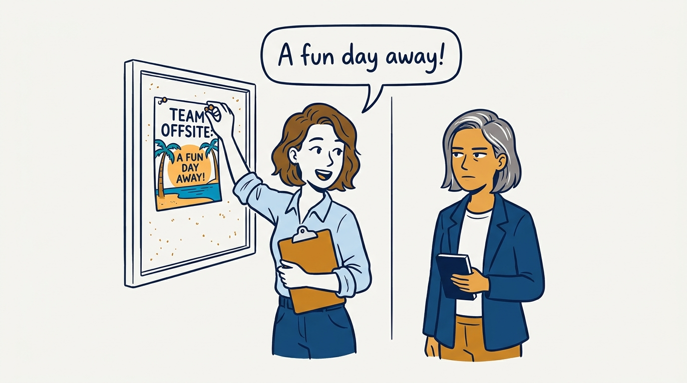
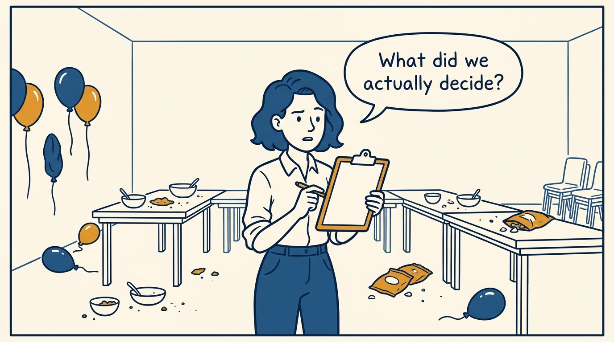
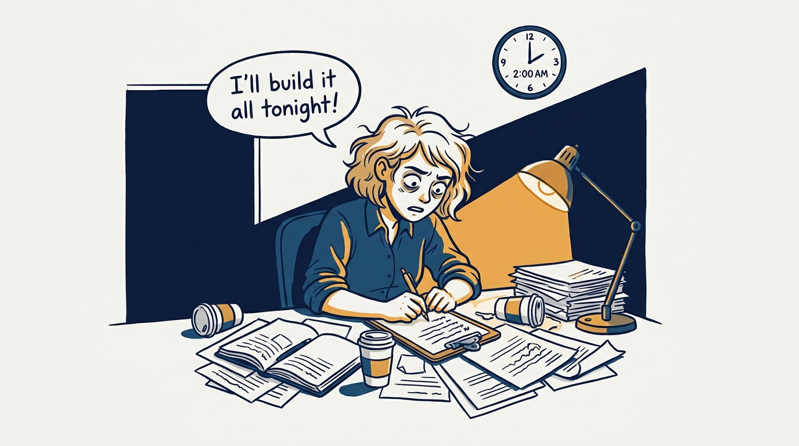
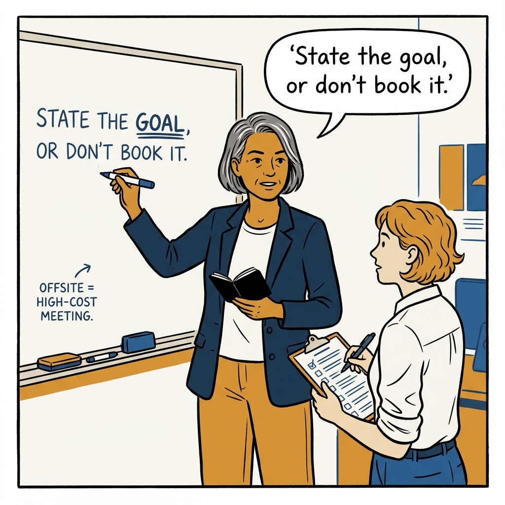
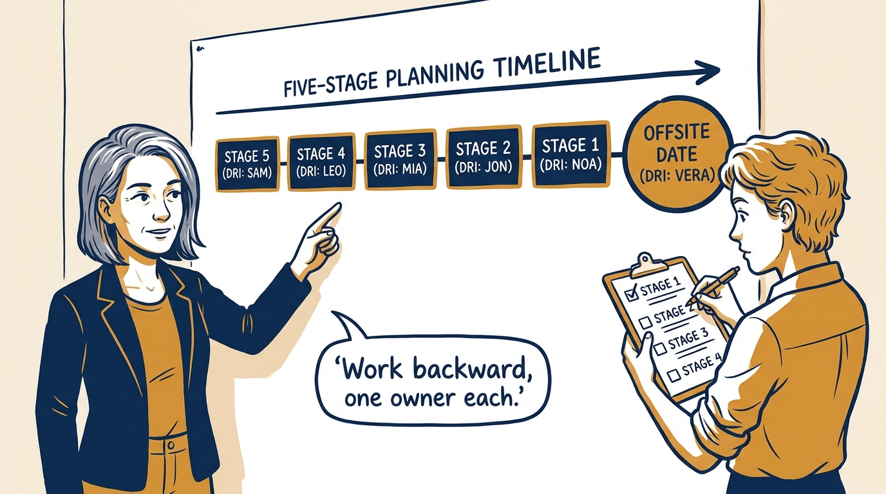
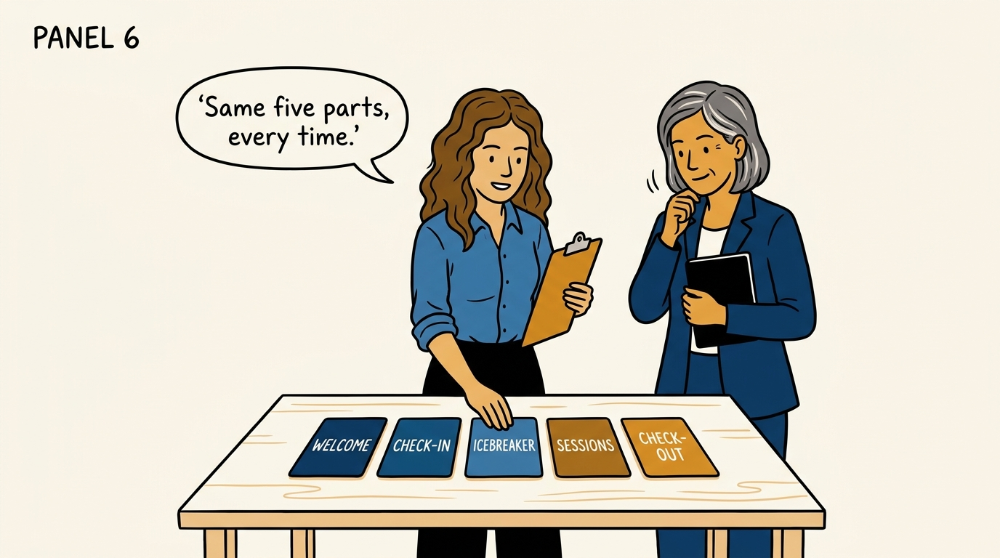
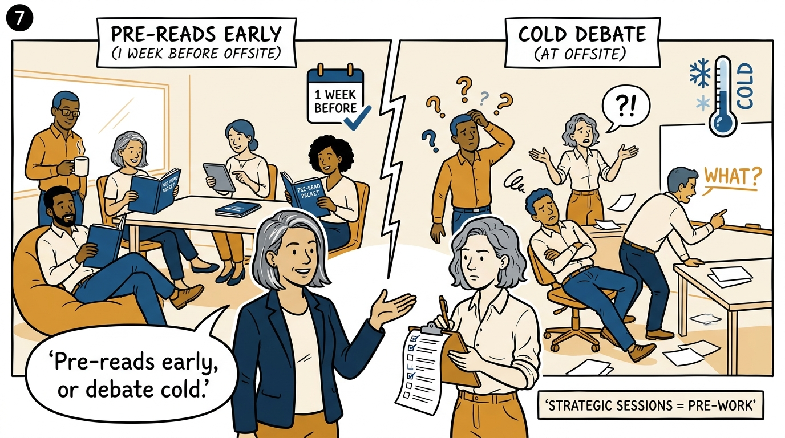
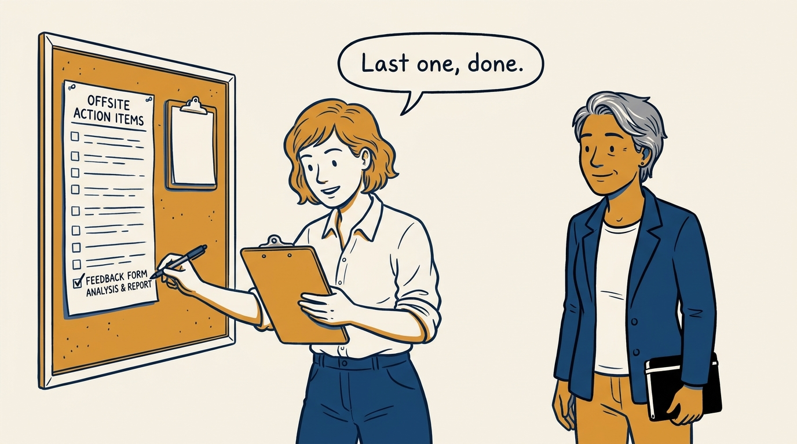

An offsite is a high-cost meeting, not a reward — in eight panels.

<!-- comic-style
{
  "cast": "VERA: a calm, seasoned executive, short gray-streaked hair, dark blazer over a plain t-shirt, carries a small black notebook. NOA: an earnest first-time people manager, short wavy hair, rolled-up shirt sleeves, carries a clipboard with a long checklist.",
  "style": "Clean two-tone explainer comic, thick ink outlines, flat colors with deep blue and amber accents on a light background, generous white space, hand-lettered speech bubbles with SHORT readable text, no photorealism."
}
-->

**Panel 1:** *The hook: a change of scenery is not a reason to book a room.*

**Panel 2:** *The problem: a day off produces nothing durable without a stated goal.*

**Panel 3:** *The wrong way: a rushed, one-person agenda with no one else invested.*

**Panel 4:** *The principle: an offsite earns its cost or it does not happen.*

**Panel 5:** *How it runs: five stages counting back from the date, each with a named owner.*

**Panel 6:** *The mechanic: welcome, check-in, icebreaker, sessions, check-out — never skipped.*

**Panel 7:** *The cost: skip the pre-reads and the room debates strategy cold.*

**Panel 8:** *The closer: tracked to complete — the day was never the point.*
