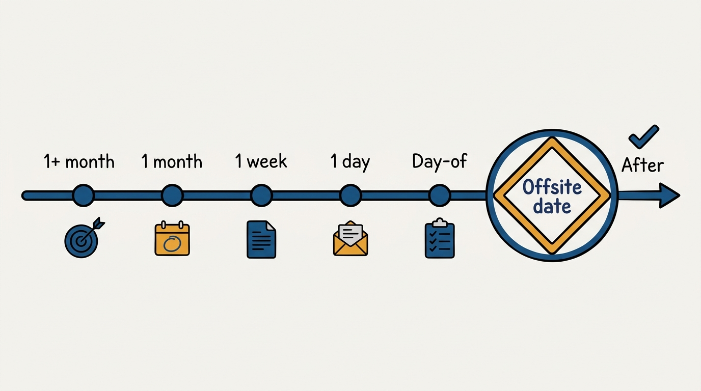
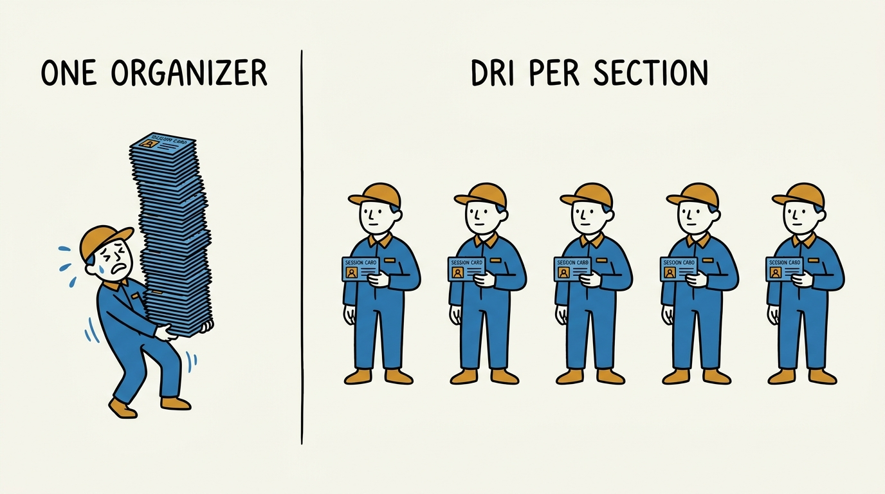
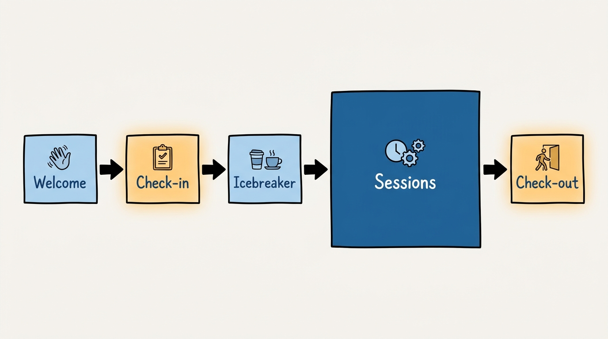

> **Status**: DRAFT
>
> **Principle**: I treat a team offsite as a high-cost meeting: a full day, sometimes more, pulled off every attendee's calendar and often paid for in travel and venue as well as time. A meeting that expensive gets a goal, a date set a month or more out, an agenda with a named owner per section, pre-work sent ahead, and tracked action items after — or it does not happen. The five-stage planning timeline and the five-part day structure are not bureaucracy on top of the offsite; they are what makes "we had a great offsite" a reproducible outcome instead of a lucky one.

## Statement

My operating model for team offsites has five parts:

- **An offsite earns its cost or it does not happen.** Before I book a room, I can state the goal in a sentence. No goal, no offsite — a day off is a perk; a day off with a stated purpose is an offsite.
- **The timeline runs backward from the date, in five stages.** 1+ month before, 1 month before, 1 week before, 1 day before, and the day itself each have a fixed set of deliverables. I do not compress them under time pressure — I move the date instead.
- **Every agenda section has a named owner.** Each session gets a DRI assigned at the 1-month mark, not improvised on the day. The DRI runs their section and owns its pre-work.
- **The day has one fixed shape: welcome, check-in, icebreaker, sessions, check-out.** I do not skip the check-in or the check-out to fit in one more session — they are where the room's energy and its takeaways actually get managed.
- **Nothing closes without follow-through.** Every offsite ends with a feedback form and a set of action items tracked to their assigned DRIs until complete. An offsite that produces no action items produced nothing durable.

**Figure 1:** *The planning timeline runs backward from the date, in five fixed stages, plus follow-through after.*

## How to Read This

This journal is my people-management toolkit, grounded in the companion workbooks to Claire Hughes Johnson's *Scaling People: Tactics for Management and Company Building* (Stripe Press, 2023), read through a practitioner-executive lens. This record is grounded in the workbooks' Chapter 4 tool, "Planning and Running Your Offsite" — the planning checklist, the day-of-offsite templates, and the worked agenda example. The runnable versions of all three — the full backward-running timeline, the welcome-email template, and the sample agenda table with time, length, and facilitator columns — live in the **Checklist** tab.

## Rationale

**An offsite is one of the most expensive meetings I ever hold.** Every attendee loses a full day of individual work, often more once travel is counted, and the organization often pays for venue, food, and materials on top of that. I judge an offsite by the same test I judge any expensive meeting by: does the value produced exceed the cost paid? A day away that produces good feelings and no decisions has failed that test regardless of how well-catered the lunch was. Stating the goal before I book the room is what keeps me honest about that test — if I cannot write the goal in a sentence, I am not ready to spend the day.

**The five-stage timeline is what turns "let's do an offsite" into a plan.** Working backward from the date — 1+ month, 1 month, 1 week, 1 day, day-of, after — each stage has a small, fixed set of deliverables: goals and a date first; food, a finalized agenda, and a DRI per section at the month mark; finalized materials, a full run-through with DRIs, and the agenda and pre-reads sent to the team at the week mark; a welcome email and supplies the day before. Compressing these stages under time pressure is where offsites fail quietly — an agenda finalized the night before has no DRI who has actually rehearsed it, and a team that receives pre-reads the morning of the offsite has not actually read them. When I am tempted to compress the timeline, I move the date instead.

**A DRI per section is the single mechanic that prevents an offsite from becoming one person's monologue.** The worked agenda example assigns a different facilitator to nearly every session — a check-in owner, a work-style-assessment owner, a results-retrospective owner, a strategic-pillars owner, a goals-and-DRIs owner, a wrap-up owner. Distributing ownership does two things at once: it spreads the preparation burden so no single person is building the entire day alone, and it gives the team visible proof that more than one person is invested in the day succeeding. A session with no named owner is the session most likely to run long, wander, or get cut.

**Figure 2:** *A named DRI per section spreads the load and proves more than one person is invested in the day.*

**Pre-work distributed in advance is what makes the strategic sessions actually work.** The worked agenda flags one session explicitly — "decide on strategic pillars for this year" — with a parenthetical the workbook does not treat as optional: pre-reads required. A room cannot debate strategic pillars cold in an hour; it can debate them productively if everyone arrived having already read the material. The same logic runs through the whole timeline: pre-work templates go to DRIs at the month mark so they have three weeks to prepare, and pre-reads go to the full team a week out so nobody opens the agenda for the first time at 9:30 a.m.

**The fixed five-part day structure exists because energy and takeaways do not manage themselves.** Welcome, check-in, icebreaker, sessions, check-out is not decoration around the "real" work in the sessions — the check-in ("share expectations for the day") sets what the room is actually there to do, the icebreaker gets a group of people who may not talk daily into a working mode together, and the check-out ("how did we do?") is where the day's value gets named out loud instead of assumed. A day that is wall-to-wall sessions with no check-in or check-out is a series of meetings stapled together, not an offsite.

**Figure 3:** *The day has one fixed shape — check-in and check-out are not padding around the sessions, they manage the room's energy and takeaways.*

**The close is where most of the value either gets captured or evaporates.** Notes and action items go to their assigned DRIs, a feedback form goes to every participant asking them to rate the offsite, and action items are tracked until complete — not until the next Monday's enthusiasm fades. An offsite with no tracked action items afterward produced a good day and nothing else; the day itself was never the point.

## What This Means in Practice

| What this record says | What it does **not** say |
| --- | --- |
| An offsite needs a stated goal before it gets a date. | Any team gathering with food and a change of scenery counts as an offsite. |
| The planning timeline runs 1+ month, 1 month, 1 week, 1 day, day-of, after. | The timeline can be compressed under time pressure — compression is a signal to move the date. |
| Every agenda section has a named DRI assigned a month out. | The organizer runs every session personally — distributing ownership is the point. |
| The day always has welcome, check-in, icebreaker, sessions, check-out. | Check-in and check-out are optional if the agenda is tight — they are where energy and takeaways are managed. |
| Strategic sessions get pre-reads sent in advance. | Debating strategy cold in the room is an acceptable substitute for preparation. |
| Every offsite closes with a feedback form and tracked action items. | The offsite's value is the day itself — value is what gets tracked to completion afterward. |

Concretely: before I schedule an offsite I can state its goal in one sentence, I set the date at least a month out, and I have assigned a DRI to every agenda section by the one-month mark. Pre-reads for any strategic decision reach the team at least a week before the day. Every offsite I run ends with a feedback form sent to participants and a list of action items assigned to named DRIs, and I do not consider the offsite closed until those items are complete.

## Anti-Patterns

- **The offsite with no stated goal.** A day off-site that cannot be justified in one sentence is a perk mislabeled as a working session.
- **The rushed timeline.** Agenda finalized the week of, pre-reads sent the morning of — the team arrives unprepared and the "strategic" session becomes a first read-through instead of a decision.
- **The one-person agenda.** A single organizer builds and runs every session alone; the room experiences a monologue with breaks, not a team offsite.
- **Skipping the check-in or check-out to fit in "one more session."** The day gains content and loses the moments where expectations and takeaways actually get named.
- **Strategic decisions debated cold.** No pre-reads, no pre-work — the room spends the session getting oriented instead of deciding.
- **The offsite that ends at the wrap-up.** Notes are taken, nobody owns the action items, and three months later nothing from the day has changed.

## Related Records

- [[team-charter]] — the durable written identity a strategic offsite session (pillars, goals) can revisit or revise; the charter is what persists, the offsite is where it gets worked on.
- [[writing-okrs]] — the objectives discipline behind a "finalize goals for the quarter and DRIs" session, when an offsite includes one.
- [[meetings]] — the engineering-journal record on everyday meeting hygiene; this record is the same discipline applied to the highest-cost meeting format a team runs.
- [[gelling-your-engineering-leadership-team]] — the engineering-journal record on building leadership-team cohesion; a well-run offsite is one of the concrete mechanisms that produces it.

## Scope and Revisiting

This record is `draft`. It governs how I plan and run any team or leadership offsite: the backward-running timeline, the fixed day structure, DRI assignment per session, and the closing discipline of feedback and tracked action items. I revisit it whenever an offsite's action items go untracked past their close date, whenever a timeline stage gets compressed and the day suffers for it, or whenever the fixed day structure stops fitting the kind of offsite I am running.

## Authoritative References

- Claire Hughes Johnson, *Scaling People: Tactics for Management and Company Building* (Stripe Press, 2023) — the companion workbooks, Chapter 4: "Planning and Running Your Offsite," the tool this record distills.
