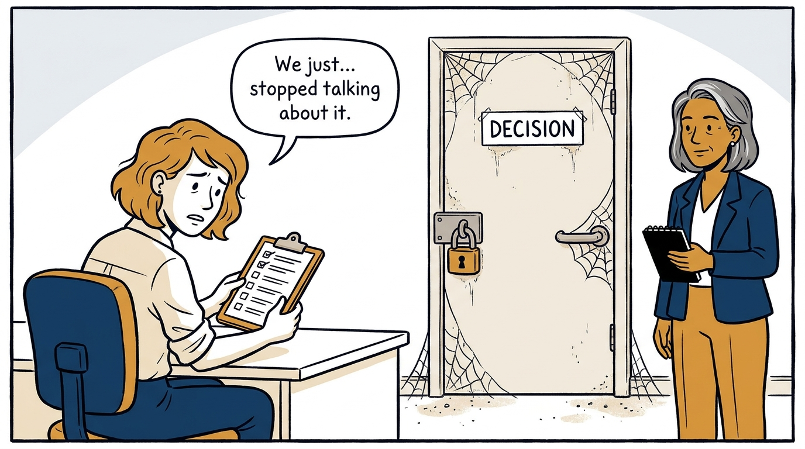
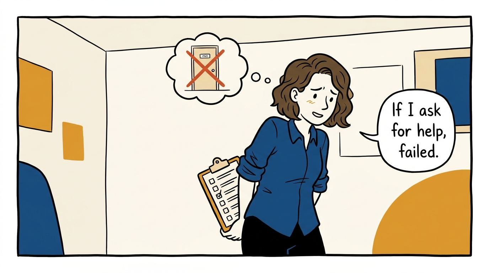
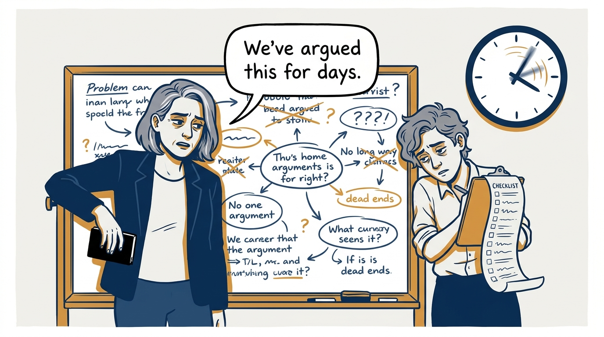
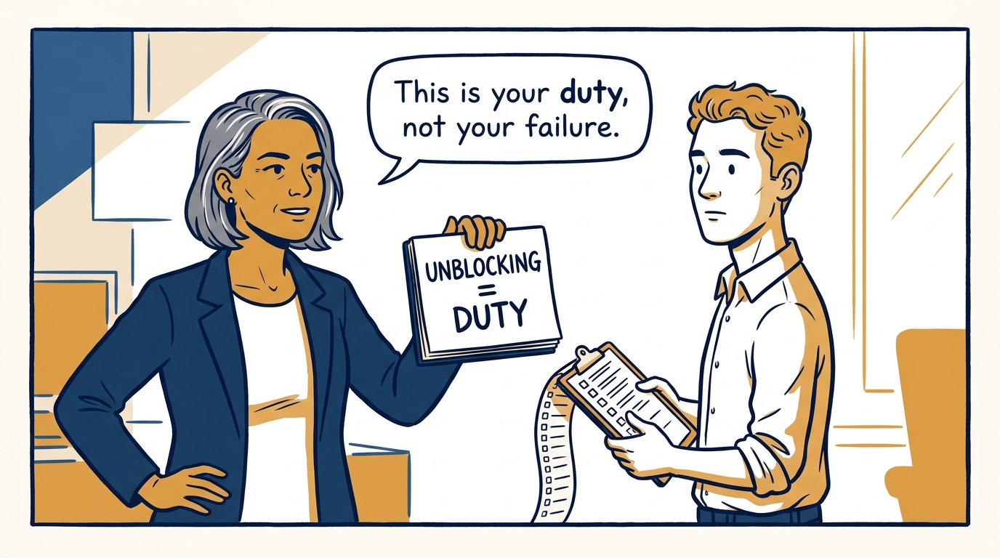
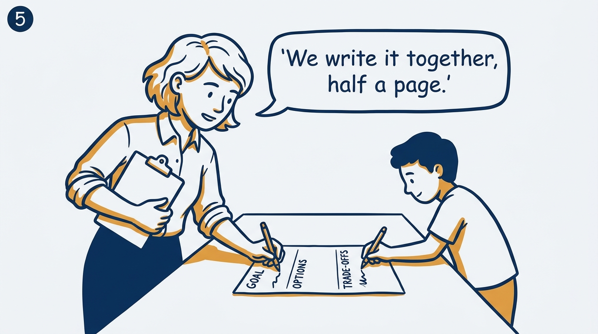
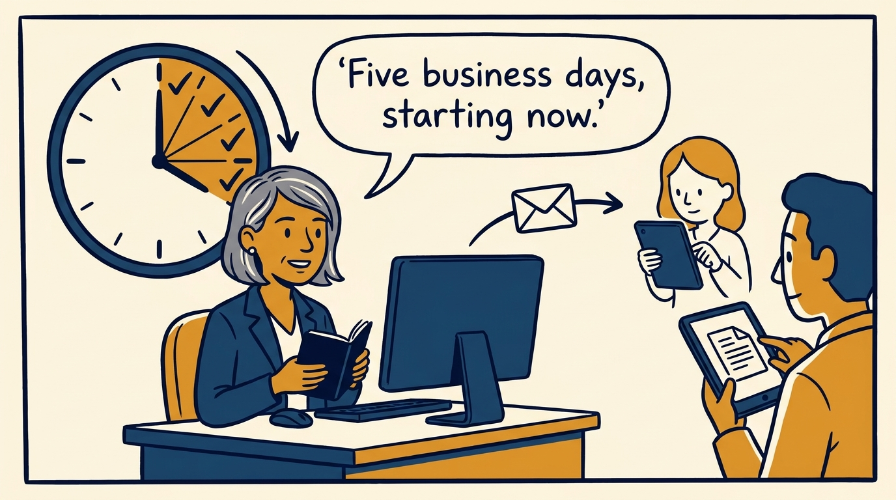
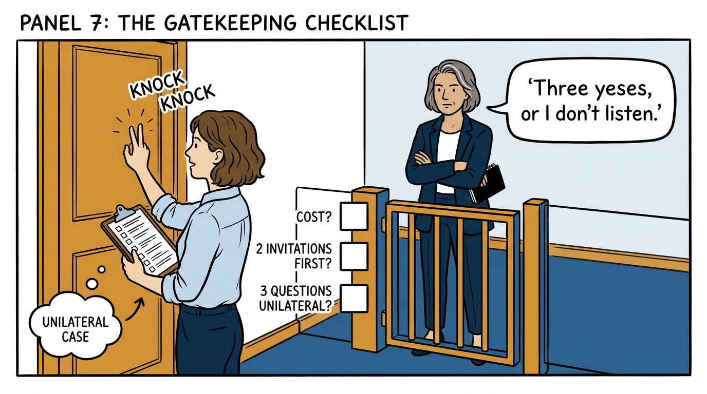
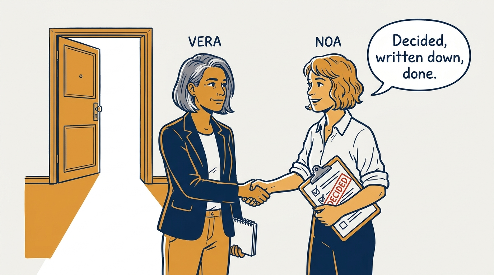

A stuck disagreement is not a personal failure to hide — it's a duty to unblock, in eight panels.

<!-- comic-style
{
  "cast": "VERA: a calm, seasoned executive, short gray-streaked hair, dark blazer over a plain t-shirt, carries a small black notebook. NOA: an earnest first-time people manager, short wavy hair, rolled-up shirt sleeves, carries a clipboard with a long checklist.",
  "style": "Clean two-tone explainer comic, thick ink outlines, flat colors with deep blue and amber accents on a light background, generous white space, hand-lettered speech bubbles with SHORT readable text, no photorealism."
}
-->

**Panel 1:** *The hook: a stuck disagreement doesn't disappear — it just goes quiet.*

**Panel 2:** *The problem: most teams treat escalating as an admission of failure.*

**Panel 3:** *The wrong way: arguing a reversible call to a standstill instead of shipping and iterating.*

**Panel 4:** *The principle: instigating the unblocking process is a duty, not a defeat.*

**Panel 5:** *How it runs: both parties co-write one half-page document — goal, options, trade-offs.*

**Panel 6:** *The mechanic: one email to both managers, a five-business-day clock starts ticking.*

**Panel 7:** *The cost: unilateral only after two invitations — and managers must run the gate before listening. Even three yeses don't end it: the manager still messages the missing colleague and invites them in.*

**Panel 8:** *The closer: a decision, written down and committed to, beats a disagreement left to rot.*
