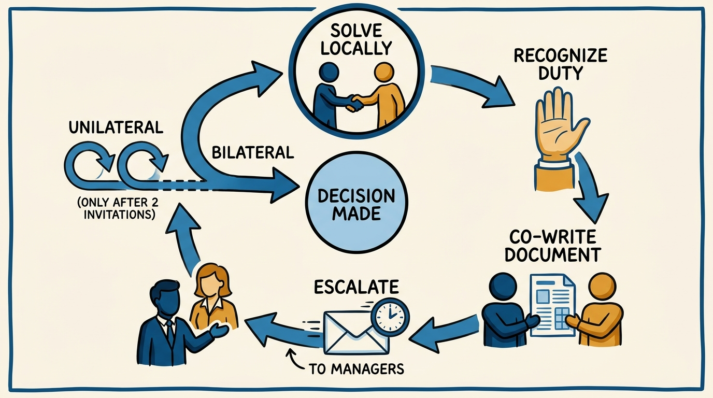
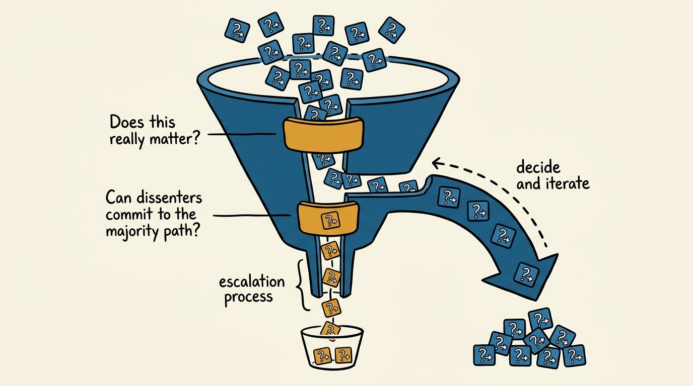
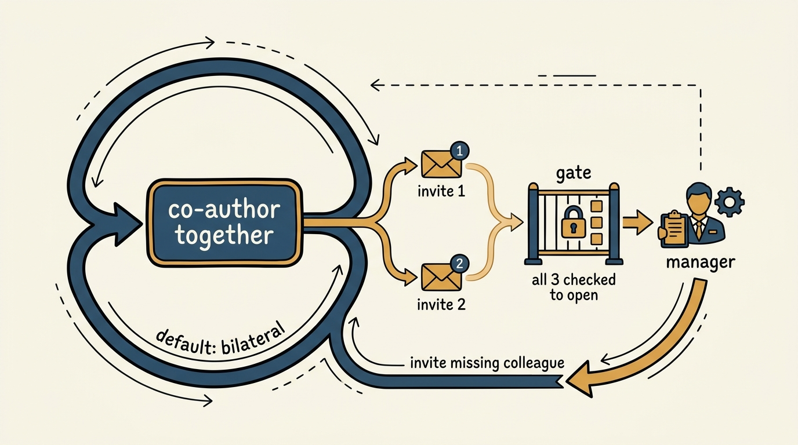

> **Status**: DRAFT
>
> **Principle**: A stuck disagreement is not a personal failure to hide — it is my duty to instigate its resolution the moment I notice it. Most decisions are reversible, so I optimize for speed and iterate rather than debate to a standstill. For the rare decision that is genuinely important, hard to reverse, and stalled after real effort, I run a fixed mechanism: a short, co-written disagreement document, escalated by email to both managers within five business days, bilateral by default and unilateral only after I have invited my counterpart twice. Slow, unclear, or unilateral decisions are the actual failure this process exists to prevent.

## Statement

My operating model for unblocking has five parts:

- **Solve locally first.** The overwhelming majority of decisions are reversible or tunable. For those, I optimize for speed: decide, ship, iterate. I ask myself two questions before escalating anything — does this really matter, and can the people doing the bulk of the work move forward on a path the dissenters can commit to, even if it isn't their first choice?
- **Escalation is a duty, not a defeat.** When a decision is genuinely important, hard to reverse, and a real disagreement has stalled after both parties tried in good faith, instigating the unblocking process is my obligation — not an admission that I failed to resolve it myself. Unblocking is not bad; slow, unclear, or bad decisions are bad.
- **Write the disagreement down, together.** The two parties co-author a short document — half a page — that frames the problem as their shared goal in the user's voice, lists the options considered, and states the trade-offs both sides agree are accurately described, flagging the ones neither side can resolve alone.
- **Escalate fast, with a clock on it.** The document goes by email to both managers (or one, if the parties share a manager), who either decide together or recursively raise it to their own managers with the doc attached — "until the stack overflows." The commitment is resolution within five business days of kicking the process off.
- **Bilateral by default; unilateral only after two invitations, and never heard unchecked.** The person who wants to escalate must invite their counterpart to co-author twice before going it alone. Any manager who receives a unilateral argument must refuse to hear it until the requester can answer yes to three questions — and even then, must invite the missing colleague back in.

**Figure 1:** *The operating model is a loop, not a ladder: solve locally, and only the rare stuck case moves through the remaining four stages.*

## How to Read This

This journal is my people-management toolkit, grounded in the companion workbooks to Claire Hughes Johnson's *Scaling People: Tactics for Management and Company Building*. This record is grounded in Stripe's Unblocking Process, a tool created by David Singleton, Stripe's CTO, read through a practitioner-executive lens: the workbook presents it as Stripe's internal mechanism for resolving decisions that individuals, groups, or teams cannot agree on despite genuinely trying; I read it as the standard I hold my organization to whenever a decision stalls, and the standard I hold myself to as the manager who eventually receives the email. The runnable tool — the escalation steps, the disagreement-document template, and the manager gate — lives in the **Checklist** tab of this post.

## Rationale

**Most decisions should never reach this process, because most decisions should be made fast.** An organization makes thousands of decisions a day, and the vast majority are reversible or tunable. Treating every one of them as a debate to be won is how organizations grind to a halt. So the first move, always, is to ask whether a reversible decision really matters enough to fight over, and whether the people who will do the bulk of the work can move forward on a path the dissenters could still commit to, even if it isn't the path they'd have chosen. If the honest answer to either question opens a path forward, there is no need for anything more formal than that conversation. The unblocking process exists for what's left over after that filter — genuinely important, genuinely hard-to-reverse decisions where reasonable, well-intentioned people have already tried to align and still can't.

**Figure 2:** *Two questions filter the flood of ordinary decisions down to the rare ones worth escalating.*

**Treating escalation as a duty, not a failure, is the reframe that makes the whole thing work.** Most organizations quietly punish the person who escalates — it reads as an inability to work things out, a manager-magnet, a sign someone couldn't handle it themselves. That instinct is exactly backward: the real cost of a stuck decision is not the discomfort of asking for help, it's the ongoing cost of not deciding — lost productivity, diminished trust between the people and teams involved, and diminished happiness on both sides while the ambiguity festers. If you're blocked by a decision that isn't getting resolved, instigating the unblocking process is your duty. Naming it a duty — not a fallback, not a failure — is what gets people to use it while the disagreement is still small enough to write on half a page.

**The document does its work through constraint, not length.** Half a page is the target, and that constraint is deliberate: it forces both parties to compress the disagreement down to what actually matters — the problem, stated as their joint goal in the voice of the person the decision serves; the options genuinely on the table; and the trade-offs both sides agree are fairly described, with the unresolved ones flagged rather than glossed over. Co-authoring it is what makes it trustworthy — a document written by one side and handed to the other reads as advocacy; a document both sides signed off on reads as a fair record a manager can actually decide from without re-litigating the whole history.

**The five-business-day clock and the recursive escalation path are what keep this from becoming its own bureaucracy.** Once the document exists, it goes to both managers by email — a single artifact both can read in minutes, not a meeting that has to be scheduled around four calendars. If a single manager owns the call, they're expected to make it. If two managers share it, they're expected to decide together; if they can't, they escalate the same document to their own managers, adding context as needed, recursively, "until the stack overflows." The clock — a decision within five business days of kicking off the process (or, when the block is a lack of data, an agreement on how to get an answer within five days of the data becoming available) — is what turns "we'll get back to you" into an actual commitment.

**The bilateral-first design, and the manager gate behind it, is what keeps unilateral escalation rare and legitimate rather than a weapon.** The process is bilateral by default: both parties are expected to co-write the document. It can become unilateral, but only after the reluctant party has been invited to join twice and still declines — at which point the other person may proceed alone, with the reluctant party copied throughout. The mirror image of that rule is the manager gate: any manager who receives a unilateral argument must refuse to engage with it until the person answers yes to three questions — did you try constructive negotiation first, did you try co-writing the doc, and did you tell your colleague you'd bring it alone if they wouldn't join you — and even after three yeses, the manager still messages the missing colleague and invites them in. That last step is what sets the cultural norm: it is never acceptable to simply refuse to unblock jointly, and a manager who skips it is quietly endorsing that refusal. See the Checklist tab's Charlie/Alice case for how this bilateral-then-unilateral path, and the manager gate, actually play out on a real disagreement.

**Figure 3:** *Bilateral is the default loop; the unilateral path only opens after two invitations and a three-question gate — and still loops back to invite the missing colleague.*

## What This Means in Practice

| What this record says | What it does **not** say |
| --- | --- |
| Solve locally first — most decisions are reversible; optimize for speed and iterate. | Every disagreement deserves the formal process — most never should reach it. |
| Instigating unblocking, when warranted, is a duty. | Escalating is an admission that you or your team failed. |
| The disagreement document is co-written, half a page, three fields. | A longer document, or one written by one side and handed to the other, is more persuasive — it is less trustworthy, not more. |
| Escalation carries a five-business-day resolution clock. | The clock is a suggestion — it is the commitment both managers are held to. |
| Unblocking is bilateral by default; unilateral only after two invitations. | Going straight to your manager alone, uninvited, is a normal first move. |
| Managers must run the three-question gate before hearing a unilateral case, and still invite the missing colleague. | A manager who hears a one-sided argument without checking these boxes is just doing their job. |

Concretely: nobody on my teams should be sitting on a stalled, important, hard-to-reverse decision for more than a few days without either resolving it locally or having a disagreement document in an inbox. Any manager who receives a unilateral escalation runs the three-question gate before engaging, and messages the missing colleague regardless of the answers. My own standard is that "we couldn't agree, so nothing happened" is never an acceptable end state on my watch.

## Anti-Patterns

- **Escalation as shame.** Treating the person who raises an unresolved disagreement as the one who "couldn't handle it," which teaches everyone to let stuck decisions rot instead of surfacing them.
- **Debating reversible decisions to a standstill.** Spending days arguing over a call that could have been made, shipped, and iterated on in an afternoon.
- **The one-sided memo.** A document written by one party alone and presented to a manager as though it were a shared account — it reads as advocacy, not evidence, and forces the manager to relitigate what actually happened.
- **The open-ended escalation.** Raising an issue to a manager with no clock and no expectation of resolution, so it joins a backlog of ambiguity that never clears.
- **Going unilateral on the first try.** Skipping the two invitations to co-author and taking a stuck decision straight to a manager alone, unannounced.
- **The manager who skips the gate.** Hearing a unilateral argument without asking whether constructive negotiation and the joint document were actually tried — and rewarding whoever escalates first rather than whoever engaged in good faith.
- **The manager who gates but doesn't invite.** Getting three honest yeses and still failing to loop the missing colleague back in — quietly normalizing "unblock jointly" as optional.

## Related Records

- [[leadership-team-updates]] — the update cadence that surfaces a stuck decision before it festers long enough to need this process.
- [[operating-principles]] — the written culture this process is one concrete mechanism for; "disagree and commit" only means something if there's a fair, fast path to the commit.
- [[internal-communication]] — the engineering-journal record on how information and disagreement should move across a team; unblocking is the mechanism for when that flow genuinely stalls.
- [[team-charter]] — a team's mission and decision rights; disputes about who owns a call are exactly the kind of thing the disagreement document should surface early.
- [[managing-underperformance]] — a different escalation path entirely; that record concerns a person's performance, this one a stuck decision between good-faith parties.

## Scope and Revisiting

This record is `draft`. It governs how I expect stuck, important, hard-to-reverse decisions to get resolved across my organization — the local-first filter, the disagreement document, the escalation clock, and the bilateral/unilateral rules and manager gate that keep escalation fair. I will revise it if the five-business-day clock proves wrong for my organization's scale, if managers start treating the gate as a formality rather than a real check, or if I see the process being reached for on decisions that were actually reversible and should have been solved locally.

## Authoritative References

- Claire Hughes Johnson, *Scaling People: Tactics for Management and Company Building* (Stripe Press, 2023) — the companion workbooks' "Stripe's Unblocking Process" exercise (Chapter 4), crediting the process to David Singleton, Stripe's CTO.
