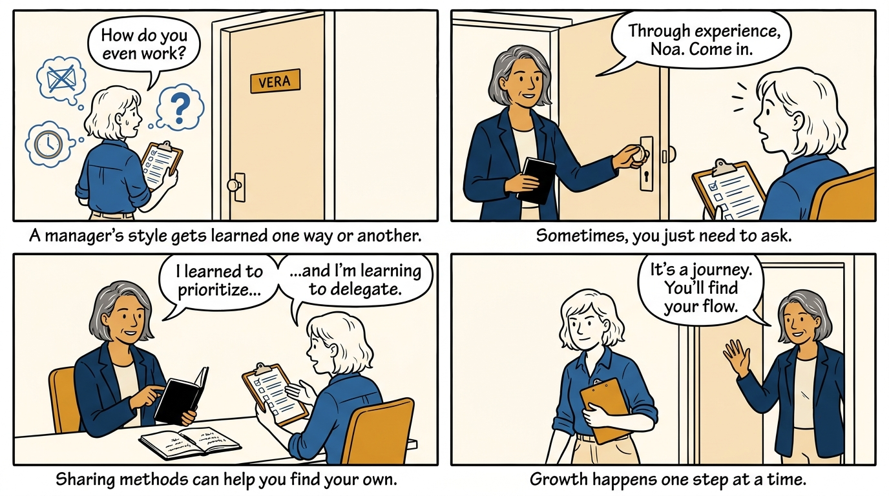
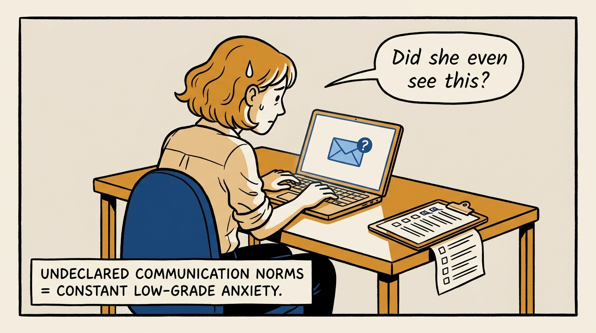
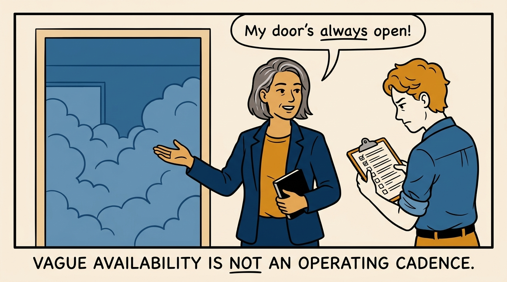
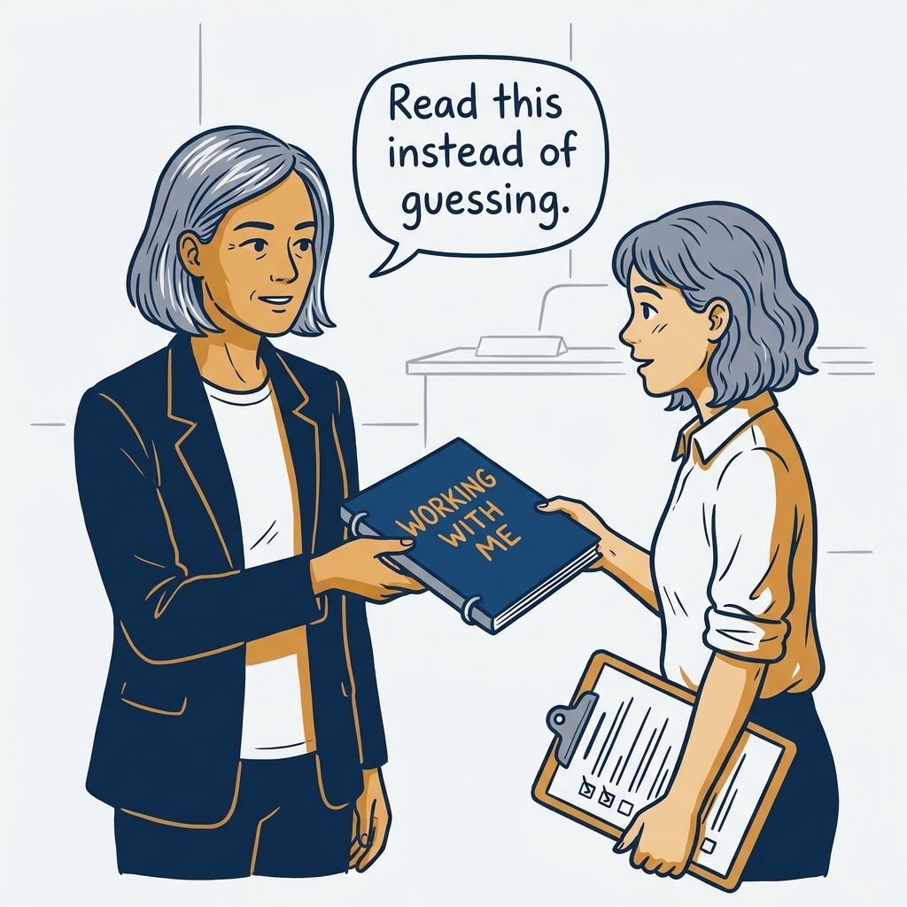
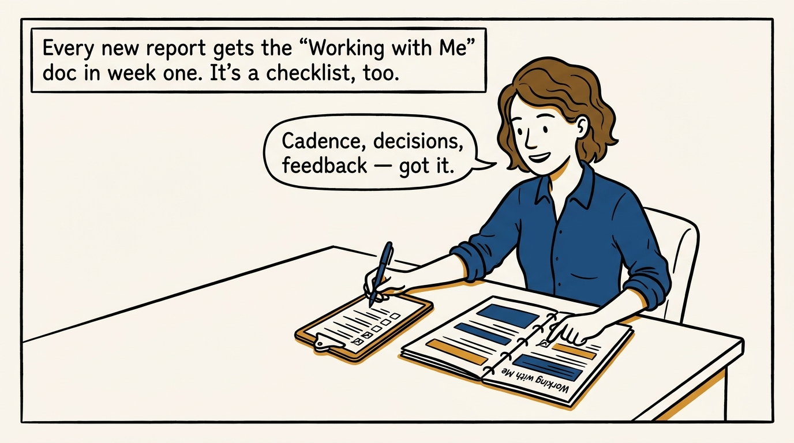
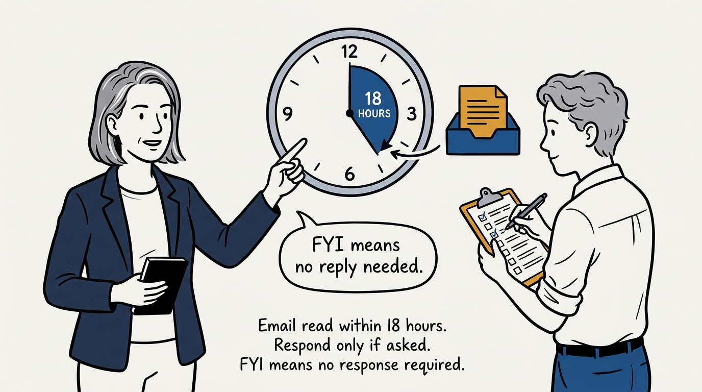
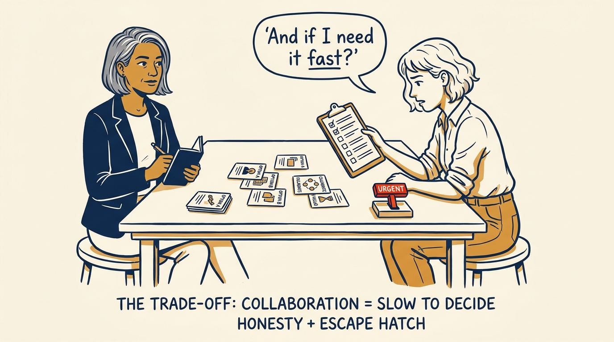
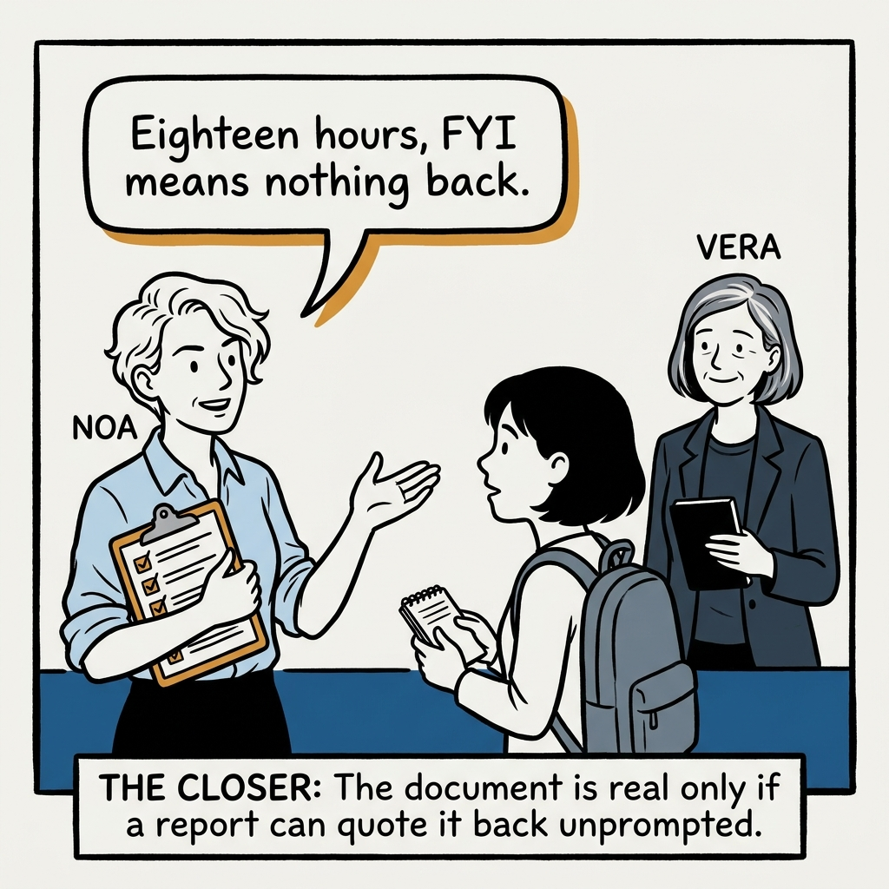

Writing the user guide to yourself as a manager — in eight panels.

<!-- comic-style
{
  "cast": "VERA: a calm, seasoned executive, short gray-streaked hair, dark blazer over a plain t-shirt, carries a small black notebook. NOA: an earnest first-time people manager, short wavy hair, rolled-up shirt sleeves, carries a clipboard with a long checklist.",
  "style": "Clean two-tone explainer comic, thick ink outlines, flat colors with deep blue and amber accents on a light background, generous white space, hand-lettered speech bubbles with SHORT readable text, no photorealism."
}
-->

**Panel 1:** *The hook: a management style nobody writes down still gets learned — just slowly and expensively.*

**Panel 2:** *The problem: without a stated contract, every silence reads as a verdict.*

**Panel 3:** *The wrong way: "my door is open" tells a new report nothing they can plan around.*

**Panel 4:** *The tool: a short, first-person guide to cadence, decisions, and communication — written down, not implied.*

**Panel 5:** *How it runs: handed to every new report in the first week, worked like a runnable checklist.*

**Panel 6:** *The mechanic: read within 18 hours, respond only if asked, FYI means exactly that.*

**Panel 7:** *The cost: collaborative can mean slow — so the escape hatch is named up front, not discovered under deadline.*

**Panel 8:** *The closer: the document is real only if the person it describes can quote it back to you.*
