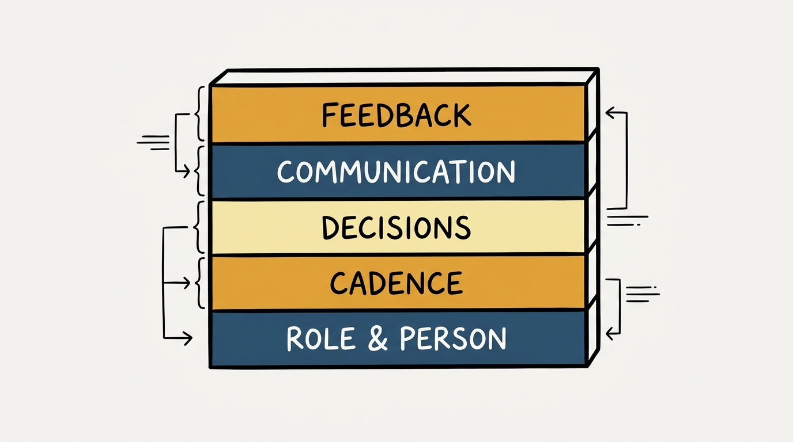
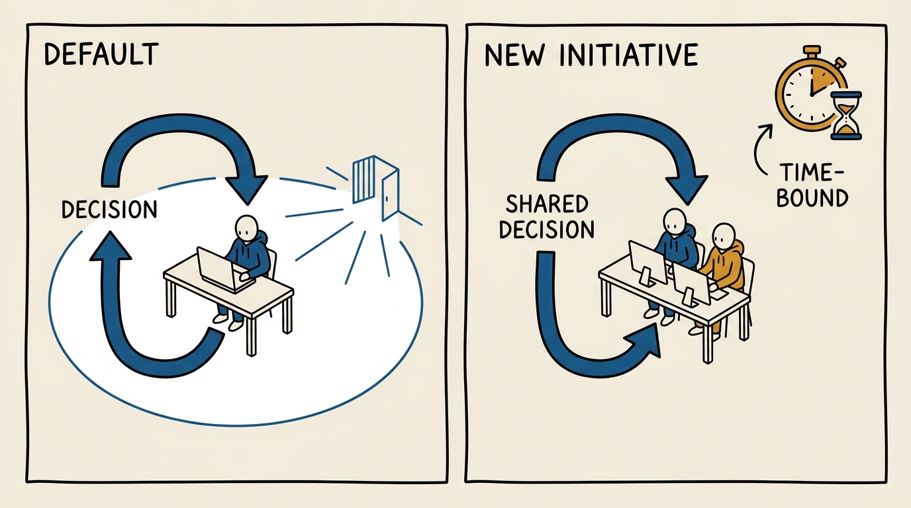
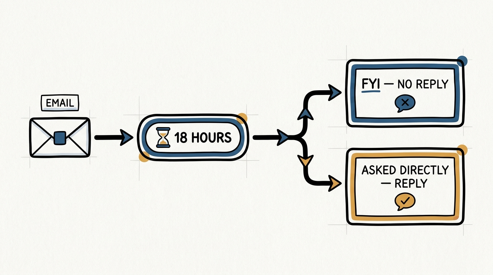

> **Status**: DRAFT
>
> **Principle**: I write a "Working with Me" document and keep it current — a short, first-person guide to my operating cadence, my management style, and how I communicate and give feedback. Writing it is a self-awareness exercise as much as a communication device: I only find out what I actually believe about how I work when I try to put it in a paragraph someone else has to act on. The document is real only if my reports can quote it back to me.

## Statement

My operating model for a "Working with Me" document has five parts:

- **Write it, don't wing it.** I keep a living "Working with Me" document — my role and goals, my personality and boundaries, my operating cadence, my management style, and how I support people's careers — rather than letting new reports assemble my preferences from trial and error.
- **State the cadence in numbers.** 1:1 frequency, team meeting purpose, quarterly planning rhythm, an early career session, and a quarterly review of each person's top personal goals — all named, not implied.
- **Declare the decision style honestly.** I say plainly that I am collaborative and can be slow to decide, that I am mostly hands-off except early in a new initiative, and that I put decisions back on the person before I take them myself — and I tell people how to pull an urgent decision out of me when they need one.
- **Set the communication contract.** Email response norms, what "FYI" means, chat expectations, and what I do and do not need looped in on, stated explicitly enough that no one has to guess whether my silence means approval or neglect.
- **Make feedback and results explicit.** I say how I give and receive feedback, that I will not let venting about someone replace telling them directly, and that I measure results relentlessly rather than assuming good intentions are enough.

**Figure 1:** *The document has five layers, each building on the one below it: identity, cadence, decisions, communication, feedback.*

## How to Read This

This journal is my people-management toolkit — first-person operating records built on the companion workbooks to Claire Hughes Johnson's *Scaling People: Tactics for Management and Company Building*. This record is grounded in the workbooks' "Working with Claire" tool and its companion "Working with Me Template," read through a practitioner-executive lens: the workbook offers both as an exercise in writing down how you work; I read the finished document as a standing artifact I owe every person who joins my team, and the exercise of writing it as a check on my own self-awareness. The runnable tool — my own filled-in template — lives in the **Checklist** tab of this post.

## Rationale

**A management style nobody wrote down still gets learned — just slowly and expensively.** Every manager has an operating style whether or not it is documented; the only choice is whether people learn it from a written page in their first week or from a string of small surprises over months. Johnson's own account of first writing "Working with Claire" in 2010 makes the case for me: her executive assistant, Maeve, read the draft and told her it was missing "the most important thing" — the "good craic" note, that she likes to have a good laugh at work. The mechanics of a working relationship and the personal texture of it are both information a report needs, and neither shows up automatically.

**The cadence has to be a number, not a mood.** Vague statements like "I'm available" or "my door is open" tell a new report nothing they can plan around. So I state the cadence explicitly: 1:1s biweekly or weekly, tracked in a joint document covering agendas, actions, goals, and updates; weekly team meetings that are both status and decision forums, with people expected to show up prepared; quarterly planning sessions with real pre-work and follow-up; an early career-history session in the first few months so I understand where someone is trying to go; and a quarterly review of each person's top three to five *personal* goals — the things they spend their own time on, distinct from team plans — reviewed roughly every three to six months, with me sharing mine in return. Numbers survive contact with a busy calendar; sentiment does not.

**Declaring my decision style is a kindness, not a confession.** I am collaborative by default — I want to discuss options and whiteboard the big calls in a group, which means I will rarely get stuck in one position but will also be slow to reach a verdict. Rather than let people discover that the hard way against a deadline, I say it up front, with the escape hatch attached: if you need a decision quickly, make sure I know it. I am hands-off day to day and expect people to decide without me — when someone brings me a decision, my default move is to hand it back with "what do you want to do?" — except early in a new initiative, when I get closer to the work on purpose so I know how to help later. Naming both halves — hands-off as the norm, hands-on as a deliberate and temporary exception — prevents the exception from reading as a broken promise. This runs both ways: I expect you to do the same and to make sure I know it when you need a fast call, just as I commit to telling you when I'm about to get hands-on.

**Figure 2:** *Hands-off is the default and decisions come back to the person; hands-on is the deliberate, temporary exception early in something new.*

**Data-driven and intuitive are not a contradiction if I say so out loud.** I want consistent data reviewed regularly so we have one honest way to see progress, and I am explicit that the goal of data is insight, not a ritual that substitutes for judgment. At the same time I use intuition deliberately on people, products, and decisions — and I tell my team what that means for them: bring the counter-argument. My gut instinct is a starting hypothesis I expect people to argue with, not a verdict to defer to; I want a good fight to a better outcome, and I say so, so that disagreement reads as the job rather than as insubordination.

**A communication contract removes the guessing tax on every message.** Left undeclared, email and chat norms generate constant, low-grade anxiety — did they see it, do they expect a reply, was silence a yes. So I state the contract: I read every email within about 18 hours but only respond if something requires a direct answer or was addressed as a question — silence means "read, no action needed," and if a response is owed, resend it or ask directly rather than waiting. "FYI" in a subject line means exactly that: for my information, no response required, and I extend the same courtesy back. Chat is for anything short, timely, or important enough to interrupt; long or non-urgent topics wait for the 1:1. None of this is a rulebook for its own sake — it is what lets people stop reading tone into my inbox behavior.

**Feedback that only reaches me sideways has already failed someone.** I want feedback in both directions and I say I like receiving it, particularly when it is constructive, with a quarterly review session as the formal backstop and more timely notes whenever something comes up sooner. The commitment that matters most is the one that protects the person who isn't in the room: anyone who vents to me about a colleague gets my help turning that into a direct conversation with that colleague, not a second-hand channel that lets the complaint travel without ever reaching the person who could act on it. And underneath all of it sits the plainest line in the whole document: measure, measure, measure — good intentions do not substitute for knowing whether the work actually produced good results.

## What This Means in Practice

| What this record says | What it does **not** say |
| --- | --- |
| I keep a written "Working with Me" document and revise it as I change. | The document is a one-time onboarding artifact filed and forgotten. |
| I state 1:1, team meeting, and planning cadence as explicit numbers. | "I'm generally available" counts as an operating cadence. |
| I am collaborative and can be slow to decide — tell me when you need speed. | Collaborative means I will always get to a fast answer, or that slowness is someone else's problem to route around silently. |
| I am hands-off by default, hands-on early in a new initiative, on purpose. | Getting involved early in a new initiative is me not trusting the team — it's temporary and it's how I learn where to help later. |
| FYI means no response required; if you're owed a response, resend or ask. | Silence on an email always means approval, or that unread mail is being ignored. |
| Venting to me about a colleague gets redirected into help telling them directly. | I'll quietly hold and file complaints about someone without that person ever hearing them. |

Concretely: every person joining my team receives my current "Working with Me" document in their first week, and I can point to the date it was last revised. If a report cannot tell me, unprompted, how I like to receive an urgent decision or what "FYI" means in my inbox, the document has failed regardless of whether it exists on a drive somewhere.

**Figure 3:** *The communication contract as a flow: every email gets an 18-hour read, then either no reply owed or a direct answer.*

## Anti-Patterns

- **The undocumented style.** New reports learn my preferences by making mistakes against them instead of reading them on day one.
- **The stale document.** Written once, years ago, no longer describing how I actually operate — worse than no document, because it actively misleads.
- **Vague availability instead of stated cadence.** "My door is open" with no 1:1 rhythm, no meeting purpose, and no planning calendar — availability without structure that anyone can plan around.
- **Silent slowness mistaken for indecision.** I say I'm collaborative and can be slow, but never give people the "tell me if you need it fast" escape hatch — so urgent calls wait behind my default pace.
- **Second-hand feedback that never travels forward.** Letting someone vent about a colleague and leaving it there, instead of turning it into help telling that colleague directly.
- **Data without a stated purpose.** Reviewing dashboards as ritual, with no one saying out loud that the point is insight, not a replacement for judgment and a good argument.

## Related Records

- [[self-awareness]] — the values, work style, and strengths inventory that this document draws on; a "Working with Me" page is that self-awareness made legible to other people.
- [[management-prerequisites]] — the baseline 1:1 and meeting hygiene this document names in specific, numbered form.
- [[new-leader-onboarding]] — the moment this document is handed over; it belongs in the first-week packet, not discovered later.
- [[manager-transitions]] — when I take on a new team, rewriting this document is one of my first moves, alongside the early career session.
- [[career-conversations]] — the early career-history session and the quarterly personal-goals review this document commits to are where those conversations start.
- [[leadership-styles]] — the engineering-executive record on styles of leading; this document is one style made explicit and personal rather than left as a label.

## Scope and Revisiting

This record is `draft`. It governs how I introduce my own operating style to anyone who works with me, and I revisit it whenever my role, team, or actual working habits change enough that the document would mislead a new reader — a reorg, a new function I'm managing, or a cadence I've genuinely stopped keeping. I also treat "can my reports quote it back to me" as a standing test; if that test fails, the document needs revision whether or not anything else has changed.

## Authoritative References

- Claire Hughes Johnson, *Scaling People: Tactics for Management and Company Building* (Stripe Press, 2023) — the companion workbooks' "Working with Claire" and "Working with Me Template" (Chapter 3), which this record distills.
