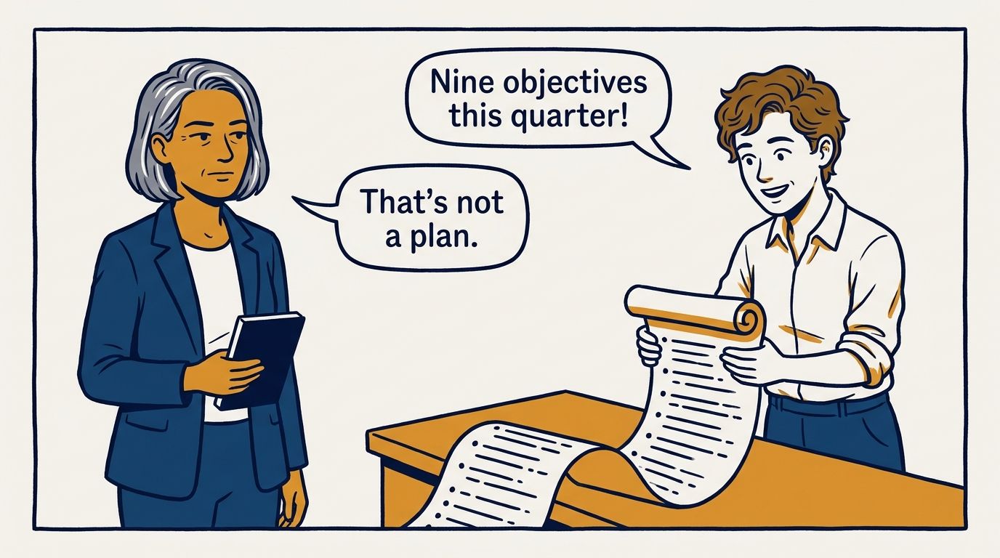
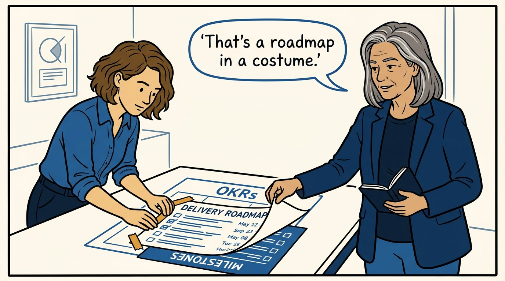
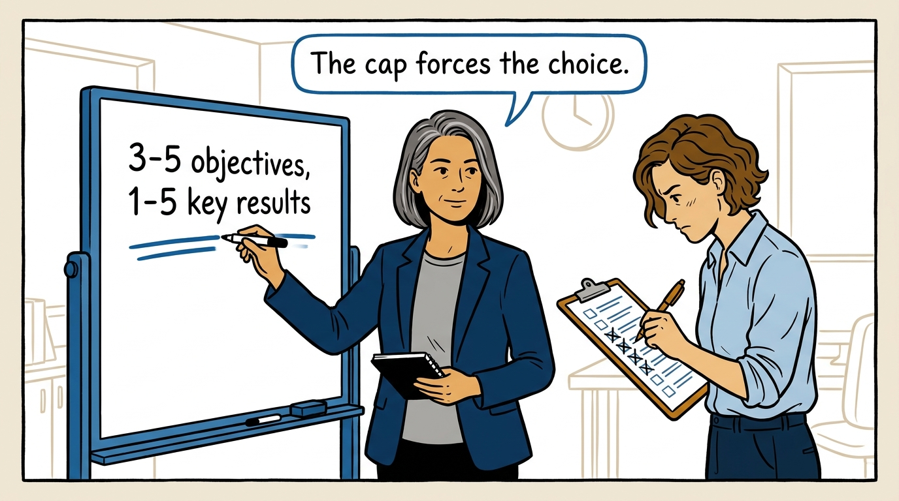
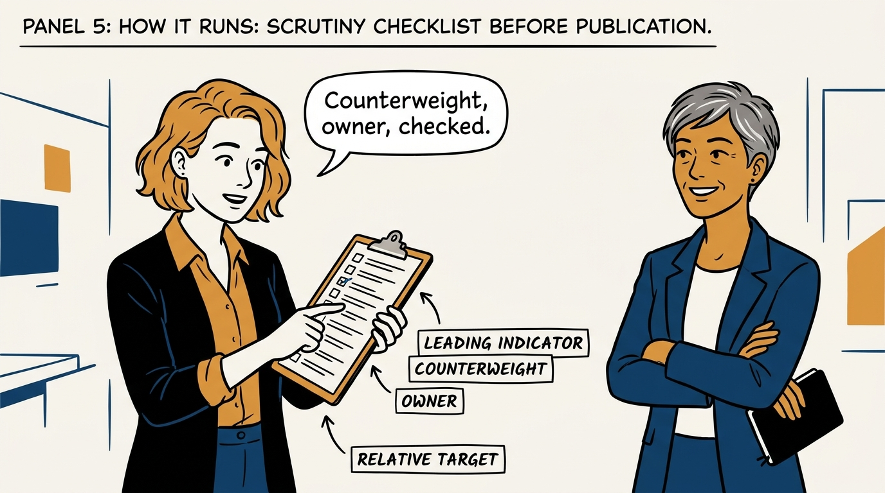
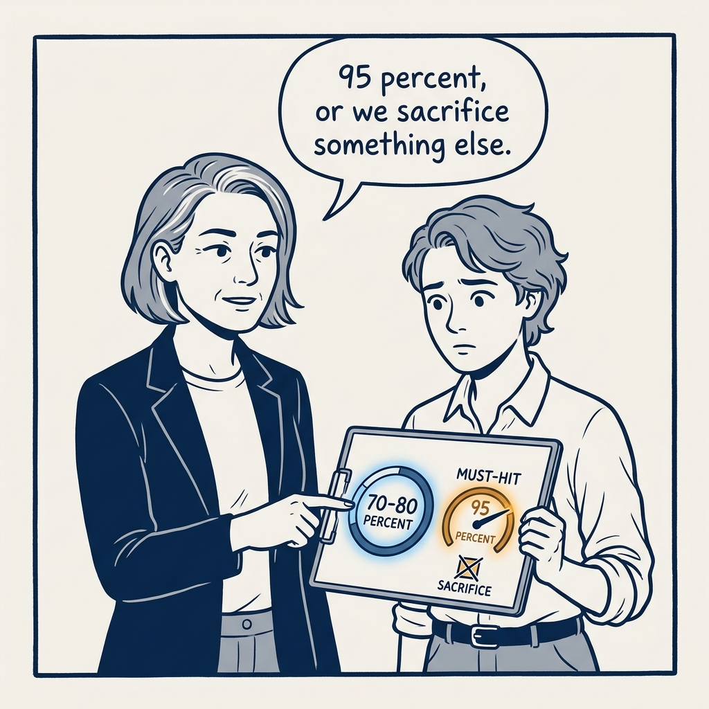
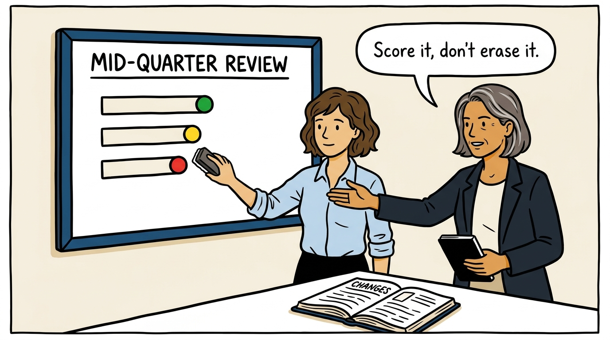
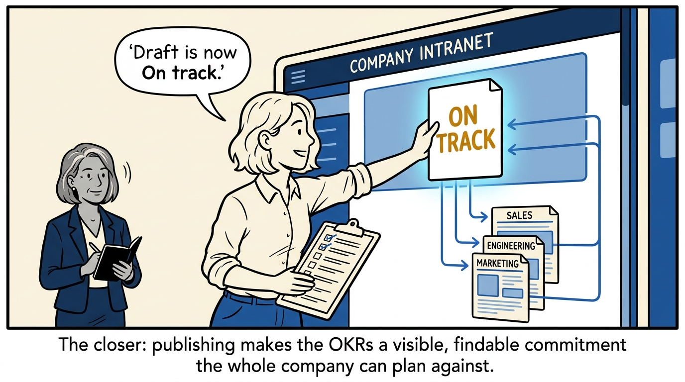

OKRs are a written contract, not a wish list — how to write, scrutinize, and score them, in eight panels.

<!-- comic-style
{
  "cast": "VERA: a calm, seasoned executive, short gray-streaked hair, dark blazer over a plain t-shirt, carries a small black notebook. NOA: an earnest first-time people manager, short wavy hair, rolled-up shirt sleeves, carries a clipboard with a long checklist.",
  "style": "Clean two-tone explainer comic, thick ink outlines, flat colors with deep blue and amber accents on a light background, generous white space, hand-lettered speech bubbles with SHORT readable text, no photorealism."
}
-->

**Panel 1:** *The hook: nine objectives is not a plan — it is a backlog wearing a costume.*

**Panel 2:** *The problem: 'ship the migration' is work, not a goal — if the world looks the same, it was never an objective.*

**Panel 3:** *The wrong way: pasting the roadmap into the OKR template fools no one for long.*

**Panel 4:** *The principle: 3-5 objectives, 1-5 key results each — the cap forces the choice.*

**Panel 5:** *How it runs: every metric is scrutinized — leading indicator, counterweight, owner, relative target — before it is published.*

**Panel 6:** *The mechanic: 70-80 percent is the target zone, but must-hit goals are held to 95 percent or better.*

**Panel 7:** *Mid-quarter, every objective scores green, yellow, or red — and nothing gets quietly erased; a dropped objective still gets scored.*

**Panel 8:** *The closer: publishing turns a private draft into a commitment the whole company can see and plan against.*
