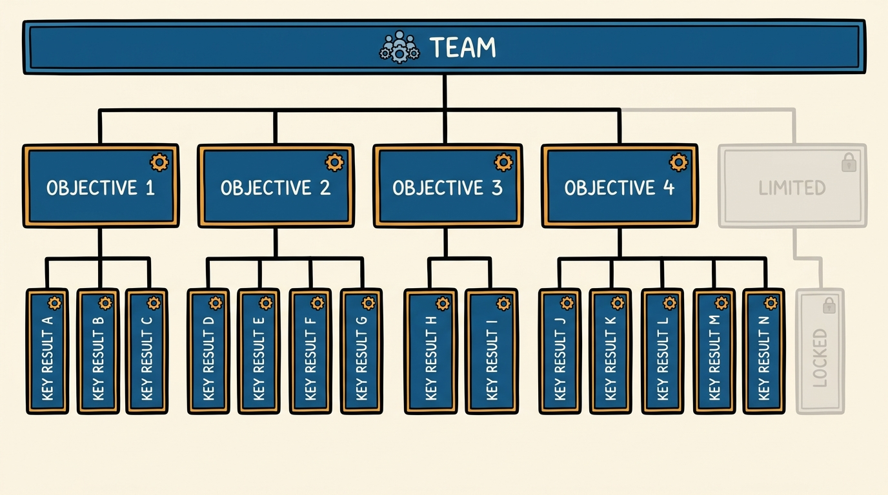
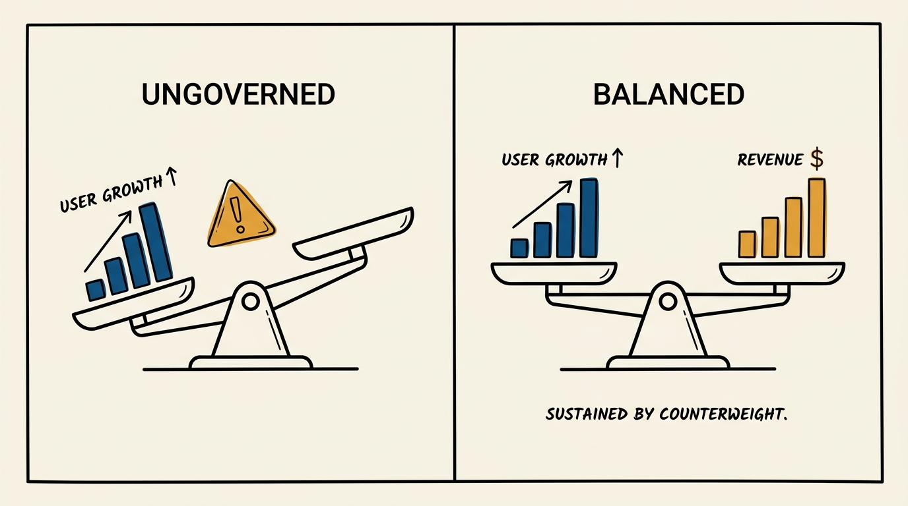
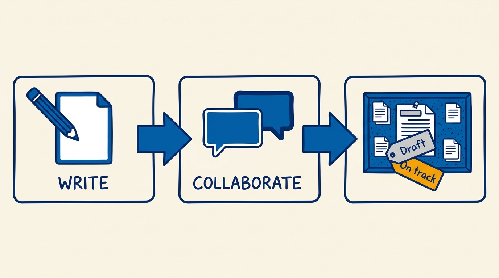

> **Status**: DRAFT
>
> **Principle**: I treat OKRs as a written contract between a team and the company, and I hold the contract to a fixed grammar: 3–5 objectives per team, 1–5 key results per objective, objectives that describe the state of the world at quarter's end, and key results that are measurable and binary. Every metric survives scrutiny — baseline, target, counterweight, owner, relative framing — before it is published. Most goals should score 70–80 percent; the 20–30 percent marked must-hit get 95 percent or better, even if other goals are sacrificed to get there. And once the quarter starts, changes are documented and communicated — a dropped objective is rare, and it stays in the sheet for scoring.

## Statement

My operating model for writing OKRs has six parts:

- **Fixed grammar, no exceptions.** Each team writes 3–5 top-level objectives with 1–5 key results per objective for the quarter. More than that is a roadmap wearing an OKR costume, and I send it back.
- **Objectives are outcomes.** An objective answers "Where do I want to go?" — a description of the state of the world at the end of the quarter, focused on the user problem being solved. Activities are not objectives. Each objective is also labeled at write time as either **aspirational** (a stretch the team is not expected to fully complete — done at roughly 70 percent) or **committed** (a hard promise, done at 100 percent); this per-objective label is a different thing from the 70–80 percent band a team's overall scores tend to land in (see below).
- **Every metric survives the scrutiny checklist.** Before an OKR is published, each metric is written into the objective–metric–baseline–target table and checked: is it a leading indicator, does it have a counterweight, is there a framework to evaluate it, does it have an owner, is the target relative rather than absolute, and does it account for growth we would get anyway?
- **Ambition is calibrated, not vibes.** Most goals are ambitious yet attainable — I expect teams to score in the 70–80 percent range over the quarter. A small number (20–30 percent of a team's goals) are marked **must-hit**, with 95 percent or better attainment expected; if a must-hit is trending behind, we sacrifice other goals in its service.
- **Write, collaborate, publish.** Drafts are shared with closely partnered teams for agreement before they are final; publishing means changing "Draft" to "On track" in the document title and putting the OKRs where the company can see them.
- **Mid-quarter, score and adjust in the open.** Teams score progress green/yellow/red with an on-track/off-track/at-risk assessment, discuss anything off track or at risk, and handle every change to the sheet with documentation and notification of impacted teams. Dropping an objective is rare — and the dropped objective stays in for scoring and discussion.

**Figure 1:** *The grammar is a shape, not a suggestion: 3-5 objectives, 1-5 key results each, and no room past the cap.*

## How to Read This

This journal is my people-management toolkit — first-person operating records, each grounded in a named tool from the companion workbooks to Claire Hughes Johnson's *Scaling People: Tactics for Management and Company Building*. This record is built on three adjacent tools from the Chapter 2 workbook: the **Objectives and Metrics Checklist**, the **Writing Good OKRs** guide — written by Stripe's finance and tech-enablement teams in collaboration with CTO David Singleton — and the **Iterating and Scoring** guidance, read through a practitioner-executive lens. The runnable tool — the metrics table, the scrutiny checklist, and the scoring cadence — lives in the **Checklist** tab of this post.

## Rationale

**The grammar is the discipline.** The 3–5 / 1–5 limits are not bureaucratic pedantry — they are the forcing function that makes a team choose. A team that writes nine objectives has not planned; it has transcribed its backlog. Capping objectives forces the question "what is the most important work?", and capping key results per objective forces the question "how will I know it happened?". Every OKR pathology I have seen — activity lists, unmeasurable aspirations, roadmaps in disguise — starts by breaking the grammar first.

**Metrics lie unless you interrogate them.** A metric that looks healthy can be hiding an easy exploit: you can grow users by giving the product away for free, which is exactly why a user metric needs a counterweight revenue metric. The scrutiny checklist exists to catch these lies before publication: a leading indicator rather than a lagging one, a named owner, a defined calculation or query so two people cannot read the same number differently, and a **relative** target — "increase users by 20 percent, from 5,000 to 6,000" — rather than an absolute one, because "increase users by 1,000" hides whether the goal is ambitious or trivial. The last check is the sharpest: does the target account for existing growth? Hitting a revenue number purely through growth from existing users means the team earned nothing.

**Figure 2:** *A metric alone can be gamed; paired with its counterweight, it has to tell the truth.*

**Calibrated ambition beats sandbagging and heroics alike.** If a team scores 100 percent every quarter, the goals were too safe; if it scores 40 percent, the plan was fiction. The 70–80 percent expectation makes ambition legible: most goals are stretches we mostly reach. The must-hit tier does the opposite job — for the 20–30 percent of goals that are hard commitments, 95 percent attainment or better is the bar, and the explicit license to sacrifice other goals in their service is what makes "commitment" mean something. Without the two-tier structure, every goal is implicitly negotiable and nothing is truly promised.

**Publishing is part of the tool.** OKRs that live in a private doc are wishes. The write–collaborate–publish sequence has a purpose at each step: collaboration catches the cross-team dependency the drafting team forgot; publication — flipping "Draft" to "On track" in the title, on the company intranet — makes the commitment visible and gives every other team something to plan against. Objectives can be shared across teams and nest up and down the organization; none of that works if the OKRs are not findable.

**Figure 3:** *Write, collaborate, publish: the sequence that turns a private draft into a commitment other teams can plan against.*

**Change discipline is what keeps the sheet honest.** New information will arrive mid-quarter; the failure mode is not changing the OKRs, it is changing them silently. So every add or drop of a key result is documented and impacted teams are notified; every added objective records what work was deprioritized to make room; and a dropped objective — rare, justified only by changed constraints or genuine lack of user value — stays in the OKRs for scoring and discussion. A sheet you can quietly edit is not a commitment device; it is a diary.

## What This Means in Practice

| What this record says | What it does **not** say |
| --- | --- |
| 3–5 objectives, 1–5 key results each, per team per quarter. | Fewer goals means less work — it means the important work is actually chosen. |
| Objectives describe the state of the world at quarter's end. | Activities disappear — they live in plans and roadmaps, below the OKR line. |
| Key results are measurable and binary: it happened or it did not. | Judgment disappears — the causal theory linking KR to objective is still argued by humans. |
| Expect 70–80 percent scores; must-hits get 95 percent or better. | A 75 percent score is failure — on ambitious goals it is exactly the target zone. |
| Every metric has a baseline, target, owner, and counterweight. | Metrics replace conversation — the mid-quarter discussion is where energy gets redirected. |
| Changes are documented and impacted teams notified; dropped objectives stay in for scoring. | OKRs are frozen — they can change, but only in the open and on the record. |

Concretely: no OKR set in my organization is published without the objective–metric–baseline–target table filled in and the scrutiny checklist passed. Must-hit goals are labeled as such in the published doc. Mid-quarter, every team runs the green/yellow/red review and anything off track or at risk gets discussed until there is a recovery plan or a documented change.

## Anti-Patterns

- **Activity as outcome.** "Ship the migration" is work, not a goal. If the world looks the same after you shipped it, the objective was never an objective.
- **The unmeasurable key result.** A KR that cannot be measured in some way is an opinion with a deadline. Measurable and binary, or it does not go in.
- **Roadmap-as-OKRs.** Pasting the delivery plan into the OKR template. The tell is objectives that read like ticket titles and key results that read like milestones.
- **Objective sprawl.** More than 3–5 objectives or more than 1–5 key results per objective. Beyond the cap, the team is refusing to prioritize and outsourcing that refusal to the reader.
- **The counterweight-free metric.** A single metric optimized in isolation — users without revenue, speed without quality. Any metric you can game by giving the product away needs its counterweight named.
- **Silent mid-quarter edits.** Swapping key results without documenting the change or telling impacted teams — or deleting a failing objective so it never gets scored. The dropped objective stays in the sheet; that is the point.

## Related Records

- [[team-objectives]] — the product-journal record on leaders assigning problems and teams proposing OKRs; this record supplies the writing grammar and scoring discipline that model of collaboration runs on.
- [[outcomes]] — the product-journal record on outcomes over output; the "objectives describe the state of the world" rule is the same principle applied at goal-writing time.
- [[measuring-engineering-organizations]] — the engineering-journal record on measurement; the counterweight-metric and metric-owner checks are the same hygiene applied to goal metrics.
- [[quarterly-business-reviews]] — where scored OKRs meet the business narrative each quarter; this record produces the inputs that review consumes.
- [[team-charter]] — the mission and plan an objective must trace to; the "related to your team's mission" check points here.
- [[leadership-team-updates]] — the ongoing communication channel that carries mid-quarter OKR status between scoring sessions.

## Scope and Revisiting

This record is `draft`. It governs how teams in my organization write, publish, score, and change their quarterly OKRs. I will revise it when a full planning cycle shows the ambition bands (70–80 percent, must-hit at 95 percent) need retuning for my context, when the scrutiny checklist misses a class of metric failure in practice, or when the cadence of mid-quarter scoring proves too coarse or too heavy for the organization's size.

## Authoritative References

- Claire Hughes Johnson, *Scaling People: Tactics for Management and Company Building* (Stripe Press, 2023) — the companion workbooks: the Chapter 2 "Objectives and Metrics Checklist," "Writing Good OKRs," and "Iterating and Scoring" tools this record is built on.
- The "Writing Good OKRs" guide was written by Stripe's finance and tech-enablement teams in collaboration with Stripe CTO David Singleton, whose credit the workbook carries.
