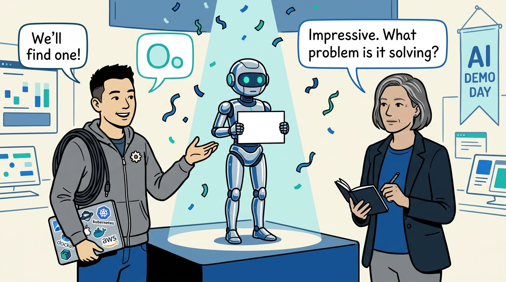
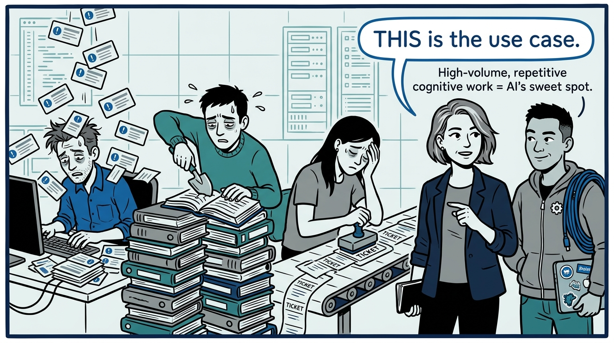
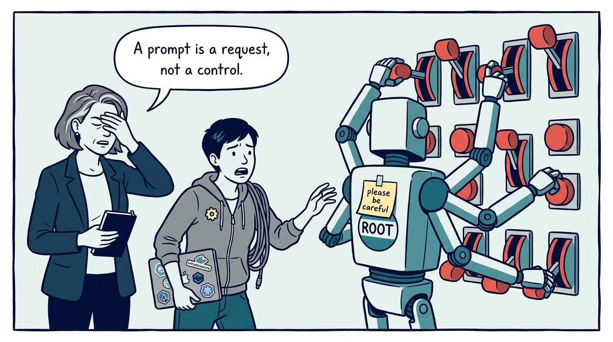
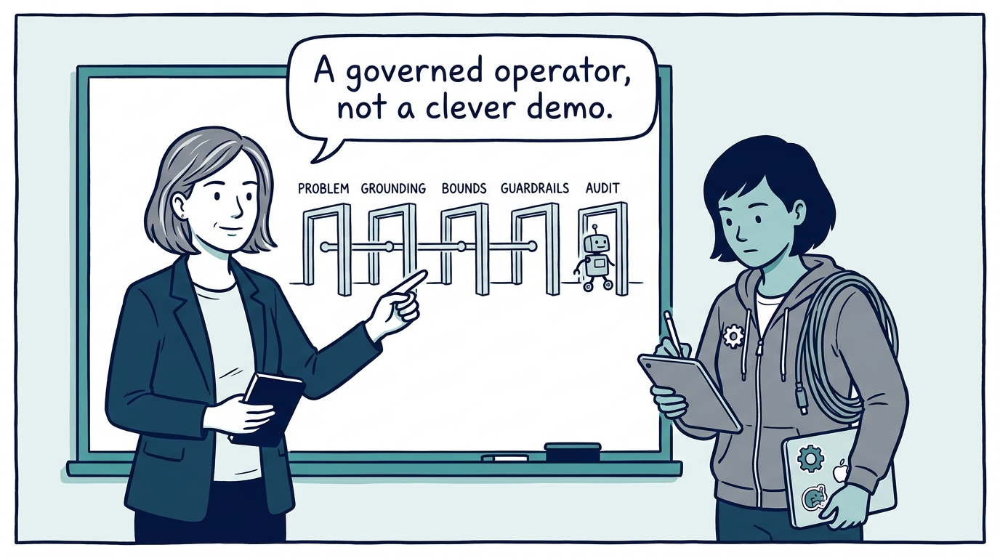
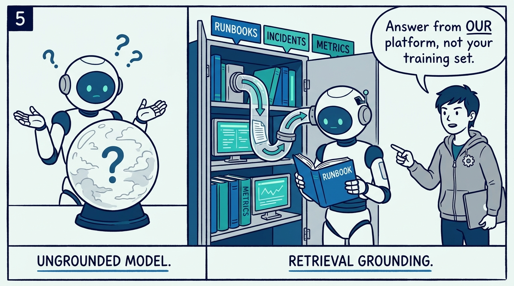
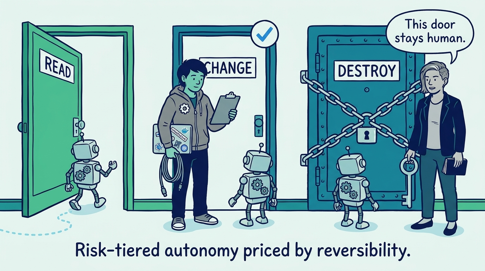
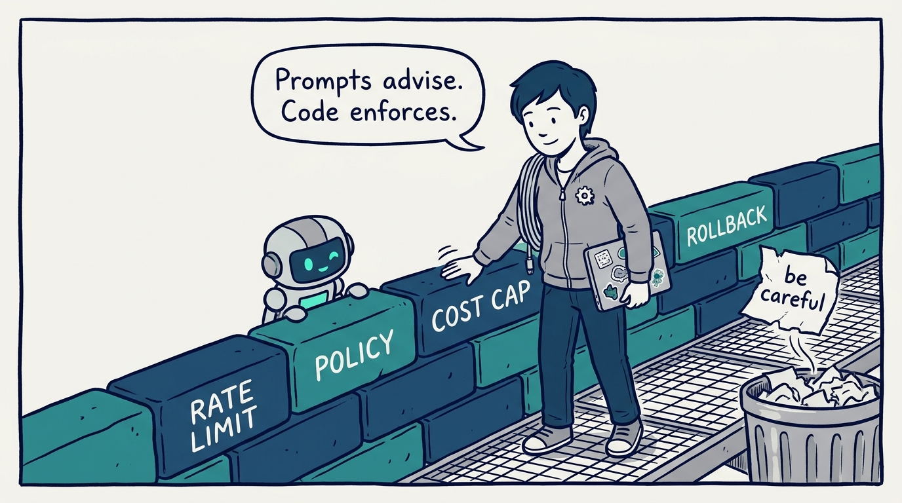
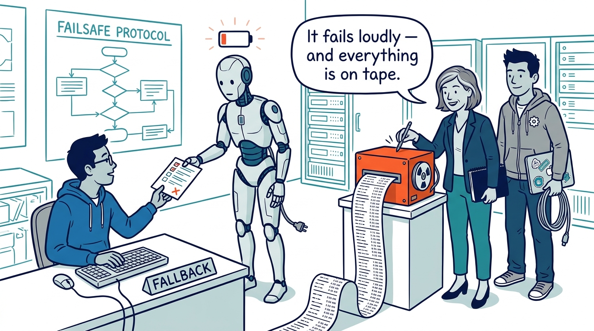
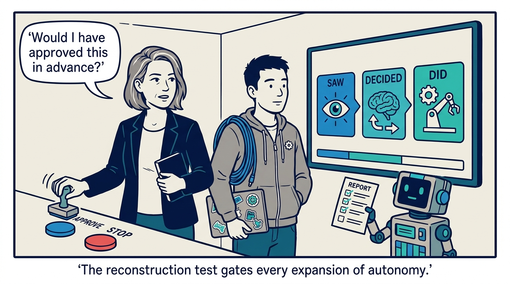

Why AI enters the platform as a governed operator, not a clever demo — in nine panels.

<!-- comic-style
{
  "cast": "VERA: a calm, seasoned engineering executive, short gray-streaked hair, dark blazer over a plain t-shirt, carries a small black notebook. KAI: a hands-on platform engineering lead, short dark hair, gray zip-up hoodie with a small gear pin, laptop covered in infrastructure stickers under one arm, a coil of cable slung over the shoulder.",
  "style": "Clean two-tone explainer comic, thick ink outlines, flat colors with deep blue and teal accents on a light background, generous white space, hand-lettered speech bubbles with SHORT readable text, no photorealism."
}
-->

**Panel 1:** *The hook: the failure mode of AI in operations is almost never the model — it is a demo in search of a problem.*

**Panel 2:** *The problem: the real candidates are unglamorous — alert deduplication, documentation archaeology, incident triage — high-volume, repetitive, measurable.*

**Panel 3:** *The wrong way: the intern with root — one undifferentiated agent, broad production access, and safety implemented as a polite prompt.*

**Panel 4:** *The principle: AI enters the platform as a governed operator — problem first, grounded, bounded, fenced in code, audited, and expanded only on evidence.*

**Panel 5:** *How it plays out: grounding through retrieval — the agent answers from our runbooks, incident history, and telemetry, not from somebody else's platform.*

**Panel 6:** *The tiers: read-only runs free, mutations need approval, destructive and irreversible actions stay human-decided and human-executed.*

**Panel 7:** *The fence: rate limits, scoped permissions, policy checks, cost thresholds, and rollback conditions live in code — where the model cannot talk its way past them.*

**Panel 8:** *The safety net: model failure is a normal operational condition — deterministic fallbacks, a route to a human, never a silent shrug — and every action lands in the flight recorder.*

**Panel 9:** *The closer: the test that never stops running — reconstruct exactly what the agent saw, decided, and did, and ask whether you would have approved it in advance. Autonomy is earned in tiers, and it is revocable.*
