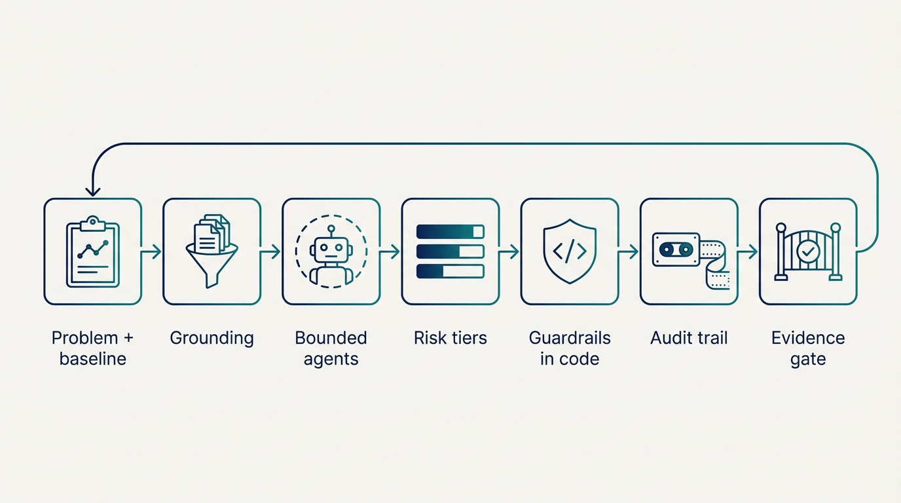
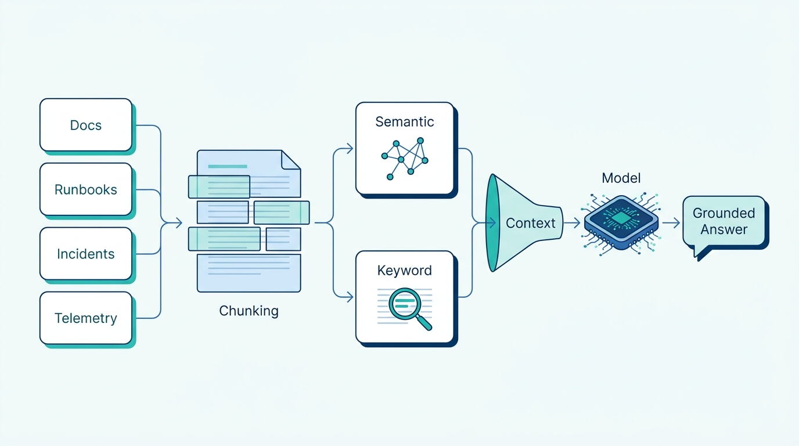
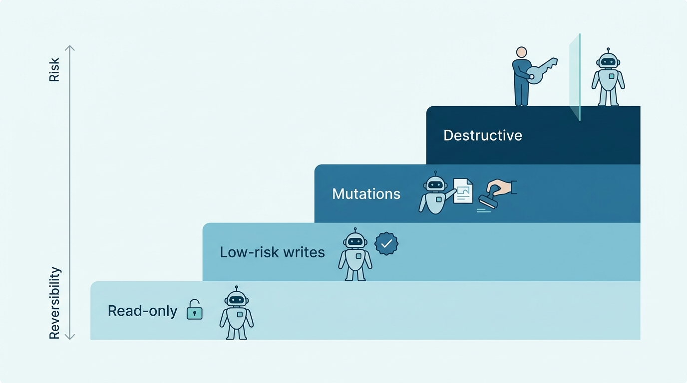
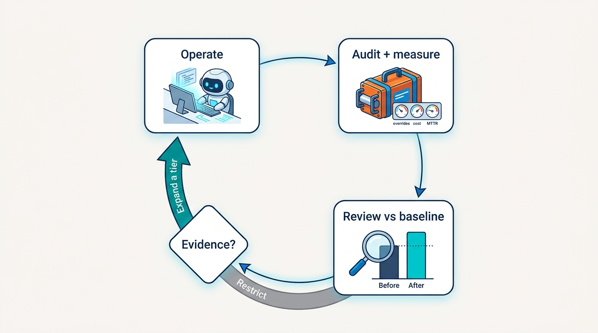

> **Status**: DRAFT
>
> **Principle**: AI enters my platform as a **governed operator, not a clever demo**. An AI-augmented platform capability starts from a **measurable operational problem** with a documented baseline; it is **grounded in the platform's own data** through retrieval, not left to answer from its training set; it acts through **agents with bounded responsibilities** and **risk-tiered autonomy** — read-only work runs free, mutations need approval, destructive actions stay human-decided and human-executed; it is fenced by **guardrails enforced in code**, because a prompt is a request, not a control; it treats **model failure as a normal operational condition** with deterministic fallbacks and no silent errors; it leaves a **complete audit trail** down to the model and prompt version; and it **expands its autonomy only when the evidence supports it**. The test I keep running: can I reconstruct, after the fact, exactly what the agent saw, decided, and did — and would I have approved it in advance?

## Statement

When a platform team in my organization builds AI into platform operations, this is the shape of the build I hold it to.

**Start from the problem, not the model:**

- **A real operational problem first.** The use case begins with a business or operational problem, never with "what could we build with AI". The best candidates are high-volume, repetitive cognitive work: alert deduplication, documentation search, incident triage, anomaly and event correlation, context-aware prioritization and routing.
- **One focused first implementation.** The first build targets one use case or one runbook — small enough to evaluate before anything expands.
- **A documented baseline.** Before any automation, the current manual workflow is written down: what engineers check first, which logs, metrics, tickets, and documents they gather, which decisions are repetitive and which need real judgment — with measured time, effort, accuracy, MTTR, and false-positive rates. Without the baseline, there is no way to prove the AI helped.
- **No AI on irreversible decisions** without explicit human approval — this constraint is set at use-case selection, not discovered in an incident review.

**Ground the model in the platform's reality:**

- **Deployment matched to the workload.** Managed APIs for reasoning-heavy or prototype work; cloud-hosted open models when data control matters; self-hosted models when local control, air-gapped operation, or high-volume cost efficiency is important; hybrid where different workloads justify different models. Licensing, data residency, and compliance are verified before use — and serving, routing, versioning, token metering, and latency monitoring are part of the build, not an afterthought.
- **Retrieval before fine-tuning.** The model is grounded through RAG over authoritative platform documentation, runbooks, incident history, and operational data — logs, metrics, traces, Kubernetes events — before fine-tuning is even considered.
- **Retrieval as engineering.** Semantic retrieval for conceptually related information, keyword retrieval where exact commands and terminology matter, hybrid where both do; documents split along meaningful section boundaries with enough overlap to preserve context.

**Bound the agents and tier the risk:**

- **Every agent has a job description.** A specific, clearly bounded responsibility; explicit definitions of what it can observe, what it can decide, what it can execute, and how it communicates with other agents; an orchestrator for multi-agent workflows; and an explicit designation of which agents run autonomously and which run supervised.
- **Autonomy is priced by reversibility.** Read-only queries and context gathering are low-risk and can run free. Ticket creation and documentation updates may be autonomous — a deliberate decision, not a default. Service restarts, rollbacks, scaling, and configuration changes require human approval. Destructive or irreversible actions — and anything touching backups, security policies, critical infrastructure, database migrations, or financial commitments — are decided *and executed* by humans.

**Enforce safety in code, expect failure, audit everything:**

- **Pre-execution checks.** AI-generated operational changes are dry-run in staging, validated against security and resource policies (a policy engine such as OPA or Kyverno where applicable), shown to the reviewer command by command, with an estimated blast radius and a rollback plan defined before execution.
- **Guardrails are programmatic.** Rate limits on repeated actions, different permissions for production and non-production, dependency checks before remediation, cost thresholds that trigger approval, rollback conditions for failed actions, input validation and prompt-injection prevention, strict tenant isolation, and validation of generated outputs before acting on them. Prompts advise; code enforces.
- **Model failure is a normal operational condition.** Defined behavior for API outages, rate limits, and quota exhaustion; cached responses where safe; deterministic fallbacks; unresolved cases routed to a human; never a silent failure or an unexplained empty response.
- **Confidence thresholds gate what runs on its own.** Thresholds define what runs autonomously, what needs human confirmation, and what gets suppressed or escalated — combined with incident severity, and recalibrated from actual results.
- **Everything is auditable and measured.** Every agent action is logged with its context, reasoning, confidence score, the human's approve/reject/modify decision, the action taken, the outcome, and the model and prompt versions needed to investigate regressions. AI-specific metrics — token usage, latency, confidence trends, cost per action, override rates, AI-assisted versus manual MTTR, false positives — are watched like any other platform SLI, and agent health is actively evaluated: autonomy is stopped or restricted when accuracy falls.
- **Expansion is gated by evidence.** Business impact is measured against the baseline; scope, autonomy, and additional agents grow incrementally and only when guardrails, fallbacks, override reviews, drift trends, and costs support it — never as a one-shot platform transformation.

**Figure 1:** *The control chain: an AI capability enters platform operations through every one of these gates — and the evidence gate at the end decides whether anything expands.*

## Reference Stack

This record is grounded in the *Platform Engineer's Handbook* reference build. The tools are the worked example; the commitments hold at the capability level.

| Role | Reference tool | The property that matters |
| --- | --- | --- |
| Model access | Managed LLM APIs; cloud-hosted or self-hosted open models | Deployment matched to data control, latency, and cost — chosen per workload, not per fashion |
| Grounding | RAG over platform docs, runbooks, incident history, operational telemetry | The model answers from our platform's reality, not its training set |
| Retrieval | Hybrid semantic (vector) + keyword search | Conceptual questions and exact commands both retrieve correctly |
| Action validation | OPA / Kyverno policy engines | AI-proposed changes pass the same policy gates as human changes |
| Guardrails | Programmatic checks in the agent runtime | Safety enforced in code; prompts are advice, not controls |
| Audit and telemetry | Structured audit log + AI metrics in the platform observability stack | Every action reconstructable; token cost, latency, confidence, and override rate watched like SLIs |

## How to Read This

This record is part of the **Reference Implementation** section of my journal — the how-it-concretely-looks companion to the Platform Engineering records. It is grounded in the AI-augmented platform engineering chapter of the *Platform Engineer's Handbook*, the build-it-end-to-end companion this section follows. The runnable version — all fifteen build steps plus the final readiness check — lives in the **Checklist** tab. The **TL;DR** tab is the two-minute management version; the **Conversation** tab argues it out loud. The record states what must be true when the build is done; the tools named above are how the reference build gets there.

## Rationale

**The use case is the strategy.** The failure mode of AI in operations is almost never the model — it is a demo in search of a problem. The chapter's discipline is unglamorous and correct: find high-volume, repetitive cognitive work where engineers already grind through alert duplication, documentation archaeology, and triage; document how that work happens today; measure it; and only then automate one focused slice of it. **The baseline is the whole argument** — without a measured before, every claim of AI value is a vibe.

**Grounding beats cleverness.** An ungrounded model answers operational questions from its training set — fluent, confident, and about somebody else's platform. Retrieval over our own runbooks, incident history, and telemetry is what makes the answers *ours*, and retrieval is real engineering: semantic search for concepts, keyword search where an exact flag or command matters, chunks split on section boundaries so the context survives. RAG comes before fine-tuning because it is cheaper, auditable, and updatable at the speed our documentation changes.

**Figure 2:** *Grounding as engineering: the platform's own corpus, chunked on section boundaries, retrieved through hybrid semantic and keyword search — so the model answers about our platform, not somebody else's.*

**An agent is a role, not a genie.** The moment "the AI" becomes one undifferentiated thing with broad access, nobody can say what it may do — which means nobody can say what it may not. Bounded responsibilities with explicit observe/decide/act/communicate contracts do for agents what job descriptions and access scopes do for people. The supervision question — which agents run autonomously, which run watched — is answered per agent, in advance, on paper.

**Autonomy is priced by reversibility.** The risk tiers encode a simple economic fact: a wrong read-only query costs seconds; a wrong rollback costs an outage; a wrong database migration costs the weekend, or the company. So the freedom an agent gets tracks the reversibility of its actions — and for the irreversible tier, the human does not just approve, the human *executes*. **An approval click on an action you did not read is not a control**, which is why the reviewer sees every proposed command, the blast radius, and the rollback plan before anything runs.

**Figure 3:** *Autonomy priced by reversibility: the agent runs free where mistakes cost seconds, needs approval where they cost outages, and steps aside entirely where they cannot be undone.*

**Prompts are requests; code is enforcement.** Telling the model to be careful is not a guardrail. Rate limits, environment-scoped permissions, cost thresholds, dependency checks, input sanitization, tenant isolation, and output validation live in code, where the model cannot talk its way past them — and where a prompt-injected input cannot either. The policy engine that already gates human changes ([[policy-as-code]]) gates AI-proposed changes for the same reason and with the same rules.

**The model will fail; the platform must not.** APIs go down, quotas exhaust, confidence collapses. Treating that as exceptional produces silent failures and unexplained empty responses — the worst possible behavior in an operational tool, because it teaches engineers to distrust it precisely when they need it. Deterministic fallbacks, cached responses where safe, and an explicit route-to-human path make the AI layer degrade the way the rest of the platform does: predictably.

**Trust is built from evidence, spent on autonomy.** The audit trail, the AI-specific metrics, and the agent-health checks are the same discipline the platform applies to everything else, extended to a component that is probabilistic by nature. Override rates, confidence drift, cost per action, and AI-versus-manual MTTR tell us whether the agent is earning its autonomy — and the expansion gate makes the answer consequential: **scope grows when the evidence says so, and shrinks when it does not.** Stopping autonomous use when accuracy falls is not an embarrassment; it is the system working.

**Figure 4:** *The evidence loop: autonomy is earned from measured results against the baseline — scope grows when the evidence says so, and shrinks when it does not.*

## What This Means in Practice

| What this record says | What it does **not** say |
| --- | --- |
| Start from a measured operational problem; automate one focused use case first. | Deploy AI wherever a model could plausibly help, and find the value later. |
| Ground the model in platform data through RAG before considering fine-tuning. | Fine-tune first — or let the model answer from its training set. |
| Every agent has bounded observe/decide/act responsibilities, designated autonomous or supervised. | One general agent with broad access "to be efficient". |
| Autonomy is risk-tiered; humans decide and execute destructive and irreversible actions. | Full autonomy is the goal and approvals are transitional friction. |
| Guardrails are enforced in code and validated by policy engines. | Careful prompt-writing counts as a safety mechanism. |
| Model failure is a normal condition with deterministic fallbacks and a human route. | AI failure is rare enough to handle ad hoc. |
| Every action is auditable down to model and prompt versions, and AI metrics are watched like SLIs. | Logging and metrics are overhead to add once the agent proves itself. |
| Expand scope, agents, and autonomy incrementally, gated on measured evidence. | Run an AI platform transformation as one program. |

Concretely: the first AI capability my platform team ships is one use case with a written baseline, a bounded agent, code-enforced guardrails, a complete audit trail, and a scheduled review that decides — from override rates, accuracy, and cost against that baseline — whether it earns more scope. The honest cost statement: governance is most of the build — the risk tiers, guardrail code, audit trail, and AI-specific observability take longer than wiring up the model itself. **Autonomy is earned in tiers, and it is revocable.**

## Anti-Patterns

- **The demo in search of a problem.** Starting from "what can we build with AI" and retrofitting a justification — impressive in the all-hands, absent from the MTTR chart.
- **The prompt-shaped guardrail.** Safety implemented as system-prompt instructions — "never delete anything" — with nothing in code to make it true when the model, or a prompt-injected input, decides otherwise.
- **The intern with root.** One general-purpose agent, broad production access, no risk tiers — trusted like a senior engineer, verified like neither.
- **The ungrounded oracle.** A model answering operational questions from its training set instead of retrieval over our runbooks and telemetry — fluent, confident, and describing somebody else's platform.
- **The silent shrug.** AI failure surfacing as an empty response or a quiet timeout — teaching engineers to distrust the tool exactly when they need it most.
- **The black box without a flight recorder.** Actions taken with no record of context, reasoning, confidence, human decision, or model and prompt versions — making every regression uninvestigable and every audit a reconstruction from memory.
- **The vibe-based victory.** Declaring the AI a success with no baseline to compare against — no before-MTTR, no manual-effort cost, no override rate.
- **The big-bang transformation.** Rolling AI across all of platform operations at once, instead of one evaluable use case that earns each expansion.

## Related Records

- [[resilience-automation]] — the remediation and failure-testing machinery this record's agents may propose to trigger; the risk tiers here gate what that automation is allowed to do unattended.
- [[observability-implementation]] — the telemetry pipelines the AI consumes as grounding data; this record adds AI-specific metrics on top of them.
- [[policy-as-code]] — the policy engine that validates AI-proposed actions with the same rules as human changes.
- [[cost-performance-scalability]] — the platform's cost discipline; this record's cost-per-action and token metering extend it to the AI layer.
- [[operating-platforms]] — the operating discipline (incidents, on-call, support) that AI augmentation plugs into; the human ownership there does not move.
- [[four-pillars]] — the AI/ML platform considerations in the qualification test; this record is that consideration built end to end.
- [[platform-success]] — the measurement mindset this record applies to the AI capability itself: business impact against a baseline, or no expansion.

## Scope and Revisiting

This record is `draft`. It applies to any AI capability my platform teams build into platform operations — triage, retrieval, remediation-proposal, or routing — everywhere I am the accountable executive. I revisit it if human override rates stay high while autonomy expands anyway (the evidence gate failing in public), if an incident reveals an agent action that cannot be reconstructed from the audit trail, if AI-assisted resolution becomes slower or costlier than the manual baseline it replaced, or if the model landscape shifts enough that the deployment-approach guidance (managed versus self-hosted, RAG versus fine-tuning) no longer reflects real trade-offs.

## Authoritative References

- *Platform Engineer's Handbook* — the AI-Augmented Platform Engineering chapter, whose checklist this record distills. (The source PDF's filename reads "Cost, Performance, and Scalability"; the chapter's own title page reads "AI-Augmented Platform Engineering".)
