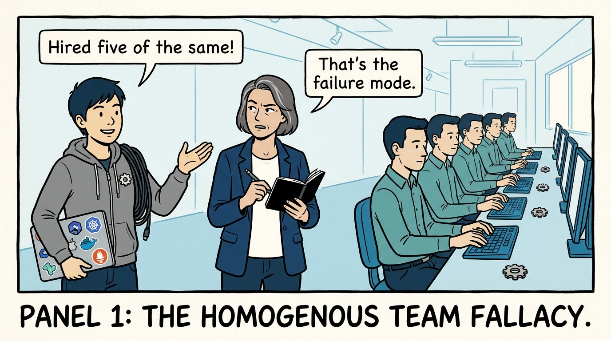
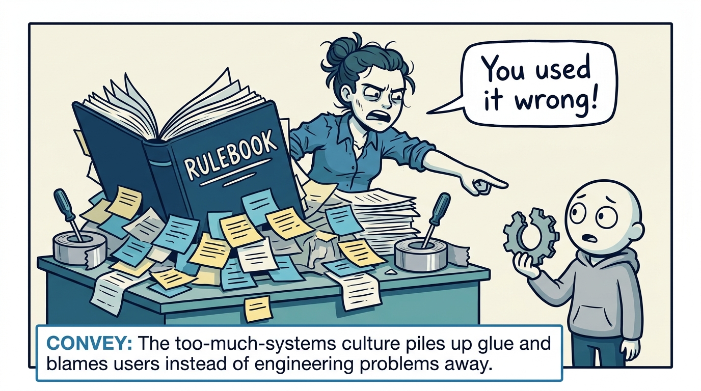
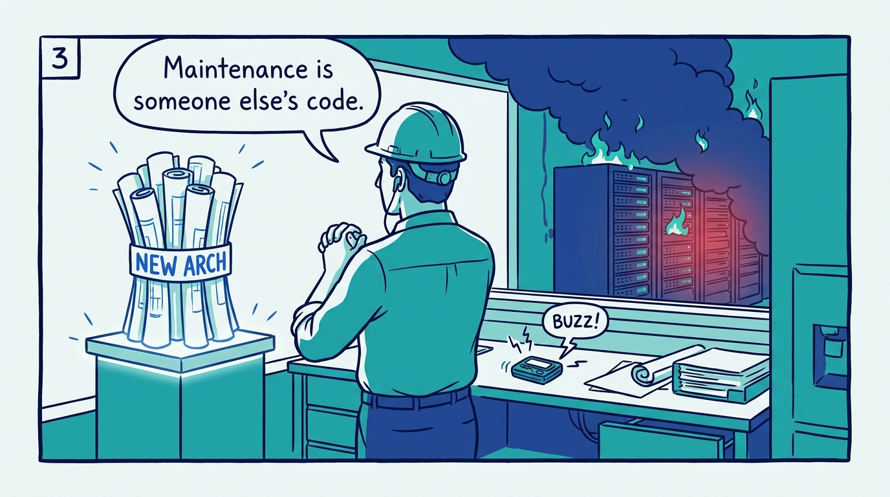
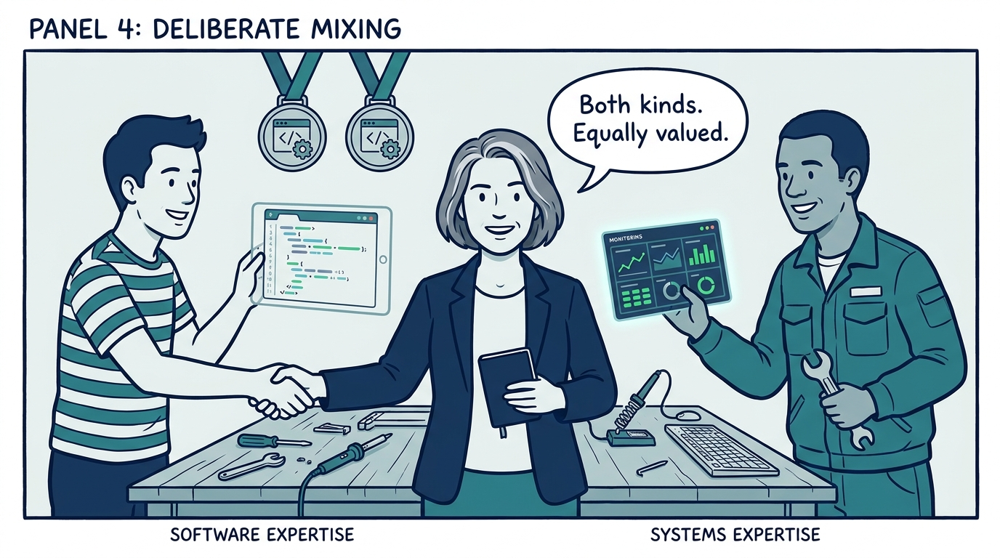
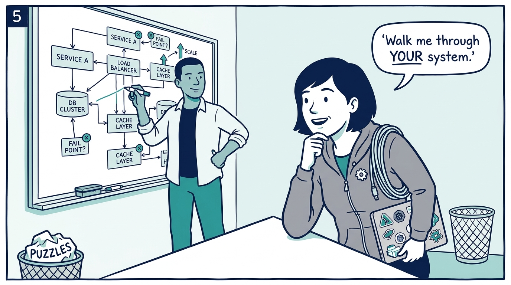
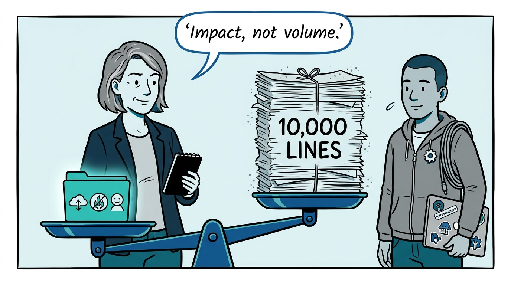
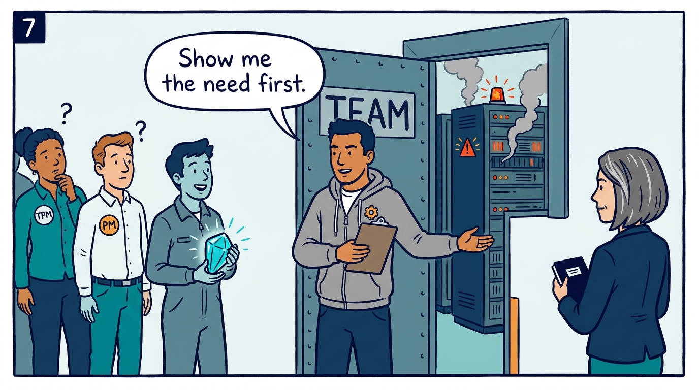
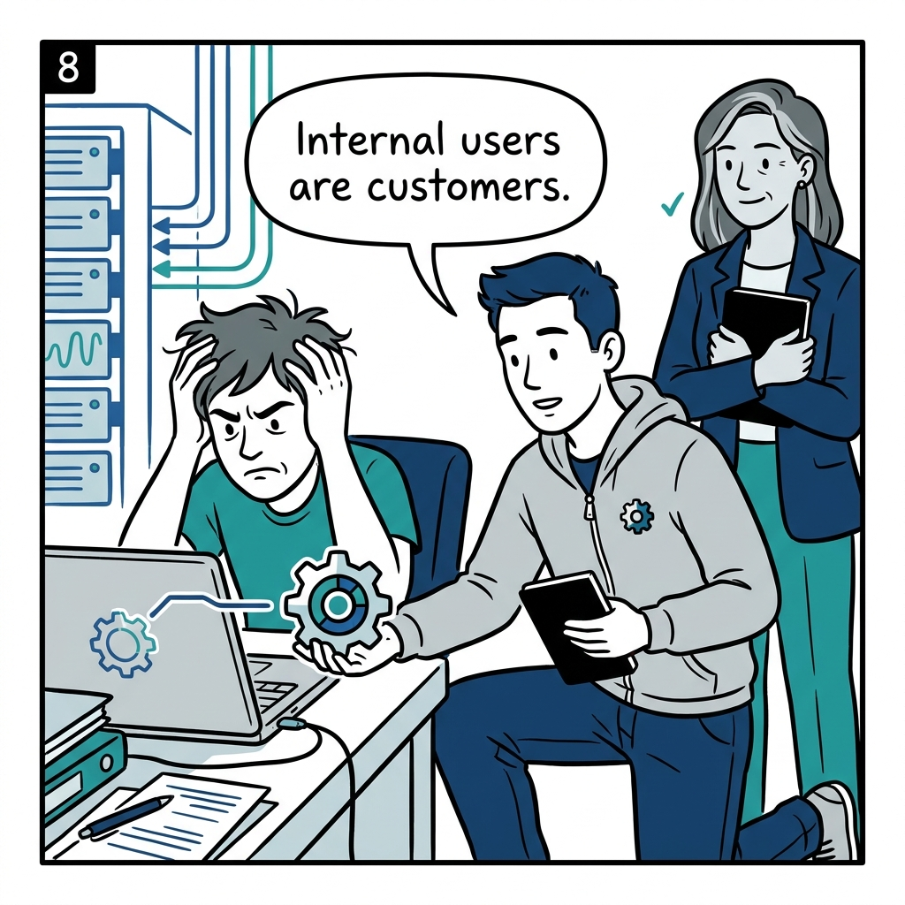

Why great platform teams are deliberately mixed — in eight panels.

<!-- comic-style
{
  "cast": "VERA: a calm, seasoned engineering executive, short gray-streaked hair, dark blazer over a plain t-shirt, carries a small black notebook. KAI: a hands-on platform engineering lead, short dark hair, gray zip-up hoodie with a small gear pin, laptop covered in infrastructure stickers under one arm, a coil of cable slung over the shoulder.",
  "style": "Clean two-tone explainer comic, thick ink outlines, flat colors with deep blue and teal accents on a light background, generous white space, hand-lettered speech bubbles with SHORT readable text, no photorealism."
}
-->

**Panel 1:** *The hook: platform teams fail from imbalance more often than from lack of talent — a single hiring profile is the failure mode.*

**Panel 2:** *Failure mode one, 'too much systems': automation, templates, and rulebooks that manage complexity without removing it — and a team that blames its users.*

**Panel 3:** *Failure mode two, 'too much development': new architecture outranks reliability, and the platform spends its customers' trust to entertain itself.*

**Panel 4:** *The principle: mix people who write substantial production code with broad systems and operational expertise — and reward both equally.*

**Panel 5:** *How it plays out: the loop mirrors the job — platform design, an inverted interview on a real system, operations and incidents, not borrowed puzzles.*

**Panel 6:** *Careers reward what the platform needs: adopted tools, support quality, incident leadership — or the team rationally stops doing that work.*

**Panel 7:** *The trade-off: reliability engineers, deep specialists, PMs, and TPMs join when a demonstrated need exists — not before, and never as a collection.*

**Panel 8:** *The closer: customer empathy is a hiring bar, not a nice-to-have — when a user struggles, the platform improves, nobody lectures.*
