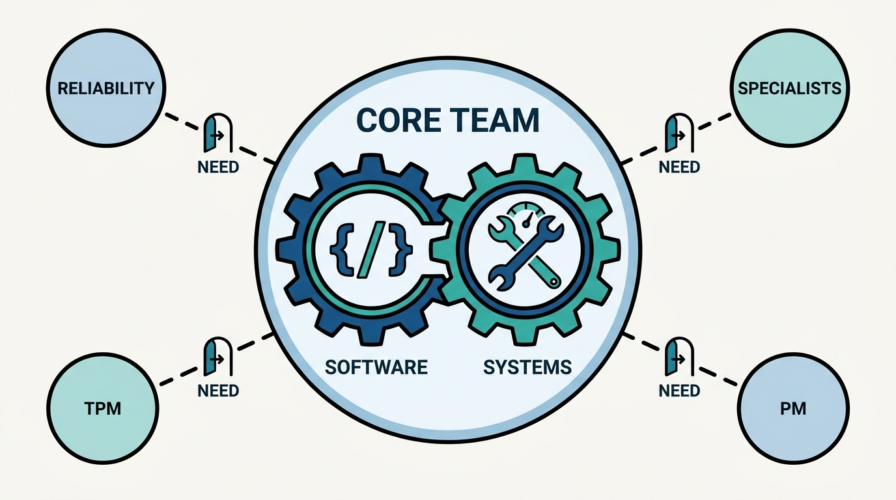
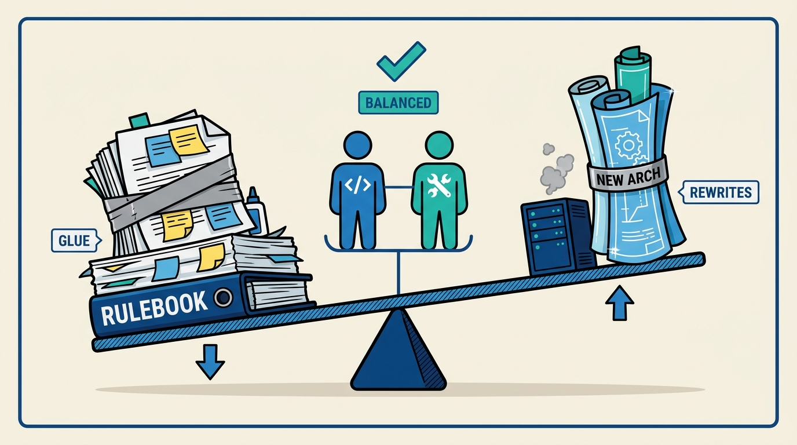
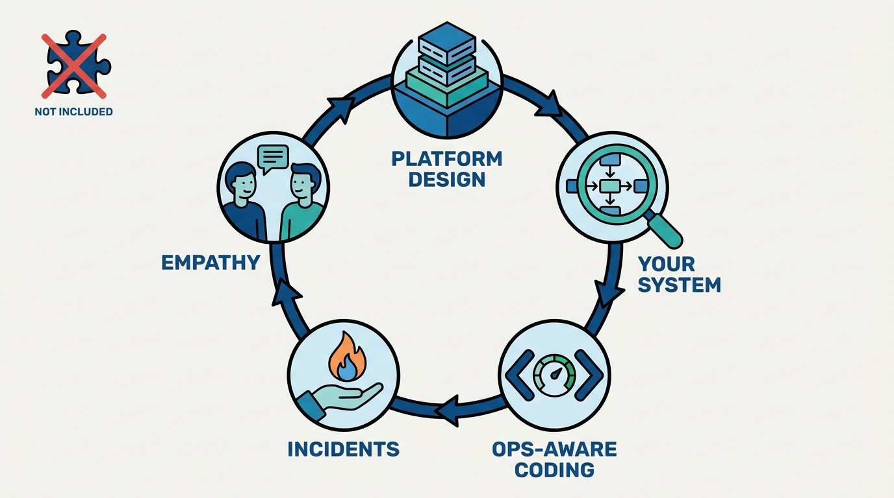

> **Status**: DRAFT
>
> **Principle**: A great platform team is a deliberately mixed team: people who can write substantial production code alongside people with broad systems and operational expertise, with both kinds of work treated as equally valuable. I staff against the two cultural failure modes that kill platform teams — the "too much systems" culture that piles up automation, templates, and manual process where engineering could remove the problem, and the "too much development" culture that chases new architecture while treating maintenance as someone else's code. Roles beyond that core — reliability engineers, specialists, product managers, TPMs — earn their place when a demonstrated need exists, not before. And customer empathy is a hiring bar, not a nice-to-have: internal users are customers of the platform, and I do not hire engineers who treat users as the problem.

## Statement

My operating model for staffing platform teams:

Composition and balance:

- **Mix software and systems expertise by design.** The team has people who can write substantial production code and people with broad systems and operational expertise — never only one kind — with reliability expertise added where reliability is a real organizational need, and both kinds of work rewarded equally.
- **Guard against the "too much systems" culture.** The test is whether the team builds platform abstractions that permanently reduce operational complexity, or just automation, templates, and one-off tools backed by rules and manual process — and whether it improves the platform rather than blaming its users.
- **Guard against the "too much development" culture.** Maintenance is valuable engineering work, technical debt is not "someone else's code", new architecture does not outrank reliability without a business reason, and every engineer understands how their systems run in production.
- **Add specialists only against demonstrated need.** Reliability engineering is a specialized role with a clear mandate — not a catch-all label for systems work. Deep specialists (networking, kernels, performance, storage) stay few, stay close to the systems that need them, and contribute beyond their specialty.

Hiring and careers:

- **Hire engineers curious about the whole environment.** Software engineers who want to understand what their code runs on and will operate business-critical systems; systems generalists who solve problems across the codebase and get a career path that lets them stay broad.
- **Interview for the actual work.** Platform design rather than only application design, plus an inverted design interview on a real system the candidate built. Coding opens up testing, error handling, and operational constraints; a behavioral round covers incidents and ambiguity; and customer empathy is assessed explicitly.
- **Evaluate outcomes, not code volume.** Title, level matrix, and interview process are separate decisions; ladders stay shared where practical; promotion evidence counts adopted tools, support quality, incident response, and reduced operational burden.

Leadership and culture:

- **Hire managers who respect operational complexity** — leaders who have operated business-critical systems, defend a deliberate delivery pace with business criticality and risk, and know when to inspect and when to trust.
- **Add product roles at scale, deliberately.** Platform-aware PMs when the platform is big enough; product-minded and staff engineers filling the gap before that; TPMs only when coordination complexity genuinely requires them — and the same need bar applies to supporting roles: developer advocates, technical writers, and support engineers.
- **Treat balanced culture as a leadership responsibility.** One shared roadmap, consolidated prioritization across development and operational work, no "software vs. operations" split — and partner teams appreciated publicly, never blamed.

**Figure 1:** *Composition by design: a core that mixes software and systems expertise as equal halves, with every additional role admitted only through a demonstrated need.*

## How to Read This

This journal is my platform operating model, one record per source checklist. This record is grounded in the chapter on building great platform teams from Camille Fournier and Ian Nowland's *Platform Engineering: A Guide for Technical, Product, and People Leaders* (O'Reilly, 2024) — the chapter about who a platform team is made of and how it stays healthy, distilled here into **the staffing rules I hold platform organizations to**. The runnable version — composition checks, role expectations, interview design, promotion evidence, and the final health check — lives in the **Checklist** tab of this post.

## Rationale

**Platform teams fail from imbalance more often than from lack of talent.** Fournier and Nowland's central observation is that the two ingredients of platform work — building software and operating systems — come with different instincts, and a team dominated by either instinct develops a characteristic pathology. That is why composition is the first decision, not an emergent property of whoever applied: I staff the mix deliberately, and I treat **software and systems work as equally valuable** because the moment one becomes the prestige track, the team starts losing the other.

**The "too much systems" failure is glue that never becomes a platform.** A team of pure systems instincts produces automation, templates, one-off tools, and an ever-growing rulebook of manual process — busy work that manages complexity without ever removing it. The tell is what happens when something breaks: a platform team improves the platform; a glue team blames the user. Engineering that **permanently reduces operational complexity** requires people who can build substantial software, which is why hiring filters that quietly exclude strong software engineers are a composition bug, not a sourcing detail.

**The "too much development" failure is architecture nobody can operate.** The opposite pathology treats maintenance as beneath the team, technical debt as someone else's code, and reliability as a tax on the interesting work. A platform is a promise that other teams can build on; a team that prioritizes new architecture over keeping that promise is **spending its customers' trust to entertain itself**. So operational responsibility is part of engineering expectations here: engineers understand how their systems behave in production, respond to incidents, and balance experimentation against long-term support.

**Figure 2:** *The two cultural failure modes: glue that never becomes a platform on one side, architecture nobody can operate on the other — the mixed team holds the fulcrum.*

**Standard interviews select for the wrong job.** An interview loop borrowed from application engineering — abstract coding plus application design — will happily pass candidates who cannot do platform work and fail candidates who excel at it. So the loop mirrors the job: **platform design, not only application design**; an inverted interview where the candidate walks through a real system they built and defends its tradeoffs; coding exercises that open conversations about testing, error handling, observability, and scaling; and behavioral evidence of staying effective during incidents and ambiguity. Interviewers are trained and calibrated before the format ships, because a bespoke loop run inconsistently is worse than a generic one.

**Figure 3:** *The loop mirrors the job: platform design, an inverted interview on a real system, operations-aware coding, incident behavior, and explicit customer empathy — generic puzzles stay outside.*

**Careers must reward what the platform needs, or the team will stop doing it.** If promotion evidence is lines of code and launches, engineers will rationally abandon support, operations, and usability — the exact work the platform's customers feel most. So I keep ladders shared where practical, refuse a separate matrix for every specialty, and make promotion cases out of **adopted tools, high-quality customer interactions, incident leadership, and reduced operational burden**. Broad systems engineers get a path that lets them stay broad; impact is not measured in code produced.

**Customer empathy is the trait that makes everything else land.** A platform team's users are engineers, which tempts platform engineers to treat them as peers who should simply read the code. I screen for the opposite: candidates who have helped users understand a system, changed what they built because of feedback, and can absorb a frustrated user without turning dismissive. A culture that **labels users as the problem** will lose those users to shadow platforms no matter how good its technology is — internal users are customers, full stop.

## What This Means in Practice

| What this record says | What it does **not** say |
| --- | --- |
| Platform teams mix software and systems expertise by design. | One hiring profile fits all — a team of only developers or only operators is a platform team. |
| Reliability engineering is a specialized role with a clear mandate. | "Reliability engineer" is a relabeling of whoever does systems work. |
| Specialists arrive when deep expertise is demonstrably needed. | Specialists are collected speculatively, or parked as evangelists disconnected from delivery. |
| Interviews test platform design, operations, and real systems the candidate built. | A borrowed application-engineering loop is good enough for platform hiring. |
| Promotion evidence counts operations, support, and customer impact. | Impact is measured in lines of code and feature launches. |
| Ladders stay shared, with at most one systems-oriented addition if truly needed. | Every specialty gets its own level matrix and hiring standard. |
| Balanced culture is an explicit leadership responsibility. | Culture will emerge automatically from hiring good people. |

Concretely: for any platform team I am accountable for, I can point at people who write substantial production code, people who can operate and debug complex systems, and evidence that both get promoted. The team runs **one shared roadmap** covering development and operational work, its interview loop looks like its job, and when a user struggles, the default response is a platform improvement — not a lecture.

## Anti-Patterns

- **The automation team that never builds a platform.** Years of scripts, templates, and runbooks; operational complexity fully preserved and now lovingly documented.
- **The rewrite factory.** A team that ships new architecture every quarter while existing systems decay, because maintenance is "someone else's code" and reliability has no sponsor.
- **The specialist zoo.** Deep experts hired speculatively, far from the systems that need them, unable to contribute outside their specialty — headcount spent on depth nobody asked for.
- **The disconnected evangelist.** An "internal advocate" role with no delivery responsibility, whose influence evaporates because it costs nothing.
- **A ladder per specialty.** A separate level matrix for every flavor of engineer, fragmenting evaluation until no one can compare impact across the team.
- **The borrowed interview loop.** Testing platform candidates with generic algorithm puzzles and application design, then wondering why new hires cannot operate anything.
- **Users-are-the-problem culture.** A team that answers every support ticket with condescension and every incident with blame — and then loses its customers to shadow platforms.
- **Prestige-track drift.** Quietly rewarding feature development over operational work until every systems engineer either converts or leaves.

## Related Records

- [[getting-started]] — when the first platform team is justified and what it does first; this record is who that team is made of.
- [[four-pillars]] — the four pillars a platform must stand on; the mixed team here is what makes the "operated as a foundation" pillar sustainable.
- [[platform-as-a-product]] — the product operating mode; the product roles and customer-empathy bar in this record are its staffing preconditions.
- [[operating-platforms]] — the operational discipline this team carries; staffing for operations is what makes that record executable.
- [[organizing-for-platforms]] — Hohpe's organizational view: how platform team setup fits the wider organization.

## Scope and Revisiting

This record is `draft`. It governs staffing, hiring, and culture for platform teams everywhere I am the accountable executive — composition, interview design, promotion evidence, and the roles added around the engineering core. I revisit it if a platform team's output drifts toward scripts and glue rather than a real platform product (the "too much systems" signal), if operational work stops appearing in promotion cases (the "too much development" signal reaching the ladder), or if support interactions show a team blaming its users rather than improving the platform.

## Authoritative References

- Camille Fournier and Ian Nowland, *Platform Engineering: A Guide for Technical, Product, and People Leaders* (O'Reilly, 2024) — the chapter on building great platform teams, whose checklist this record distills.
